# 用神奇宝贝解释渐近分析:深入复杂性分析

> 原文：<https://www.freecodecamp.org/news/asymptotic-analysis-explained-with-pokemon-a-deep-dive-into-complexity-analysis-8bf4396804e0/>

由 divya 性腺

# 用神奇宝贝解释渐近分析:深入复杂性分析

由[萨钦·马尔霍特拉](https://medium.com/@sachinmalhotra)和[迪维娅·戈达亚尔](https://medium.com/@divyagodayal)


> 让我们承认，我们要么仍然停留在如何编写一个好的算法的细微差别上，要么我们害怕这个术语本身。

一个算法没什么稀奇的。这只是做事的方法。例如，让我们说皮卡丘今晚要去拜访他的朋友。他可以用许多不同的方法做这件事。重要的是他选择哪种方法。

他选择的方法将决定他联系到朋友的时间。我们每天都在处理这样的情况。我们可能不会认为每个决策都是算法决策，但它可能是一个。

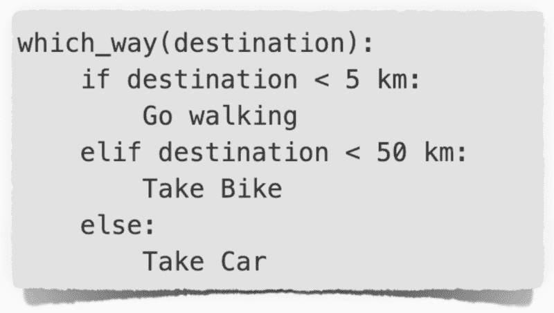

This is an algorithm. But maybe even this is not enough for an efficient route!!

程序员每次都需要做出明智的选择。当您正在构建一个高可伸缩性和高响应性的应用程序时，这一点就更加重要了。

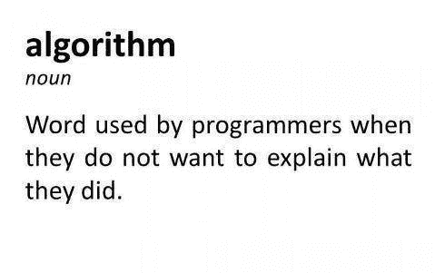

**Is that true ? Mmmm maybe.**

你要为你写的每一段代码负责，即使它不工作。？

### 目录

*   [为什么要分析一个算法？？](https://medium.com/p/8bf4396804e0#845b)
*   [复杂性和渐近行为？️‍♀️](https://medium.com/p/8bf4396804e0#e744)
*   [复杂程度◎◉●○⦿](https://medium.com/p/8bf4396804e0#267c)
*   用于复杂性分析的工具？
*   [空间复杂度？](https://medium.com/p/8bf4396804e0#ec3c)
*   [时空取舍？](https://medium.com/p/8bf4396804e0#b336)
*   [冒泡排序？](https://medium.com/p/8bf4396804e0#889a)
*   [插入排序？？？](https://medium.com/p/8bf4396804e0#f4cd)
*   [合并排序？](https://medium.com/p/8bf4396804e0#4ead)
*   [递归树分析？](https://medium.com/p/8bf4396804e0#3bdd)
*   [掌握方法分析？？](https://medium.com/p/8bf4396804e0#f99f)
*   [二分搜索法？？？](https://medium.com/p/8bf4396804e0#d256)

### [为什么要分析一个算法？？](https://medium.com/p/8bf4396804e0#d256)


**Application of Algorithms** — Basically everything, you can think of !!!

[算法无处不在。几乎无处不在。事实上，为了写这篇文章，我们编制了 1200 个步骤的列表。](https://medium.com/p/8bf4396804e0#d256)

现在不要太认真了。我当然是开玩笑啦！？

我的意思是，在生活的任何领域都无法逃避算法。你最好学会选对人的艺术！

假设我们心爱的口袋妖怪设立了一个锦标赛。每当口袋妖怪赢得一场战斗，它的排名就会更新。为了打破平局，下一场比赛是和得分相同的口袋妖怪。

你被要求建立一个网站，它能快速告诉下一场比赛。你体内的编码忍者兴奋起来，扑了上去。你建立了一个别致的网站，有很酷的图片。最初你被告知有 50 个口袋妖怪会参与战斗。

[为了找到获胜的口袋妖怪的下一个游戏，你决定将它的分数与冠军赛中每个口袋妖怪的分数进行比较，这本质上是线性搜索。它非常有效！](https://medium.com/p/8bf4396804e0#d256)

[但是在第一场比赛的那天， **1000 只新**口袋妖怪(姑且假设？)注册了！！啊，真倒霉。你没想到会这样，对吧？](https://medium.com/p/8bf4396804e0#d256)

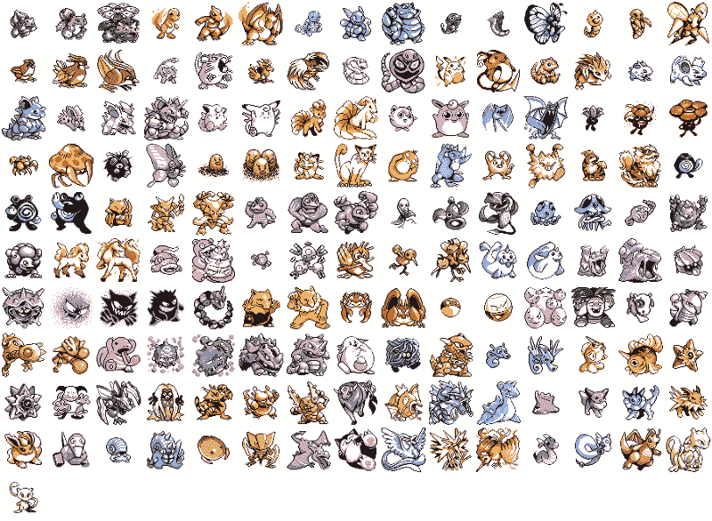

**Scalability: You can’t ignore that.**

[渐近分析是**仅根据输入大小(N)评估算法的性能，其中 N 非常大**。它让您了解应用程序的限制行为，因此对于衡量代码的性能非常重要。](https://medium.com/p/8bf4396804e0#d256)

[举个例子，如果参加战斗的口袋妖怪数量是 **N** ，那么你的](https://medium.com/p/8bf4396804e0#d256) [线性搜索](https://guide.freecodecamp.org/algorithms/search-algorithms/linear-search/)算法的渐近复杂度是 **O(N)** 。如果你不知道这个符号是什么，不要烦恼。我们将很快解决这个问题。

简单来说，这就像问所有的 **N** 口袋妖怪他们的排名是什么，然后再做决定。想象一下问所有 1000 个口袋妖怪。累人！对吗？

对于一台机器来说， **O(N)** 可能还不错，但对于一个注重响应性和速度的网站来说，这可能不是最佳选择。

1000 个新口袋妖怪之所以成为一个大问题，是因为你没有从一开始就考虑应用程序的可伸缩性，而是用一种幼稚的方法来解决这个问题。遇到这样的可伸缩性问题只是时间问题。

对算法的分析就是这样，总是挂在嘴边。但是你只有在真正需要的时候才会认真对待它。然后你只是绕着尾巴打转…啊哦，我是说灌木丛？


Oh My Tail ! What the hell are you doing here??

> 分析算法有助于衡量程序的效率，从你开始考虑解决方案的那一刻起，它就需要你的关注。

你可以使用一个[字典](https://guide.freecodecamp.org/computer-science/data-structures/dictionaries/)或者一个[散列表](https://guide.freecodecamp.org/computer-science/data-structures/hash-tables/)来找到所有具有相同等级的口袋妖怪，并将算法时间复杂度降低到 **O(1)** 。这就像去找一个口袋妖怪经理，他有你问题的答案。

时间复杂度疯狂降低，从 **O(N)到 O(1)** 。分析一个算法使得比较不同的方法并决定最好的方法成为可能。

### 顺便问一下，N 是什么？？

n 定义输入。这里 N 是口袋妖怪的数量。出于算法分析的目的，我们认为 N 非常大。

### 复杂性和渐近行为？️‍♀️

假设[皮卡丘](https://www.pokemon.com/us/pokedex/pikachu)正在寻找一个拥有某种特殊力量的宠物小精灵。皮卡丘从逐一询问所有口袋妖怪的力量开始。这种方法被称为**线性搜索**，因为它是一个接一个地线性进行的。但为了我们的参考，姑且称之为**皮卡丘的搜索**。

```
1\. Pikachu_Search(pokemons):              # List of pokemons2\.     for p in pokemons_list:           # No. of iterations -  N 3\.         if p has special power:  # Constant time operation4\.           return p               # Constant time operation    5\.   return "No Pokemon Found"            # Constant time operation
```

在上面的代码片段中，`pokemons_list`是所有参加锦标赛的口袋妖怪的列表。因此，这个列表的大小是 n。

**皮卡丘搜索运行时分析:**

1.  `Step 2`是一个 for 循环，因此其中的操作会重复 N 次。只有当`step 3`中的条件为真时，才会执行`Step 4`。一旦`step 4`被执行，循环中断并返回结果。
2.  如果`Step 3`花费的时间不变，比如说`C1`，那么 for 循环花费的总时间就是`**C1.N.**`
3.  所有其他操作都是不受循环影响的常数时间操作，因此我们可以将它们的累积常数作为`**C2**`。

> *总运行时间 f(N) = `**C1.N + C2**` **，**N 的函数*

让我们把它做大吧。N 的值非常非常大怎么办。你认为这些常数会有什么意义吗？


在算法分析中，一个重要的想法是砍掉不太重要的部分。

例如，如果算法的运行时间被表示为`10N² + 2N + 5`，那么渐近地，只有高阶项 **N** 是有意义的。这使得算法之间的比较更加容易。

### 复杂程度◎◉●○⦿

当暴露于不同类型的输入时，算法显示不同的行为。这让我们开始讨论如何定义这种行为或算法的复杂性。既然皮卡丘的搜索还在进行，那我们就来看看他是怎么回事。

1.  **最佳案例~** *纯粹的乐观主义*。他非常幸运，因为他接触的第一只口袋妖怪就拥有皮卡丘正在寻找的特殊力量。
2.  **最坏的情况~** *纯粹的悲观主义*。他不得不去拜访所有的口袋妖怪，令他沮丧的是，最后一只口袋妖怪拥有了他想要的超能力。
3.  **一般情况~** *讲求实际。*皮卡丘现在是一只长大的口袋妖怪了。经验教会了他很多，他知道这只是时间和运气的问题。他估计在他参观的前 500 个左右的口袋妖怪中找到超级口袋妖怪的几率很高，他是对的。

可以通过上述三种方式来分析算法。

`best case complexity`产量不多。它充当算法复杂度的下限。如果你顺其自然，你只是在为自己做最好的准备。无论如何，你必须非常幸运，你的算法能达到最好的情况。从实际意义上来说，这并没有多大帮助。

需要知道的是，`average case complexity`通常很难计算，因为它需要你分析你的算法在不同输入变量下的性能，因此没有被广泛使用。

帮助你做好最坏的打算。在算法中，这种悲观主义被认为是好的，因为它给出了复杂度的上限。因此，你总是知道你的算法的限制！

### 复杂性分析工具？

我们之前看到皮卡丘搜索的总运行时间是`f(N)= ***C1.N + C2***` **，**n 的函数，让我们了解更多我们拥有的工具，来表示运行时间，从而使算法之间的比较成为可能。

**大 O** ？:哦是的！它是这样发音的。B `ig — Oh` ！这是算法复杂度的上限。因此，它被用来表示算法的最差行为。

本质上，这表示算法的最大运行时间，与输入无关。

它是使用最广泛的符号，因为它可以通过了解算法的最差行为来轻松分析算法。

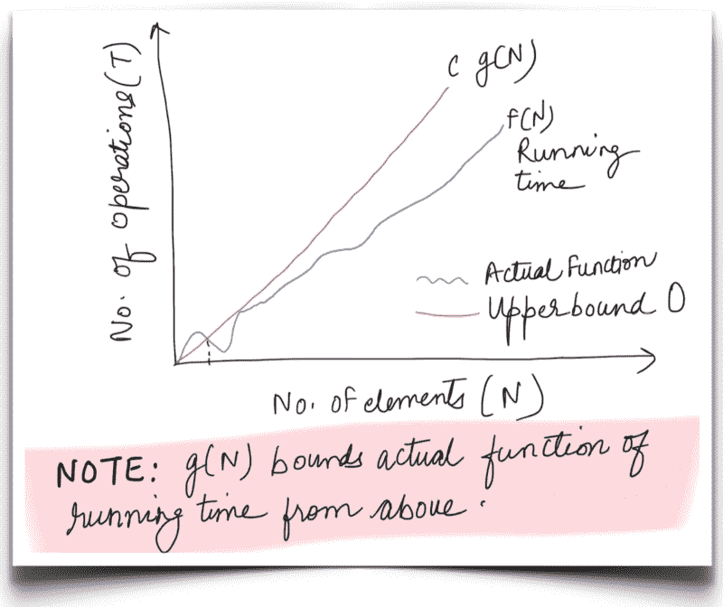

C is a constant. **f(N)** is the runtime function for which the upper bound is **g(N)**.

对于皮卡丘的搜索，对于非常大的 N，我们可以说 f(N)或运行时间从以上的*到`**C.g(N)**`有界，其中`c`是常数，`g(N) = N`。因此`O(N)`代表皮卡丘搜索的渐近上限。*

**大ω(ω):**与大 O 记法类似，ω记法用于定义算法性能的渐近下界。因此，这用于表示最佳情况。

ω界限本质上意味着**我们的算法执行**所需的最小时间量，不考虑输入。

这种符号在实际场景中并不常用，因为研究最佳行为并不是进行比较的正确方法。

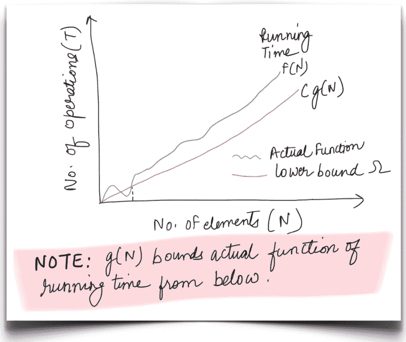

C is a constant. **f(N)** is the runtime function for which the lower bound is **g(N)**.

对于皮卡丘的搜索，对于非常大的 N，我们可以说 f(N)或运行时间从下面的*到`**C.g(N)**`有界，其中 c 是常数，`g(N) = 1`。因此`**Ω**(1)` 代表了皮卡丘搜索的渐近下限。*

**大θ**(**θ)**:算法行为的一个紧界，这个符号定义了一个函数的上界和下界。这被称为`tight bound`,因为我们将运行时间固定在上下一个常数因子内。大概是这样的:

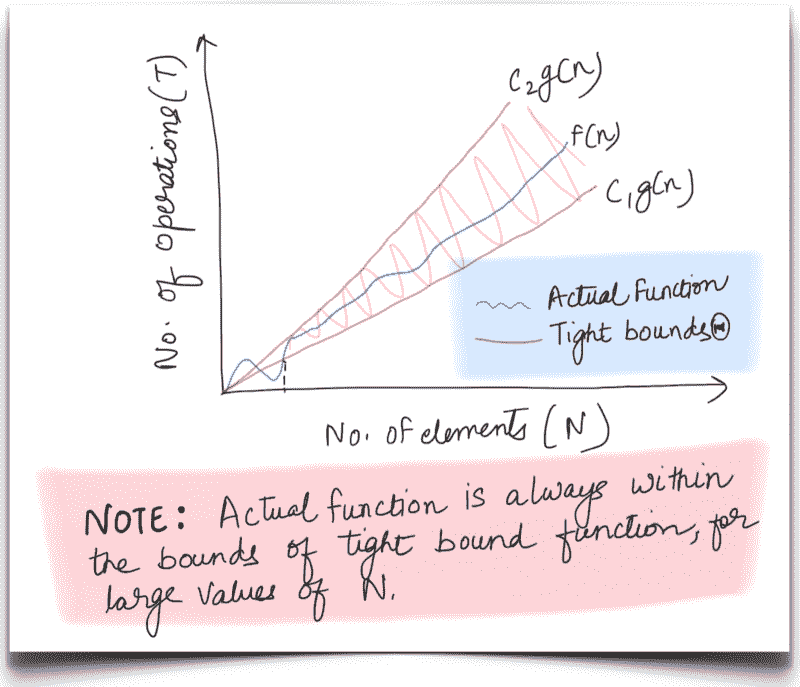

C1 and C2 are constants. **f(N)** is the runtime for which the tight bound function is would be **g(N)**

算法可能表现出不同的最佳和最坏情况行为。当两者相同时，我们倾向于使用 theta 符号。否则，最佳和最差情况分别称为**，如下所示:**

**(a)对于`**worst case**` f(N)受函数`g(N) = N`限制，对于大的 N 值。因此紧界复杂度将被表示为`Θ(N)`。这意味着皮卡丘搜索的最坏情况运行时间至少是**`C*1​⋅N*`*和最多**`C*2⋅N.*`*******

*******(b)同理，其`**best case**` 紧束缚复杂度为`Θ(1)`。*******

*****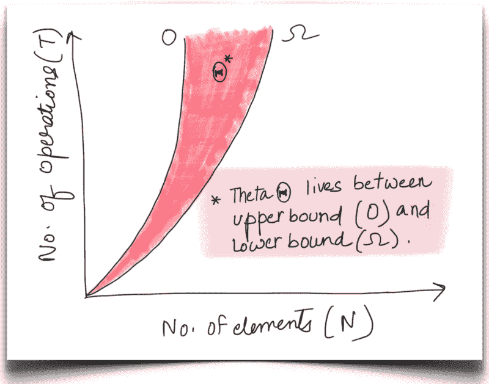*****

*****让我们再考虑一个例子，其中`f(N) = 10N² + 2N + 5`，对于该函数，最佳和最差情况的复杂度分别为ω(N)和 O(N)。因此，平均复杂度或紧界复杂度将是θ(N)。*****

*****由于最坏情况的复杂性是一个更好的比较标准，从现在开始我们将使用 Big-O 进行复杂性分析。*****

### *****空间复杂度？*****

*****我们一直在讨论时间复杂性。复杂度分析中的一个重要概念是*空间复杂度*。顾名思义，它的意思是用 N 来表示算法将占用多少*空间或内存*，其中 N 非常大。*****

*****每当我们比较解决一个特定问题的不同算法时，我们不仅仅关注时间复杂性。空间复杂度也是比较不同算法的一个重要方面。是的，这是真的，我们有很多可用的内存，因此，空间是可以妥协的。然而，它不是我们应该一直忽视的东西。*****

*****当开发人员提出编程问题的解决方案时，总会遇到一个有趣的难题。让我们稍微讨论一下它是什么。*****

### *****时间和空间的权衡？*****

*****通常，你想让你的算法快得惊人。有时候，这样做最终会损害空间的复杂性。*****

> *****但是，有时候我们会牺牲一些*的时间来优化**的空间**。******

******在实际应用中，一件事或另一件事被折衷，这在算法分析世界中被著名地称为时空折衷。******

******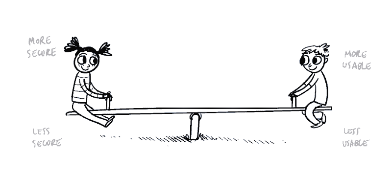

See-Saw. We are talking about similar kind of play between **Time and Space******** 

******皮卡丘意识到他每隔一天就在搜寻一只口袋妖怪。这实质上意味着反复运行皮卡丘的搜索。哼！？很自然地，他对每天必须做的令人精疲力尽的工作感到很累。******

******为了帮助他并加速他的搜索过程，我们决定使用散列表。我们可以使用口袋妖怪的*力量类型*作为哈希表中的*键*。******

******如果我们需要找到具有特殊能力的口袋妖怪，最糟糕的情况复杂性将是`O(1)`，因为散列表查找是一个恒定时间的操作。******

******如果不使用这个哈希表，可怜的小皮卡丘将不得不单独访问每一个口袋妖怪，并询问他们的权力。反复这样做是疯狂的。******

******只需要创建一个散列表，然后用它进行查找，就可以降低整个运行时间！******

******

Whaaaaaaaaatttttttttt?****** 

******但事实并非如此，正如你所看到的，它是以空间为代价的。哈希表需要为每一个口袋妖怪建立一个条目。因此空间复杂度将是`O(N)`。******

******`*O(N) Time, O(1) Space*` —— **在** — — `*O(1) Time, O(N) Space*`之间选择******

******

Don’t worry, it’s not that bad. ?****** 

******这种选择取决于应用需求。如果我们有一个面向客户的应用程序，它应该不会很慢。在这种情况下，优先考虑的是让应用程序尽可能地响应，而不管使用了多少空间。然而，如果我们真的受到可用空间的限制，我们必须放弃时间来弥补。******

> ******明智地选择算法有助于优化时间和空间。******

******时间和空间的复杂性总是相伴而生。我们需要做数学计算，并采用最佳方法。有一条黄金法则可以帮助你决定在哪个问题上妥协。一切都取决于应用。******

******有很多理论概念需要理解。我们知道，即使是可怜的皮卡丘也有点厌倦了。但不用担心，我们现在将把所有这些概念付诸实践，并用它们来分析一些算法的复杂性。这将有助于澄清不同种类的复杂性之间的细微差别，big-Oh 复杂性的重要性，时间-空间权衡等等。******

******首先，皮卡丘想要分析所有的排序技术。将所有的口袋妖怪按等级分类有助于他保持等级表的有序。******

************

******让我们来看看基本而重要的排序算法。要排序的输入数组`pk_rank`的大小为 n。******

******如果您不熟悉下面提到的任何排序算法，我们建议您在进入下面的部分之前先阅读这些算法。下面的例子的目的是 ***而不是*** 来解释不同的算法，而是解释你如何推导它们的时间和空间复杂度。******

### ******冒泡排序？******

******[**冒泡排序**](https://guide.freecodecamp.org/algorithms/sorting-algorithms/bubble-sort) **，**排序算法中最简单的一种，反复比较数组中相邻的元素，如果顺序不对就交换。这个类比来自于最终会浮到顶部的泡沫。当一个数组的元素被排序时，它们逐渐**冒泡**到它们在数组中的正确位置。******

******

Exactly like the bubbles in Pikachu’s glass. ?****** ******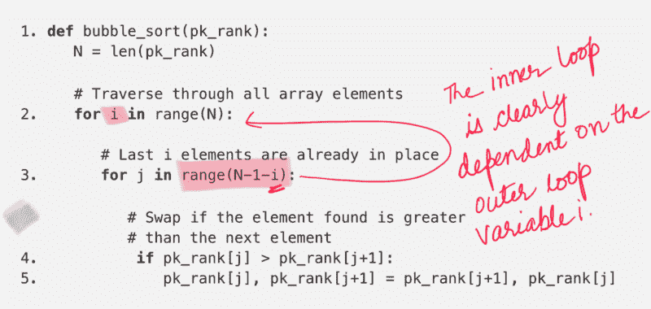

Bubble Sort Algorithm****** 

********时间复杂度:**现在我们已经有了算法，让我们开始分析它的时间和空间复杂度。从`step 2 and 3`中我们可以清楚地看到，算法中有一个*嵌套循环*结构。第二个 for 循环的范围也是`N — 1 — i`，这清楚地表明它依赖于前一个循环。******

```
****`if i = 0, second for loop would execute N-1 timesif i = 1, second for loop would execute N-2 timesif i = 2, second for loop would execute N-3 times..if i = N-1, second for loop would execute 0 times`****
```

******现在我们知道了冒泡排序算法在每一步所花费的时间(迭代次数)。我们之前提到过算法中有一个嵌套循环。对于第一次循环中变量的每个值，我们知道第二次循环所用的时间。现在剩下的就是总结这些。就这么办吧。******

```
****`S = N-1 + N-2 + N-3 + ... + 3 + 2 + 1~ N * (N+1) / 2 ~ N² + N, ignoring all the coefficients`****
```

******如果你看一下`step 4`和`step 5`，这些都是常数时间运算。它们并没有真正增加时间复杂度(或空间复杂度)。这意味着，我们有 **N + N** 次迭代，并且在每一次迭代中，我们都执行恒定时间的操作。******

******因此，冒泡排序算法的运行时间复杂度将是 **C.(N + N)** ，其中`C`是常数。渐近地，我们可以说冒泡排序的最坏情况时间复杂度是`**O(N²)**`。******

******这是一个好的排序算法吗？我们还没有看到任何其他算法可以与之相比。但是，我们来看看这个算法排序十亿只口袋妖怪需要多长时间(繁殖，人口过剩，你懂了吗？).******

******我们把计算留给你，但是，对 10 亿个口袋妖怪进行排序大约需要**31，709 年**(假设执行每条指令需要 1 毫秒)。皮卡丘是神仙还是什么？******

******

tik-tok 1, tik-tok 2.****** 

********空间复杂度:**相对于该算法的时间复杂度，分析空间复杂度相对简单。冒泡排序算法只重复执行一次操作。交换数字。这样做时，它不使用任何外部存储器。它只是重新排列原始数组中的数字，因此，空间复杂度是常数，或者是`O(1)`甚至是`Θ(1)`。******

### ******插入排序？？？******

******你喜欢打牌吗？******

******好吧，即使你不知道，你也应该知道，在很多游戏中，一个好的初始策略是按照特定的顺序排列卡片，即按照 ***对一副卡片*进行排序。**插入排序的想法非常类似于排列卡片组。******

******比方说，你有几张按升序排列的卡片。如果给你另一张牌放在正确的位置，这样你手里的牌仍然是分类的。*你会怎么做？*******

> ******你可以从手里的牌的最左边或最右边开始，将新牌与一副牌中的每张牌进行比较，找到正确的位置。******

******

Once you find the right position, you will `**insert**` the card there.****** 

******类似地，如果提供了更多的新卡，您对每张新卡重复相同的过程，并保持您手中的卡排序。******

******[**插入排序**](https://guide.freecodecamp.org/algorithms/sorting-algorithms/insertion-sort/) 也是如此。它从索引`1`开始(数组排序从`0`开始)，并将每个元素视为一张新卡。然后每个新元素可以被放置在*已经排序的左子数组*中的正确位置。******

******这里要注意的重要一点是，给定一张新牌(或者在我们的例子中是索引为`j`的元素)，手里的所有牌(或者该索引之前的所有元素)都已经*排序*。******

******让我们看一个插入排序的正式算法，后面是一个在测试输入上执行该算法的动画。******

******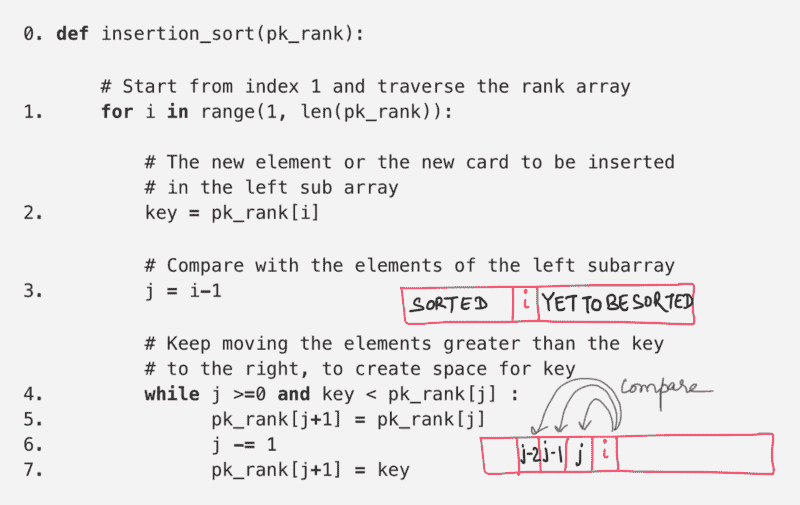************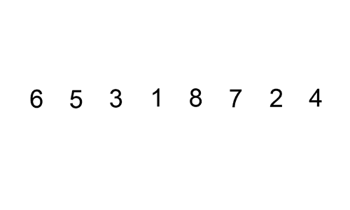******

********时间复杂度:**从`step 1 and 4`开始在一个`for`循环内有一个*嵌套* `while`结构。while 循环运行`j+1`次，`j`显然依赖于`i`。让我们看看`j`的值如何随着`i`值的变化而变化。******

```
****`if i = 1, then j = 0 hence while loop would execute 1 timesif i = 2, then j = 1 hence while loop would execute 2 timesif i = 3, then j = 2 hence while loop would execute 3 times..if i = N-1, then j = N-2 hence while loop would execute N-1 times`****
```

******现在我们知道了插入排序算法在每一步所花费的时间(迭代次数)。总时间是:******

```
****`S = 1 + 2 + 3 + .... + N-2 + N-1~ N * (N+1) / 2 ~ N² + N, ignoring all the coefficients`****
```

******`Step 2 through 7`是恒定时间操作。它们并没有真正增加时间复杂度(或空间复杂度)。这意味着，我们有 **N + N** 次迭代，并且在每一次迭代中，我们都执行恒定时间的操作。******

******因此，插入排序算法的运行时间复杂度将是 **C.(N + N)** ，其中`C`是常数。渐近地，我们可以说插入排序的最坏情况时间复杂度与冒泡排序相同，即`**O(N²)**` **。********

********空间复杂度:**相对于该算法的时间复杂度，分析空间复杂度相对简单。插入排序算法只重新排列原始数组中的数字。这样做时，它根本不使用任何外部存储器。因此，空间复杂度是常数，或者是`O(1)`甚至是`Θ(1)`。******

********注:**在渐近复杂度的基础上比较算法简单快速。从更高的层面来看，这也是一个很好的衡量标准。但是从实际角度来看，如果两种算法具有相同的复杂度，并不一定意味着它们在实际场景中具有相同的性能。******

******在计算算法的渐近复杂度时，我们忽略所有的*常数因子*和低阶项。******

> ******但是这些被忽略的值最终会增加算法的执行时间。******

******当数组被*几乎*排序时，插入排序比冒泡排序快得多。对于每次遍历数组，冒泡排序必须进行到数组的末尾，并比较相邻的对，另一方面，插入排序如果发现数组已排序，就会提前退出。尝试在一个排序的数组上执行这两个算法，并查看它们完成执行所需的迭代次数。******

******因此，每当您为您的应用程序寻找最佳算法时，都需要从许多不同的方面进行分析。渐近分析无疑有助于剔除速度较慢的算法，但观察和更深入的了解有助于找到最适合您应用的算法。******

******

Watch out for it !****** 

### ******合并排序？******

******到目前为止，我们已经分析了两个最基本的排序算法。这些是介绍性的排序算法，但由于它们的高渐近复杂性，在实践中并不常用。******

******让我们转到一个更快、更实用的排序算法。合并排序算法偏离了我们在前两个算法中看到的*嵌套循环*结构化排序，并采用了我们将在下面讨论的全新范例。******

******[**合并排序**](https://guide.freecodecamp.org/algorithms/sorting-algorithms/merge-sort) 算法是基于所谓的*分治*编程范例。这种编程范式基于一个非常简单的想法，这在很多不同的算法中都有应用，包括合并排序。分而治之分为三个基本步骤:******

> *********分*** :把一个大问题分解成更小的子问题。
> ***征服*** :优化求解较小的子问题
> ***组合* :** 最后，组合子问题的结果，找到原大问题的解。******

******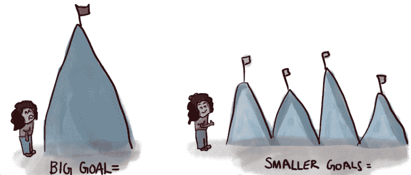

Which one looks **easier**?****** 

******让我们看一下合并排序算法如何利用分而治之范式的简要概述。******

1.  *******划分* ~该过程的第一步是*将给定的数组划分为两个大小相等的更小的子数组。这很有帮助，因为现在我们有两个更小的数组要排序，每个数组的元素数量是原来的一半。*******
2.  *******征服~* 下一步是对较小的数组进行排序。这一部分被称为*征服*步骤，因为我们正在最优地解决子问题。******
3.  *******Combine ~* 最后，我们看到了原始数组的两个排序后的一半，我们必须以最佳方式将它们组合起来，这样我们就得到一个排序后的数组。这是上面解释的范例的*合并*步骤。******

******但是等等。是这个吗？******

******给定一个包含 1000 个元素的数组，如果我们将它分成两半，每一半 500 个元素，那么在一个数组(或子数组)中仍然有很多元素需要排序。******

******难道我们不应该把两半进一步分成 4 个以得到更短的子阵列吗？******

******是啊！的确应该！******

********我们[递归地](https://medium.freecodecamp.org/recursion-demystified-99a2105cb871)将数组分成更小的两半，排序并合并更小的两半以得到原始数组。********

******这实质上意味着我们将一个大小为 1000 的数组分成两半，每一半 500 个。然后我们进一步将这两半分成 4 份，每份 250 个，依此类推。如果您不能从复杂性分析的角度直观地考虑所有这些，请不要担心。我们很快就会谈到这一点。******

******让我们来看看合并排序的算法。该算法分为两个函数，一个递归排序给定数组的两个相等的一半，另一个将排序后的两个一半合并在一起。******

******我们将首先分析 *merge* 函数的复杂性，然后开始分析 *merge_sort* 函数。******

******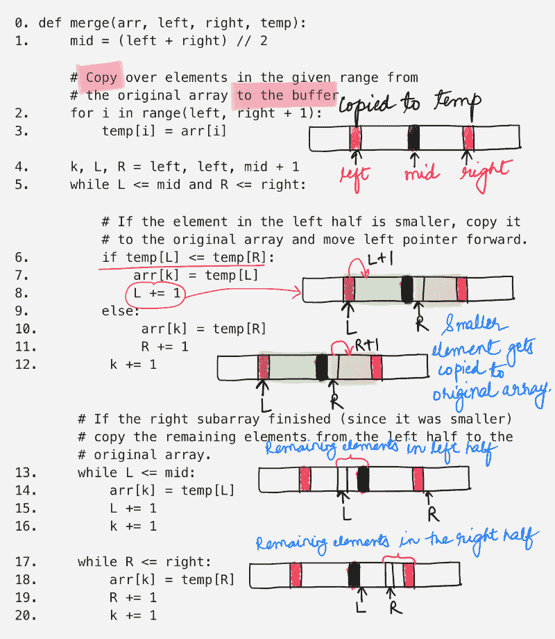

**Merge** two **sorted** arrays****** 

******上面的函数只是接受数组的两个排序后的部分，并将它们合并成一个排序后的部分。这两半是用指数定义的。左半边来自`[left, mid]`，右半边来自`[mid + 1, right]`。******

******将元素从原始数组复制到一个临时缓冲区，我们使用这个缓冲区进行合并。排序后的元素被复制回原始数组。因为我们迭代数组的某个部分，考虑到数组中有`N`个元素，这个操作的时间复杂度是`O(N)`。******

******`step 5`是一个 while 循环，它迭代两个子数组中较短的一个。在`step 13 and step 14`中，这个 while 循环和后面的循环覆盖了两个子数组的所有元素。所以，它们的综合时间复杂度是`O(N)`。******

******这意味着合并步骤是线性时间算法。******

> ******合并排序的总体复杂度取决于合并函数被调用的次数。******

******让我们继续，看看最初的 *merge_sort* 函数。这非常简单。******

******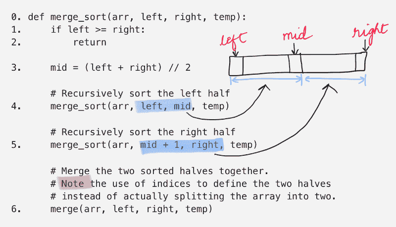

Merge Sort Algorithm****** 

******`step 4`调用数组左半部分的`merge_sort`函数。******

******`step 5`调用数组右半部分的`merge_sort`函数。******

******然后`step 6`最后调用`merge`函数来合并两半。******

******呃。一个函数调用自己？？？******

******如何计算它的复杂性？******

******到目前为止，我们已经讨论了循环分析。然而，许多算法，如合并排序，本质上是递归的。当我们分析它们时，我们得到了时间复杂度的递推关系。我们得到大小为`N`的输入的运行时间作为`N`的函数，以及更小输入的运行时间。******

******主要有两种分析递归关系复杂性的重要方法:******

1.  ******使用递归树和******
2.  ******使用主方法。******

### ******递归树分析？******

******这是分析递归关系复杂性的最直观的方法。本质上，我们可以用递归树的形式来可视化递归关系。******

******可视化有助于了解算法在每一步(读取级别)所做的工作量，总结每一级别所做的工作量可以告诉我们算法的整体复杂性。******

******在我们看合并排序算法的递归树之前，让我们先看看它的递归关系。******

```
****`T(N) = 2T(N / 2) + O(N)`****
```

******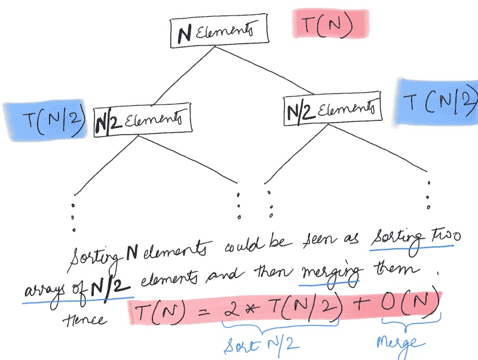******

******让`T(N)`表示对由`N`个元素组成的数组进行排序所完成的工作量(或花费的时间)。上面的关系表明，总的时间等于排序数组的两半所花的时间`+`合并这两半所花的时间。我们已经看到了之前合并两半所花费的时间，那就是`O(N)`。******

******我们可以将递归关系写为:******

```
****`T(N) = 2T(N / 2) + O(N)T(N / 2) = 2T(N / 4) + O(N / 2)T(N / 4) = 2T(N / 8) + O(N / 4)...`****
```

******用树的形式来形象化这一点要容易得多。树中的每个节点将由两个分支组成，因为给定一个问题，我们有两个不同的子问题。让我们看看合并排序的递归树。******

******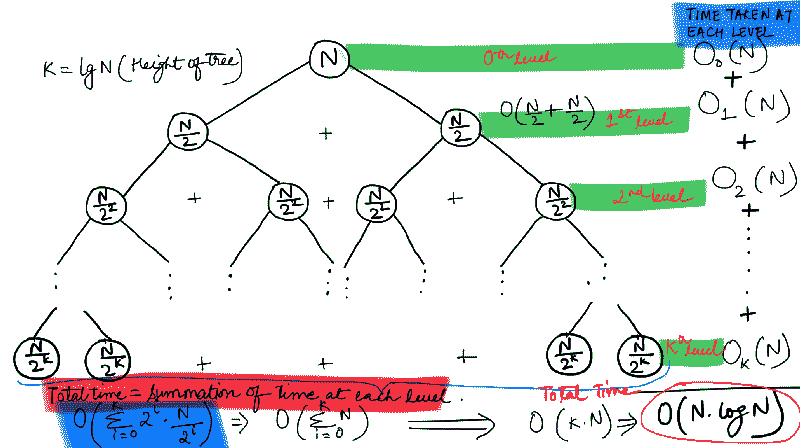

Recursion Tree for Merge Sort****** 

******树中的每个节点代表一个子问题，每个节点的值代表在每个子问题上花费的工作量。根节点代表最初的问题。******

******在我们的递归树中，每个非叶节点有 2 个子节点，代表它要分裂成的子问题的数量。从合并排序的算法中我们已经看到，在递归的每一步，给定的数组被分成相等的两半。******

******因此，为了分析合并排序算法的复杂性，我们需要弄清楚两件重要的事情。******

1.  ******我们需要知道树中每个*级别*完成的*工作量*******
2.  ******我们需要知道树中*层*的总数，或者更通常的说法，树的*高度。*******

******首先，我们将计算递归树的高度。我们可以从上面的递归树中看到，每个非叶节点分裂成两个节点。因此，上面我们得到的是一棵*完全二叉树*。******

******直观上，我们将继续分割数组，直到子数组中只剩下一个元素，这时我们不需要任何排序(这是基本情况)，我们只需返回。******

******在我们的二叉递归树的第一层，有一个由`N`元素组成的子问题。树中的下一层由`2`个子问题(要排序的子数组)组成，每个子问题有`N / 2`个元素。******

******现在，我们并不真正关心子问题的数量。我们只想知道每个子问题的大小，因为我们可以看到**在树的特定层次上的所有子问题都是相同的大小。********

```
****`At Level 0 we have subproblem(s) each consisting of N    elementsAt Level 1 we have subproblem(s) each consisting of N/2  elementsAt Level 2 we have subproblem(s) each consisting of N/4  elementsAt Level 3 we have subproblem(s) each consisting of N/8  elementsAt Level 4 we have subproblem(s) each consisting of N/16 elements...At Level X we have subproblem(s) each consisting of 1 element.`****
```

******在`powers of 2`中，元素的数量似乎在减少。从上面的模式来看，似乎:******

```
****`N = 2^X X = log_2(N)`****
```

******这意味着，我们树的高度是`log_2(N)`(N 的对数底 2)。现在让我们看看算法在每一步完成的*工作量。*******

******`T(N)`被定义为对一组`N`元素进行排序所需的工作量。我们之前看了这个递归关系，它是:******

```
****`T(N) = 2T(N / 2) + O(N)`****
```

******这意味着，在树的第一层完成的工作量是`O(N)`，其余的工作在下一层完成。这是由于以`2T(N / 2)`形式的递归调用。在下一个级别，从上图我们可以看到，完成的工作量是`2 * O(N / 2) = O(N)`。同样，在第三级 os `4 * O(N / 4) = O(N)`完成的工作量。******

******令人惊讶的是，该算法必须在每个级别上执行相同数量的工作，并且该工作总计为`O(N)`，这是*合并*过程所消耗的时间。因此，级别的数量将定义总的时间复杂度。******

******正如我们之前计算的，递归树中的层数是`log(N)`，因此合并排序的时间复杂度是`O(Nlog(N)).`******

******耶！我们学习了递归树形式的渐近分析的新方法。对于任何递归关系的复杂性，这是一种建立直觉的有趣方式。画出完整的递归树可能并不总是可行的，但它肯定有助于建立理解。******

### ******掌握方法分析？？******

******我们已经研究了基于递归树的递归渐近分析方法。然而，如前所述，每次都绘制递归树来计算复杂度可能是不可行的。******

******合并排序递归将给定的问题(数组)分解成两个更小的子问题(子数组)。如果我们得到一个算法，把一个问题分成 100 个子问题，会怎么样？我们无法画出递归树来分析。******

******因此，我们需要一种更直接的方法来分析递归关系的复杂性。我们需要一种方法，它不需要我们*实际绘制*递归树，而是建立在与递归树相同的概念上。******

******这就是**主方法**发挥作用的地方。该方法基于递归树方法。主方法涵盖了三种不同的情况，基本上涵盖了大多数递归关系。然而，在看这些情况之前，让我们看一下下面的一般递归关系的递归树:******

```
****`T(n) = a T(n / b) + f(n)`****
```

*   ******`n`是问题的大小。******
*   ******`a`是递归中子问题的数量。******
*   ******`n / b`是每个子问题的大小。(这里假设所有子问题的大小基本相同。)******
*   ******`f(n)`是递归调用之外所做工作的成本，包括将问题分成更小的子问题的成本，以及将解决方案合并到子问题的成本。******

******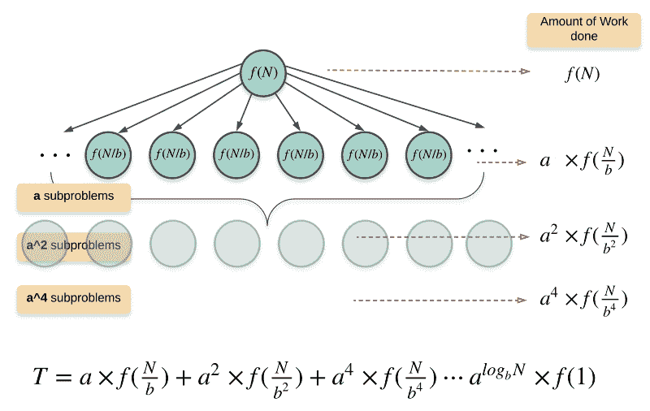******

******为了理解主方法，我们需要知道两个最重要的事情，即算法在根处完成的工作量和在叶处完成的工作量。******

******在根上做的工作简直就是`f(n)`。树叶所做的功取决于树的高度。******

******这棵树的高度是`log_b(n)`，也就是`n`的对数基数`b`。这是我们看到的合并排序的递归树的结果。`b`在合并排序的情况下是`2`。任何级别的节点数`l`都是`a^l`，因此，最后一级的叶节点数将是:******

```
****`a^{log_b(n)} = n ^ log_b(a) nodes.`****
```

******因为在最后一级的每个子问题上完成的工作量是`Θ(1)`，所以在叶节点上完成的总工作量是`n ^ log_b(a)`。******

******如果你关注上面的一般递归关系，你会注意到有两个主要的竞争力量在起作用:******

1.  *******除法步骤* ~ the？？(?/?)term 拼命地繁殖，繁殖越来越小的自己的副本。******
2.  *******征服步骤* ~ the？(?)术语表示合并，因为它拼命地试图将这些小部分折叠在一起。******

******这两种力量试图对抗另一种力量，这样做，他们想控制算法完成的总工作量，从而控制总的时间复杂度。******

******谁会赢？******

#### ******案例 1(除法步骤获胜)******

******如果`f(n) = Θ(n^c)`这样`c < log_b` (a)，th `en T(n) = Θ(n^log_b` (a `). f` (n)是在树根处做的功，a `nd n ^ log_b` (a)是在树叶处做的功。******

******如果在叶子上做的功是多项式的，那么叶子是主要部分，我们的结果就变成了在叶子上做的功。******

```
****`e.g. T(n) = 8 T(n / 2) + 1000 n^2`****
```

******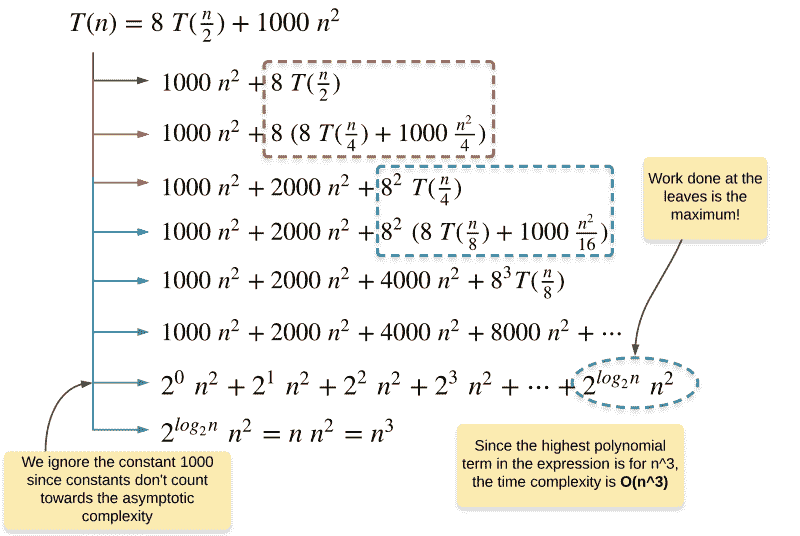******

******如果我们在主方法中拟合这个递归关系，我们得到:******

```
****`a = 8, b = 2, and f(n) = O(n^2)Hence, c = 2 and log_b(a) = log_2(8) = 3Clearly, 2 < 3 and this fits in the Case 1 for Master method. This implies, the amount of work done at the leaves of the tree is asymptotically higher than the work done at the root. Hence, the complexity of this recurrence relation is Θ(n^log_2(8)) = Θ(n^3).`****
```

#### ******案例 2(征服步骤获胜)******

******如果`f(n) = Θ(n^c)`使得`c > log_b` (a)，th `en T(n) = Θ(f(` n)。如果在根上做的功渐近地更多，那么我们最终的复杂度就变成了在根上做的功。******

******在这里，我们不关心在较低层完成的工作量，因为依赖于`n`的最大多项式项是控制算法复杂度的项。因此，可以安全地忽略所有较低级别上所做的工作。******

```
****`e.g. T(n) = 2 T(n / 2) + n^2`****
```

******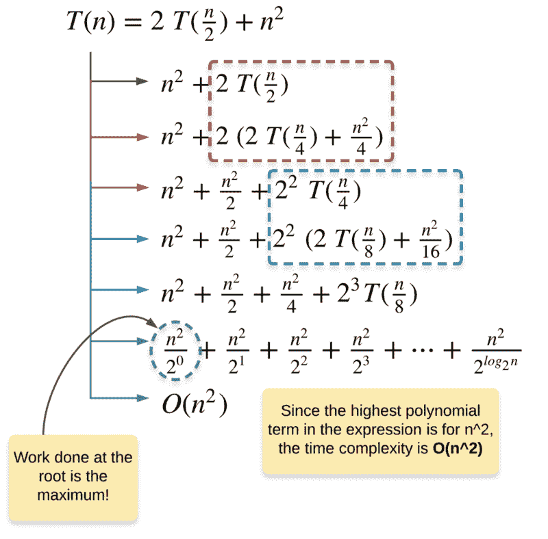******

******如果我们在主方法中拟合这个递归关系，我们得到:******

```
****`a = 2, b = 2, and f(n) = O(n^2)Hence, c = 2 and log_b(a) = log_2(2) = 1Clearly, 2 > 1 and hence this fits the Case 2 of the Master method where majority of the work is done at the root of the recursion tree and that is why Θ(f(n)) controls the complexity of the algorithm. Thus, the time complexity of this recurrence relation is Θ(n^2).`****
```

#### ******案例三【是平手！]******

******如果`f(n) = Θ(n^c)`这样`c = log_b(a)`，那么`T(n) = Θ(n^c log(n)).`最后一种情况是，在树叶上做的功和在树根上做的功有关联。******

******在这种情况下，征服和分割步骤同样占主导地位，因此，所做的总工作量等于在树的任何级别*高度所做的工作量。******

```
****`e.g. T(n) = 2T(n / 2) + O(n)`****
```

******

Wait, isn’t that Merge Sort?****** 

******是啊！这就是合并排序算法的复杂性。如果我们在主方法中拟合合并排序的递归关系，我们得到:******

```
****`a = 2, b = 2, and f(n) = O(n^1)Hence, c = 1 = log_2(2)`****
```

```
****`This fits the criterion for the Case 3 described above. The amount of work done is same on all the levels as can be verified from the figure above. Thus, the time complexity is the work done at any level * the total number of levels (or the height of the tree).`****
```

******我们用递归树和 Master 方法两种不同的方法分析了归并排序算法的时间复杂度。我们不得不使用这些不同的技术，因为合并排序算法是一种 ***递归*** 算法，而我们之前看到的用于 ***循环*** 的经典渐近分析方法在这里没有用。******

********空间复杂度:**至于空间复杂度，我们不需要使用任何复杂的技术，因此，分析要简单得多。合并排序算法中一个主要的占用空间的数据结构是在`merge`过程中使用的`temp buffer`数组。******

******这个数组被初始化一次，数组的大小是`N`。另一种占用空间的数据结构是 [*递归栈*](https://www.hackerearth.com/practice/notes/demystifying-recursion-by-stack-tracing/) *。本质上，递归调用的总数决定了递归堆栈的大小。正如我们在递归树表示中看到的，**由合并排序产生的调用数量实质上是递归树的高度。*********

******递归树的高度是`log_2(N)`,因此递归堆栈的最大大小也是`log_2(N)`。******

******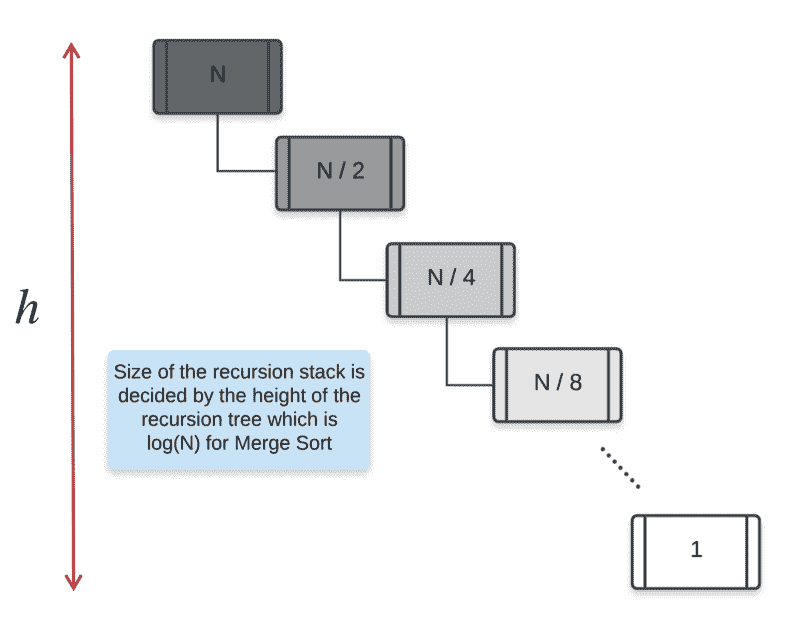******

******因此，合并排序的总空间复杂度将是`N + log_2(N) = O(N)`。******

### ******二分搜索法？？？******

******还记得我们的朋友皮卡丘和他寻找一个特定力量的口袋妖怪。可怜的小皮卡丘有 1000 个口袋妖怪供他支配，他必须找到一个有特殊力量的口袋妖怪。是的，皮卡丘对他的对手非常挑剔。******

******他的需求每天都在变化，他当然不能每次他的需求变化时都去检查每一个口袋妖怪，也就是说，他不能在口袋妖怪列表中执行**线性搜索**来找到他正在寻找的那个。******

******我们之前提到过使用一个**散列表**来存储口袋妖怪，使用它们唯一的力量值作为密钥，口袋妖怪本身作为值。这将把搜索复杂度降低到`O(1)`，即恒定时间。******

******然而，这利用了额外的空间，考虑到有`N`个口袋妖怪可用，这将搜索操作的空间复杂度提高到了`O(N)`。`N`在这种情况下会是`1000`。如果皮卡丘没有所有这些额外的可用空间，但他仍然希望加快搜索过程，那该怎么办？******

******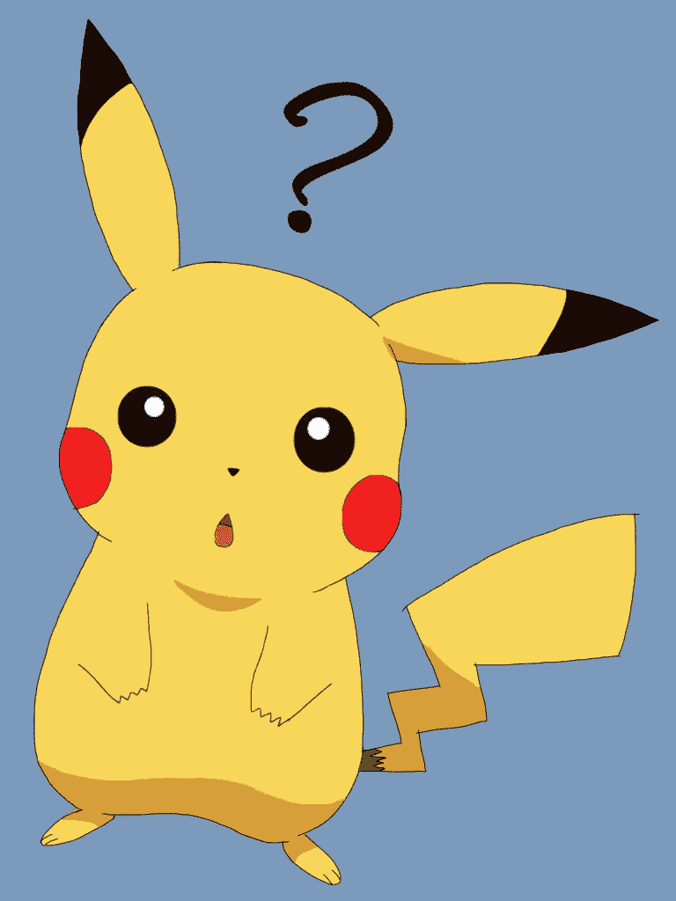

Can I do that?****** 

******是啊！当然，皮卡丘可以利用他对排序算法的渊博知识，想出一个比缓慢的线性搜索更快的搜索策略。******

******皮卡丘决定向他的好朋友代欧奇希斯寻求帮助。代欧奇希斯是最快的口袋妖怪，他帮助皮卡丘 ***根据口袋妖怪的力量对*** 进行排序。******

******代欧奇希斯没有依赖传统的排序算法，而是使用了 [**快速排序**](https://guide.freecodecamp.org/algorithms/sorting-algorithms/quick-sort/) 算法(当然他是这么做的！)用于整理口袋妖怪。******

******这样做，他没有利用任何额外的空间，并且对`N`口袋妖怪进行排序所花费的时间与`Merge Sort`算法所花费的时间相同。所以，皮卡丘很高兴他的朋友在他需要的时候帮助他。******

******非常聪明的皮卡丘想出了一个搜索策略，它利用了口袋妖怪列表的排序性质。这种新的策略/算法被称为[](https://guide.freecodecamp.org/miscellaneous/freecodecamp-algorithm-binary-search-guide/)****算法。(**注**:排序是运行二分搜索法的前提条件，一旦列表排序，皮卡丘就可以在这个排序列表上任意多次运行二分搜索法)。**********

******让我们看看这个算法的代码，然后分析它的复杂性。******

******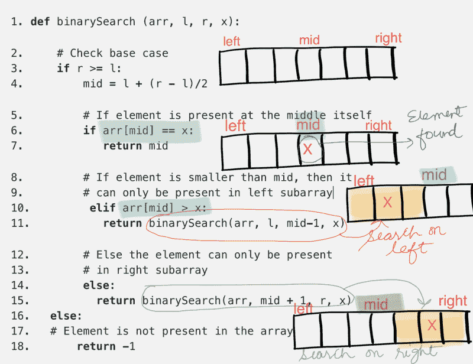******

******显然，该算法本质上是递归的。让我们看看是否可以使用我们新学到的技巧来分析二分搜索法算法的时间复杂度。两个变量`l`和`r`本质上定义了数组的一部分，我们必须在其中搜索给定的元素`x`。******

******如果我们看看这个算法，它实际上只是把输入数组的搜索部分分成两半。除了基于特定条件进行递归调用之外，它实际上不做任何事情。所以，让我们快速看一下二分搜索法算法的递归关系。******

```
******`T(n) = T(n / 2) + O(1)`******
```

******这似乎是一个非常简单的递归关系来分析。首先让我们试着分析递归树，从中得出复杂性，然后我们会看主定理，看看三种情况中哪一种符合递归。******

******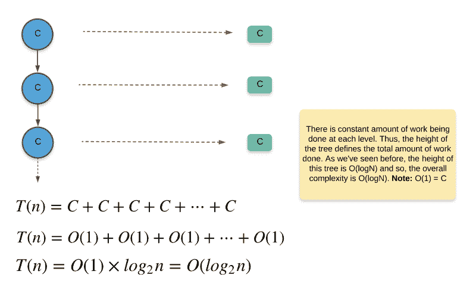******

******哇哦。这个二分搜索法算法非常快。比线性搜索快多了。这对我们可爱的小朋友皮卡丘来说意味着，对于 1000 个口袋妖怪，他只需去 max“询问”其中的 10 个就能找到他正在寻找的一个特殊的口袋妖怪(怎么做？？).******

******现在让我们看看更“公式化”的递归复杂性分析方法，即主方法，在这种情况下如何帮助我们。通用主方法递归关系是******

```
******`T(n) = a T(n / b) + f(n)`******
```

******对于我们的二分搜索法算法，我们有******

```
******`T(n) = T(n / 2) + O(1)f(n) = O(n^0), hence c = 0a = 1b = 2c = 0`******
```

******主定理有 3 种不同的情况，而`c ? log_b(a)`决定三种情况中的哪一种用于特定的分析。在我们的例子中，`0 < log_2` (1) i. `e. 0` = 0。这意味着我们的二分搜索法算法符合主定理的情形 -3，因此`re T(n) = Θ(n^0 log(n)) = Θ(log` (n)******

### ******如何选择最好的算法？？******

******在本文中，我们介绍了算法设计和开发的重要组成部分——复杂性分析的思想。我们看到了为什么分析算法的复杂性是重要的，以及它如何直接影响我们的可伸缩性决策。我们甚至看到了一些很棒的技术，可以有效而正确地分析这种复杂性，以便及时地做出明智的决策。然而，问题出现了，******

******鉴于我对两种算法的时间和空间复杂性的了解，我该如何选择最终使用哪一种算法呢？有黄金法则吗？******

******不幸的是，这个问题的答案是**不！********

******没有金科玉律可以帮你决定使用哪种算法。这完全取决于很多外部因素。让我们试着看看你可能会遇到的一些情景，并看看你想要做出的决定。******

#### ******对空间没有限制！******

******好吧，如果你有两个算法 A 和 B，你想决定用哪一个，除了时间复杂度，空间复杂度也成为一个重要的因素。******

******然而，考虑到空间不是你所关心的问题，最好使用能够在给定更多空间的情况下进一步降低时间复杂度的算法。******

******例如，[计数排序](https://guide.freecodecamp.org/algorithms/sorting-algorithms/counting-sort)是一种线性时间排序算法，但它严重依赖于可用空间的大小。准确地说，它能够处理的数字的*范围*取决于可用空间的大小。给定无限的空间，您最好使用计数排序算法对大量数字进行排序。******

#### ******亚秒延迟要求和有限的可用空间******

******如果您发现自己处于这种情况，那么深入了解算法在许多不同输入上的性能就变得非常重要，尤其是您希望算法在应用中处理的输入类型。******

******例如，我们有两种排序算法:冒泡排序和插入排序，您想在其中决定使用哪一种算法来根据用户的年龄对他们的列表进行排序。您分析了预期的输入类型，发现输入数组为 ***几乎排序为*** 。在这种情况下，最好使用插入排序而不是冒泡排序，因为它具有处理几乎已排序输入的惊人能力。******

#### ******等等，为什么有人会在现实世界中使用冒泡或插入排序？******

******如果你认为这些算法只是用于教育目的，而不是用于任何现实世界的场景，你并不孤单！然而，这与事实相去甚远。我相信你们在职业生涯中都用过 Python 中的`sort()`功能。******

******如果您使用过它，并对它的性能惊叹不已，那么您一定使用过基于插入排序和合并排序的混合算法，称为 Tim 排序算法。要了解更多信息，请点击这里:******

******[**Tim sort——你从未听说过的最快排序算法**](https://skerritt.blog/timsort-the-fastest-sorting-algorithm-youve-never-heard-of/)
[*Timsort:一个非常快速的，O(n log n)稳定的排序算法，专为现实世界打造——非学术界构造…* skerritt.blog](https://skerritt.blog/timsort-the-fastest-sorting-algorithm-youve-never-heard-of/)******

******的确，插入排序对于非常大的输入可能没有用，正如我们从它的多项式时间复杂性中看到的那样。然而，它固有的快速排序*几乎*排序范围内的数字的能力使它如此特殊，这正是它被用于 Timsort 算法的原因。******

******简而言之，在你努力选择的算法之间，你永远不会有一个清晰的黑白界限。你必须分析算法的所有属性，包括它们的时间和空间复杂度。您必须考虑您期望算法处理的输入的大小以及可能存在的任何其他约束。考虑到所有这些因素，你必须做出明智的决定！******

> ******如果你在理解复杂性分析的错综复杂中度过了一段愉快的时光，并且还和我们的朋友皮卡丘一起玩耍，请记得摧毁那个 like 按钮，传播一些爱。 *❣️*******

> ******如果你想要更多的编程问题和详细的复杂性分析，请到我们的[厨房](https://github.com/DivyaGodayal/CoderChef-Kitchen)！*？*******

> ******分析算法是任何开发人员技能集的重要组成部分，如果你觉得有其他人可能从这篇文章中受益，那么尽可能地分享它！******