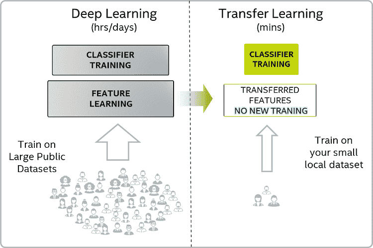
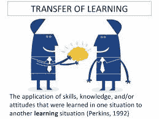

# 如何利用迁移学习进行手语识别

> 原文：<https://www.freecodecamp.org/news/asl-recognition-using-transfer-learning-918ba054c004/>

来了

# 如何利用迁移学习进行手语识别

作为我上一篇关于使用 AlexNet 进行美国手语识别的文章的继续，现在让我们考虑如何使用迁移学习技术来解决这个问题。



对于计算机视觉极客来说，迁移学习已经变得如此方便。

它基本上是一种机制，其中通过训练模型来实现任务所获得的知识被有效地修改或优化，以便完成第二个相关的任务。

> 深度学习的一个强大任务是，有时我们可以从一个任务(任务 A)中获取神经网络已经学习的知识，并将该知识应用于另一个任务(任务 B)。这就是所谓的迁移学习。
> —吴恩达



例如，经过物体识别训练的神经网络可以用来读取 x 射线扫描。这是通过冻结权重直到根据任务 A 的数据学习了初始层或中间层，移除最后一层或最后几层，并添加新层以及使用任务 b 的数据训练那些参数来实现的

当任务 A 的训练数据相当大而任务 B 的数据相对较小时，迁移学习是有意义的。通过对如此大量的数据进行训练，并在其测试数据上显示出优异的性能，这意味着神经网络具有从输入图像中提取有用特征的良好知识。这对于完成一项任务是必不可少的，也是强有力的。

既然我们已经从这些层中获得了如此强大的特征(来自任务 A 的权重被冻结)，我们只需要利用这些提取的特征来实现任务 b。因此，来自冻结层的这些特征被馈送到新的层，并且这些层的参数根据任务 b 的数据进行训练

因此，基本上，我们以冻结层的权重的形式存储来自前一个任务的知识(称为预训练)。然后，我们通过在新数据上训练(称为微调)后面的层，使神经网络任务 B 特定。有关迁移学习的更多信息，请访问[此处](https://www.youtube.com/watch?v=yofjFQddwHE)。

这项技术非常有用，因为:

*   我们可以为任务 B 建立一个运行良好的模型，尽管我们对任务 B 的可用数据较少，
*   需要训练的参数更少(只有最后一层/多层),
*   对 GPU、TPU 等繁重计算资源的需求较少(但仍取决于任务 B 可用的数据)。

由于本帖是上一篇关于使用 AlexNet 的 [ASL 识别——从零开始训练](https://medium.com/@vagdevi.k15/asl-using-alexnet-training-from-scratch-cfec9a8acf84)的延续，所以预处理细节和代码(preprocess.py)请参考那篇帖子。

用于两个帖子的数据是 ASL 的这个 [Kaggle 数据。该数据集由英文字母表中每个字母的手势图像组成。单个类别的图像具有不同的变体，如缩放版本、昏暗和明亮的光线条件等。对于每个类，有多达 3000 个图像。以下是](https://www.kaggle.com/grassknoted/asl-alphabet)[预处理&训练](https://github.com/vagdevik/American-Sign-Language-Recognition-System/blob/master/4_VGG16_BCVWL/asl_full.py)和[测试](https://github.com/vagdevik/American-Sign-Language-Recognition-System/blob/master/4_VGG16_BCVWL/predict.py)的完整代码链接。

对于迁移学习，我使用了在 ImageNet 数据集上训练的 VGG16 预训练模型。这些砝码在 keras 很容易买到。我们将首先导入如下所有必需的模块:

```
import kerasfrom keras.optimizers import SGD       from keras.models import Sequential from keras.applications import VGG16   #VGG16 pretrained weights    from keras.preprocessing import imagefrom keras.layers.normalization import BatchNormalizationfrom keras.layers import Dense, Activation, Dropout, Flatten,Conv2D, MaxPooling2D
```

```
print("Imported Network Essentials")
```

现在，让我们将模型初始化为顺序模型，并首先将预训练的 VGG16 网络添加到我们的模型中。请注意，我们需要删除最后一层(称为顶层)，并冻结所有先前层的权重。那是由`include_top=False`完成的。`weights='imagenet’`采用在 ImageNet 数据集上训练的 VGG16 网络的权重。

```
# to fix the input image sizeimage_size=224
```

```
# Load the VGG modelvgg_base = VGG16(weights='imagenet',include_top=False,                 input_shape=(image_size,image_size,3))
```

现在，VGG16 中我们想要的那部分存储在`vgg_base`中。我们还将在`vgg_base`的顶部添加其他层，如密集层和脱落层。因此，我们使用的神经网络的完整架构应该是:

```
#initiate a modelmodel = Sequential() #Add the VGG base modelmodel.add(vgg_base) #Add new layersmodel.add(Flatten()) model.add(Dense(8192,activation='relu'))model.add(Dropout(0.8))model.add(Dense(4096,activation='relu'))model.add(Dropout(0.5))model.add(Dense(5, activation='softmax'))
```

接下来，我们将优化器定义为 SGD，并设置学习率`lr`值。由于这是一个范畴分类，我们使用 categorical _ crossentropy 作为`model.compile`中的损失函数。使用检查点是存储我们在中断点之前获得的权重的最佳方式，以便我们以后可以使用它们。第一个参数是设置存储的位置:在检查点文件夹中保存为`weights.{epoch:02d}-{val_loss:.2f}.hdf5`。然后我们使用`model.fit`进行训练。

```
# Compile sgd = SGD(lr=0.001)model.compile(loss='categorical_crossentropy', optimizer=sgd,    metrics=['accuracy'])checkpoint = keras.callbacks.ModelCheckpoint("Weights/weights.{epoch:02d}-{val_loss:.2f}.hdf5", monitor='val_loss', verbose=0, save_best_only=False, save_weights_only=False, mode='auto', period=1)
```

```
# Trainmodel.fit(X_train/255.0, Y_train, batch_size=32, epochs=15, verbose=1,validation_data=(X_test/255.0,Y_test/255.0), shuffle=True,callbacks=[checkpoint])
```

我们可以按如下方式保存模型和权重:

```
# serialize model to JSONmodel_json = model.to_json()with open("Model/model.json", "w") as json_file:    json_file.write(model_json)
```

```
# serialize weights to HDF5model.save_weights("Model/model_weights.h5")print("Saved model to disk")
```

让我们在这里看一下培训的全部代码:

```
# train.py
```

```
import kerasfrom keras.optimizers import SGD       from keras.models import Sequential from keras.applications import VGG16   #VGG16 pretrained weights    from keras.preprocessing import imagefrom keras.layers.normalization import BatchNormalizationfrom keras.layers import Dense, Activation, Dropout, Flatten,Conv2D, MaxPooling2Dprint("Imported Network Essentials")
```

```
# to fix the input image sizeimage_size=224
```

```
# Load the VGG modelvgg_base = VGG16(weights='imagenet',include_top=False,                 input_shape=(image_size,image_size,3))
```

```
#initiate a modelmodel = Sequential() #Add the VGG base modelmodel.add(vgg_base) #Add new layersmodel.add(Flatten()) model.add(Dense(8192,activation='relu'))model.add(Dropout(0.8))model.add(Dense(4096,activation='relu'))model.add(Dropout(0.5))model.add(Dense(5, activation='softmax'))
```

```
# Compile sgd = SGD(lr=0.001)model.compile(loss='categorical_crossentropy', optimizer=sgd,    metrics=['accuracy'])checkpoint = keras.callbacks.ModelCheckpoint("Weights/weights.{epoch:02d}-{val_loss:.2f}.hdf5", monitor='val_loss', verbose=0, save_best_only=False, save_weights_only=False, mode='auto', period=1)
```

```
# Trainmodel.fit(X_train/255.0, Y_train, batch_size=32, epochs=15, verbose=1,validation_data=(X_test/255.0,Y_test/255.0), shuffle=True,callbacks=[checkpoint])
```

```
# serialize model to JSONmodel_json = model.to_json()with open("Model/model.json", "w") as json_file:    json_file.write(model_json)
```

```
# serialize weights to HDF5model.save_weights("Model/model_weights.h5")print("Saved model to disk")
```

现在是测试的时候了！这是从存储的 JSON 文件中加载模型和训练权重并使用来自`sklearn.metrics`的评估指标`accuracy_score`的方法。

```
# test.py
```

```
import numpy as npfrom keras.models import model_from_jsonfrom sklearn.metrics import accuracy_score 
```

```
# dimensions of our imagesimage_size = 224 with open('Model/model.json', 'r') as f:    model = model_from_json(f.read())      model.summary()model.load_weights('Model/model_weights.h5')
```

```
# loading the numpy test images (feel free to look at preprocessing)X_test=np.load("Numpy/test_set.npy")Y_test=np.load("Numpy/test_classes.npy") 
```

```
# getting predictions and getting the maximum of predictions# since predictions are of form [0.01, 0.99, 0, 0] in Y_predict and # are of the form [0,1,0,0] in Y_testY_predict = model.predict(X_test) Y_predict = [np.argmax(r) for r in Y_predict]Y_test = [np.argmax(r) for r in Y_test] 
```

```
print("##################")acc_score = accuracy_score(Y_test, Y_predict)print("Accuracy: "+str(acc_score))print("##################")
```

我得到了 97%的准确率。您可以遵循某些步骤来提高准确性，例如:

*   超参数调谐。
*   使用不同的预训练模型，如 ResNet、VGG19 等，而不是 VGG16。

完整的代码可以在这里找到[。我很想在下面的评论区听到你的结果。](https://github.com/vagdevik/American-Sign-Language-Recognition-System/tree/master/3_VGG16_newData)

快乐学习！