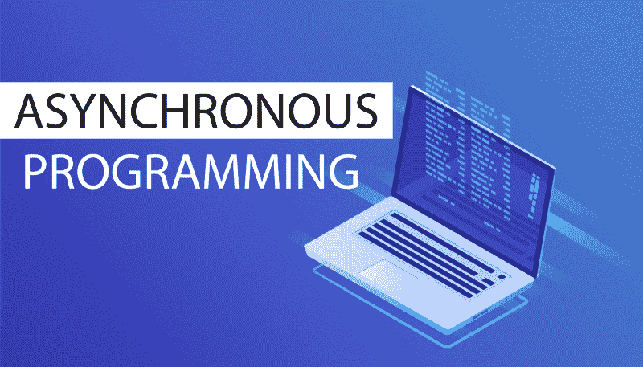

# 如何用期货给 Dart 带来一点异步编程

> 原文：<https://www.freecodecamp.org/news/dart-asynchronous-programming-futures-5b20c62a91c0/>

作者:穆罕默德·萨尔曼

# 如何用期货给 Dart 带来一点异步编程



“Designed by fullvector / Freepik”

异步编程是并行编程的一种形式，它允许一个工作单元独立于主应用程序线程运行。当工作完成时，它通知主线程(以及工作是完成还是失败)。使用它有许多好处，例如提高应用程序性能和增强响应能力。

[最初发布在我的博客上。](https://code.nimrey.me/dart-asynchronous-programming-futures/)

[TL；博士](#dbd5)。

### 问题

Dart 代码在单线程执行中运行，因此如果它被阻塞，整个程序就会冻结。

示例:

```
//..
```

```
var data = fetchDataFromSomeApi(); // Takes time while fetching data
```

```
doStuffWithData(data); // Manipulate the data
```

```
doOtherStuff(); // Do other stuff unrelated to the data
```

```
//..
```

由于`fetchDataFromSomeApi()`阻塞，剩下的代码只有在`fetchDataFromSomeApi()`带着数据返回后才运行，*不管那需要多长时间*。

这段代码逐行运行，导致代码暂停，并在数据获取操作完成后运行`doOtherStuff()`(这可能不是您想要的)。

### 解决办法

异步操作让您的程序在等待其他操作完成的同时完成其他工作。

与上面的示例相同，但使用了异步方法:

```
fetchDataFromSomeApi().then((data) {  print('Fetched data');  doStuffWithData(data);});
```

```
print('Working on other stuff...');doOtherStuff();
```

```
// Output://   Working on other stuff...//   Fetched data
```

`fetchDataFromSomeApi`是非阻塞的，这意味着它允许其他代码在获取数据时运行。这就是为什么在回调函数中，顶层的`print`语句在`print`语句之前运行。

### 期货

未来代表一种不会立即完成的计算。在普通函数返回结果的地方，异步函数返回一个 future，它最终将包含结果。未来会告诉你什么时候有结果。

`Future`对象(*期货*)代表*异步操作*的结果——处理或稍后要完成的 I/O。

我们可以像这样简单地创造未来:

```
Future future = Future();
```

让我们定义一个名为`f`的函数:

```
String f() => 'work is done!';
```

并传递给未来:

```
Future<String> future = Future(f);
```

*注意，未来采用相同类型的函数`f`返回类型`String`。*

出于本教程的目的，我们传递了一个只返回字符串的函数。这创建了一个包含与`Timer.run`异步调用`f`的结果的 future。

如果执行`f`的结果抛出，返回的 future 以错误完成。

如果返回值本身是一个`Future`，那么创建的 future 将一直等到返回的 future 完成，然后以相同的结果完成。

如果返回非未来值，则返回的未来以该值结束。

#### 然后

让我们在未来调用`then`,并传递一个将异步操作的输出作为参数的函数

```
future.then((String val) => print(val)); // work is done
```

我们可以通过传递`print`函数来简化它，因为它只接受一个字符串

```
future.then(print); // work is done
```

### 错误处理

为了捕捉错误，在异步函数中使用 try-catch 表达式(或者使用`catchError()`)。

#### `catchError`

让我们想象一下，我们的未来在某个时刻抛出了一个错误:

```
Future future = Future(() => throw Error());
```

如果我们在未来调用`then`而不处理错误，它将抛出错误并停止我们程序的执行:

```
future.then(print); // Error: Error: Instance of 'Error'
```

让我们定义一个接受错误并处理它的函数:

```
void handleError(err) { print(‘$err was handled’);}
```

然后把`catchError()`追加到未来，通过`handleError`:

```
future.then(print).catchError(handleError); // Error: Error: Instance of 'Error' was handled
```

这样，错误得到处理，程序继续执行。

#### 异步，等待

要在未来完成之前暂停执行，请在异步函数中使用`await`(或使用`then()`)。

要使用`await`关键字，它必须在`async`函数内，如下所示:

```
main() async { Future future = Future(() => ‘work is done’); String res = await future; print(res); // work is done}
```

*注意到`main`函数标有`async`关键字。*

任何标有`async`的函数都是异步调用的。

当我们用关键字`await`调用 future 时，函数执行会暂停，直到`future`返回值或抛出错误。

我们可以使用`try` … `catch`块来处理将来的错误:

```
main() async { Future future = Future(() => throw Error()); try {   print(await future);  } catch (e) {   print(‘$e was handled’); // Instance of 'Error' was handled }}
```

### 结论

*   Dart 代码在单个执行“线程”中运行。
*   阻塞执行线程的代码会使程序冻结。
*   `Future`对象(*期货*)代表*异步操作*的结果——处理或稍后要完成的 I/O。
*   要在未来完成之前暂停执行，请在异步函数中使用`await`(或使用`then()`)。
*   为了捕捉错误，在异步函数中使用 try-catch 表达式(或者使用`catchError()`)。

如果你觉得我在这里错过了什么，请告诉我，或者如果你有任何问题，你可以通过 [twitter](https://twitter.com/4msal4) 联系我。

[订阅我的简讯](https://tinyletter.com/nimreycode)！

### 其他有用的资源

[异步编程:期货](https://www.dartlang.org/tutorials/language/futures)