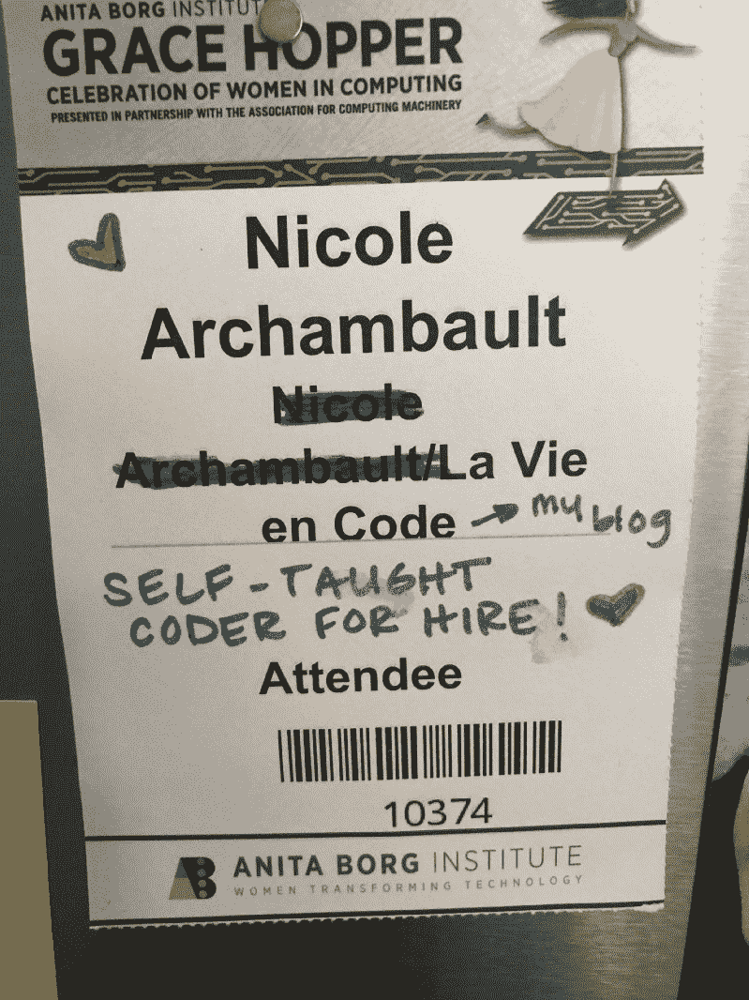
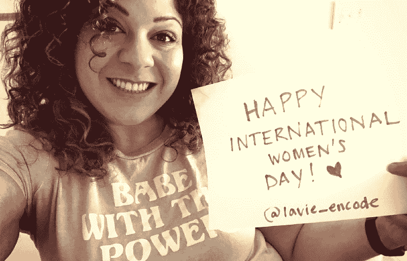

# 一个不同类型的家:我如何找到我的社区和我在技术中的位置

> 原文：<https://www.freecodecamp.org/news/a-different-kind-of-home-725868fae451/>

妮可·阿香博

# 一个不同类型的家:我如何找到我的社区和我在技术中的位置

#### #国际世界日反思

2015 年，我进入了科技行业，当时我意外地被一家移动 POS 应用初创公司解雇了。我站在外面的角落里，真的不知道下一步该怎么办。

我曾试图在韦尔斯利学院主修计算机科学，但最终因为跟不上我应该记住的抽象信息而气馁。

### 入门指南

被放开后，我决定自学编码。我一直喜欢在网上闲逛。我在 14 岁左右建立了我的第一个在线博客，当一些随机的博客评级账户给我打了 10/10 时，我欣喜若狂。啊，更简单的时代。

我决定使用一个我听说过的平台，它位于我所在的波特兰，叫做[树屋](http://www.teamtreehouse.com)。他们告诉我，我可以学习技能，找到一份网页开发的工作，我相信他们。我没有真正坚定的目标，但我知道我必须尽快采取行动。

我快速浏览了这些材料，因为 Treehouse 基于视频的学习平台允许我暂停、后退、加速、减速——这些都是我在课堂环境中从来没有过的功能。

我开了一个名为[生命代码](http://www.lavieencode.net/blog)的小博客。我在里面写了一些随机的东西——我正在做的事情，对某项特定技术的想法。我早期的帖子很搞笑。我真他妈的高兴能学到东西。

大约一个月后，我发现了一个名为[女士风暴黑客马拉松](https://www.facebook.com/groups/LadiesStormHackathons/)的脸书团体。

这个时候我已经 30 岁了，但是仍然对技术非常兴奋，以至于我投身于这群大学生中，主要是发布关于黑客马拉松和技术的帖子，而我对这些知识还远远不够了解和理解。

LSH 让我激动不已，因为它表明科技行业中确实有女性。说真的——当你进入这个行业时，你在网上看到的几乎每个人都是白人，作为一个有色人种女性，这是无法抗拒的。

作为一名土生土长的黑人女性，我甚至不知道从哪里开始寻找一个像我这样的社区。但是他们就在那里。

而且参加完(并且[获奖](https://devpost.com/software/ask-a-code-queen-b9aq1r)！)我的第一次黑客马拉松，由耐克在波特兰的木偶实验室举办的[We Code Women Hackathon](https://wecode.devpost.com/)，在开始编码后不到 3 个月，它开始在我眼前实现。

这些女人不仅在这里，而且声音很大(说真的，hackathon 会议室每隔几分钟就会爆发出笑声！)，骄傲，又好玩。

2015 年秋天，当我得知自己被格蕾丝·赫柏科技女性庆典的候选人名单除名时，我大吃一惊。我哀叹自己负担不起(这仍然是一个问题，但这是另一篇文章的主题)，韦尔斯利学院的校友们迅速赶来帮助我，不仅为我提供了机票和住宿。

这一经历改变了生活，但并不容易。那里有很多计算机科学的学生，作为一个自学成才的程序员，我感到格格不入。冒名顶替综合症发作了，*硬*。

My 2015 GHC name tag. I have it on my fridge, and it cracks me up every time I look at it. ?

有一次，我在展厅里扔我的简历。IBM 的一位女士看着它，然后看着我，然后转过身，好像不确定是否有人能帮她。

我的简历清楚地表明我是自学的。然而，我是一名前端开发人员，那里似乎真的没有任何自学的 FE 开发人员的机会。另外，我真的很不自信。

和她谈过之后，我溜到一个窗帘后面，哭了起来。我非常想融入其中，但我还没有那种自信。

从那天起，不仅培养了我的技能，也培养了我的信心，成为我的首要目标。我有太多的创伤要克服，被拒绝的感觉就像是我被挤出了技术圈——尽管整个该死的会议是对技术界女性的庆祝。

我回去了，更加努力地工作。我开始向我的新社区讲述我的经历，我得到了理解和同情。我甚至遇到几个我不认识的人都是自学的，现在都有软件工程的角色。

这些女性帮助我认识到在技术领域有我的一席之地。通过寻找，我找到了家。渐渐地，我觉得我还有希望。

但我完整地把它变成了技术，我很感激我做到了。经过 10 个月的努力和坚持，我成功到达了彼岸，并得到了我的第一份网站开发工作。

那里全是男人，但我根本不在乎。我在科技在线的女性社区开始真正繁荣起来，这对我来说已经足够好了。

### 寻找我的家

在黑客马拉松之后，我在科技领域的女性世界变得越来越清晰。

我寻找女性团体，然后最终开始关注科技界的杰出女性，因为她们是我想成为的人——她们知道像她们一样的人。

我加入的新手程序员社区，比如 [#CodeNewbie](http://www.codenewbie.org) ，是我第一次接触科技领域真正的 ***有色人种*** 女性。

我不得不回顾过去，意识到迄今为止我认识的大多数女性都是白人。我甚至没有真正想过这个问题——我只是很高兴和自豪能和女人在一起，就这样。

从那以后，我特别关注有色人种女性，并特别关注她们的经历。我意识到它们比我读过的任何其他东西更能引起我的共鸣。我发现了一些土著社区，比如科技行业的美国土著妇女和 AISES 的 T2 土著妇女。感觉就像回到了家。

凭借他们在许多不同领域的知识，他们帮助我建立了一个名为 [La Vie en Code](http://www.lavieencode.net) 的小博客，并将其推向了新的高度。我在 2016 年 9 月开始了[的生活代码播客](http://www.lavieencode.net/podcast)。

播客是我给自己的一个挑战:让我真正的声音在那里，因为我可以通过文本交流…我对技术有很多想法，人们应该得到更多。

在我的第一份开发工作之后，我决定做一段时间自由职业者。我的女性社区为我提供了第一份工作。然而，我仍然觉得自己像一个试图把自己塞进圆孔的方钉。

### 建筑物

我决定创业——我想和别人分享我学到的东西，和他们一起学习。

我想关注那些和我想走同一条路的人。

我想确保他们到达另一边，不放弃。

我想帮助他们培养同样的勇气和激情，当事情变得艰难时，这种勇气和激情驱使着我。

你看，虽然我的女性社区帮助了我，但是有些事情她们帮不上忙。我不得不自己做很多，这很难。

我们很忙。我们专注于自己的事业。作为女性，我们已经走投无路，奋力拼搏。对一些人来说，这比其他人更艰难。我们需要挣钱，而不仅仅是我们的 70 美分(或者经常是，少得多的 T1)。

在将近一年半的时间里，我致力于我的在线课程+辅导项目，即 [30 天到 Web 开发](http://www.30daystowebdevelopment.com)。这是我喜欢的最具挑战性的事情之一。我全身心地投入其中。当我最终发射时(主要是对蟋蟀哈哈)，我为自己感到非常自豪。

[**欢迎来到网络开发 30 天！**](http://www.30daystowebdevelopment.com)
[*学习如何学习，解决编程问题——并获得你的第一份 web 开发工作*www.30daystowebdevelopment.com](http://www.30daystowebdevelopment.com)

从那以后，我的学生群体慢慢壮大。我曾和一些了不起的人一起工作，他们有着自己完全无法实现的梦想。我从他们身上学到的和他们从我身上学到的一样多。无论他们最终用什么语言进行构建，他们所继承的东西将帮助他们作为开发人员度过余生。

### 了解我自己

2018 年初，在我创建课程的过程中，我专注于创业，这需要你付出很多。

我必须解决为什么我的能量水平和情绪波动如此之大的问题，这给我带来了一致性问题。从我上学的时候起，这就成了我的一个问题，而且一直是个问题。

我在 2017 年末被诊断为双相 2 型障碍。我一点也不惊讶——我父亲有躁郁症。我基本上是这样的，好吗？？‍♀️:那我们开始吃药吧，这样我才能继续我的生活。

有了这些知识在我的口袋里，我现在可以开始前进的过程，并适应我大脑如何工作的新知识。它似乎主要影响了我的精力，这当然反过来又影响了我的情绪。

但是，我仍然对我持续的学习困难有很多疑问。为什么我还是那么渴望向外面的人展示真实的自己？为什么我对自己的沟通方式感到不自在？为什么我会无聊地漫谈科技，让我对写作感到奇怪？

32 岁时，我被诊断患有自闭症(以前被称为阿斯伯格综合症)，患有非语言学习障碍。

非常有天赋…但有一个主要的非语言困难，这使得理解复杂、抽象的主题变得特别困难。

我意识到我的神经分歧给我提供了一个强烈的、复杂的头脑，几乎可以用不同于其他人的方式对待任何事情。我对事物的感受与其他人不同，对事物的反应也不同。

事实证明，女性表达她们的自闭症的方式非常不同，并且经常掩盖我们个人的自闭症行为以适应社会。我不知道女性的亚斯伯格综合症是什么样的，但我很快意识到它看起来像是我的 T2。

这就是为什么工作场所对我来说如此糟糕。为什么我的社会关系对我如此重要，如果他们出了什么差错，我会感到崩溃。为什么我在别人面前会如此害羞。为什么我可以连续几个小时专注于我的特殊兴趣…也就是编程。

这就是为什么我有这么多该死的焦虑，阻止我真正的优秀。

事情开始有了头绪。我差点逃回了家。我的职业和生活又一次要改变了——但这次是变得更好。

### 我要去哪里

在推进我的创业和保持相关性所需的学习时，我的非语言学习障碍让事情变得一团糟。随着我越来越深入 web 开发的世界，我需要花很长时间来解决问题。我不得不更加努力去理解和克服。

每天都将是一场战斗，这一点永远不会改变。这将是我的余生，为此我是个该死的战士。

我的最终目标一直是创造一个安全、健康的空间，让人们学习编程的基础知识——包括解决问题和自学技能——然后培养他们获得第一份工作所需的技能。在我的支持下，他们可以为 web 开发做准备，并利用我的辅导电话来应用他们所学的东西。

现在，认识到我的沟通和脆弱的超能力，我能够看到我可以用自己的故事帮助别人的方法。我无法告诉你有多少人向我伸出了理解和支持之手。科技馆里全是精神病患者。

我最钦佩的女性是那些努力帮助人们照顾自己的人。利用他们对他人的同情心来帮助他们避免筋疲力尽。给予严厉的爱——但总的来说，是爱。

即使被诊断患有非语言学习障碍和自闭症，我也创造了一些东西，让世界变得更美好。

我的成功不仅归功于我自己的努力和决心，也归功于那些推动我前进的强大、聪明、勇敢、有勇气和热情的女性的支持。

当我带着爱和同情分享我的故事时，那些从来没有评判过我的人，甚至伸出手来与我沟通。

对于那些激励过我并一直支持我的女性，我的目标不仅仅是找到一种方法来为你们提供平等的支持，而是将你们的使命向前推进。因为如果我的圈子里有你，我会感激你和你的使命，不管是什么。

这个列表并不全面，但是我有一些我绝对需要说出来的。

？K [imCrayton1？？？(Tw](https://www.freecodecamp.org/news/a-different-kind-of-home-725868fae451/undefined) it [ter)，y](http://www.twitter.com/kimcrayton1) ou 是一股不可忽视的力量。我钦佩你的勇敢，你的力量，你的口才，同时显示出如此深刻的信念和激情。

？阿伦·伊特巴雷克 (T [维特)](http://www.twitter.com/saronyitbarek):你激励我成为一名社区领袖。你吸引人的能力令人难以置信。我深深地热爱和欣赏#CodeNewbie 社区，并通过它建立了终生的联系。

？库特·菲尼克斯 (T [维特)](http://www.twitter.com/scooterphoenix):我非常感激你。在会议上见过你，你是 Tech™️.酷黑女孩的终极定义

？你不在灵媒上，但你实际上在其他任何地方。？说真，你参加过多少会议？你畅所欲言，自由分享你的知识。你真的在激励我在 2019 年的许多会议上扔我的帽子！

？阿拉回声鹰:你是一个发电站。你的精神很美。看到你在舞台上向 GHC 解释印第安人，我起了鸡皮疙瘩。我等不及要和你一起去 AISES 了！

？安德里亚·德尔加多·奥尔森:你是我的阿姨妈妈！？我非常爱你。感谢你们为我提供了一个在美国本土女性技术领域的家，以及一个分享我声音的舞台。我迫不及待想今年再次和你一起演讲！

？♚ D [国际女皇:](http://www.twitter.com/digitalempress)你帮我做回了我自己。我看见你，即使你看不见我。我喜欢找乐子，而科技不可能是严肃的。另外，你在网络安全组织了一群坏黑人妇女！？？

？E [mma Wedekind](https://www.freecodecamp.org/news/a-different-kind-of-home-725868fae451/undefined) (T [维特)](https://twitter.com/EmmaWedekind):你真是科技社区的一员。这些年来，你创造了超级有价值的内容，帮助我更好地了解技术和其中的社区！

我知道我错过了一些人，我就是知道。所以，我可能会回到这里更新名单，但该死的，我知道很多女性在技术。？

我期待着在健康、支持我的科技界人士身边度过 2019 年。女性是我事业成功不可或缺的一部分，我期待着能够扩大你们的力量。？

Nicole Archambault 是**的创造者，这是一个[博客](http://www.lavieencode.net/blog)、[播客](http://www.lavieencode.net/podcast)和[在线课程](http://www.30daystowebdevelopment.com)品牌，致力于为自学的网络开发人员提供独特的体验。她围绕技术、教育、心理学以及它们影响自学的 web 开发人员的方式的交叉点建立了自己的企业。**

**当然，她是一个骄傲的神经分裂的女人，帮助别人找到自己的路。:)**