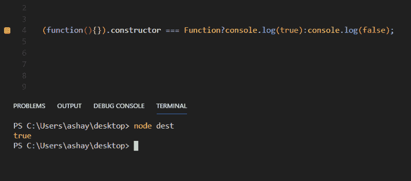
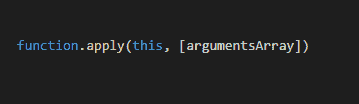
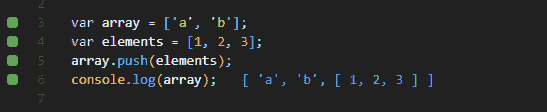
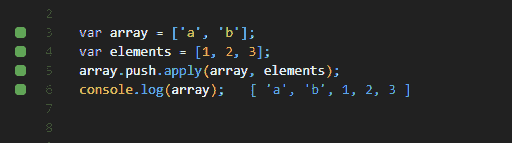
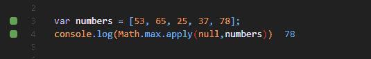
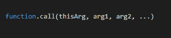
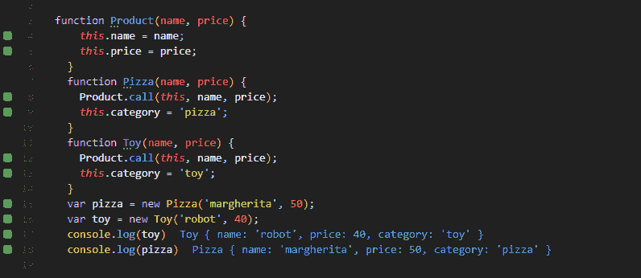
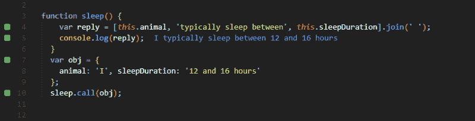
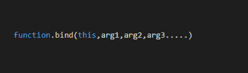
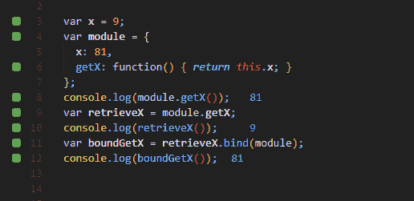

# 如何使用 apply(？)，打电话(？)和 bind(➰)方法

> 原文：<https://www.freecodecamp.org/news/how-to-use-the-apply-call-and-bind-methods-in-javascript-80a8e6096a90/>

作者阿莎·曼德瓦娅？️?？

# 如何使用 apply(？)，打电话(？)和 bind(➰)方法

Photo by [Pankaj Patel](https://unsplash.com/@pankajpatel?utm_source=medium&utm_medium=referral) on [Unsplash](https://unsplash.com?utm_source=medium&utm_medium=referral)

在本文中，我们将讨论函数原型链的 apply、call 和 bind 方法。它们是 JavaScript 中一些最重要和最常用的概念，并且与关键字 *this* 密切相关。

因此，为了掌握本文中的信息，首先你必须熟悉关键字*的概念和用法。如果你已经熟悉了，那么你可以继续——否则，你可以参考这篇文章[这里](https://medium.freecodecamp.org/a-guide-to-this-in-javascript-e3b9daef4df1)，然后回到这里。*

要了解 **apply|call|bind** 我们还需要了解 JavaScript 中的函数，假设你熟悉*这个*。

### 功能

Photo by [The Roaming Platypus](https://unsplash.com/@the_roaming_platypus?utm_source=medium&utm_medium=referral) on [Unsplash](https://unsplash.com?utm_source=medium&utm_medium=referral)

函数构造器创建一个新的函数对象。直接调用构造函数可以动态创建函数，函数可以在全局范围内执行。

由于函数是 JavaScript 中的对象，它们的调用由 **apply、call 和 bind** 方法控制。

要检查一个函数是否是一个函数对象，我们可以使用下面代码片段中的代码，它返回 true。

> 全局函数对象没有自己的方法或属性。但是，因为它本身是一个函数，所以它通过 Function.prototype 的原型链继承了一些方法和属性

以下是函数原型链中的方法:

*   **函数.原型.应用()**
*   **function . prototype . bind()**
*   **function . prototype . call()**
*   Function.prototype.isGenerator()
*   Function.prototype.toSource()
*   对象.原型.源
*   Function.prototype.toString()
*   Object.prototype.toString

我们关心的是前三个，所以让我们开始吧。

### 申请？

Photo by [Julian O'hayon](https://unsplash.com/@anckor?utm_source=medium&utm_medium=referral) on [Unsplash](https://unsplash.com?utm_source=medium&utm_medium=referral)

> **apply()** 方法是函数原型的一个重要方法，用于调用其他带有提供的 *this* 关键字值的函数，参数以数组或类数组对象的形式提供。

类似数组的对象可以引用 NodeList 或函数中的 arguments 对象。

这意味着我们可以调用任何函数，并显式指定这个应该在调用函数中引用什么*。*

#### 句法

#### 返回

它返回由这个调用的函数的结果。

#### 描述

**apply** 方法用于允许属于对象 x 的函数/对象被调用并分配给对象 y。

#### 例子

#### 1.

正如在给定的代码片段中看到的，当我们将一个数组推入另一个数组时，整个数组被视为一个元素，并被推入数组变量中。

但是，如果我们希望元素被单独地推进，而不是作为一个数组呢？当然，实际上有 n 种方法可以做到这一点，但是当我们学习应用时，让我们使用它:

在给定的示例中，我们可以看到使用 **apply** 来连接两个给定的数组。参数数组是元素数组，*这个*参数指向数组变量。元素数组的元素被推送到**所指向的*对象(*数组*)。*我们得到的结果是第二个数组的单个元素被推送到*这个*所指向的数组。**

#### 2.

JS 中的 max 函数用于从给定的元素池中查找具有最大值的元素。但是正如我们从代码片段中看到的，如果值是数组的形式，我们得到的结果是 NaN。我们当然是在谈论 JavaScript，所以有 n 种方法可以做到这一点，但是让我们使用 apply。

现在，当我们使用 apply 并使用 Math.max()函数时，我们得到了结果。正如我们所知，apply 将把数组中的所有值作为单独的参数，然后对它们应用 max 函数。这将给我们数组中的最大值。

这里要指出的一件有趣的事情是，我们用 null 代替了 *this* 。由于提供的参数是数字数组，即使引入了*这个*，它也将指向同一个数组，我们将得到相同的结果。因此，在这种情况下，我们可以用 null 代替 *this。*这表明 apply 函数中的 *this* 参数是可选参数。

### 打电话

Photo by [Eric Muhr](https://unsplash.com/@ericmuhr?utm_source=medium&utm_medium=referral) on [Unsplash](https://unsplash.com?utm_source=medium&utm_medium=referral)

> **call()** 方法用于调用给定 *this* 和单独提供给它的参数的函数。

这意味着我们可以调用任何函数，显式地指定*这个*应该在调用函数中引用的引用。

这与 **apply、**非常相似，唯一的区别是 **apply** 以数组或类数组对象的形式接受参数，这里参数是单独提供的。

#### 句法

#### 返回

使用指定的`**this**`值和参数调用函数的结果。

#### 描述

**调用**方法用于允许属于对象 x 的函数/对象被调用并分配给对象 y

#### 例子

#### 1.

这是一个构造函数链接的例子。正如我们所看到的，在每个函数中都调用了产品的构造函数，并且使用**调用**将产品对象的属性分别与 Pizza 和 Toy 对象链接起来。

当创建 Pizza 和 Toy 对象的新实例时，会提供名称、价格和类别等参数。Category 仅在定义中应用，但是 name 和 price 是使用 Product 对象的链式构造函数应用的，因为它们是在 Product 对象中定义和应用的。稍加调整，我们就可以实现继承。

#### 2.

在上面的代码片段中，我们定义了一个名为 sleep 的函数。它由一个数组回复组成，该数组回复由使用关键字 *this* 寻址属性的元素组成。它们被定义在函数之外的一个单独的对象中。

使用对象 *obj* 作为参数调用函数 sleep。我们可以看到， *obj* 的属性分别设置在 *this.animal* 和 *this.sleepDuration、*中，我们得到完整的句子作为输出。

### Bind➰

Photo by [Michael Held](https://unsplash.com/@michaelheld?utm_source=medium&utm_medium=referral) on [Unsplash](https://unsplash.com?utm_source=medium&utm_medium=referral)

> **bind()** 方法创建一个新函数，当调用该函数时，它的`this`关键字被设置为提供的值，当调用新函数时，在任何提供的参数之前有一个给定的参数序列。— MDN

#### 句法

#### 返回

**Bind** 用提供的 *this* 和参数返回函数的副本。

#### 描述

**bind** 函数很像 **call** 函数，主要区别在于 bind 返回一个新函数，而 call 不返回。

根据 ECMAScript 5 规范， **bind** 返回的函数是一种特殊类型的外来函数对象(他们这样称呼它)，称为**绑定函数** **(BF)** 。BF 包装原始函数对象。调用 BF 运行其中的包装函数。

#### 例子

#### 1.

Example taken from MDN

在上面的代码片段中，我们定义了一个变量 x 和一个名为 module 的对象。它还包含一个名为 *x* 的属性和另一个属性，其对应的值是一个返回 *x* 值的函数。

当调用函数 *getX* 时，它返回定义在对象内部的 *x* 的值，而不是全局范围内的 *x* 。

另一个变量在全局作用域中声明，它从*模块*对象中调用 *getX* 函数。但是由于变量在全局范围内，所以 *getX* 中的 *this* 指向全局 *x* ，因此返回 9。

定义了另一个变量，该变量调用前面的函数，但这次将所述函数与*模块*对象绑定。这个绑定返回对象内部的 *x* 的值。由于绑定，函数中的 *this* 指向对象中 *x* 的值，而不是全局 *x* 。因此我们得到 81 作为输出

### 结论

现在我们已经学习了关于方法的基础知识，您可能仍然会对为什么有 3 个不同的函数做几乎相同的事情感到有点困惑。为了澄清这个概念，你必须在不同的情况和场景下进行练习，这样你才能更彻底地了解在哪里以及如何使用它们。它们肯定会让你的代码更干净、更强大。

如果你喜欢这篇文章，请鼓掌？然后跟着？为了更多。

Google