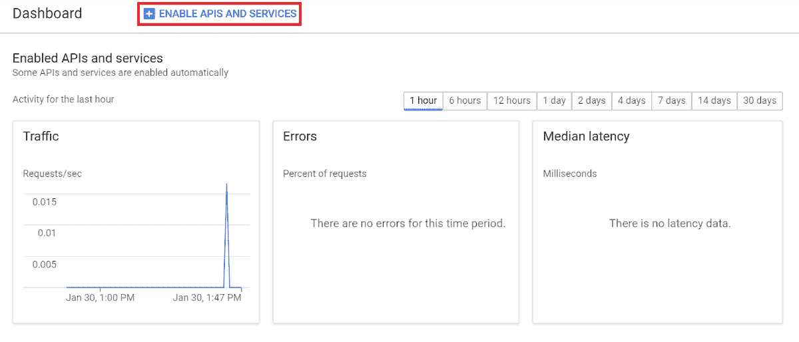
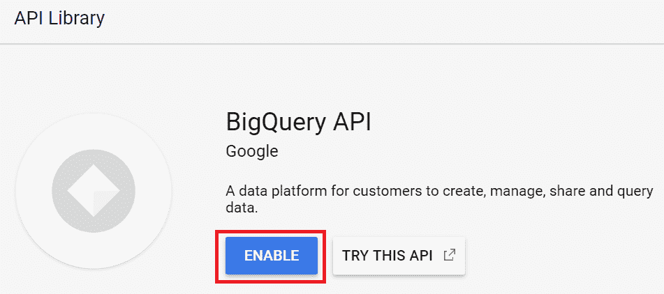
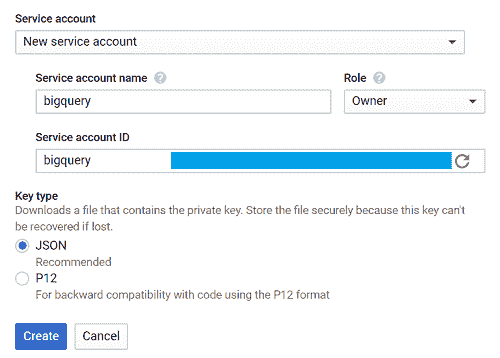
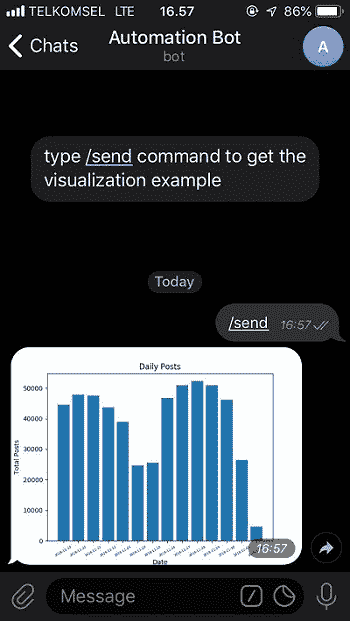

# 如何使用 Python 和 Google BigQuery 构建一个机器人来自动化您的无脑任务

> 原文：<https://www.freecodecamp.org/news/how-to-build-a-bot-to-automate-your-mindless-tasks-using-python-and-google-bigquery-a34faf7fb74/>

你有重复性的任务吗？你经常做的事情，每周甚至每天都做？报告可能是你每周或每天的任务之一。你查询或索要数据，做一些可视化处理，然后交给你的老板。如果不是手动完成，而是自动完成，这样你就不必做那些无聊的事情，你就可以用你宝贵的时间去做其他事情，那会怎么样？

在本教程中，我们将制作一个电报机器人，它将自动化你工作中枯燥的部分——报告。哦，我提到过构建它不需要超过 50 行代码吗？；)

如果这是你第一次制作电报机器人，你可能想先读一下这篇文章。

### 入门指南

#### 1.安装库

我们将使用 [google-cloud-bigquery](https://github.com/googleapis/google-cloud-python) 来查询来自 Google BigQuery 的数据。 [matplotlib](https://matplotlib.org/) 、 [numpy](http://www.numpy.org/) 和 [pandas](https://pandas.pydata.org/) 将帮助我们进行数据可视化。 [python-telegram-bot](https://github.com/python-telegram-bot/python-telegram-bot) 将通过电报聊天发送可视化图像。

```
pip3 install google-cloud-bigquery matplotlib numpy pandas python-telegram-bot
```

#### 2.启用 Google BigQuery API

如果我们想使用这个服务，我们需要首先启用 Google BigQuery API。

转到[谷歌开发者控制台](https://console.developers.google.com/)并创建一个新项目(或选择你已有的项目)。

在项目仪表盘中，点击 ****启用 API 和服务**** ，搜索 BigQuery API。



点击 ****启用**** 启用 API。



#### 
3。创建服务帐户密钥

如果我们想使用 Google BigQuery 这样的 Google 云服务，我们需要一个服务账号密钥。这就像我们使用谷歌服务的凭证。

进入 [Google 开发者控制台](https://console.developers.google.com/)，点击 ****凭证**** 标签，选择 ****创建凭证**** ，点击 ****服务账号键**** 。

选择 ****新建服务账号**** ，在 ****服务账号名称**** 字段，输入名称。

从 ****角色**** 下拉列表中，选择 ****项目**** > ****所有者、**** 然后点击 ****创建**** 。



有一个. json 文件会自动下载，命名为`creds.json`。

在终端中用我们的`creds.json`文件的路径设置`GOOGLE_APPLICATION_CREDENTIALS`。

```
export GOOGLE_APPLICATION_CREDENTIALS='[PATH_TO_CREDS.JSON]'
```

现在一切都应该好了，是时候写我们的程序了。

### 写程序

我们将编写从 BigQuery 查询数据的程序(我们假设数据存储在那里)。然后我们将数据可视化并保存为图像。图像将通过电报聊天发送。

在本教程中，我们使用的是`bigquery-public-data.stackoverflow`数据集，我们将每天的总帖子数据用于我们的报告。

我们程序的工作流程非常简单:

> ******查询**** 表格- > ****可视化**** 数据- > ****保存**** 可视化- > ****发送**** 图像**

让我们用一个函数来定义每个流。

#### 1.对 BigQuery 的查询

首先导入库。从 google.cloud 导入 bigquery

制作一个名为`query_to_bigquery`的函数，它以`query`为参数。

```
def query_to_bigquery(query):
    client = bigquery.Client()    
    query_job = client.query(query)    
    result = query_job.result()    
    dataframe = result.to_dataframe()    
    return dataframe
```

该函数将以数据帧的形式返回数据。

#### 2.将数据可视化

我们将使用 matplotlib 来可视化数据。

```
import matplotlib.pyplot as plt
```

我们取五个参数，分别是:`x`作为 x 轴数据，`x_label`作为 x 轴标签名，`y`作为 y 轴数据，`y_label`作为 y 轴标签名，`title`作为我们的可视化标题。

```
def visualize_bar_chart(x, x_label, y, y_label, title):
    plt.title(title)    
    plt.xlabel(x_label)    
    plt.ylabel(y_label)    
    index = np.arange(len(x))    
    plt.xticks(index, x, fontsize=5, rotation=30)    
    plt.bar(index, y)    
    return plt
```

#### 3.保存图像

让我们使用上面的两个函数来创建一个可视化，然后保存图像。

就像我之前提到的，我们想要发送每日总帖子数据。首先编写查询。

```
query = """ 
            SELECT DATE(creation_date) date, COUNT(*) total_posts
            FROM `bigquery-public-data.stackoverflow.post_history`
            GROUP BY 1
            HAVING date > DATE_SUB('2018-12-02', INTERVAL 14 DAY)
            ORDER BY 1
        """
```

请注意，在上面的查询中，`HAVING date > DATE_SUB('2018-12-02', INTERVAL 14 DAY)`表示我们希望收集 2018 年 12 月 2 日 14 天前开始的数据。

我们使用该日期是因为`2018-12-02`是`bigquery-public-data.stackoverflow.post_history`中记录的最后一个数据，在不同的情况下，您可能希望使用`CURRENT_DATE()`来代替，这样您将获得最新的数据。

调用`query_to_bigquery`函数获取数据。

```
dataframe = query_to_bigquery(query)
```

将`date`列作为我们的 x 轴数据，将`total_posts`列作为我们的 y 轴数据。

```
x = dataframe['date'].tolist()
y = dataframe['total_posts'].tolist()
```

使用`visualize_bar_chart`功能将数据可视化，然后保存为图像。

```
plt = visualize_bar_chart(x=x, 
			  x_label='Date', 
                          y=y, 
                          y_label='Total Posts', 
                          title='Daily Posts')
plt.savefig('viz.png')
```

将代码包装在一个名为`get_and_save_image`的函数中。

```
def get_and_save_image():    
	query = """ 
                SELECT DATE(creation_date) date, COUNT(*) total_posts
                FROM `bigquery-public-data.stackoverflow.post_history`
                GROUP BY 1
                HAVING date > DATE_SUB('2018-12-02', INTERVAL 14 DAY)
                ORDER BY 1
                """
        dataframe = query_to_bigquery(query)
        x = dataframe['date'].tolist()
        y = dataframe['total_posts'].tolist()
        plt = visualize_bar_chart(x=x, 
			  	  x_label='Date', 
                          	  y=y, 
                          	  y_label='Total Posts', 
                          	  title='Daily Posts')
        plt.savefig('viz.png')
```

#### 4.发送图像

为了能够将它发送给正确的人，我们需要知道他们的`chat_id`，因为这是必需的参数之一。

转到[用户信息机器人](https://telegram.me/userinfobot)，然后输入`/start`。机器人将回复我们的用户信息，我们的`chat_id`是`Id`字段中的数字。

做一个叫`send_image`的函数。该函数将首先调用`get_and_save_image`函数来获取并保存可视化效果，然后将其发送给其 chat_id 在`chat_id`变量中声明的人。

```
def send_image(bot, update):
    get_and_save_image()
    chat_id = 'CHAT_ID_RECEIVER'
    bot.send_photo(chat_id=chat_id, photo=open('viz.png','rb'))
```

#### 5.主程序

最后，创建另一个函数`main`来运行我们的程序。 ****别忘了用你的 bot 令牌换**** `YOUR_TOKEN`。

记住，这个程序会根据我们定义的日期和时间自动发送图像。

例如，在本教程中，我们将它设置为每天上午 9:00。

```
def main():
    updater = Updater('YOUR_TOKEN')
    updater.job_queue.run_daily(send_image, time=datetime.datetime.strptime('9:00AM', '%I:%M%p').time(),days=(0,1,2,3,4,5,6))
    updater.start_polling()
    updater.idle()

 if __name__ == '__main__':    main()
```

最后，您的代码应该如下所示:

```
from google.cloud import bigquery
from telegram.ext import Updater

import matplotlib.pyplot as plt
import numpy as np
import datetime

def query_to_bigquery(query):
    client = bigquery.Client()
    query_job = client.query(query)
    result = query_job.result()
    dataframe = result.to_dataframe()
    return dataframe

def visualize_bar_chart(x, x_label, y, y_label, title):
    plt.title(title)
    plt.xlabel(x_label)
    plt.ylabel(y_label)
    index = np.arange(len(x))
    plt.xticks(index, x, fontsize=5, rotation=30)
    plt.bar(index, y)
    return plt

def get_and_save_image():
    query = """ 
            SELECT DATE(creation_date) date, COUNT(*) total_posts
            FROM `bigquery-public-data.stackoverflow.post_history`
            GROUP BY 1
            HAVING date > DATE_SUB('2018-12-02', INTERVAL 14 DAY)
            ORDER BY 1
            """
    dataframe = query_to_bigquery(query)   
    x = dataframe['date'].tolist()
    y = dataframe['total_posts'].tolist()
    plt = visualize_bar_chart(x=x, x_label='Date', y=y, y_label='Total Posts', title='Daily Posts')
    plt.savefig('viz.png')

def send_image(bot, update):
    get_and_save_image()
    chat_id = 'CHAT_ID_RECEIVER'
    bot.send_photo(chat_id=chat_id, photo=open('viz.png', 'rb'))

def main():
    updater = Updater('YOUR_TOKEN')
    updater.job_queue.run_daily(send_image, time=datetime.datetime.strptime('9:00AM', '%I:%M%p').time(), days=(0,1,2,3,4,5,6))
    updater.start_polling()
    updater.idle()

if __name__ == '__main__':
    main()
```

保存文件并将其命名为`main.py`。

通过在 terminal.python3 main.py 中键入以下命令来运行程序

太好了！现在您有了一个不超过 50 行代码的自动报告生成器——很酷吧？

在[这里](https://telegram.me/automatereportbot)检查机器人，并键入`/send`命令查看图像可视化的例子。

下图显示了机器人将发送的可视化。现在，您可以高枕无忧，等待机器人每天向您发送报告:)



您可以访问我的 [GitHub](https://github.com/dzakyputra/automatebot) 获取代码，如果您有任何疑问，请随时联系我的 [Linkedin](https://www.linkedin.com/in/dzakywp/) 个人资料并留言。

如果您认为我的代码或文字中有任何错误，请留下评论。

如果你对数据科学或机器学习感兴趣，你可能想看看我在[构建情感分析器](https://medium.freecodecamp.org/how-to-make-your-own-sentiment-analyzer-using-python-and-googles-natural-language-api-9e91e1c493e)上的帖子。

再次感谢你，祝你好运！:)