# 如何用 TF-IDF 和 Python 的 Scikit-Learn 从文本中提取关键词

> 原文：<https://www.freecodecamp.org/news/how-to-extract-keywords-from-text-with-tf-idf-and-pythons-scikit-learn-b2a0f3d7e667/>

作者:卡维塔·加内桑

早在 2006 年，当我不得不在 Java 中使用 TF-IDF 进行关键字提取时，我不得不从头开始编写所有代码。那时数据科学和 GitHub 都不存在，图书馆也很有限。

今天的世界已经大不相同了。Github 上有几个[库](http://scikit-learn.org/stable/modules/generated/sklearn.feature_extraction.text.TfidfTransformer.html#sklearn.feature_extraction.text.TfidfTransformer)和[开源代码库，它们提供了 TF-IDF 的体面实现。如果你不需要控制 TF-IDF 的计算方式，我强烈推荐重用已知包中的库，如](https://github.com/topics/tf-idf?o=desc&s=forks) [Spark 的 MLLib](https://spark.apache.org/docs/2.2.0/mllib-feature-extraction.html) 或 [Python 的 scikit-learn](http://scikit-learn.org/stable/) 。

我注意到这些库的一个问题是，它们是其他任务如聚类、主题建模和文本分类的先决条件。 [TF-IDF](https://en.wikipedia.org/wiki/Tf%E2%80%93idf) 实际上可以用来从文档中提取重要的关键词，以了解文档的特征。例如，如果您正在处理 Wikipedia 文章，您可以使用 tf-idf 来提取给定文章特有的单词。这些关键词可以作为一个非常简单的文档摘要，并且当我们从整体上看这些关键词时，可以用于文本分析。

**在本文**中，我将向您展示如何使用 scikit-learn 从使用 TF-IDF 的文档中提取关键字。我们将专门在堆栈溢出数据集上这样做。如果你想访问**全部 Jupyter 笔记本**，请[前往我的回购](https://github.com/kavgan/data-science-tutorials/tree/master/tf-idf)。

**重要提示:**我假设阅读本教程的人已经熟悉了 TF-IDF 的概念。如果你不是，请在阅读之前熟悉这个概念。网上有几个[视频](https://www.youtube.com/results?search_query=tf-idf.)直观地解释了它是什么。如果要更学术性的解释，我会推荐我的[博士导师的解释](https://www.coursera.org/lecture/text-retrieval/lesson-2-2-tf-transformation-W0NZe)。

### 资料组

在本例中，我们将使用一个堆栈溢出数据集，它有点嘈杂，模拟了您在现实生活中可能会遇到的情况。你可以在[我的教程报告](https://github.com/kavgan/data-science-tutorials/tree/master/tf-idf/data)中找到这个数据集。

注意这里有**两个文件**。包含 20，000 篇文章的较大文件`stackoverflow-data-idf.json`用于计算逆文档频率(IDF)。包含 500 篇文章的较小文件`stackoverflow-test.json`将被用作我们从中提取关键词的测试集。该数据集基于谷歌大查询中公开的[堆栈溢出转储。](https://cloud.google.com/bigquery/public-data/stackoverflow)

让我们看一下我们的数据集。下面的代码从`data/stackoverflow-data-idf.json`读取一个每行一个的 json 字符串到 pandas 数据帧，并打印出它的模式和帖子总数。

这里，`lines=True`仅仅意味着我们将文本文件中的每一行都视为一个单独的 json 字符串。

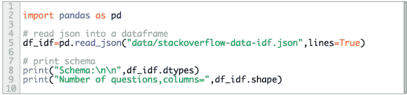

Read the json file and print out schema and total number of Stack Overflow posts.

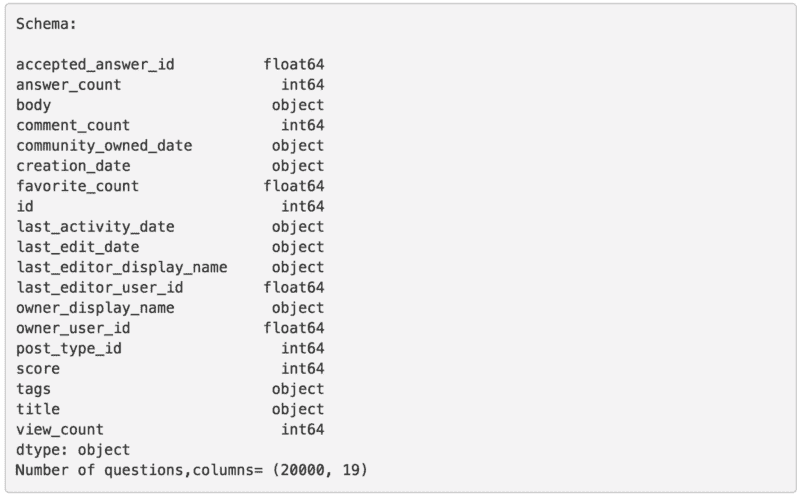

The schema and total number of posts.

注意，这个堆栈溢出数据集包含 19 个字段，包括文章标题、正文、标签、日期和本教程不需要的其他元数据。对于本教程，我们最感兴趣的是主体和标题。这些将成为我们提取关键词的文本来源。

我们现在将创建一个结合了`body`和`title`的字段，这样我们就可以在一个字段中包含两者。我们还将在新字段中打印第二个文本条目，以查看文本的外观。

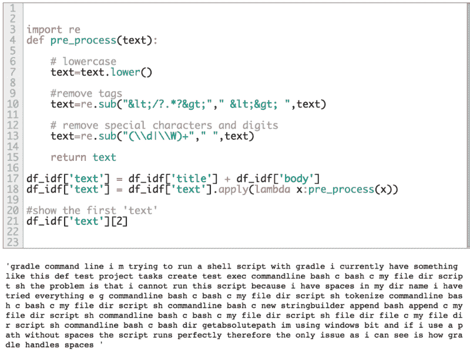

啊哦，这看起来不太可读！嗯，那是因为在`pre_process(..)`进行的所有清洁工作。您可以在`pre_process(..)`中做更多的事情，比如删除所有代码段，将单词规范化到其词根。为了简单起见，我们将只执行一些温和的预处理。

### 为 IDF 创建词汇和字数统计

我们现在需要创建词汇表并开始计数过程。我们可以使用[计数矢量器](http://scikit-learn.org/stable/modules/generated/sklearn.feature_extraction.text.CountVectorizer.html)从我们的`df_idf['text']`中的所有文本创建一个词汇表，后面跟着词汇表中的字数:

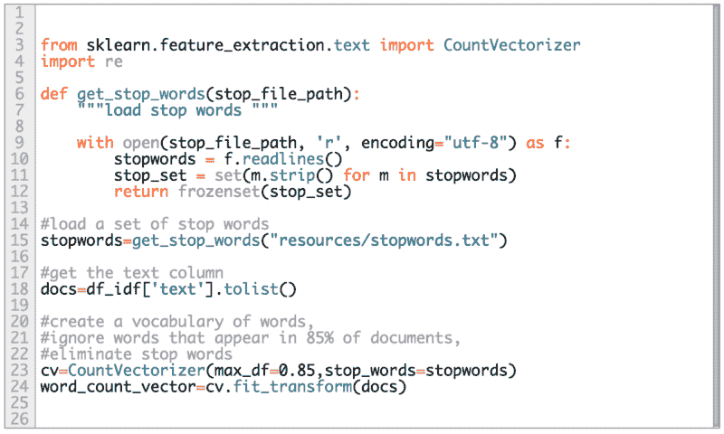

上面代码的最后两行的结果是计数的稀疏矩阵表示。每一列代表词汇表中的一个单词。每行代表我们数据集中的文档，其中的值是字数。

**注意**使用这种表示，如果单词没有出现在相应的文档中，一些单词的计数可能是 0。

这里我们将两个参数传递给 CountVectorizer，`max_df`和`stop_words`。第一种方法是忽略在 85%的文档中出现过的所有单词，因为这些单词可能不重要。后者是一个自定义的停用词表。你也可以通过设置`stop_words='english'`来使用 sklearn 自带的停用词。本教程使用的停用词表可以在这里找到[。](https://github.com/kavgan/data-science-tutorials/tree/master/tf-idf/resources)

`word_count_vector`的结果形状是(20000，124901 ),因为我们的数据集中有 20，000 个文档(行),词汇大小是 124，901。

在一些文本挖掘应用中，比如聚类和文本分类，我们通常会限制词汇表的大小。在实例化 CountVectorizer 时设置`max_features=vocab_size`真的很容易做到这一点。在本教程中，我们将词汇量限制在 10，000 个以内:

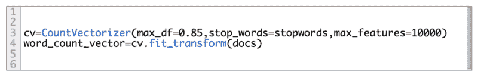

现在，让我们来看 10 个词汇:

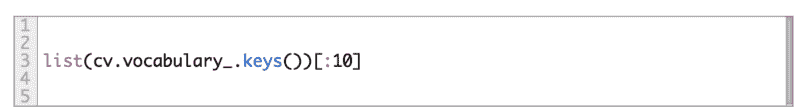

```
['serializing', 'private', 'struct', 'public', 'class', 'contains', 'properties', 'string', 'serialize', 'attempt']
```

太好了，这些大多是编程相关的。

### 用于计算 IDF 的 TfidfTransformer

现在是计算 IDF 值的时候了。

在下面的代码中，当您调用`fit(...)`时，我们实际上是从 CountVectorizer ( `word_count_vector`)获取稀疏矩阵来生成 IDF:

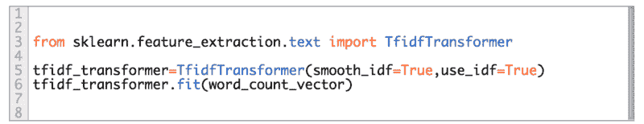

**非常重要的一点**:IDF 应该总是基于一个大的语料库，并且应该代表你用来提取关键词的文本。我在网上看到过几篇文章，使用少量文档计算 IDF。如果 IDF 加权不是基于大型语料库，您将**挫败 IDF 加权的整个目的**，因为:

1.  你的词汇量变得太小，而且
2.  你观察你所知道的单词行为的能力有限。

### 计算 TF-IDF 并提取关键词

一旦我们计算了 IDF，我们就可以计算 TF-IDF，然后从 TF-IDF 向量中提取关键词。

在本例中，我们将提取`data/stackoverflow-test.json`中问题的热门关键词。这个数据文件有 500 个问题，其字段与我们上面看到的`data/stackoverflow-data-idf.json`的字段相同。我们将从读取测试文件开始，提取必要的字段——标题和正文——并将文本放入一个列表中。

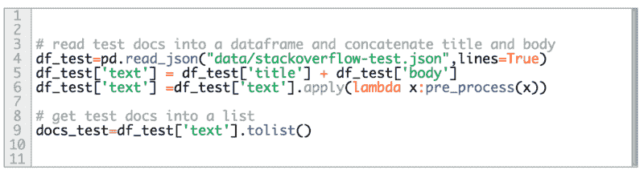

下一步是通过调用`tfidf_transformer.transform(...)`来计算测试集中给定文档的 tf-idf 值。这生成了 tf-idf 分数的向量。

接下来，我们按照 tf-idf 值的降序对向量中的单词进行排序，然后迭代提取前 n 个关键字。在下面的例子中，我们为测试集中的第一个文档提取关键字。

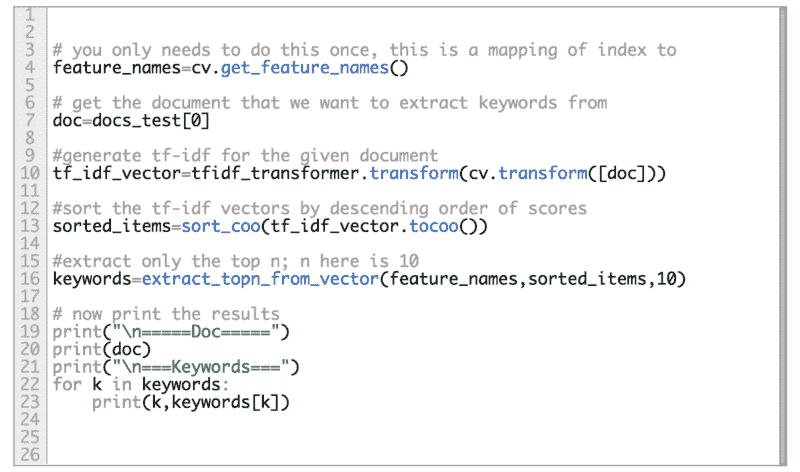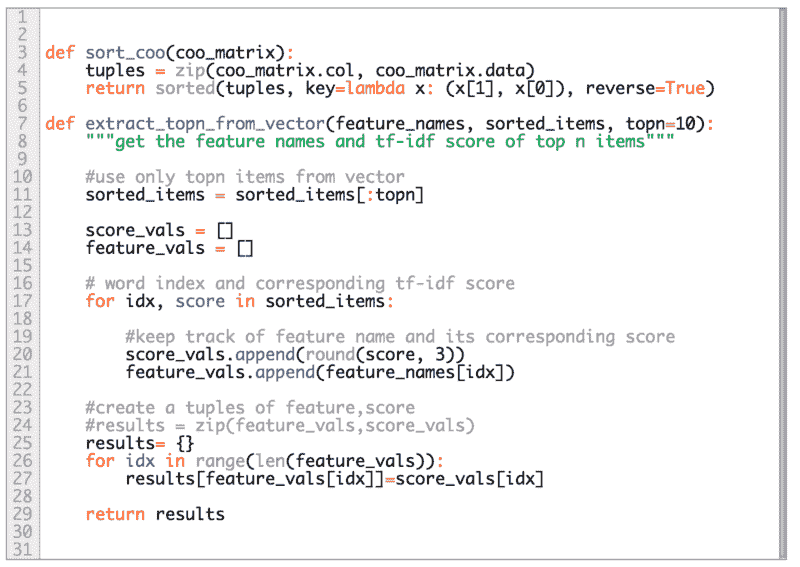

`sort_coo(...)`方法本质上是对向量中的值进行排序，同时保留列索引。一旦你有了列索引，那么就很容易查找相应的单词值，就像你在`extract_topn_from_vector(...)`中看到的那样，我们在这里做`feature_vals.append(feature_names[idx])`。

### 一些结果！

在本节中，您将看到堆栈溢出问题，后面是相应的提取关键字。

#### 关于 Eclipse 插件集成的问题

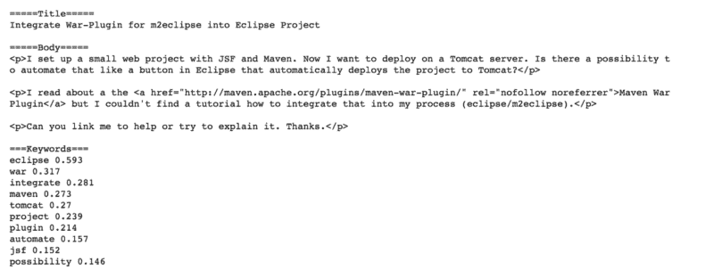

Actual extracted keywords.

从上面的关键词来看，置顶关键词其实是有道理的，它讲的是`eclipse`、`maven`、`integrate`、`war`、`tomcat`，都是这个具体问题特有的。

有几个关键词可以被删除，比如`possibility`甚至`project`。你可以通过在你的禁止列表中添加更多的常用词来做到这一点。你甚至可以创建你自己的一套阻止名单，[非常具体到你的领域](http://kavita-ganesan.com/tips-for-constructing-custom-stop-word-lists/)。

现在我们来看另一个例子。

#### 关于 SQL 导入的问题

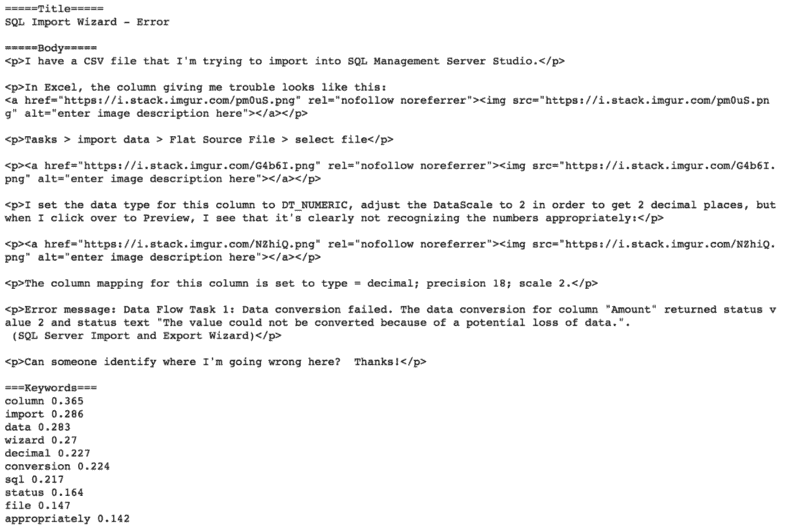

Actual extracted keywords

即使有所有的 html 标签，由于预处理，我们能够在这里提取一些非常好的关键字。最后一个单词`appropriately`可以作为停用词。您可以继续运行不同的示例，以获得如何微调结果的想法。

瞧啊。现在你可以从任何类型的文本中提取重要的关键字！

### 资源

*   [本教程的完整源代码和数据集](https://github.com/kavgan/data-science-tutorials/tree/master/tf-idf/)
*   在 [Google 的 BigQuery](https://cloud.google.com/bigquery/public-data/stackoverflow) 上堆栈溢出数据

[关注我的博客](http://kavita-ganesan.com/subscribe/#.XGs_lpNKigQ)从应用角度了解更多文本挖掘、NLP 和机器学习。

本文最初发表于[kavita-ganesan.com](http://kavita-ganesan.com/extracting-keywords-from-text-with-tf-idf-and-pythons-scikit-learn/)。