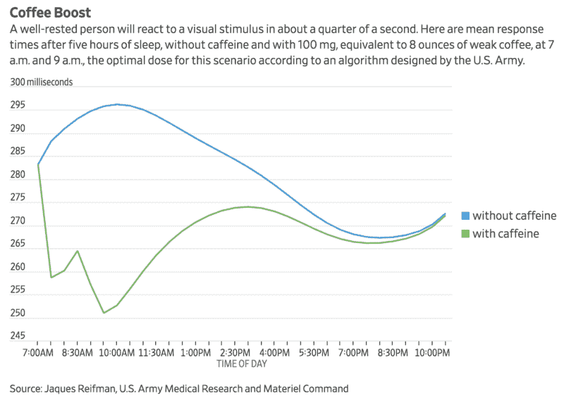
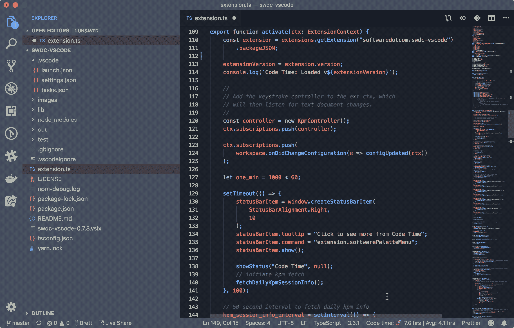
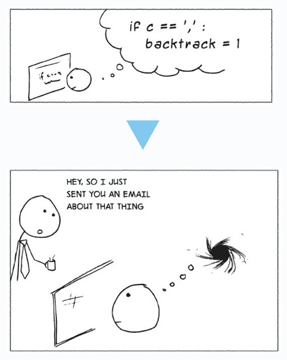
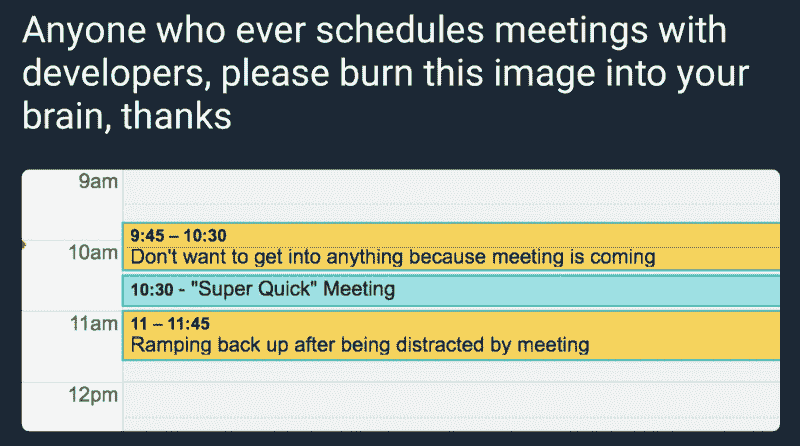
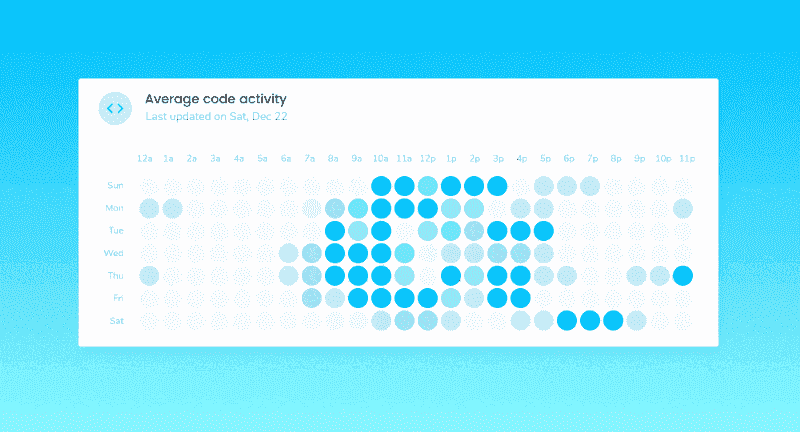

# 我如何从没有编码经验到推出我的第一个产品

> 原文：<https://www.freecodecamp.org/news/how-i-went-from-no-coding-experience-to-launching-my-first-product-7d3a6812b4e3/>

布雷特·史蒂文斯

# 我如何从没有编码经验到推出我的第一个产品

一年前，我没有真正的编码经验。现在，我和一个开发团队一起工作，几乎每天都要提交代码，主要使用 Javascript 和 React。

而今天，我们团队正在推出我们的第一款产品，[****代号时间为 VS 代号****](https://www.producthunt.com/posts/code-time) 。

### 免费代码营入门

在我找到 freeCodeCamp 之前，我是一个彻头彻尾的编码新手。作为一名本科生，我学习了一些基本的 Python，并在机械工程课上使用了 MATLAB，其中大部分我已经忘记了。

然后我在 Medium 上发现了 freeCodeCamp。我从一些编码挑战开始，这些挑战教会了我如何用足够的结构进行编码的基础知识，我可以用自己在课程之外的实践和探索来补充。

在学习如何编码之前，我还自学了如何在 Sketch 中设计用户界面，这帮助我理解了前端开发中涉及的很多概念。在应对挑战的过程中，我一直在思考我既能设计又能编码的产品。

### 偶遇产品创意

我一直喜欢跑步——不仅仅是因为这项运动，还因为在长跑后，我通常感觉最专注、最有创造力。

在一次例行跑步穿过金门公园后，我打开手机上的 Strava 应用程序，像往常一样检查我的时间、距离和速度。然后我想到了一个主意。

为什么我没有一个应用程序在我编码的时候跟踪我的进度？

长跑后查看我的数据既有趣又有益。除了用 Strava 跟踪我的跑步，我还用 Fitbit 跟踪我的睡眠，用 Mint 跟踪我的财务。

但当谈到编码时，我找不到一个应用程序能在长时间专注的会议后给我同样的回报感。

我还想看看我成为一名更熟练的开发人员的旅程背后的数据。我每周花多少时间写代码？我通常在一天中什么时候注意力最集中？当我编码时，我变得更有效率了吗？学习一个新的框架或语言，比如 React，需要多长时间？

我相信量化自我运动——你可以从数据中学习并做出决定，从而改善你的日常生活。

虽然我对让我更快乐、更有效率的习惯有一些假设，但我看不到实际的数据。睡眠和咖啡如何影响我一整天的注意力？跑步能给我创造性的编码提升吗，就像咖啡一样？

Source: [Wall Street Journal](https://www.wsj.com/articles/whats-your-ideal-caffeine-fix-an-algorithm-can-tell-you-1532084522)

我们都对驱动我们行为和结果的因素有信念，但它们可能是正确的，也可能是错误的。我们有难以置信的数量的偏差影响我们的理解，例如[确认偏差](https://en.wikipedia.org/wiki/Confirmation_bias)和[样本集偏差](https://en.wikipedia.org/wiki/Sampling_bias)。

我寻找答案，却找不到任何真正的解决方法。

这就是我们如何想到 [Code Time](https://www.software.com/) 的想法，这是一个为开发者自动生成时间和项目报告的插件。这个想法非常吸引人，我们从投资者那里获得了一些种子资金，包括斯坦福大学计算机科学教授、硅谷传奇人物[大卫·谢瑞登](https://en.wikipedia.org/wiki/David_Cheriton)。

我们的团队使用 VS 代码，所以我们的第一次产品发布是 VS 代码的代码时间。

[Code Time](https://marketplace.visualstudio.com/items?itemName=softwaredotcom.swdc-vscode) extension for VS Code

### 从代码到流程时间

当我开始参加 freeCodeCamp 的时候，当我长时间不受干扰的时候——通常是深夜和周末——我学习效率最高。

分心对进步尤其有害。当我开始和一个开发团队一起工作时，我意识到一个简单的中断会对编码会话造成多大的破坏。

你是否曾经陷入沉思，在花了大量时间进行研究后思考一个复杂的问题，却在你开始编码时被打断？

Source: [Jason Heeris](https://heeris.id.au/2013/this-is-why-you-shouldnt-interrupt-a-programmer/)

《社交网络 中也有一个很棒的场景，肖恩·帕克试图向脸书的一位开发者介绍自己，却遭到了拒绝，马克·扎克伯格告诉他，“哦，他已经连线进来了。”

[https://www.youtube.com/embed/PRBSKaTDrqQ?feature=oembed](https://www.youtube.com/embed/PRBSKaTDrqQ?feature=oembed)

开发是一项精细的、有逻辑的、艰苦的工作。松散的信息、脸书通知，有时还有会议——我们喜欢称之为“心流的敌人”——会分散注意力。

也许你以前偶然发现过这个伟大的 Reddit 帖子:

Source: [Reddit](https://i.redd.it/zr8if3gdtafz.png)

当我们构建代码时间时，我们假设数据可以帮助开发人员找到他们的流程，并在他们一天中最有生产力的时间里阻止中断。我们的团队认为，理解流程和自然聚焦时间是更聪明地编码的关键之一，而不是更困难。

例如，使用来自我们的代码时间插件的数据，我们构建了一个简单的热图，通过显示你一天中每个小时的平均编码活动，帮助你可视化你的流程。

我们也遵循“代码优先”的原则——我们不会安排打断他人流程的会议。我们的目标是通过在午餐前后安排会议来整理我们的日程表。

### 成为开发者最快的方法？打造产品！

在我在 freeCodeCamp 上学习了编码的基础知识，并提出了一个产品想法后，我开始与一个开发团队合作，将这个想法付诸实践。

幸运的是，我和一些非常有才华的高级开发人员一起工作。我通过在任务完成后阅读他们的代码、询问对我自己的代码的反馈以及观察他们如何做出代码设计和架构决策来学习。

在他们的指导和教导下，我从对我们的 web 应用程序的 CSS 进行小的修改，到使用 Nivo 的 React 图表库和 Material UI 构建自己的数据可视化。

[https://stackblitz.com/edit/work-life-balance?embed=1](https://stackblitz.com/edit/work-life-balance?embed=1)

随着我们的进步，我们的产品理念也发生了巨大的变化。例如，我的一个队友(Xavier，他构建了我们所有的代码编辑器插件)有一个想法，通过与 Spotify 和 iTunes 集成来捕获热门歌曲进行编码。(我们生成了一个排名前 40 的播放列表，您可以[点击这里](https://open.spotify.com/playlist/6jCkTED0V5NEuM8sKbGG1Z))。

这很讽刺，但是我已经学会了如何用 freeCodeCamp 和为开发者开发一个产品来编码。

freeCodeCamp 教会了我一些基础知识，给了我自信成为一名开发人员所需要的基础。这些挑战让我建立了一个 web 开发框架，在我处理自己的项目时，我可以在这个框架的基础上进行开发。

虽然时间和经验是无法替代的，但 freeCodeCamp 帮助我迈出了第一步。

有时候，旅程中最困难的部分是刚刚开始。

* * *

我们的团队刚刚推出了产品搜索的[代码时间](https://www.producthunt.com/posts/code-time) …看看吧！如果你喜欢，请投票支持我们！