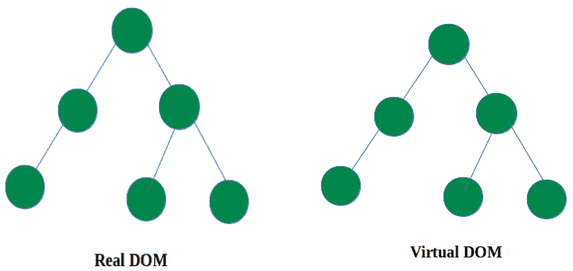
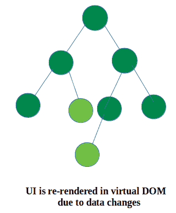
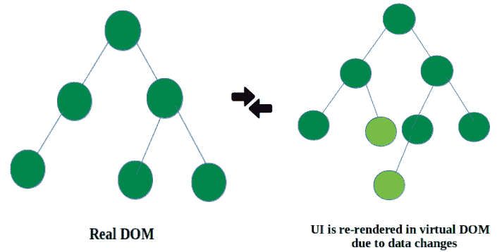
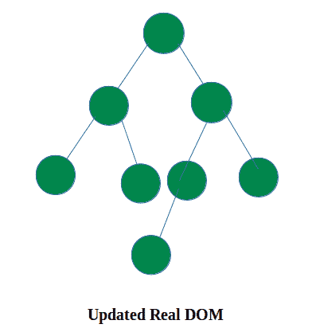

# 学习 React.js 基础知识——适用于初学者

> 原文：<https://www.freecodecamp.org/news/start-your-journey-into-the-world-of-react-by-learning-these-basics-d6e05d3655e3/>

今天，我将重点介绍 React 世界的基础知识。如果你刚刚在 ReactJS 开始你的旅程，那么我会说你来对地方了。在本文中，我试图以非常简单的方式介绍 React 的基础知识。我希望在这篇文章结束时，你会知道反应的基本概念。

我们开始吧。

### ReactJS —一个强大的库

你可能已经在很多地方读到过，React 是一个用于制作 web 和移动 UI 的库。它是由脸书开发的。

ReactJS 是组件驱动的。一切都是负责某些功能的组件。你编写很小很小的组件，然后把它们组合在一起形成大的组件。这使得代码更具可读性和可理解性。使 React 强大而美观的功能有:

1.  它使用虚拟的 DOM 概念，而不是真实的 DOM。
2.  由于 JSX，代码可读性更好。使用 JSX 会让你感觉像在编写 web 应用程序(看起来像 HTML 一样的 JavaScript)。
3.  **它还使用了 SSR (SSR 在 SEO 中有帮助)。**

这些都是你可能已经读过的东西，但是当你阅读本教程时，你会理解和感受到的。因此，让我们深入了解虚拟 DOM 的概念(我想说这是使 React 更漂亮的主要特性)。

### **ReactJS 虚拟 DOM**

虚拟 DOM 是真实 DOM 的副本。与真实的 DOM 不同，虚拟 DOM 做最少量的 DOM 操作来保持组件最新。它只更新已经更新的部分。

DOM 操作非常容易。下面是虚拟 DOM 如何工作的可视化演示:

1.  虚拟 DOM 是真实 DOM 的副本。



2.当组件中的数据发生变化时，整个 UI 会在虚拟 DOM 中重新呈现。



3.然后在真实 DOM 和虚拟 DOM 之间进行比较。



4.一旦计算完成，真正的 DOM 就会用更改的内容进行更新。



我们一直在谈论 React 的一个伟大特性——那就是虚拟 DOM，但是等等！第二部电影中的 JSX 是什么？您可能想知道它是什么，它与 React 有什么关系，以及它如何给我们编写 web 应用程序的感觉...

这次让我们潜入 JSX 游泳池。

### JSX

在继续之前，让我们看一下下面的代码:

```
class FirstComponent extends React.Component {  
     render() {    
         return (      
             <span className='customSize'>My First Component</span>    
          );  
      }
}
```

```
class FirstComponent extends React.Component {  
     render() {    
         return (      
            React.createElement('span',{className: 'customSize'},                            'My First Component')    
         );  
      }
}
```

在第一个例子中，渲染函数看起来像是在返回 HTML 代码，但这是 JSX。第一个例子是第二个例子的 JSX 版本。JSX 是一个 JavaScript 扩展，让你的 JS 代码看起来像 HTML。

看看第二个例子，React.createElement 用于创建一个 React 元素来表示 react 组件。如果元素不需要属性，第二个参数可以为 null 或空。第三个参数定义了它应该包含什么(像任何其他 React 元素一样，比如说，带有属性‘src’)。

如果你看看上面的两个代码块，你会发现第一个更熟悉，因为它给人一种 HTML 的感觉。JSX 还增加了代码的可读性。让我们来看看另一个例子，没有 JSX 和 JSX 来感受一下代码的可读性。

**没有 JSX 的反应:**

```
React.createElement("div", null,  
      React.createElement("img", {src: "image.jpg", alt: "Random photo"}),
      React.createElement("h3", null, "Hello React"));
```

**与 JSX 版本的反应:**

```
<div>  
     
   <h3&gt;Hello React</h3>
</div>
```

通过看上面的例子，你可以理解我所说的关于代码可读性的内容。用 JSX 读代码有多简单，对吗？我认为这对于 JSX 来说已经足够了，我希望现在你能够更好地理解 JSX 在 React 世界中的力量。

**注意—** *浏览器无法阅读 JSX。所以，我们必须用 JSX 变形金刚(比如巴别塔)把它转换成 JavaScript，这样浏览器才能理解。*

现在我们知道 JSX 是什么了。但是我想让你看一下我之前写的 React 是关于组件的图片。它是组件驱动的。因为组件是 React 的构建模块，所以让我们来研究一下它们。

### 反应堆心脏组件

在研究 React 的过程中，您可能会遇到以下代码，这些代码说明了如何创建组件:

```
class MyStatefulComponent extends React.Component {   
     state = {       
         title: ''    
     }

componentDidMount() {   
    console.log('Component mounted')  
}

render() {    
    return <div>{this.props.name}</div>;  
    }
}
```

如果你以上述方式编写你的组件，它就被称为一个**类/有状态/容器**组件。如果您认为这是创建组件的唯一方式，请三思。是的，有另一种创建组件的方法，这种方法产生了**功能/无状态/表示组件。**在继续之前，让我们看看功能组件是如何编写的:

```
const MyStatelessComponent = props => <div>{props.name}</div>;
```

现在，您可能想知道这两者之间有什么区别，以及您应该如何选择创建哪种类型。因此，让我们深入研究有状态和无状态组件池。

**无状态(或者表示层或者功能层)**组件是那些没有任何状态的组件(不知道状态？别担心，我会在后面的部分解释)。它们用于表示你希望你的组件是什么样子。

组件是一个普通的 JavaScript 函数，它将一个 prop 作为参数，并返回一个 React 元素(见上面的例子)。它的名字是不言自明的——它没有状态。它没有生命周期方法(如**componentdimount**方法等)。您可能在研究 React 教程时已经读过)。

**有状态(或容器或类)**组件是那些有状态的组件——数据源(可以在其中调用 this.setState)，生命周期方法(可以用来进行 API 调用)。它是一个 JavaScript 类，扩展了 React 组件，这意味着 React 创建了它的实例。React 初始化组件类，以便使用生命周期方法，初始化状态等等。

等等…现在你可能想知道哪一个更好，以及选择什么？如果你头脑中有这个问题，关于如何将逻辑部分和表象部分分开，你可以回答这个问题。是的，一个问题回答另一个问题是很奇怪的，但你很快就会明白我为什么这么说了。

正如您可能在其他 React 教程中看到的，它们使用类来创建组件。他们将逻辑和表现部分放在同一个组件中，这使得该组件更加复杂和庞大。

所以，如果你想把你的逻辑组件和表现组件分开，那么组件类最适合逻辑类的东西，比如从 API 获取数据或者数据变化。另一方面，如果你的组件关注于表现性/功能性的东西，那么这个组件应该看起来不错。

简而言之，我会说两者都用。当你需要一个东西(生命周期方法，状态)的时候使用组件类，为了表示，使用一个功能组件。

那都是关于组件的。

现在，我们有了如何编写组件的蓝图，但是我还没有告诉你我们如何管理组件中的数据。我认为如果没有数据，组件将毫无用处。因此，我们将看看如何管理组件的数据(比如从 API 获取数据，反应“状态”故事，设置状态等等)。

我们开始吧。

### 小道具

“Prop”是 properties 的简写，这是我们组件中的一个数据源。它可以用来将数据传递给不同的组件。等等！我想让你回到我告诉你关于表示和类组件的地方。我告诉过你使用表示组件来管理组件的外观，使用容器组件来处理数据等等。正确！

所以“道具”是我们可以用来在这两种类型的组件之间建立连接的东西。是的，您可以使用 props 将数据从容器组件传递到表示组件，表示组件将使用您的动态数据呈现视图。请看看下面的代码，以便更好地理解:

```
import {ButtonView} from './button.presentation';  
class MyContainerComponent extends React.Component {  
    state={      
       text : 'Submit'  
    }
render() {   
    return (    
        <ButtonView btnText={this.state.text}/>
        )
    }
} 
```

(button.container.js file)

```
export const ButtonView=({btnText})=>(  
     <div>   
         <button className="btn btn-info btn-lg">{btnText}</button>              </div>
)
```

(button.presentation.js file)

和上面的方法一样(使用 props—‘btnText’)，你可以把逻辑部分和表示部分分开。props 的另一个特征是它们是只读的，即它们是不可变的。它们不会在传递它们的组件内部进行修改。数据流也是单向的——这为我们提供了单向数据绑定(不像 Angular)。

但是，在某些情况下，我们可能想要更改数据(比如在某些事件中由用户更改数据等等)。因此，在这种情况下，“状态”进入反应市场。让我们深入研究一下。

### 状态

正如我告诉你的，属性是不可变的，而状态是可变数据——即响应特定事件而变化的数据。所以，如果你想改变你的数据值，那么把它存储在状态中。状态是存储组件数据的对象。为了更好地说明状态是如何定义和使用的，这里有一个例子:

```
class LoginContainer extends React.Component {
      constructor(props) {  
          super(props);  
              this.state = {   
                 userName: "",  
               };
      }
onFilluserName = event => {   
     this.setState({    
          userName: event.target.value,   
     });
}
render() {  
    return (  
       <div>    
          <input value={this.state.userName} onChange=          {this.onFilluserName}   
       </div>   
     ); 
   }
}
```

从上面的例子可以看出，state 表示存储组件数据的对象。它们在构造函数中初始化。您可以使用“this.state”来访问状态。这是使用状态在组件中呈现数据的方式。

但是，我告诉过你，使状态成为组件核心的东西是它的可变行为。是的，现在的问题是我们如何改变国家的财产。答案是使用‘this . setstate’(请看上面的例子)。使用 this.setState，我们在用户键入时更改了数据值。

简而言之，属性和状态都是数据的来源，但是它们的用法和行为是不同的。每当你的数据可能发生变化时，使用“状态”来表示——否则“适当的”是好的选择。

这就是 React 世界的所有基础知识。希望你对基础有更好的理解。

我还没有讨论类组件的一个非常重要的部分:生命周期方法。是的，生命周期方法是 ReactJS 的另一个关键部分，但是它们是什么以及它们为什么重要将在我的下一篇文章中讨论！

感谢阅读。