# 深度学习和数据科学的 Python 入门方法

> 原文：<https://www.freecodecamp.org/news/how-to-get-started-with-python-for-deep-learning-and-data-science-3bed07f91a08/>

作者李宗德·韦恩

# 深度学习和数据科学的 Python 入门方法

#### 完全初学者设置 Python 的分步指南


如今，你可以用几行代码编写自己的数据科学或深度学习项目。这并不夸张；许多程序员已经完成了编写大量代码供我们使用的艰苦工作，因此我们需要做的就是即插即用，而不是从头开始编写代码。

你可能在数据科学/深度学习博客帖子上看到过一些这样的代码。也许你会想:“好吧，如果真的那么简单，那我为什么不自己尝试一下呢？”

如果你是 Python 的初学者，并且想开始这段旅程，那么这篇文章将指导你迈出第一步。我从完全初学者那里听到的一个常见抱怨是设置 Python 非常困难。我们如何在第一时间启动一切，以便我们可以即插即用数据科学或深度学习代码？

这篇文章将逐步指导你如何为你的数据科学和深度学习项目设置 Python。我们将:

*   设置水蟒和木星笔记本
*   创建 Anaconda 环境并安装软件包(其他人编写的使我们的生活变得非常简单的代码)，如 tensorflow、keras、pandas、scikit-learn 和 matplotlib。

一旦你设置了以上内容，你就可以在本教程中建立你的第一个神经网络来预测房价了:

[用 Keras 建立第一个预测房价的神经网络](https://medium.com/intuitive-deep-learning/build-your-first-neural-network-to-predict-house-prices-with-keras-eb5db60232c)

### 设置 Anaconda 和 Jupyter 笔记本

我们要用的主要编程语言叫 Python，是深度学习从业者最常用的编程语言。

第一步是下载 Anaconda，你可以把它想象成一个让你“开箱即用”使用 Python 的平台。

访问此页面:[https://www.anaconda.com/distribution/](https://www.anaconda.com/distribution/)向下滚动查看:

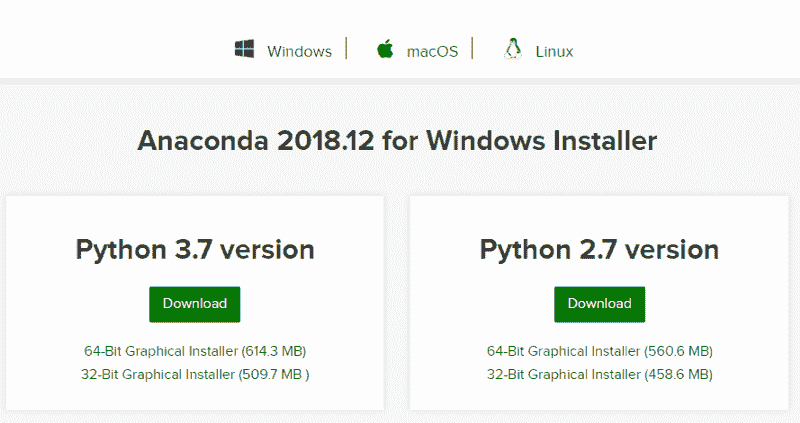

Download Anaconda

本教程是专门为 Windows 用户编写的，但对其他操作系统用户的说明并没有什么不同。请务必点击“Windows”作为您的操作系统(或您所在的任何操作系统)，以确保您下载的是正确的版本。

本教程将使用 Python 3，因此单击“Python 3.7 版本”下的绿色下载按钮。应该会出现一个弹出窗口，让您点击“保存”进入您想要的任何目录。


下载完成后，只需按如下步骤逐步完成设置:

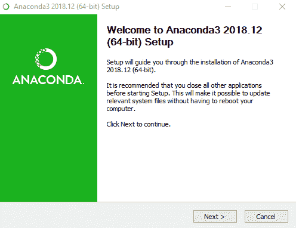

Click Next

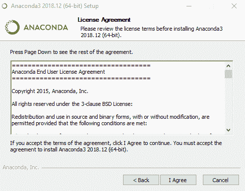

Click “I Agree”

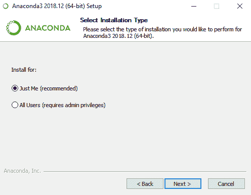

Click Next

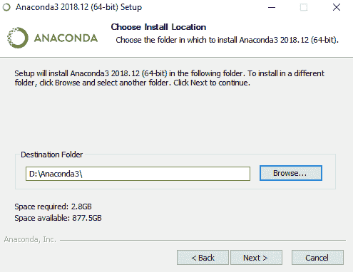

Choose a destination folder and click Next

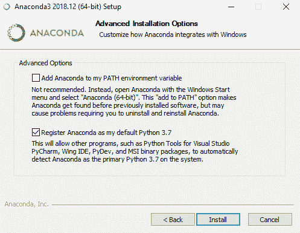

Click Install with the default options, and wait for a few moments as Anaconda installs

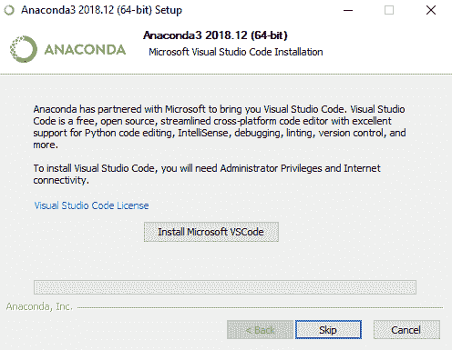

Click Skip as we will not be using Microsoft VSCode in our tutorials

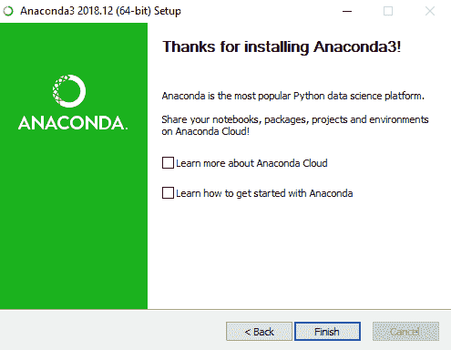

Click Finish, and the installation is done!

安装完成后，进入开始菜单，您应该会看到一些新安装的软件:

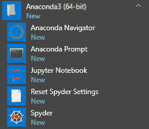

You should see this on your start menu

点击 Anaconda Navigator，这是一个一站式中心，可以导航我们需要的应用程序。您应该会看到这样的首页:

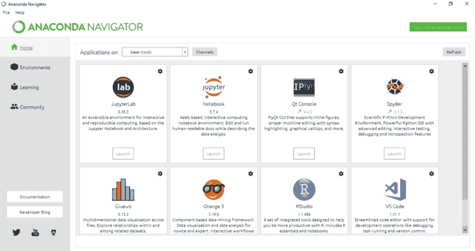

Anaconda Navigator Home Screen

点击 Jupyter 笔记本下的“启动”,这是我屏幕上方的第二个面板。Jupyter Notebook 允许我们在 web 浏览器上交互式地运行 Python 代码，这是我们编写大部分代码的地方。

应该会打开一个浏览器窗口，显示您的目录列表。我准备在桌面上创建一个文件夹，名为“直觉深度学习教程”。如果您导航到该文件夹，您的浏览器应该如下所示:

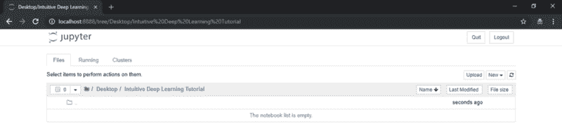

Navigating to a folder called Intuitive Deep Learning Tutorial on my Desktop

在右上角，单击“新建”并选择“Python 3”:

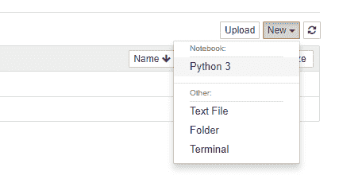

Click on New and select Python 3

一个新的浏览器窗口应该像这样弹出。

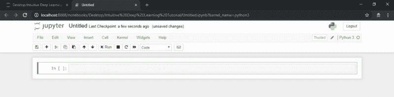

Browser window pop-up

祝贺您，您已经创建了您的第一个 Jupyter 笔记本！现在是时候写一些代码了。Jupyter 笔记本允许我们编写代码片段，然后运行这些片段，而无需运行整个程序。这可能有助于我们查看程序的任何中间输出。

首先，让我们编写代码，在运行时显示一些单词。这个功能叫做*打印*。将以下代码复制并粘贴到 Jupyter 笔记本的灰色方框中:

```
print("Hello World!")
```

您的笔记本应该是这样的:

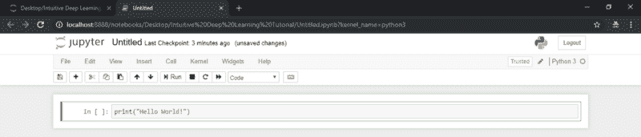

Entering in code into our Jupyter Notebook

现在，按下键盘上 Alt-Enter 来运行这段代码:

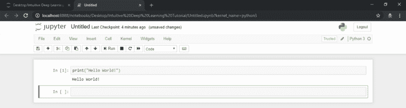

Press Alt-Enter to run that snippet of code

你可以看到 Jupyter 笔记本已经显示了“Hello World！”代码片段下面的显示面板上！数字 1 也填充在方括号中，这意味着这是我们到目前为止运行的第一个代码片段。这将帮助我们跟踪代码片段的运行顺序。

除了 Alt-Enter，请注意，当代码段突出显示时，您也可以单击 Run:

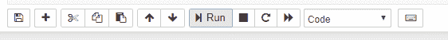

Click Run on the panel

如果您希望创建新的灰色块来编写更多的代码片段，您可以在“插入”下这样做。

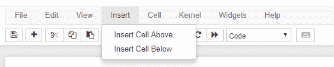

Jupyter Notebook 还允许您编写普通文本，而不是代码。点击当前显示“代码”的下拉菜单，并选择“降价”:

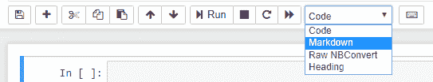

现在，我们标记为降价的灰色框旁边将没有方括号。如果您现在在这个灰色框中输入一些文本，然后按 Alt-Enter，文本将显示为纯文本，如下所示:

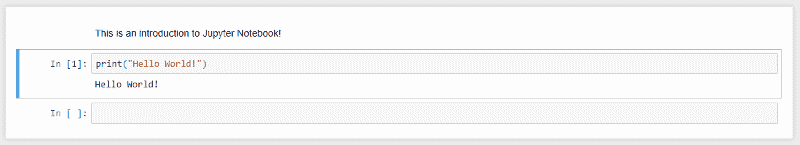

If we write text in our grey box tagged as markdown, pressing Alt-Enter will render it as plain text.

您还可以探索其他一些功能。但是现在我们已经有了 Jupyter notebook，可以开始写一些代码了！

### 设置 Anaconda 环境和安装包

现在我们已经建立了我们的编码平台。但是我们要从头开始写深度学习代码吗？这似乎是一件极其困难的事情！

好消息是，许多其他人已经编写了代码，并提供给我们！有了其他人代码的贡献，我们可以在非常高的水平上玩深度学习模型，而不必担心从头实现所有这些模型。这使得我们开始编码深度学习模型变得极其容易。

对于本教程，我们将下载深度学习实践者常用的五个包:

*   Tensorflow
*   Keras
*   熊猫
*   Scikit-learn
*   Matplotlib

我们要做的第一件事是创建一个 Python 环境。一个环境就像一个独立的 Python 工作副本，所以无论您在您的环境中做什么(比如安装新的包)都不会影响其他环境。为您的项目创建一个环境是一个很好的实践。

单击左侧面板上的 Environments，您应该会看到这样的屏幕:

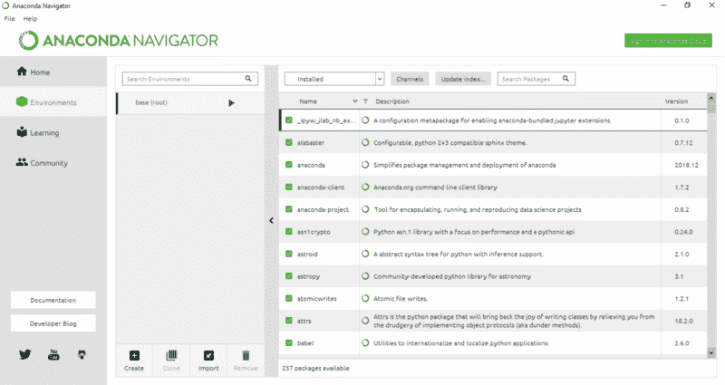

Anaconda environments

点击列表底部的“创建”按钮。应该会出现这样的弹出窗口:

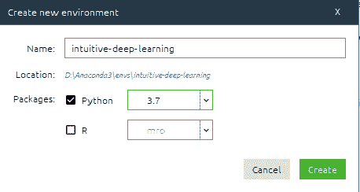

A pop-up like this should appear.

命名您的环境并选择 Python 3.7，然后单击创建。这可能需要一些时间。

完成后，您的屏幕应该如下所示:

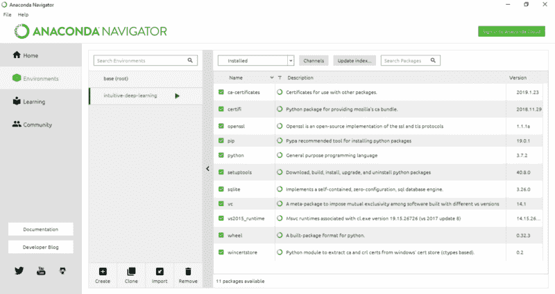

请注意，我们已经创建了一个“直观-深度学习”的环境。我们可以看到我们在这个环境中安装了哪些包以及它们各自的版本。

现在让我们将一些我们需要的包安装到我们的环境中！

我们将安装的前两个包名为 Tensorflow 和 Keras，它们帮助我们即插即用深度学习的代码。

在 Anaconda Navigator 上，单击当前显示“已安装”的下拉菜单，然后选择“未安装”:

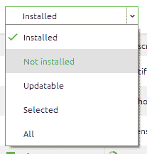

您尚未安装的软件包的完整列表将如下所示:

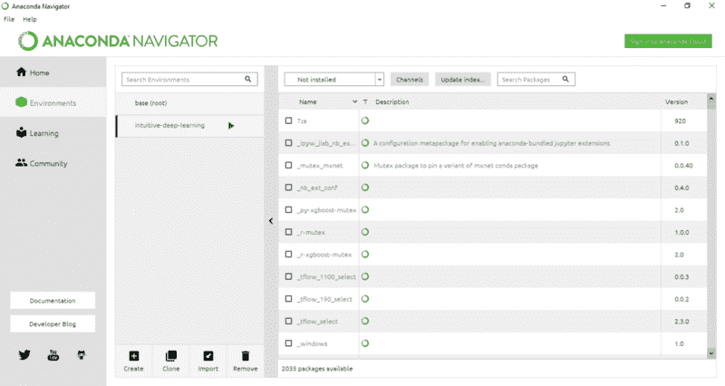

搜索“tensorflow”，并单击“keras”和“tensorflow”的复选框。然后，单击屏幕右下角的“应用”:

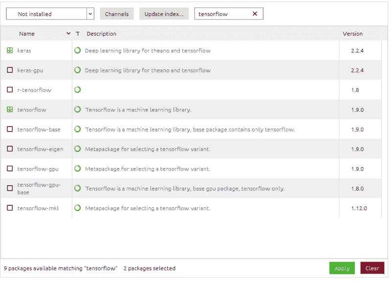

弹出窗口应该如下所示:

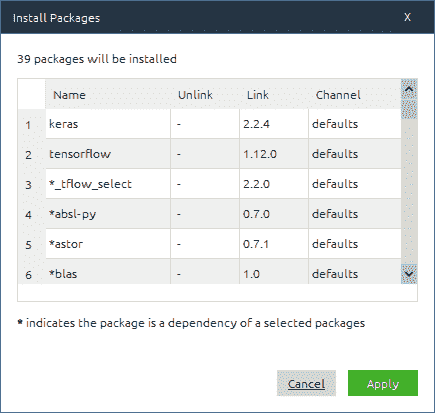

单击应用并等待片刻。完成后，我们将在环境中安装 Keras 和 Tensorflow！

使用同样的方法，让我们安装软件包'熊猫'，' scikit-learn '和' matplotlib '。这些是数据科学家用来处理数据以及在 Jupyter notebook 中可视化漂亮图形的常用软件包。

这是您应该在 Anaconda Navigator 上看到的每个包的内容。

**熊猫:**

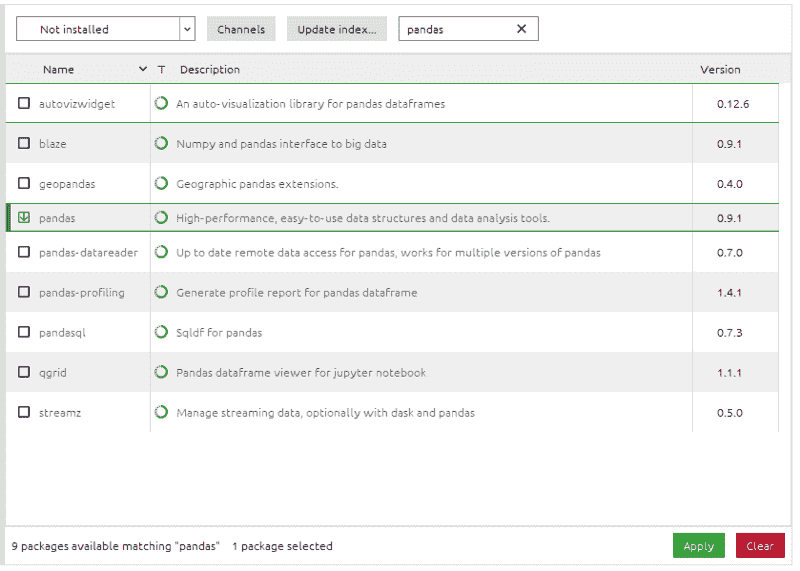

Installing pandas into your environment

**Scikit-learn:**

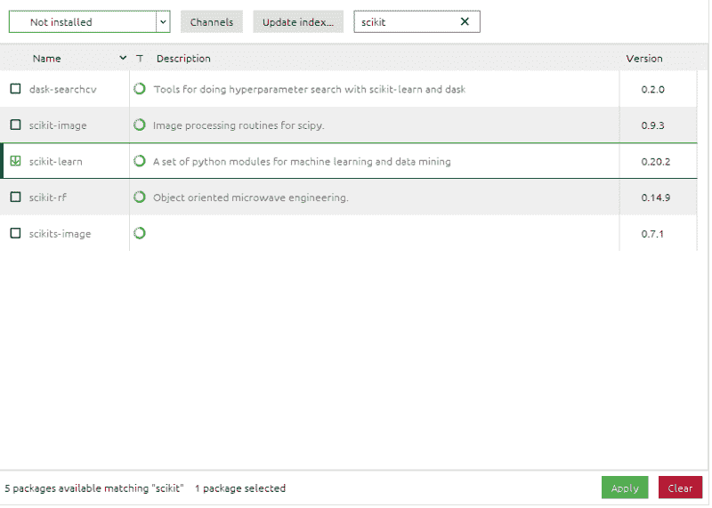

Installing scikit-learn into your environment

**Matplotlib:**


Installing matplotlib into your environment

完成后，返回 Anaconda Navigator 左侧面板的“Home”。你应该会看到这样一个屏幕，上面写着“直觉深度学习的应用”:

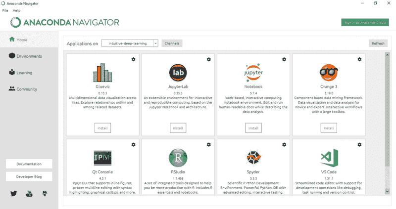

现在，我们必须在这种环境下安装 Jupyter 笔记本。所以点击 Jupyter 笔记本 logo 下的绿色按钮“安装”。(又)要花一些时间。安装完成后，Jupyter 笔记本面板应该如下所示:

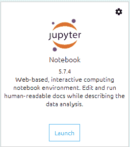

点击启动，Jupyter 笔记本应用程序应该会打开。

创建一个笔记本，键入这五段代码，然后单击 Alt-Enter。这段代码告诉笔记本，我们将使用您在本教程前面用 Anaconda Navigator 安装的五个包。

```
import tensorflow as tf
```

```
import keras
```

```
import pandas
```

```
import sklearn
```

```
import matplotlib
```

如果没有错误，那么恭喜您，您已经正确安装了所有东西:

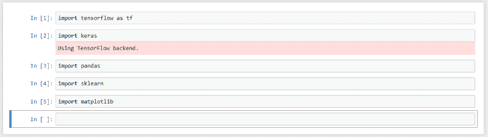

A sign that everything works!

现在我们已经设置好了一切，我们将在这里开始构建我们的第一个神经网络:

[**用 Keras 建立你的第一个神经网络来预测房价**](https://medium.com/intuitive-deep-learning/build-your-first-neural-network-to-predict-house-prices-with-keras-eb5db60232c)
[*一步一步完整的初学者指南用几行代码建立你的第一个神经网络像一个深…*medium.com](https://medium.com/intuitive-deep-learning/build-your-first-neural-network-to-predict-house-prices-with-keras-eb5db60232c)

如果你在上面的任何步骤中有任何问题，请随时在下面评论，我会帮你解决的！

**关于作者:**

你好，我是约瑟夫！我最近从斯坦福大学毕业，在那里我和吴恩达一起在[斯坦福机器学习小组](https://stanfordmlgroup.github.io/)工作。我想让深度学习概念尽可能直观，尽可能容易被每个人理解，这激励了我的出版:[直观的深度学习](https://medium.com/intuitive-deep-learning)。