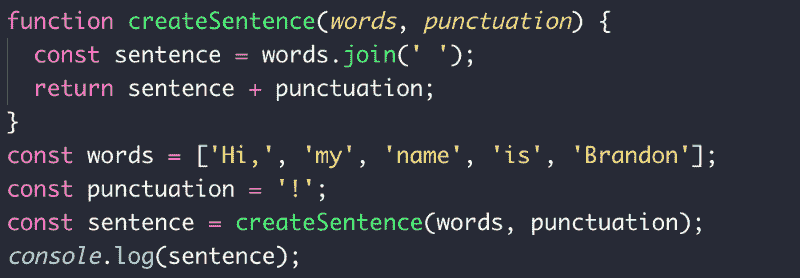
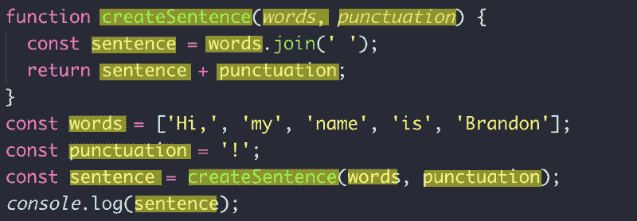
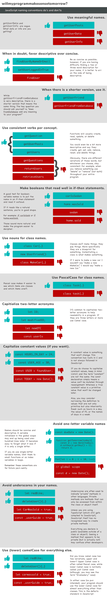

# JavaScript 命名惯例:该做什么和不该做什么

> 原文：<https://www.freecodecamp.org/news/javascript-naming-conventions-dos-and-don-ts-99c0e2fdd78a/>

我发现我们可以从不到 30 个字符中获得多少不同的含义，这很令人惊讶。当然，我说的是带有一些恰当标点的字母表。从一个爱情故事到一个电脑程序，写作让我们创造了一个非常不同的世界。总的来说，语言提供了一个框架，在这个框架中，我们可以悬挂一连串的想法。

大多数编程语言似乎都有非常严格的标准——某些术语必须在某些地方使用。但是有一个领域有很大的自由度，那就是我们如何命名这些术语。

以这个简单的程序为例，它从一组单词中创建一个句子，添加一个标点符号，并将其记录到控制台:

没什么特别的，对吧？但是你可能没有考虑到你要负责说出多少个术语。

上述程序中有 23 个字(不包括硬编码值)。我们控制了其中 14 个单词的名称。超过 60%的输入内容是由我们负责命名的！

You are responsible for the majority of the names in your program

无论你是在构建一个企业应用还是一个简单的 *Hello，World，*你都希望你的程序读起来像《泰晤士报》的畅销书，而不是一本疯狂的 Libs 工作簿。

这不是关于如何构建一个完整的 JavaScript 应用程序的宣言，而是关于如何为你可以自由选择的事物命名的一章。如果你想了解更多，我在底部提供了各种参考资料。最后一点，我们所有惯例和标准的关键要点是:

> 这些惯例中的大部分不是为你今天准备的，而是为你和明天阅读你代码的人准备的。

#### 参考资料和继续学习

1.  罗伯特·c·马丁的《干净的代码》——*所有语言的好读物。它超越了命名约定，提出了程序的整个结构。这些例子是用 Java 编写的，但是这些原则也适用于 JavaScript。*
2.  [“干净代码 JavaScript”作者:瑞安·麦克德莫特](https://github.com/ryanmcdermott/clean-code-javascript) — *上述书籍，但为 JavaScript 而重新制作。它可以在网上免费获得。*
3.  Airbnb JavaScript 风格指南——*可能是最全面的 JavaScript 风格指南。它不仅包含是什么，还包含为什么。(如果您使用的是小型设备，您可能需要点击“查看所有自述文件”来查看整个文档)。*
4.  W3 JavaScript 风格指南—*简明指南。*
5.  谷歌的 ES6 风格指南——*谷歌的 JavaScript 风格指南。*

感谢阅读！

沃兹

在 [Twitter](https://twitter.com/Brandonwoz) 上关注我。