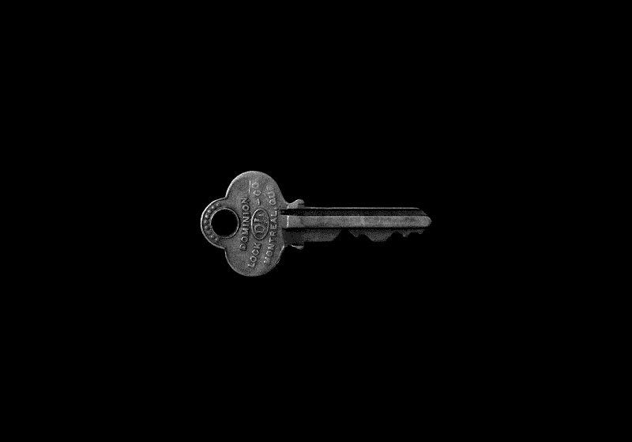

# 对 SSH 及其如何实现安全数据共享的自上而下的介绍

> 原文：<https://www.freecodecamp.org/news/a-top-down-introduction-to-ssh-965f4fadd32e/>

山姆·奥拉森

本文将从高层次和自顶向下的方法来解释 SSH 如何工作，以及如何使用它来安全地与远程计算机通信。

我们将看看 SSH 会话实际上是如何“安全”的，以及计算机首先是如何建立和设置 SSH 会话的。我们还将看看使用 SSH 的好处。

注意:这是给我自己的未来笔记，但我希望你也能从中学到一些东西！



Photo by [Matt Artz](https://unsplash.com/photos/pY_AZJfdbHQ?utm_source=unsplash&utm_medium=referral&utm_content=creditCopyText) on [Unsplash](https://unsplash.com/search/photos/key?utm_source=unsplash&utm_medium=referral&utm_content=creditCopyText)

### 什么是宋承宪？

SSH 是“安全外壳”的缩写。这是一种通过互联网在两台计算机之间共享数据的协议。

协议本质上是一组规则，它们定义了计算机可以用来通信的语言。

通常，涉及的两台计算机是您的计算机(“客户机”)和远程服务器(“主机”)。

### 我们为什么关心？

#### 计算机之间的安全通信

每当两台计算机通过互联网进行通信时，我们都希望确保我们的消息不会被任何监听消息的人截获和理解。

想象一下，通过互联网发送您的银行信息，以便在网上购物。如果你的信息没有加密，那么任何监听的电脑或者任何接收到信息的电脑都可以看到你的账号和密码。这可不好。

我相信对于任何渴望使用 web 技术的人来说，这是一个需要理解的重要概念。

#### 安全访问远程计算机

使用 SSH 来检查身份验证是比使用密码更安全的身份验证方式。我们将在下面探讨这是如何工作的。

### SSH 如何安全？

SSH 是两台计算机之间发送通信的安全方式。

所谓“安全”，我指的是在客户端计算机上对消息进行编码的一种方式，这样唯一能够解码消息并理解它们的其他计算机就是主机。这种编码/解码被称为**加密，**所以我们在这里真正的意思是 SSH 是安全的，因为它使用了一个**加密的通信通道。**

### SSH 会话是如何建立的？

为了开始 SSH 会话，两台计算机之间需要进行几个过程。

1.  首先，我们需要一种方法来建立一种在计算机之间交换信息的安全方法。我们需要建立一个**加密通道。**
2.  我们需要一种方法来检查主机收到的数据是否被篡改。这称为**验证**，我们在这里验证客户端发送的数据的完整性。
3.  (再次)验证。我们需要一种方法来检查与我们通信的计算机不是冒牌货。这是另一种形式的验证，但这里我们验证的是计算机的身份。

完成这三个步骤后，我们现在可以安全地与远程计算机通信了。

完成这些步骤后，我们可以安全地共享“秘密”数据，我们还可以检查客户端是否有权以比使用密码更安全的方式访问主机。这个过程被称为使用非对称加密的**认证。**

下面的每一节都将更详细地介绍这些步骤。

### **设置加密通道**

SSH 协议的一个核心部分是它是否安全(它甚至出现在名称中！)，这意味着使用 SSH 发送的所有信息都是加密的。

#### 这些信息是如何加密的？

加密本质上只是意味着用一些聪明的数学方法“混淆字母”。两台计算机都需要有一个的方式来加密信息，这样只有另一台计算机才能解密信息并理解它。

#### 这是如何工作的？

两台计算机都有一个相同版本的**对称密钥。**对称密钥只是存储在计算机某处的一串字母。计算机可以使用对称密钥对发送给它们的消息进行加密和解密。

使用这种对称密钥方法被称为**对称加密。**“对称”部分来自于每台计算机上的对称密钥是相同的这一事实。这种方法非常有效…但是只有在没有其他计算机可以访问对称密钥的情况下才有效。

#### 一个问题

两台计算机如何知道对称密钥是什么？

一台电脑就可以创建它，并通过互联网发送出去。但是这些信息还没有被加密，所以任何截获这些信息的人都会立即得到对称密钥……并且可以解密所有未来的通信。那就糟了！

这有时被称为“密钥交换”问题。很明显，在使用对称密钥之前，我们需要在这个过程中添加另一个步骤。

#### 一个解决方案

上述“密钥交换”问题的一个解决方案是，两台计算机彼此共享一些公共信息(这是“公共”的，意味着它们不介意任何人拦截它)，并将这些信息与它们自己计算机上的一些信息结合起来，独立地**创建**相同的**对称密钥。**

然后，这些对称密钥可以以上述方式用于对称加密。

#### 这是如何工作的

两台计算机都有自己的私钥和公钥。它们一起形成了一个**密钥对**。计算机**通过互联网彼此共享它们的公钥**。因此，在这个过程的这一点上，每台计算机都知道

*   它自己的私钥，
*   它自己的公钥，
*   和另一台计算机的公钥。

#### 生成对称密钥

两台计算机然后使用这 3 条信息独立生成一个**相同的**对称密钥。

每台计算机使用一种数学算法，该算法使用上述 3 种输入。该算法是 Diffie-Hellman 密钥交换算法的一部分。将在每台计算机上执行的算法是这样的:

```
Host
pub_2 = other computer's public key
pub_1 = my public key
pri_1 = my private key

f(pub_2, pub_1, pri_1) = abcdefg // Symmetric Key

Client:
f(pub_1, pub_2, pri_2) = abcdefg // Symmetric Key
```

这里要带走的重要一点是，计算机在互联网**上**只共享公共信息**，但仍然能够创建对称密钥！**

使用密钥对和共享公共信息来生成相同对称密钥的方法称为**非对称加密**。之所以称之为“不对称”，是因为两台计算机都是从各自不同的密钥对开始的。

**到目前为止:**我们已经看到了如何使用非对称加密以安全的方式在两台计算机*上独立生成相同的对称密钥*(解决密钥交换问题)，然后使用对称密钥进行加密和解密，在计算机之间安全地交换信息。

### 确认

这样我们就可以安全地交流了。但是建立 SSH 会话过程的下一部分是验证数据在传输时没有被篡改**和**另一台计算机实际上是它所说的那个人。

#### 我们为什么需要这个？

另一台计算机可以模拟其中一台计算机并启动上述密钥交换。那么，我们如何**安全地**判断出消息实际上是来自另一台计算机，而不是来自一个冒名顶替者呢？

#### 散列法

我们必须使用一个**散列**函数。这只是一个数学函数，它接受输入并产生一个固定大小的字符串。

这个函数的重要特征是，仅仅使用输出几乎不可能计算出输入是什么。

客户端和主机生成对称密钥后，客户端将使用哈希函数来生成 HMAC。这只是代表“基于散列的消息认证码”。这只是另一串字符/数字。客户端会将这个 HMAC 发送到服务器进行验证。

散列函数的组成部分是

*   客户端上的对称密钥
*   包序列号(发送的每条消息都包含在信息“包”中)
*   (加密了！！！)消息内容

虚假数据的一个例子:

```
symm_key       = abcdefg
pkge_no        = 13
encr_message   = encrypted_password

Hash(symm_key, pkge_no, encr_message) = *HMAC* // Hashed value
```

#### 主机如何使用这些信息？

当主机接收到 HMAC 时，它可以使用具有以下三种成分的**相同的**散列函数:

*   它自己的副本(完全相同！)对称密钥，
*   包装序列号，
*   和加密的消息。

如果它计算的哈希值与它从客户端接收的 HMAC 相同，那么我们已经验证了连接计算机与拥有对称密钥的计算机是同一台计算机。

请记住，只有主机和客户端知道对称密钥是什么，其他计算机不知道！

因此，在这里，主机不知道加密消息的解码内容并不重要——主机仍然验证了连接计算机的身份！

这种方法的美妙之处在于，我们不仅验证了客户端的身份并确保了数据没有被篡改，而且我们做到了安全(没有**没有共享任何私人信息)**。

**总结:**我们先在客户端使用哈希函数，然后在主机上使用哈希函数来验证数据完整性，并验证客户端的身份。


### 证明

与远程计算机安全通信的最后一部分是:

*即使*我们已经用连接的计算机生成了对称密钥，并且

*即使*我们使用对称密钥进行安全通信

*即使*连接的计算机真的是我们期望的客户而不是冒名顶替者，

然后我们建立了一个 SSH 会话…但是连接的计算机有**权限**访问主机的内容吗？

这被称为“认证”:检查许可和访问权限的行为。

#### 有两种检查身份验证的方法:

**1—使用密码**

客户端可以向主机发送包含密码的(加密)消息。主机可以解密消息并检查数据库中的密码，以检查客户端是否有权访问指定的“用户”(计算机的区域)。任务完成。

**2 —使用密钥对和非对称加密**

前面，我们看到了非对称加密如何使用两个密钥对在客户机和主机上安全地生成相同的对称密钥。使用类似的想法，客户端可以在没有密码的情况下登录。

这是一个非常高级的流程工作方式:

*设置:*

在客户机上，进入终端，使用一个命令在客户机上生成一个公钥和一个私钥(表面上它使用“RSA”，一种数学算法)。复制**公钥**(不是私钥！)到剪贴板。

*我重复一遍:*复制**公钥**(**不是私钥**)！)到剪贴板。

然后，在客户端的终端上，使用密码远程登录到主机。将客户机的公钥粘贴到主机上适当的文件夹中，与任何其他公钥放在一起。

现在，主持人已经

*   它有自己的公钥/私钥对
*   客户端的公钥

查看上面关于密钥交换算法的部分，您可以看到主机如何拥有生成对称密钥所需的所有要素！

*挑战:*

当客户端想要连接时，主机可以通过发送一条已加密的消息(使用主机的对称密钥)来发出“挑战”，并说:*“只有当您可以解密这条消息时，我才会授权您访问！”。*

然后，客户端拥有

*   它自己的公钥和私钥
*   主机的公钥
*   加密的消息

所以现在客户机已经拥有了生成(相同的)对称密钥…并解密消息所需的一切！它可以解密该消息，并向主机发回挑战“成功”的确认。

主机确信连接客户端已被授权，并授予访问权限。

为什么要使用第二种方法呢？

这被视为比简单地使用密码更安全，因为机器人可以使用“暴力”方法来不断使用许多组合来猜测你的密码，但他们没有正确的密钥对来进行第二种方法。

延伸阅读:

[**SSH 初学者教程——SSH 是如何工作的**](https://www.hostinger.com/tutorials/ssh-tutorial-how-does-ssh-work)
[*SSH，即安全外壳，是一种远程管理协议，允许用户控制和修改他们的远程服务器……*www.hostinger.com](https://www.hostinger.com/tutorials/ssh-tutorial-how-does-ssh-work)

[https://www . udemy . com/the-complete-junior-to-senior-web-developer-roadmap/](https://www.udemy.com/the-complete-junior-to-senior-web-developer-roadmap/)

### 结论

SSH 是用于远程控制其他计算机的重要工具。

SSH 是安全的，因为两台计算机可以使用相同的对称密钥加密和解密消息(称为“对称加密”)。

启动 SSH 会话的主要步骤是:

1.  **设置加密频道。**使用非对称加密解决密钥交换问题，在两台计算机上独立生成相同的对称密钥，而不共享任何私人信息。
2.  **验证:**在两台计算机上使用散列来验证连接计算机的身份
3.  (再次)验证。在两台计算机上使用哈希来验证数据完整性在传输中没有受到损害。

然后，我们可以使用 SSH 在计算机之间安全地发送数据。其中一个重要的用例是用于**认证。**虽然您可以使用密码，但使用非对称加密来检查连接的“客户端”是否有权访问“主机”被视为更安全。

如果你有兴趣提高你的 SSH，我强烈推荐[这门](https://www.udemy.com/the-complete-junior-to-senior-web-developer-roadmap/)课程。我发现提高我的一些技能真的很有用！(*免责声明:*我与作者或平台没有任何联系。前阵子上的课，发现真的很不错！)

感谢阅读！