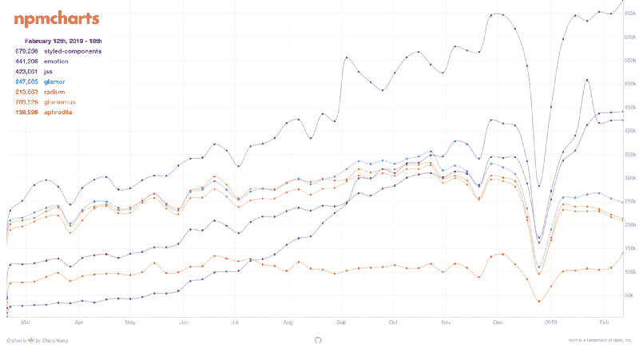
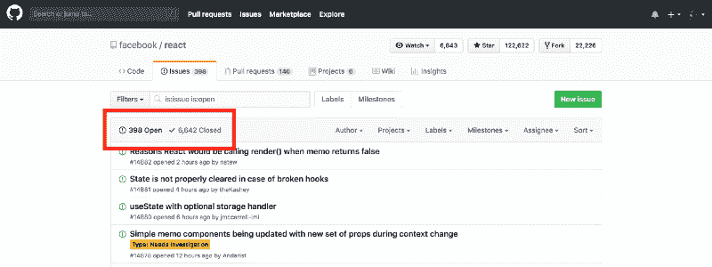
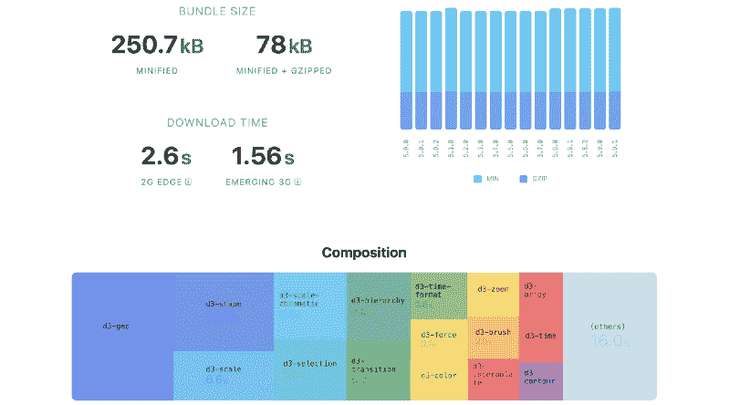
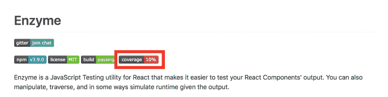

# 在将 NPM 包添加到您的项目之前，您应该问自己什么

> 原文：<https://www.freecodecamp.org/news/what-to-ask-yourself-before-adding-an-npm-package-to-your-project-6b92ba13070d/>

雅各布·沃雷尔

# 在将 NPM 包添加到您的项目之前，您应该问自己什么

Image credit Andreas Gursky, Amazon, 2016

如今，作为一名 JavaScript 开发人员，最大的好处之一就是能够利用其极其丰富的生态系统。NPM 注册中心有近**百万**个软件包，当面临一个普遍解决的问题时，寻求现成的解决方案并不罕见。你花在重新发明轮子上的时间越少，你就越能专注于手头更大的问题。

也就是说，并不是所有的开源软件都是平等的，在采取行动和依赖别人的代码之前做好自己的功课可能是个好主意。在向项目中添加新的 NPM 包之前，您应该问自己一些基本问题，以及可以用来回答这些问题的工具。

### TL；速度三角形定位法(dead reckoning)

以下问题基于我作为 JavaScript 开发人员的经验，并不详尽。如果你觉得缺少了什么，请随时在评论中告诉我！

有多受欢迎？查看 Github 上 NPM &明星的每周下载量。

**有多成熟？**查看 NPM 上第一个发布版本的日期，以及 Github 上公开问题与关闭问题的数量。

**是否积极维护？**查看 Github 上的提交历史和[提交](https://github.com/expressjs/express/graphs/commit-activity)和[代码频率](https://github.com/expressjs/express/graphs/code-frequency)图表(在 Insights 选项卡下)。查看 NPM 的“最后出版”日期。

有多大？在[捆恐惧症](https://bundlephobia.com/)上检查捆大小。

它有测试覆盖率吗？在 NPM/Github 上查看报道徽章。打开测试文件。

### 有多受欢迎？

Popularity of CSS-in-JS libraries by NPM downloads, courtesy of [npmcharts](https://npmcharts.com/).

当寻找开源软件包来解决他们的问题时，受欢迎程度可能是大多数人想知道的第一件事——更具体地说，它在 Github 上有多少明星，在 NPM 上有多少周下载量。

虽然这两个指标可能会让您了解一个项目在社区中有多大的吸引力，但是您绝对应该对这些数字有所保留。请记住，Github 明星基本上相当于社交媒体网站上的“赞”,许多开发人员会像糖果一样分发这些赞。我自己对此也感到内疚，仅仅因为我主演了一部《回购协议》,并不意味着我已经检查了代码质量，并给予了完全的认可。

当谈到下载量时，即使是 NPM 也承认他们的统计数据是“天真的设计”,因为他们包括了自动构建服务器、镜像和机器人的下载量。不过，你必须从某个地方开始，所以你最好把这个问题解决掉。请注意，这可能是最不重要的(也是最容易误导的！)因素，所以一定要做好尽职调查，绝对不要止步于此。

### 有多成熟？

A healthy number of open vs. closed issues is a good indicator of how mature a project is.

如果你听说过 [80/20 法则](https://swreflections.blogspot.com/2013/11/applying-8020-rule-in-software.html)，你可能会熟悉这样一个概念，即前 80%的代码通常用 20%的时间完成，剩下的 20%占用了另外 80%的时间。这是因为启动并运行某些东西通常很容易，但处理所有的边缘情况、修复无法预见的错误以及处理性能和规模通常是编写稳定软件的最具挑战性的部分。这就是为什么理想情况下你只想使用经过战斗考验和时间考验的开源软件。

首先要检查的是包首次发布的时间。转到该项目的 NPM 页面，点击 Versions 选项卡以获得每个版本的完整历史，并向下滚动到最底部。拥有大量版本的长期历史通常是一个好迹象，因为这意味着项目已经被迭代了一段时间。

成熟项目的下一个也可能是最好的指标是 Github 上打开和关闭的问题的数量。把这两个数字放在一起看通常是个好主意，因为一个数字没有另一个数字的意义就不大了。如果已结问题的数量更多，大量未结问题不一定是坏事。给你一些参考框架，在撰写本文时， [React](https://github.com/facebook/react/issues) 有大约 400 个未决问题，但有超过 6500 个已结问题。 [Node.js](https://github.com/nodejs/node/issues) 有大约 600 个未结问题，近 9000 个已结问题。

没有神奇的比率，但是要小心那些相对于已经关闭的问题数量而言，有大量开放问题的项目。另一方面，如果已结问题的数量也很少，那么未结问题的数量很少并不一定是件好事。这可能意味着它还没有被经常使用，仍然处于开发的早期阶段。

### 是否积极维护？

The insights tab on Github

除非一个项目已经非常成熟，没有增加新的特性，或者做一些相对小范围的事情，否则积极地维护它是很重要的。还记得 80/20 法则吗？软件从新的和实验性的到稳定和成熟的唯一途径是通过主动维护，这意味着定期的错误修复和增加增强。

根据我的经验，最好的检查方法是查看项目主分支上的提交历史。首先，点击项目的 Github 页面上的提交数量，并检查最后一次提交是何时合并到 master 的。这个日期本身并没有太大的意义，但却是全局中重要的一部分。

如果你和我一样，喜欢看到这种可视化的数据，点击 insights 选项卡，在这里你可以收集关于回购的各种信息。我大概可以单独写一整篇关于这个特性的博文，所以我要说的是，如果你还没有用过这个，停止阅读，去你最喜欢的开源项目的 Github 页面，开始使用它。

我特别喜欢[提交](https://github.com/expressjs/express/graphs/commit-activity)和[代码频率](https://github.com/expressjs/express/graphs/code-frequency)图，因为它们一眼就能告诉我项目进行了多少。但是请记住，仅仅因为没有很多最近的提交并不意味着代码不可信。相反，这有时是成熟的标志——在上面的截图中，Express 的代码频率表是一个成熟项目的形象化展示。

最后但同样重要的是，我发现知道一个新版本最后一次在 NPM 上发布是什么时候很有用，这包括在一个项目的 NPM 页面的英雄统计中。这让我大致了解了维护人员实际上安排发布的频率，而不仅仅是提交代码。

### 它有多大？

A breakdown of d3’s NPM module on [Bundlephobia](https://bundlephobia.com/).

没有人喜欢臃肿的包裹。尽管不断向项目添加节点模块很容易，但这可能会带来[成本](https://medium.com/@addyosmani/the-cost-of-javascript-in-2018-7d8950fbb5d4)。缩小、压缩和代码分割很有帮助，但归根结底，这取决于你向客户端发送了多少 JavaScript。

我的参考资料是 [Bundlephobia](https://bundlephobia.com/) ，这是一个很棒的网站，它不仅向你展示了 NPM 包裹的包装尺寸，还展示了其他各种各样的奇特东西。如上图所示，您可以看到慢速网络上的预计下载时间、不同版本的捆绑包大小的演变以及依赖关系的构成。它还会告诉你这个包是否已经过优化，可以利用像 Webpack 这样的现代捆绑器进行树抖动，甚至会推荐类似的模块，并提供统计数据来比较它们的大小。

理想情况下，您希望使用小尺寸和少量依赖项(如果有的话)的模块。当然，大小是相对的，所以要确保你是在比较苹果——例如，如果你在看一个图表库，要确保你是在和其他图表库比较(后者往往在范围的更大一端)。

### 它有测试覆盖率吗？

A testing library with no test coverage…?

这似乎是显而易见的，但是总是，总是，总是检查测试覆盖率。不能测试的代码是不能信任的代码。

如今，由于有了像 [Coveralls](https://coveralls.io/) 和 [Codecov](https://codecov.io/) 这样的工具，获得高水平的覆盖范围要容易得多——这些工具随着时间的推移跟踪覆盖范围，并为作者提供闪亮的徽章，让他们可以自豪地在 Github 和 NPM 页面上展示。请记住，测试覆盖工具只检查测试期间执行了多少代码，有时可能会[误导](http://www.developintelligence.com/blog/2017/11/why-test-coverage-shouldnt-trust/)。如果你真的想深入细节，没有什么可以替代打开测试文件和通读测试规范。

### 当然还有…

#### 它遵循语义版本化吗？

语义版本化是开源作者通过版本号与他们软件的消费者就新版本包含什么样的变化进行交流的一种方式。它确保您知道何时引入了突破性的更改，从而保持对代码的控制，尽管依赖于其他模块。更多关于语义版本控制的信息请点击这里。

#### 执照是什么？

如果你在整个 [React 许可崩溃](https://medium.freecodecamp.org/facebook-just-changed-the-license-on-react-heres-a-2-minute-explanation-why-5878478913b2)期间在场，你可能知道在开始使用任何开源软件之前检查许可是一个好主意，以免一些看似仁慈的组织试图欺骗你。您可以在源代码中找到它们，通常在项目的根目录中。寻找像[麻省理工学院许可证](https://en.wikipedia.org/wiki/MIT_License)这样的许可许可证，它基本上允许你做任何你想做的事情，除了起诉作者。更多关于许可证[的信息，请点击](https://medium.com/shakuro/software-licenses-explained-77f4f18ebeb1)。

### 没错，看源代码！

虽然上面讨论的问题是了解 NPM 软件包整体健康状况的好方法，但是确定任何项目的代码质量的最好方法是实际查看源代码。当然，这比浏览一个项目的 NPM / Github / Bundlephobia 页面要花更多的时间，所以你不可能对每个依赖项都这样做。然而，如果这个模块对你的应用程序至关重要，它可能会有所回报。如果你发现了一些可能没有被注意到的破坏交易的因素，这甚至会让你以后不再头疼。

### 关于第三方用户界面组件的说明

如果你正在使用一个组件驱动的前端框架，比如 React、Vue 或 Angular，那么在你的`package.json`依赖项中可能有一些第三方 UI 组件。虽然这篇文章中提出的所有问题仍然适用，但 UI 组件需要一些额外的审查，我计划在未来的文章中解决这些问题，所以请继续关注！