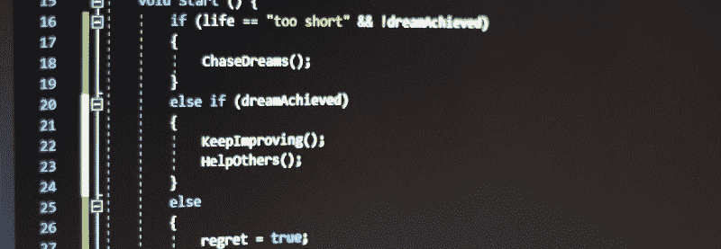
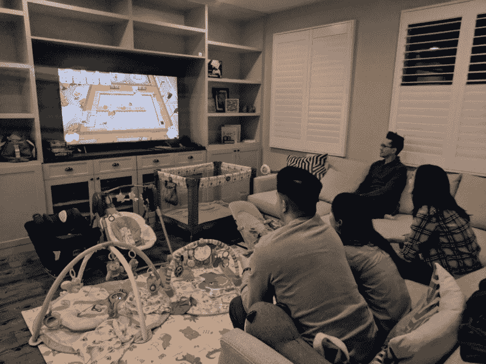
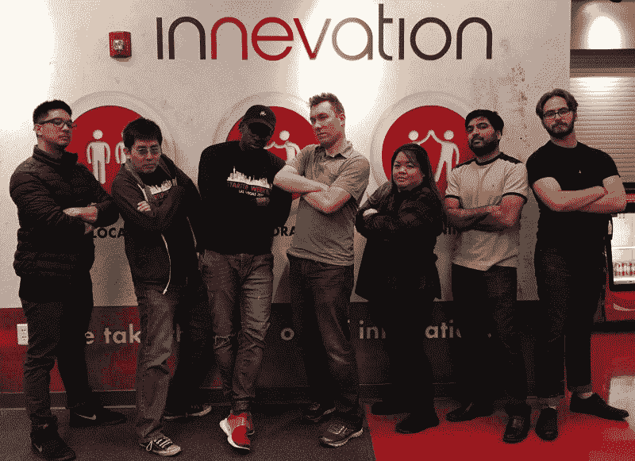
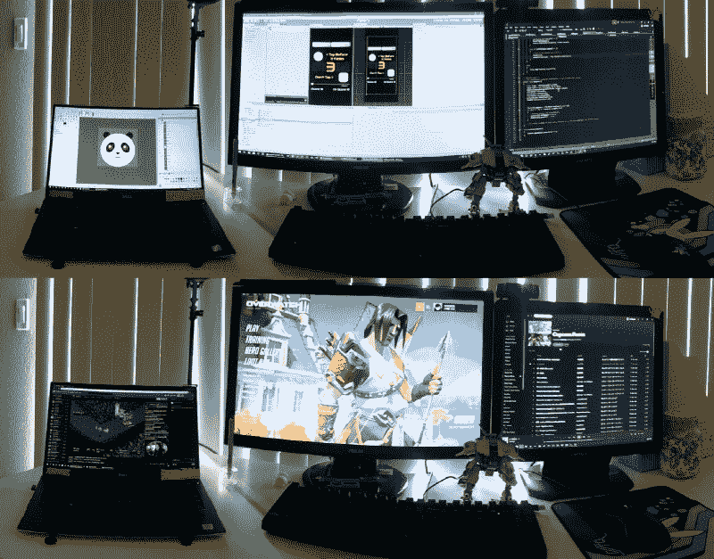

# 我用一年多的编码经验创建一个视频游戏学到了什么

> 原文：<https://www.freecodecamp.org/news/how-i-created-a-video-game-with-just-over-a-year-of-coding-experience-6bc585acef76/>

作者:马尔洛·桑德·阿西斯

# 我用一年多的编码经验创建一个视频游戏学到了什么

Warning: Not actual game code.

电子游戏在我的生活中一直扮演着重要的角色。最终幻想 2 教我如何阅读(超级任天堂娱乐系统，所以实际上是 FF4)。

是的，我早期的词汇包括“乔科博”和“痴情吟游诗人”我记得街霸 2 出来的时候。我和我的兄弟们会在游乐场玩上几个小时。

我会花一整天的时间在街机上和我的兄弟，我的表弟，还有我们其他的朋友一起玩跳舞机。我们甚至有一个“DDR 团队”和其他当地团队“战斗”。

我最近开始玩《守望先锋》，它让我和 5 年前甚至 10 年前的朋友们重新联系起来。我和我妻子通过玩煮过头来加强(或测试)我们的关系。

说我喜欢电子游戏是一种轻描淡写的说法！？

电子游戏可以教学、激发想象力、挑战他人、联系他人。电子游戏给人们的生活带来了快乐。另一方面，我现在的职业大部分都充满了痛苦——不一定是我自己的痛苦，而是别人的痛苦。

我目前是一名住院医师(意味着我已经完成了医学院的学业，但我仍在其他医生的监督下接受培训)。在我短暂的职业生涯中，我听过太多的父母在他们的孩子在医院病危之前谈论他们孩子的光明未来。

听过太多病人躺在病榻上的惋惜。我经常想起生命是多么短暂。有梦想不去努力追求，太短暂了。

所以，我决定实现我成为游戏开发者的梦想。在这篇文章中，我将分享我迄今为止在旅途中学到的东西，以及我面临的一些挑战，希望能帮助其他有同样梦想的人。

Overcooked 2 — a game that will reveal the true nature of your relationship(s)

#### **学习如何编码**

那么我是怎么开始的呢？当我开始实习的时候，我看到一个 Udemy 课程的广告，关于如何在 Unity 上制作视频游戏。终于有收入了，就买了。我很快变得太忙了，没有时间去做。我把它放在一边，就像在蒸汽大甩卖时买的游戏一样。

两年后，我的未婚妻(现在是妻子)结束了一天艰难的工作回到家。她说她只是要去学习如何编码，然后辞职。像个好伙伴一样，我说:“哦！我也是！”我打开了我的课程，下载了所有的东西。然而，那时候，我和妻子相距 4 小时车程。当我把所有东西都装好后，是时候离开并开车去找她了。

我决定下载并听一些播客作为驱动。这让我想起了我学到的第一课。播客非常有用。听播客真的加速了我的进步。我是在 [CodeNewbie](https://www.codenewbie.org/podcast) 上了解到[免费代码营](https://www.freecodecamp.org/)的。通过 freeCodeCamp，我了解到成为社区一员的重要性。[简单的程序员播客](https://simpleprogrammer.libsyn.com/)激励我继续前进并保持专注。

在游戏开发相关的播客方面，[设计师笔记](https://www.idlethumbs.net/designernotes/)，[调试日志](http://thedebuglog.com/category/podcast/)，[游戏开发解放](https://www.gamedevunchained.com/about-us)向我介绍了其他游戏开发者的经验。他们的故事鼓励了我。我学会了行话。我从他们已经犯下的错误中吸取了教训。当我要去拜访我的未婚妻时，我在 4 个小时的车程中做了这些。播客将原本空闲的时间转化成了有效率的时间。

帮助我学得更快的另一件事是我直接投入进去。[我参加了一个黑客马拉松(偶然的),只有 13 天的编程经验](https://medium.freecodecamp.org/i-entered-a-hackathon-with-13-days-of-coding-experience-here-is-what-i-learnt-5538d73ee7ce)。正是在这里，我了解了这个社区和 T2 当地的聚会。

在当地的聚会上，我了解到了制作的可能性。这促使我做出一些东西，这样我就可以在当地的展示日展示给他们看。这让我想继续创作和分享。

在我创作和分享的过程中，我从周围的人那里得到了反馈和建议。我就是这样好起来的。这就是为什么我会有这样一个疯狂的想法，我可以用如此有限的经验自己制作并发布一款游戏。

My got second place with my first hackathon team: Developers.Vegas

#### 第一次制作和发行游戏的挑战。

实际上，制作我自己的第一个要发行的游戏有制作艺术和编写代码的挑战。随着时间、练习和大量的谷歌搜索，我有所提高。

我发现一个有用的技巧是用图表和“伪代码”写东西这些图表帮助我直观地看到所有的东西是如何连接的，伪代码帮助我跟踪我想要我的代码完成的事情。从那时起，我们进行了大量的试验和错误，并从头再来一遍。

我发现处理和实施人们的反馈很有挑战性。当我开始把我的游戏发给人们尝试时，他们会提出建议。这很难的一个原因是，我不知道如何做他们要求的事情。另一个原因是我想真正完成并发布我的游戏。

我听说过一些人放弃他们的项目的故事，因为他们被太多的功能淹没了。我想留在我的范围和最小可行的产品。另一方面，我想做出人们真正想要的产品。我想这对我和任何游戏开发者/设计师来说都将是一场斗争。

在这个过程中，我也意识到很多障碍来自内部。当我独自做自己的项目时，很容易变得懒惰和分心。停止做某件事并说它“足够好”是很容易的。这就像花太多时间在“不够好”的事情上一样简单。我发现有帮助的是为自己设定最后期限，并为我必须在游戏中工作的每一段时间写下目标。

最大的内在挑战是“冒名顶替综合症”，我想我会继续面对这个挑战。在这个过程中的多个点上，我会问自己，“我是谁来制作和发布一个游戏？”当我第一次上传我的游戏到谷歌 Play 商店进行内部测试时，它被拒绝了。我当时就想放弃，尽管事实上我已经投入了工作来完成这个项目。我连拒绝的理由都没看！谢天谢地，我振作起来，调查了这个问题。结果证明这是一个简单的、可以弥补的错误。想象一下如果我放弃了。

My setup frequently transforms from the top half to the bottom half

#### **游戏发布及以后**

按下按钮向公众发布我的游戏是可怕的。如果人们讨厌我的游戏怎么办？如果某个东西完全坏掉了呢？至少到目前为止，这些担心是没有根据的。事实上，到目前为止，我对我的游戏的反应非常满意。这绝不是一个超级成功的游戏，总下载量只有 90 次，总收入只有 0.00 美元，这是 T2 的第三次。在撰写本文时。？

然而，在这个阶段，成功就是看到人们喜欢我的游戏。它是看到一个正要离开聚会的人因为有人打破了他的最高记录而多呆了一个小时。就是看到别人把自己的高分截图贴出来。是有人打破了我的高分(虽然我内心有点死)。是看到人们挑战自己。当他们达到一个新的成就水平时，看到那种喜悦。

那么，我该何去何从？我想我想尝试融入多人游戏，或者至少弄清楚如何做一个排名系统。人们似乎真的很想得到高分。我还需要学习更多的商业/营销方面的东西。

我想我现在就开始。我邀请你尝试我的游戏“Squircle Circle Tap”，它适用于 iOS 系统[或安卓系统](https://itunes.apple.com/us/app/squircle-circle-tap/id1452644588?mt=8)[的](https://play.google.com/store/apps/details?id=com.asisgames.squricles)。当你尝试这个游戏的时候，我会继续提高我的技能，向那些影响我一生的游戏前进。感谢阅读，编码快乐。