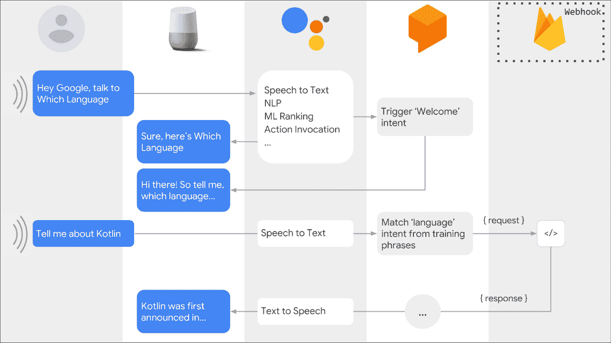
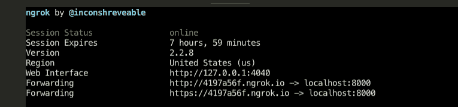

# 如何使用 Dialogflow 实现 Google Assistant 操作的本地实现

> 原文：<https://www.freecodecamp.org/news/how-to-implement-local-fulfillment-for-google-assistant-actions-using-dialogflow-1b3b3a13075f/>

***注意:本博客仅涵盖 Google node.js 部署上的操作，并假定对 Google/ Dialogflow*** 上的操作有一些基本的先验知识


Google Home Devices that run the Google Assistant

你好，世界！

#### **问题陈述**

我很晚才开始在谷歌上进行[活动——非常享受——我的学习主要是设计一些小的“派对戏法”，让访客开心。我也一直在用 Alexa 做同样的事情，但由于我对](https://developers.google.com/actions/)[谷歌云平台](https://cloud.google.com/)和 [Firebase](https://firebase.google.com/) 更加熟悉，我在谷歌上做了更多的原型。

Google Assistant 的操作和工作通常需要服务器端逻辑来处理与所需个性化或定制级别的交互。这叫“圆满”。

fulfillment 的开发周期可能有点乏味，因为您每次都需要将服务器代码推送到云中，以查看它是否工作。每当我们做出想要测试的更改时，我们都需要将代码推送到 Firebase，并给它 30-60 秒的传播时间。这就像热重新加载之前的 web 开发——唉！所以 2011 年。

#### **架构概述**

我不会深入到助手的构建动作的细节中，因为有很多东西可以帮助你。但是现在对该系统的高层次概述将帮助你理解激发这篇博客的问题陈述。

这是谷歌的一张图，解释了动作/助手交互是如何处理的。

用户的交互被设备拾取，转换成设备解析的文本，并传递给一个 [DialogFlow](http://dialogflow.com/) 代理，它是一个 [NLU](https://en.wikipedia.org/wiki/Natural-language_understanding) 引擎。然后计算出用户陈述的“意图”(短语或“话语”)。然后，这个意图与“实现”用户意图的代码匹配，然后返回一个(希望)合适且可接受的响应。



如果你仔细研究过这张图片，你会发现在最后一列中有一个请求，这表示 [Firebase](https://firebase.google.com/) 。它真正表示的是一个后端服务器，该服务器有一个 HTTP webhook，它接收“请求”来完成任务，然后计算出如何做出适当的响应。在架构上，Dialogflow NLU 代理向服务器 webhook 发送一个 ****POST**** 请求，然后由服务器使用 SDK 进行处理。

处理请求和响应的后端服务器很容易托管在 [Firebase Cloud Functions](https://firebase.google.com/) 上(当然，谷歌使使用他们的堆栈变得很容易——这是一笔好生意！).

此外，本地运行的服务器将生成类似于 [http://localhost:3000，](http://localhost:3000,/)的 webhook 端点，Google Assistant 的 POST 请求无法访问该端点。

#### **解决方案陈述—本地实施开发服务器！**

这个解决方案有三个步骤:

1.  创建后端履行服务器作为[快速服务器](https://expressjs.com/)。
2.  作为 Express 端点处理 Dialogflow 请求和响应。默认的 Firebase Cloud Functions 服务器使用 Google Nodejs 客户端库上的[操作，该客户端库具有从 Dialogflow 代理接收 HTTP POST 请求的内置功能。但是这在 Firebase 环境之外是行不通的(例如，在我们的本地开发服务器上)。因此，我们需要在快递应用程序上部署我们的履行服务器。](https://github.com/actions-on-google/actions-on-google-nodejs)
3.  使用 [Ngrok 节点包](https://www.npmjs.com/package/ngrok)创建一个临时 HTTP 端点，将 HTTP 请求通过隧道传输到我们的 local:3000(或者您使用的任何端口)服务器。

我不会详细介绍为一个简单的 nodejs 实现服务器设置基本代码的步骤 Google docs 上的 Dialogflow/ Actions 可以帮助您完成所有这些工作。但我确实在这里提供了一些片段，向你展示如何将 Dialogflow 应用程序转换成 Express 应用程序，以及你的`package.json`需要什么样子。

让我们从 Dialogflow node.js 客户端的基本设置开始。我们称之为 Dialogflow 应用程序。

```
const {
  dialogflow,
  BasicCard
} = require("actions-on-google");

// Instantiate the Dialogflow client.
const app = dialogflow({ debug: true });

// Handlers go here..
app.intent("Default Welcome Intent", conv => {
   // handler for this intent
});

app.intent("Say_Something_Silly", conv => {
   // handler for this intent
});

module.exports = app;
```

这是“处理”意图的应用程序。上面的代码只是脚手架。导出 app，在`functions/index.js`导入。

`index.js`是我们的`functions`文件夹中的入口点，其中包含了我们上推到 Firebase 云函数的云函数。在这个文件中，我们创建了 Express 应用程序，并导入了 DialogflowApp 对象，然后将其传递给 Express 路由，该路由将接收来自 Dialogflow 的 HTTP POST 请求。 ****注意**** 我们需要 body-parser npm 包，因为 HTTP 请求是 JSON。

```
"use strict";

const express = require("express");
const bodyParser = require("body-parser");
const functions = require("firebase-functions");

// clients
const dialogFlowApp = require("./DialogflowApp");
const expressApp = express().use(bodyParser.json());

// EXPRESS APP fulfillment route (POST). The entire dialogFlowApp object (incl its handlers) is the callback handler for this route.
expressApp.post("/", dialogFlowApp);

//  EXPRESS APP test route (GET)
expressApp.get("/", (req, res) => {
  res.send("CONFIRMED RECEIPT OF GET.");
});

/*
 *   LOCAL NGROK SERVER LOGIC. ENSURE that you "export IS_LOCAL_DEV=true" in terminal prior to start
 */
if (process.env.IS_LOCAL_DEV) {
  const PORT = 8000;
  expressApp.listen(PORT, () =>
    console.log(`*** SERVER RUNNING LOCALLY ON PORT ${PORT} ***`)
  );
} else {
  console.log("*** NOT LOCALLY SERVED - OR - LOCAL ENV VAR NOT SET  ****");
}

//EXPORT either of the following two endpoints:  one express app, one dialogflow app
exports.fulfillmentExpressServer = functions.https.onRequest(expressApp);
exports.dialogflowFirebaseFulfillment = functions.https.onRequest(dialogFlowApp);
```

这段代码的关键部分是我们创建了一个 POST 路由，它将我们的 DialogflowApp 对象作为处理程序回调。我创建了一个 GET route 只是为了让 quick browser 发出 GET 请求来测试端点是否工作。但是 Dialogflow 只使用 POST 路由。

****注意**** 我在这里做了两个出口。一个是 Express app，一个是 dialogflow App 本身。这创建了带有两个端点的 Firebase 函数，这两个端点由附加到`exports`对象的属性标识。一个端点将是<……/fulfillmentExpressServer>，另一个端点将是<……/dialogflowfirbaseffection>。

一旦我完成了本地开发并将最终代码推送到 Firebase Cloud 函数，我就可以使用这些 HTTP 端点中的任何一个来实现。

#### **本地开发服务器隧道的 NGROK】**

第 26 行有一些看起来很有趣的代码。在我的 Mac 终端上，我在本地启动服务器之前使用`export IS_LOCAL_DEV=true`。第 26 行的代码块基本上启动了服务器本地监听，这是我们将代码推送到云函数时需要的 ****而不是****——它只用于本地服务器。

```
"dependencies": {
    "actions-on-google": "^2.0.0",
    "body-parser": "^1.18.3",
    "express": "^4.16.4",
    "firebase-functions": "^2.2.0"
  },
"devDependencies": {
    "ngrok": "^3.1.1"
  },
"scripts": {
    "lint": "eslint .",
    "serve": "firebase serve --only functions",
    "shell": "firebase experimental:functions:shell",
    "start": "npm run shell",
    "deploy": "firebase deploy --only functions",
    "logs": "firebase functions:log",
    "tunnel": "ngrok http 8000",
    "dev": "nodemon index.js"
  },
```

这让我想到了 package.json 中的上述配置。注意那里的端口号 8000。这可以设置为您喜欢的任何值，但是要确保`index.js`中设置`PORT`常量的代码(要点中的第 27 行)是同一个端口号。

运行代码之前，请检查以下内容:

1.  您已经设置了您的环境变量，代码与它匹配——在我的例子中，我使用了`IS_LOCAL_DEV=true`
2.  您的端口号在`index.js`和`tunnel`脚本中匹配

然后，打开两个终端窗口，运行以下命令:

`npm run dev`和`npm run tunnel`

在运行隧道的终端(ngrok)中，您会看到类似这样的内容:



请注意两个“转发”地址。它们是相同的，除了一个是 https。两个都行。这是您的端点，假设您的 POST 路由是`/`而不是`/<some path>.`，如果您已经添加了 POST 处理程序的路径，那么您需要将该路径添加到转发地址。

****注意**** 每次你运行 ngrok 它都会为你生成一个新的临时 URL。因此，您需要在每次运行`npm run tunnel`时更新您的 Dialogflow fulfillment webhook。

给你。不用再将代码中的每一个小变化都推给 Firebase 云函数，也不用在测试前等待一两分钟。动态开发，有了 nodemon，您的服务器可以重启，您可以在编码的同时继续测试！

如果你是一个编程新手，觉得这很难，那是很自然的。你跳得太远了。我也犯了那个错误，它让我付出了太多。

如果你想了解更多关于我的代码之旅，请查看[免费代码营播客](http://podcast.freecodecamp.org/)的[第 53 集](http://podcast.freecodecamp.org/53-zubin-pratap-from-lawyer-to-developer)，昆西(免费代码营的创始人)和我分享了我们作为职业改变者的经验，可能对你的旅程有所帮助。你也可以在 [iTunes](https://itunes.apple.com/au/podcast/ep-53-zubin-pratap-from-lawyer-to-developer/id1313660749?i=1000431046274&mt=2) 、 [Stitcher](https://www.stitcher.com/podcast/freecodecamp-podcast/e/59201373?autoplay=true) 和 [Spotify](https://open.spotify.com/episode/4lG0RGpzriG5vXRMgza05C) 上访问播客。

在接下来的几个月里，我还将举办一些 ama 和网络研讨会。如果您对此感兴趣，请点击[此处](http://www.matchfitmastery.com/)告知我。当然，你也可以在 [@ZubinPratap](https://twitter.com/zubinpratap) 给我发微博。