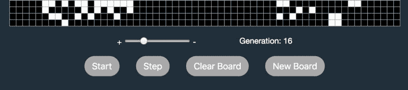
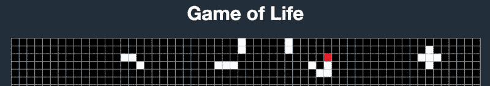
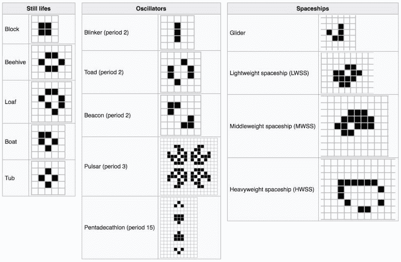

# 如何用 React 编写生命的游戏

> 原文：<https://www.freecodecamp.org/news/coding-the-game-of-life-with-react-7de2385b7356/>

巴勃罗·雷根

生命的[游戏](https://en.wikipedia.org/wiki/Conway%27s_Game_of_Life)包括一个二维的方形细胞正交网格，每个细胞都处于两种可能的状态之一，活着或者死了。在每一步中，每个细胞都遵循一套简单的规则与其八个相邻的细胞相互作用，从而产生和死亡。

这是一个零玩家游戏。它的进化是由它的初始状态决定的，不需要玩家的进一步输入。人们通过创建一个初始配置并观察它如何演变来与游戏互动，或者对于高级玩家来说，通过创建具有特定属性的模式来与游戏互动。

#### 规则

1.  任何少于两个活邻居的活细胞都会死亡，就像人口减少一样
2.  任何有两个或三个活邻居的活细胞都能存活到下一代
3.  任何有三个以上活邻居的活细胞都会死亡，好像是由于人口过多
4.  任何一个死细胞，只要有三个活的邻居，就会变成活细胞，就像通过繁殖一样

虽然这个游戏可以用普通的 JavaScript 完美地编码，但我很高兴用 React 完成这个挑战。那我们开始吧。

### 设置 React

有几种方法可以设置 React，但如果你是新手，我建议你查看一下**Create React App**[docs](https://reactjs.org/docs/create-a-new-react-app.html#create-react-app)和 [github](https://github.com/facebook/create-react-app) ，以及 [Tania Rascia](https://www.taniarascia.com/getting-started-with-react/) 的 React 详细概述。

### 设计游戏



Controllers

顶部的主图像是我对游戏的实现。包含亮(活)和暗(死)细胞的棋盘网格显示了游戏的发展。控制器允许你开始/停止，一次走一步，设置一个新的板或清除它，通过点击单个单元来试验你自己的模式。滑块控制速度，生成通知已完成的迭代次数。

除了保存状态的主要组件之外，我将单独创建一个函数来从头开始生成所有棋盘的单元格状态，一个组件用于棋盘网格，另一个组件用于滑块。

### 设置 App.js

首先，让我们导入 React 和 React。来自“反应”的组件。然后确定棋盘网格有多少行和多少列。我选择 40 乘 60，但也可以随意选择不同的数字。然后是上面描述的独立的函数和函数组件(注意第一个字母大写),以及保存状态和方法的类组件，包括 render 组件。最后，让我们导出主要组件应用程序。

```
import React, { Component } from 'react';

const totalBoardRows = 40;
const totalBoardColumns = 60;

const newBoardStatus = () => {};
const BoardGrid = () => {};
const Slider = () => {};

class App extends Component {
    state = {};

    // Methods ...

    render() {
        return (

        );
    }
}

export default App;
```

#### 生成新电路板的单元状态

因为我们需要知道每个单元格**的状态以及**在每次迭代中的 8 个相邻单元格的状态，所以让我们创建一个函数来返回一个数组的数组，每个数组都包含具有布尔值的单元格。主数组中数组的数量将与行数相匹配，每个数组中值的数量将与列数相匹配。所以每个布尔值将代表每个细胞的状态，“活着”或“死了”。该函数的参数默认为不到 30%的生存机会，但可以自由试验其他数字。

```
const newBoardStatus = (cellStatus = () => Math.random() < 0.3) => {
    const grid = [];
    for (let r = 0; r < totalBoardRows; r++) {
        grid[r] = [];
        for (let c = 0; c < totalBoardColumns; c++) {
            grid[r][c] = cellStatus();
        }
    }
    return grid;
};

/* Returns an array of arrays, each containing booleans values
(40) [Array(60), Array(60), ... ]
0: (60) [true, false, true, ... ]
1: (60) [false, false, false, ... ]
2: (60) [false, false, true, ...]
...
*/
```

#### 生成电路板网格

让我们定义一个函数组件，它创建电路板网格并将其分配给一个变量。该函数接收整个棋盘的状态，以及一个允许用户切换单个单元格状态的方法。这个方法是在保存应用程序所有状态的主组件上定义的。

每个单元格由一个表格的Represents, and has a className attribute whose value depends on the Boolean value of the corresponding board cell. Clicking a cell by a player will cause the method passed as props to be called, where the row and column positions of the cell are taken as parameters.

查看[提升状态上升](https://reactjs.org/docs/lifting-state-up.html#lifting-state-up)以获得关于作为道具的传球方法的附加信息，并且不要忘记添加[键](https://reactjs.org/docs/lists-and-keys.html#keys)。

```
const BoardGrid = ({ boardStatus, onToggleCellStatus }) => {
    const handleClick = (r,c) => onToggleCellStatus(r,c);

    const tr = [];
    for (let r = 0; r < totalBoardRows; r++) {
        const td = [];
        for (let c = 0; c < totalBoardColumns; c++) {
            td.push(
                <td
                    key={`${r},${c}`}
                    className={boardStatus[r][c] ? 'alive' : 'dead'}
                    onClick={() => handleClick(r,c)}
                />
            );
        }
        tr.push(<tr key={r}>{td}</tr>);
    }
    return <table><tbody>{tr}</tbody></table>;
};
```

#### 创建速度滑块

这个函数组件创建了一个滑块，允许玩家改变迭代的速度。它接收当前速度的状态和处理速度变化的方法作为道具。您可以尝试不同的最小值、最大值和步长值。速度变化会导致作为 props 传递的方法以所需的速度作为参数被调用。

```
const Slider = ({ speed, onSpeedChange }) => {
    const handleChange = e => onSpeedChange(e.target.value);

    return (
        <input
            type='range'
            min='50'
            max='1000'
            step='50'
            value={speed}
            onChange={handleChange}
        />
    );
};
```

### 主要成分

因为它包含了应用程序的状态，所以让它成为一个类组件。请注意，我没有使用[钩子](https://reactjs.org/docs/hooks-intro.html)，这是 React 16.8 中的一个新功能，它允许您在不编写类的情况下使用状态和其他 React 特性。我更喜欢使用[实验公共类字段语法](https://reactjs.org/docs/handling-events.html)，所以我不在构造函数中绑定方法。

我们来解剖一下。

#### 状态

我将状态定义为一个对象，它具有棋盘状态、生成数、游戏运行或停止以及迭代速度的属性。当游戏开始时，棋盘单元的状态将是调用生成新棋盘状态的函数所返回的状态。生成从 0 开始，游戏只有在用户决定后才会运行。默认速度为 500 毫秒。

```
class App extends Component {
    state = {
        boardStatus: newBoardStatus(),
        generation: 0,
        isGameRunning: false,
        speed: 500
    };

    // Other methods ...

}
```

#### 运行/停止按钮

根据游戏状态返回不同按钮元素的函数:运行或停止。

```
class App extends Component {
    state = {...};

    runStopButton = () => {
        return this.state.isGameRunning ?
        <button type='button' onClick={this.handleStop}>Stop</button> :
        <button type='button' onClick={this.handleRun}>Start</button>;
    }

    // Other methods ...
}
```

#### 清晰和新的董事会

处理玩家请求以新的随机面板的单元状态开始或完全清除面板的方法，以便他们可以通过切换单个单元状态进行实验。它们之间的区别在于，一个清除棋盘的方法将所有单元格的状态设置为 false，而另一个不向 newBoardStatus 方法传递任何参数，因此每个单元格的状态默认为随机布尔值。

```
class App extends Component {
    state = {...};
    runStopButton = () => {...}

    handleClearBoard = () => {
        this.setState({
            boardStatus: newBoardStatus(() => false),
            generation: 0
        });
    }

    handleNewBoard = () => {
        this.setState({
            boardStatus: newBoardStatus(),
            generation: 0
        });
    }

    // More methods ...

 }
```

#### 切换单元格状态



Clicking on a cell toggles its status between true (alive) and false (dead)

我们需要一种方法来处理玩家切换单个单元格状态的请求，这对于直接在板上实验自定义模式非常有用。每当玩家点击一个单元格时，BoardGrid 组件就调用它。它通过调用一个函数并将前一个状态作为参数传递给函数[来设置电路板的状态。](https://reactjs.org/docs/state-and-lifecycle.html#state-updates-may-be-asynchronous)

该函数深度克隆前一个电路板的状态，以避免在更新下一行的单个单元时通过引用修改它。(使用`const clonedBoardStatus = […boardStatus]`会修改原始状态，因为在复制数组时，扩展语法有效地深入一级，因此，[可能不适合复制多维数组](https://developer.mozilla.org/en-US/docs/Web/JavaScript/Reference/Operators/Spread_syntax#Spread_in_array_literals)。注意`JSON.parse(JSON.stringify(obj))`在克隆对象使用函数的情况下不起作用)。该函数最后返回更新的克隆板状态，有效地更新了板的状态。

要进行深度克隆，请点击这里的、这里的和这里的。

```
class App extends Component {
    state = {...};
    runStopButton = () => {...}
    handleClearBoard = () => {...}
    handleNewBoard = () => {...}

    handleToggleCellStatus = (r,c) => {
        const toggleBoardStatus = prevState => {
            const clonedBoardStatus = JSON.parse(JSON.stringify(prevState.boardStatus));
            clonedBoardStatus[r][c] = !clonedBoardStatus[r][c];
            return clonedBoardStatus;
        };

        this.setState(prevState => ({
            boardStatus: toggleBoardStatus(prevState)
        }));
    }

    // Other methods ...

}
```

#### 生成下一步

这里是通过将棋盘状态设置为函数的返回值来生成下一个游戏迭代的地方。它还将代的状态加 1，以通知玩家到目前为止已经产生了多少次迭代。

函数(“nextStep”)定义了两个变量:板状态和深克隆板状态。然后，每当调用一个函数时，该函数计算单个单元格中值为 true 的邻居数量(在棋盘内)。根据规则，每个像元不需要计算超过四个真正的邻居。最后，根据规则，它更新克隆板的单个单元状态，并返回克隆板状态，该状态在 setState 中使用。

```
class App extends Component {
    state = {...};
    runStopButton = () => {...}
    handleClearBoard = () => {...}
    handleNewBoard = () => {...}
    handleToggleCellStatus = () => {...}

    handleStep = () => {
        const nextStep = prevState => {
            const boardStatus = prevState.boardStatus;
            const clonedBoardStatus = JSON.parse(JSON.stringify(boardStatus));

            const amountTrueNeighbors = (r,c) => {
                const neighbors = [[-1, -1], [-1, 0], [-1, 1], [0, 1], [1, 1], [1, 0], [1, -1], [0, -1]];
                return neighbors.reduce((trueNeighbors, neighbor) => {
                    const x = r + neighbor[0];
                    const y = c + neighbor[1];
                    const isNeighborOnBoard = (x >= 0 && x < totalBoardRows && y >= 0 && y < totalBoardColumns);
                    /* No need to count more than 4 alive neighbors */
                    if (trueNeighbors < 4 && isNeighborOnBoard && boardStatus[x][y]) {
                        return trueNeighbors + 1;
                    } else {
			return trueNeighbors;
		    }
                }, 0);
            };

            for (let r = 0; r < totalBoardRows; r++) {
                for (let c = 0; c < totalBoardColumns; c++) {
                    const totalTrueNeighbors = amountTrueNeighbors(r,c);

                    if (!boardStatus[r][c]) {
                        if (totalTrueNeighbors === 3) clonedBoardStatus[r][c] = true;
                    } else {
                        if (totalTrueNeighbors < 2 || totalTrueNeighbors > 3) clonedBoardStatus[r][c] = false;
                    }
                }
            }

            return clonedBoardStatus;
        };

        this.setState(prevState => ({
            boardStatus: nextStep(prevState),
            generation: prevState.generation + 1
        }));
    }

    // Other methods ...
} 
```

#### 处理速度变化和启动/停止动作

这 3 个方法仅设置 speed 和 isGameRunning 属性的状态值。

然后，在 componentDidUpdate 生命周期方法中，让我们根据不同的值组合来清除和/或设置计时器。计时器以指定的速度间隔调度对 handleStep 方法的调用。

```
class App extends Component {
    state = {...};
    runStopButton = () => {...}
    handleClearBoard = () => {...}
    handleNewBoard = () => {...}
    handleToggleCellStatus = () => {...}
    handleStep = () => {...}

    handleSpeedChange = newSpeed => {
        this.setState({ speed: newSpeed });
    }

    handleRun = () => {
        this.setState({ isGameRunning: true });
    }

    handleStop = () => {
        this.setState({ isGameRunning: false });
    }

    componentDidUpdate(prevProps, prevState) {
        const { isGameRunning, speed } = this.state;
        const speedChanged = prevState.speed !== speed;
        const gameStarted = !prevState.isGameRunning && isGameRunning;
        const gameStopped = prevState.isGameRunning && !isGameRunning;

        if ((isGameRunning && speedChanged) || gameStopped) {
            clearInterval(this.timerID);
        }

        if ((isGameRunning && speedChanged) || gameStarted) {
            this.timerID = setInterval(() => {
                this.handleStep();
            }, speed);
        }
    }

    // Render method ...
}
```

#### 该渲染方法

App 组件中的最后一个方法返回想要显示的页面的结构和信息。由于状态属于 App 组件，我们将状态和方法传递给需要它们作为道具的组件。

```
class App extends Component {
    // All previous methods ...

    render() {
        const { boardStatus, isGameRunning, generation, speed } = this.state;

        return (
            <div>
                <h1>Game of Life</h1>
                <BoardGrid boardStatus={boardStatus} onToggleCellStatus={this.handleToggleCellStatus} />
                <div className='flexRow upperControls'
                    <span>
                        {'+ '}
                        <Slider speed={speed} onSpeedChange={this.handleSpeedChange} />
                        {' -'}
                    </span>
                    {`Generation: ${generation}`}
                </div>
                <div className='flexRow lowerControls'>
                    {this.runStopButton()}
                    <button type='button' disabled={isGameRunning} onClick={this.handleStep}>Step</button>
                    <button type='button' onClick={this.handleClearBoard}>Clear Board</button>
                    <button type='button' onClick={this.handleNewBoard}>New Board</button>
                </div>
            </div>
        );
    }
}
```

#### 导出默认应用程序

最后，让我们导出默认应用程序(`export default App;`)，它是通过“index.js”与“index.scss”中的样式一起导入的，然后呈现到 DOM 中。

#### **就这样！？**

在 [github](https://github.com/PabloRegen/game-of-life) 上查看**完整代码**，在这里**玩游戏** [。试试下面的](https://pabloregen.github.io/game-of-life/)[这些](https://en.wikipedia.org/wiki/Conway%27s_Game_of_Life#Examples_of_patterns)图案，或者自己创造有趣的图案。



From Wikipedia: frequently occurring examples

感谢阅读。