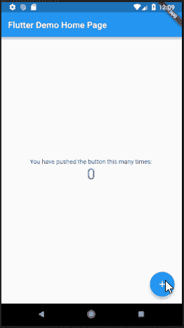
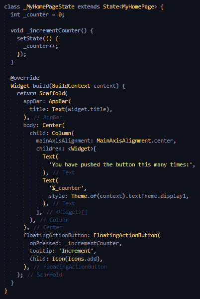
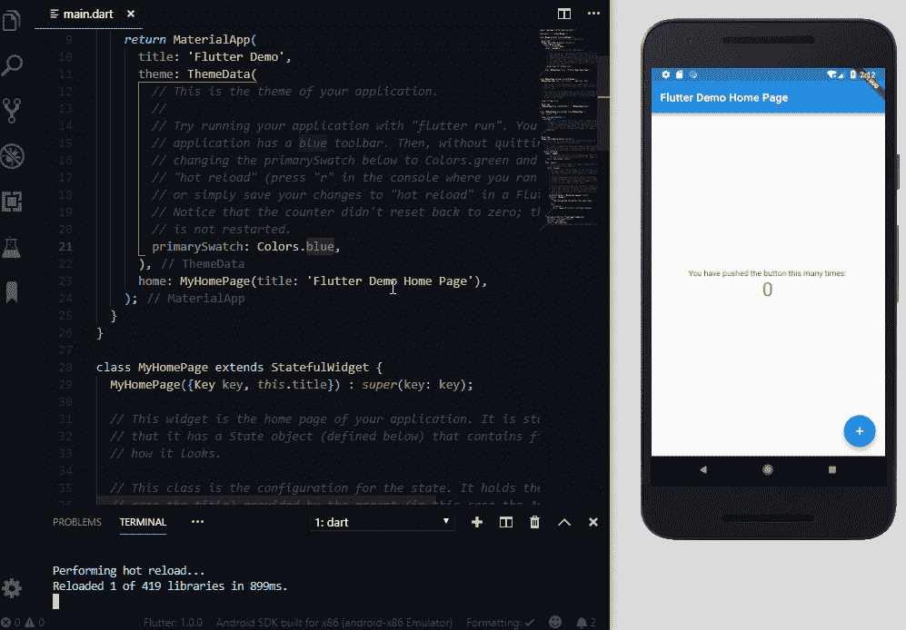
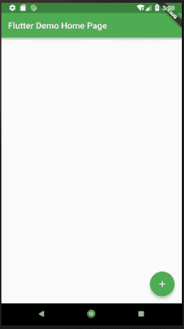

# 省道和扑动的简单介绍

> 原文：<https://www.freecodecamp.org/news/https-medium-com-rahman-sameeha-whats-flutter-an-intro-to-dart-6fc42ba7c4a3/>

#### 一点背景知识

这一切都始于 2011 年:现在是微软旗下公司的 Xamarin 通过其标志性产品 Xamarin SDK with C#为混合移动应用程序提供了一个解决方案。由此开始了混合移动应用程序的革命，为许多平台编写一个代码库变得容易。

Ionic 于 2013 年由 Drifty Co .发布了第一个版本，它帮助 web 开发人员在不断增长的移动应用程序行业中使用他们现有的技能。2015 年，脸书使用 React.js 为移动应用开发者进行了彻底改造。他们给了我们 React Native，一个完全依赖于原生 SDK 的 JavaScript 代码库。

这些并不是唯一的，而是许多混合移动框架中的一部分。更多信息可在这里找到[。](https://blog.jscrambler.com/10-frameworks-for-mobile-hybrid-apps/)

现在，我们可以看到谷歌(Google)转而扑向这块馅饼。


### Dart 是什么？

去年 12 月，谷歌发布了有史以来第一个 Flutter 1.0，此前它已经处于测试模式超过 18 个月。Dart 是用来编写 Flutter 应用程序的编程语言。Dart 是谷歌的另一款产品，在 Flutter 之前于 11 月发布了 2.1 版本。刚开始时，扑动群落不像反应型、离子型或 Xamarin 那样广泛。

不久前，我发现了对 JavaScript 的喜爱。我欣喜若狂地为我的实习工作开发一个反应性的移动应用程序。我也喜欢编写混合移动应用程序，所以想尝试一下 Flutter，就像我去年做 Xamarin 一样。

第一眼看到 Flutter(和 Dart)的时候，我觉得糊里糊涂的，似乎什么都不能理解。他们甚至在文档中为从 React Native 迁移过来的开发人员开辟了一个区域。所以，我开始深入研究 Dart 的一切。

Dart 看起来有点像 C，是一种面向对象的编程语言。所以，如果你更喜欢 C 语言或 Java，Dart 是适合你的，你可能会精通它。

Dart 不仅用于移动应用程序开发，还是一种编程语言。被 Ecma (ECMA-408)批准为标准，它被用于构建网络上的任何东西，服务器，桌面，当然，还有移动应用程序(是的，正是这些人标准化了我们最喜欢的 ES5 和 ES6。)

Dart 在 web 应用程序中使用时，被转换成 JavaScript，因此可以在所有 web 浏览器上运行。Dart 安装还附带了一个虚拟机来运行。命令行界面中的 dart 文件。Flutter 应用中使用的 Dart 文件被编译并打包成一个二进制文件(。apk 或者。ipa)并上传到应用商店。

### Dart 中的编码是什么样子的？

像大多数 ALGOL 语言一样(像 C#或 Java):

1.  Dart 类的入口点是`main()`方法。这个方法也是 Flutter 应用程序的起点。
2.  大多数数据类型的默认值是`null`。
3.  Dart 类只支持单一继承。一个特定的类只能有一个超类，但是它可以有许多接口的实现。
4.  某些语句的流控制，如 if 条件、循环(for、while 和 do-while)、switch-case、break 和 continue 语句是相同的。
5.  抽象以类似的方式工作，允许抽象类和接口。

不像他们(有时有点像 JavaScript):

1.  Dart 具有类型推理。变量的数据类型不需要显式声明，因为 Dart 会“推断”它是什么。在 Java 中，变量需要在声明时明确给出它的类型。比如`String something;`。但在 Dart 中，该关键字被改为这样使用，`var something;`。代码根据变量包含的内容来处理变量，无论是数字、字符串、布尔值还是对象。
2.  所有数据类型都是对象，包括数字。因此，如果不初始化，它们的默认值不是 0，而是 null。
3.  方法签名中不需要方法的返回类型。
4.  类型`num`声明任何数字元素，包括实数和整数。
5.  `super()`方法调用只在子类的构造函数的末尾。
6.  在对象创建的构造函数之前使用的关键字`new`是可选的。
7.  方法签名可以包含所传递参数的默认值。因此，如果方法调用中没有包含默认值，该方法将使用默认值。
8.  它有一个新的内置数据类型，称为 Runes，处理字符串中的 UTF-32 代码点。举个简单的例子，看看表情符号和类似的图标。

所有这些差异只是你可以在 Dart 语言之旅中找到的许多差异中的一小部分，你可以在这里查看。

Dart 还在 Dart SDK 中安装了内置库，最常用的是:

1.  dart:核心功能的核心；它被导入到所有 dart 文件中。
2.  dart:async 用于异步编程。
3.  dart:数学函数和常数的数学。
4.  dart:convert 用于不同数据表示之间的转换，比如从 JSON 到 UTF-8。

你可以在这里找到更多关于 Dart 库的信息。

### 在颤振中使用飞镖

Flutter 有更多特定于应用程序的库，更常见于用户界面元素，如:

1.  小部件:常见的应用程序元素，如文本或列表视图。
2.  材质:包含遵循材质设计的元素，如浮动 ActionButton。
3.  Cupertino:包含遵循当前 iOS 设计的元素，如 CupertinoButton。

你可以在这里找到 Flutter 的特定库[。](https://docs.flutter.io/flutter/animation/animation-library.html)

### 设置颤振

因此，要让这件事情进入状态，请遵循 [Flutter 文档。](https://flutter.io/docs/get-started/install)它给出了安装 Flutter SDK 和设置您的首选 IDE 的细节；我的是 VS 代码。用 Flutter 扩展设置 VS 代码是有帮助的。它带有内置命令，而不是使用终端。

再次按照文档创建您的第一个应用程序。在我的例子中，运行扩展命令 Flutter: New Project。之后，键入项目名称并选择目标文件夹。

如果您更喜欢使用终端，请移至应用程序的目标文件夹。然后使用命令`flutter create <app_na` me >创建 app 文件夹。这将生成整个应用程序文件夹，包括 Android 和 iOS 项目文件夹。要打开这些文件夹，请使用 Android Studio 和 XCode 来构建应用程序。

在项目的根目录中，您可以找到`pubspec.yaml`。此文件包含应用程序的依赖项。这包括外部库/模块和资产，如图像和配置文件。它的工作方式就像一个`package.json`，包含了 app 的所有外部模块。要安装这些软件包，请在`pubspec.yaml`的`dependencies:`部分输入软件包名称和版本。运行命令`flutter packages get`。将应用程序的资源包含在同一文件的`flutter:`部分中。

该应用程序的入口点是`main.dart`，位于 lib 文件夹中。该文件夹还包含所有 Dart 类(应用程序页面或可重用组件)。在创建应用程序时，`main.dart`文件带有一个简单的预写代码。在运行这段代码之前，将设备连接到 PC，并启用 USB 调试。之后，在终端上运行命令 flutter run。

### Flutter 应用程序的第一印象

该应用程序目前看起来像这样:



构建 Flutter 应用程序的用户界面使用了小部件。

小部件以类似的方式做出反应。小部件使用不同的组件来描述 UI 应该是什么样子。它们可以是有状态的，也可以是无状态的。在有状态组件中，小部件由于状态改变而重建，以适应新的状态。

当我们查看主页的当前代码时，我们看到它是一个有状态的页面。如果计数器变量增加，框架会尝试找到最便宜的方法来重新呈现页面。在这种情况下，找出当前小部件描述和未来小部件描述之间的最小差异。它考虑到了改变的状态。



Scaffold 类是一种材料设计布局结构，是主页的主要容器。AppBar 也是一个材质设计元素，是页面顶部的标题栏。所有其他组件，如浮动按钮和两个文本标签，都位于页面主体之下。Center 类是一个布局类，它使其子组件垂直和水平居中。

另一个布局小部件 Column 类垂直列出每个子元素。它的每个子元素都被添加到一个数组中，并放在 children: section 的下面。

这两个文本不言自明。第一个显示文本“您已推送”第二个显示`_counter`变量的当前值。

FloatingActionButton 是材质设计小部件的一部分。它显示一个+图标并触发`_counter`变量的增量。

### 热重装

使用 Flutter 的另一个优点是热重载特性。它允许您实时查看对代码所做的更改，而无需重新启动构建过程。在运行`flutter run`命令的同一个控制台上键入“r”。



### 改变当前代码

我们可以看到，当您单击按钮时，_counter 变量值会增加。这将重新呈现页面，新值显示在页面正文中。

我要稍微改变一下。对于每一次按钮点击，我们将显示一个带有项目编号的定制卡组件。

#### 创建自定义卡组件

首先，我们制作一个新的。lib 文件夹中的 dart 文件。我在一个子文件夹`commonComponents`中创建了我的，并将其命名为`customCard.dart`。

```
import 'package:flutter/material.dart';

class CustomCard extends StatelessWidget {  CustomCard({@required this.index});
	final index;

    @override  
    Widget build(BuildContext context) {    
    	return Card(      
        	child: Column(        
            	children: <Widget>[Text('Card $index')],      
            )    
        );  
    }
}
```

这个组件将是一个无状态的小部件，将只显示我们发送给它的值，在文本小部件。

#### 显示自定义卡片列表

将上述组件导入到`main.dart`中，如下所示:

```
import 'commonComponents/customCard.dart';
```

然后，我将主页主体的代码从上面的代码替换为:

```
body: Center(  
	child: Container(    
    	child: ListView.builder(      
        	itemCount: _counter,      
            itemBuilder: (context, int index) {        
            	return CustomCard(          
                	index: ++index,        
                );      
            },    
        )  
    ),
),
```



它现在显示一个`CustomCard`元素的列表，直到按钮被点击的次数。`itemCount`用于定义`ListView`必须显示的元素数量。`itemBuilder`返回显示的实际项目。

这是使用 Flutter 的一个简单例子。

### 总之…

在我的兴趣转向 JavaScript 之前，我从事 Java 工作。如果在那个时候左右遇到 Dart，我可能会比现在更容易理解。总而言之，这并不太难，但需要一点时间来掌握它。我可以预见自己会及时使用它。

找到代码 repo，[这里](https://github.com/samsam-026/flutter-example)。

在这里找到这篇文章的提交。