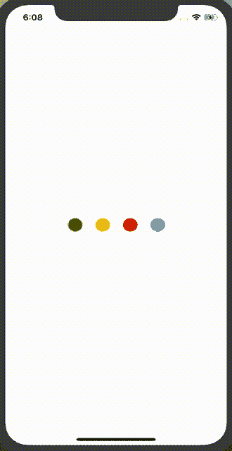
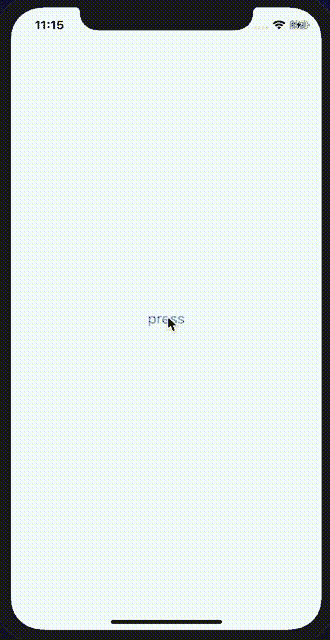

# 如何在 React Native 中创建一个漂亮的动画加载器

> 原文：<https://www.freecodecamp.org/news/how-to-create-a-beautifully-animated-loader-in-react-native-21da37a8f6b0/>

作者:维克兰特·内吉

# 如何在 React Native 中创建一个漂亮的动画加载器

#### 使用 Airbnb 的 [Lottie](https://airbnb.design/lottie/) 图书馆来激活你的装载机。



Lottie Animation for Loaders

Web 或 Mobile 中的加载器是一个基本的设计元素，通常在我们需要执行一些异步任务(如数据处理或获取)时使用。由于这些任务可能需要一些时间，并且用户必须在这段时间内娱乐，这就是加载器派上用场的地方。

加载器有助于开发人员在用户等待时吸引他们，并避免应用程序缺乏响应。？

> 不想等了？查看 npm 包[React-Native-Animated-Loader](https://github.com/vikrantnegi/react-native-animated-loader)。

#### 入门指南

React Native 内置了一个`[ActivityIndicator](https://facebook.github.io/react-native/docs/activityindicator)`，可以用作加载指示器。

但是对于`Loaders`,我们不能只使用`ActivityIndicator`,因为我们想防止用户在任务完成之前执行任何动作。为此，我们将使用`[Modals](https://facebook.github.io/react-native/docs/modal#docsNav)`。

如果你只是想要一个简单的装载机，那么看看这个教程。

但是如果你想要点厉害？洒入您的加载器，继续学习教程。？

#### airbnb 的 slotte？

[Lottie](https://airbnb.design/lottie/) 是一个 iOS、Android 和 React 原生库，可以实时渲染 After Effects 动画，允许应用程序像使用静态图像一样轻松地使用动画。

我们将使用它的 React 本机包装库 [lottie-react-native](https://github.com/react-native-community/lottie-react-native) 来制作我们的自定义加载器动画。

#### 创建应用程序

我们将使用`react-native-cli`创建一个 React 本地项目，但是您也可以使用 Expo。

使用以下命令创建一个示例项目:

```
~ react-native init LoaderExample
```

#### 安装依赖项

现在让我们添加必要的包。首先安装`react-native-animated-loader`和`lottie-react-native`。

```
~ npm install react-native-animated-loader --save
```

```
~ npm i --save lottie-react-native
```

> 如果你使用 Expo，你不需要安装 Lottie。

因为`lottie-react-native`需要本地链接，所以运行以下命令:

```
~ react-native link lottie-ios
```

```
~ react-native link lottie-react-native
```

之后，打开 Xcode 项目配置，将`Lottie.framework`添加为`Embedded Binaries`。

> 如果您在链接 Lottie 后遇到任何错误，请遵循此处的详细安装说明。

#### 我们来加点魔法？

现在用以下代码更新您的`App.js`:

```
import React, { Component } from 'react';import { StyleSheet, View, Button } from 'react-native';import AnimatedLoader from 'react-native-animated-loader';
```

```
export default class App extends Component<Props> {  constructor(props) {    super(props);    this.state = { visible: false };  }
```

```
 handlePress = () => {    setTimeout(() => {      this.setState({         visible: !this.state.visible,      });    }, 1000);  };
```

```
 render() {    const { visible } = this.state;
```

```
 return (      <View style={styles.container}>        <AnimatedLoader          visible={visible}          overlayColor="rgba(255,255,255,0.75)"          animationStyle={styles.lottie}          speed={1}        />        &lt;Button title="press" onPress={this.handlePress} />      </View>    );  }}
```

```
const styles = StyleSheet.create({  container: {    flex: 1,    justifyContent: 'center',    alignItems: 'center',    backgroundColor: '#F5FCFF',  },  lottie: {    width: 100,    height: 100,  },});
```

当您点击时，您应该在几秒钟内看到以下动画。



#### 自定义动画

您看到的动画是默认的，但您可以添加自己的洛蒂动画。如果你想找一些很酷的加载器动画，去 [lottiefiles](https://lottiefiles.com/) ，在那里你可以找到一些预建的加载器动画。选择你喜欢的，下载它的 JSON 文件就可以了。

现在将下载的 JSON 文件添加到`LoaderExample`项目中，并将 source prop 添加到`AnimatedLoader`中。添加源后，它应该看起来像这样:

```
<AnimatedLoader  visible={visible}  overlayColor="rgba(255,255,255,0.75)"  animationStyle={styles.lottie}  speed={1}  source={require("./path-of-your-json-file.json")} // Add here/>
```

您也可以通过添加`animationStyle`道具来自定义加载器样式。

#### 使用

在我们的例子中，我使用了`setTimeout`来模拟一个异步任务。在现实世界中，您可能会将它用于各种异步任务，比如从 API 获取数据。

#### 结论

现在你知道如何制作一个很酷的动画加载器，我希望你不要再为你的加载器使用旧的，无聊的活动指示器。

> 在这里找到图书馆回购[。](https://github.com/vikrantnegi/react-native-animated-loader)

如果你喜欢这篇文章，请用你的掌声表达你的爱。

查看我在 React Native 上的其他文章:

*   R [eact 具有实时搜索能力的本地平面表](https://medium.freecodecamp.org/how-to-build-a-react-native-flatlist-with-realtime-searching-ability-81ad100f6699)
*   [反应原生位置追踪](https://medium.com/quick-code/react-native-location-tracking-14ab2c9e2db8)
*   [用动态工具提示反应原生图表](https://medium.freecodecamp.org/how-to-build-react-native-charts-with-dynamic-tooltips-64aefc550c95)