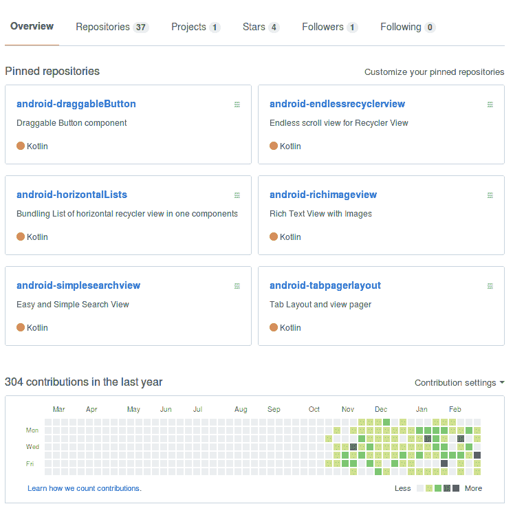
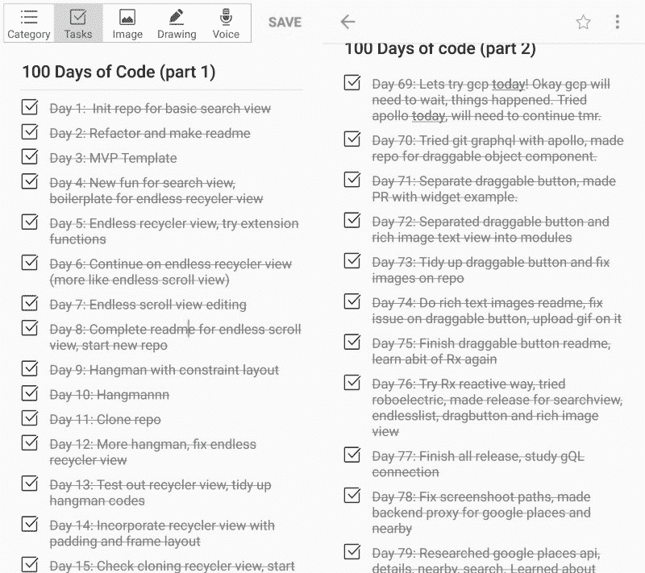
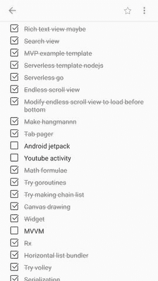
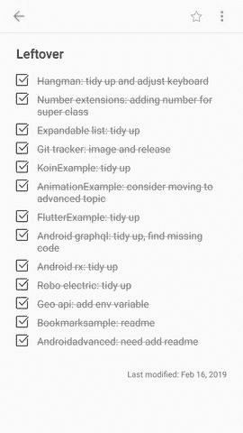

# 我完成 100 天代码的旅程

> 原文：<https://www.freecodecamp.org/news/my-journey-in-completing-100-days-of-code-e657428b1fa6/>

这里我给大家讲讲我是如何完成 100 天代码的故事，我是如何开始的，我是如何坚持下去的，我是如何最终完成的。

What I have produced in my 100 days of code

### **起点**

大约一年前，我听说了很多关于 100 天代码挑战的事情，但是我从来没有想过要去做。那时，一百天的声音对我来说是如此的可怕，以至于我不确定我真的能完成它。

然后有一天我看了[这篇文章](https://android.jlelse.eu/100-days-of-code-in-open-source-3ceb38474a89)，在 Twitter 上看了这么多做 100 天代码的人的励志故事后，我终于决定，我开始的时间是现在或者永远不会。大约在我写这篇文章的 100 天前，我终于开始写我的《100 天代码》。

### **管理和规划我的工作**

首先，我计划我将做什么样的编码，我决定为 GitHub 开源社区做贡献。我每天会花大约 1 个小时编码，并且我会尽量保持在这个时间范围内——因为我也有自己的时间；)

我在这方面的主要挑战实际上是**找到每天做什么**。为此，我总是在手机上准备**两种笔记**:

第一种类型的笔记是我在 100 天代码中每天的进度列表。不仅如此，这张纸条还充当了我第二天该做什么的笔记。我总是计划晚上要做什么。然后第二天我就知道该做什么了，这样我就不会浪费时间去想我应该编码的时候该做什么了。

made it into two notes since there is actually a limit in android Memo App

我的第二个注意是我想做的开源东西的列表，类似于遗愿清单或愿望清单，但它是一个代码列表。

I named this open source wish list

找到一个做什么的想法也是每天都要做的一件困难的事情。这就是为什么我总是**花时间阅读媒体文章**来寻找我应该探索的灵感。

由于我的专长是 Android 移动应用程序开发，我用 Kotlin 启动了我的大多数基于 Android 应用程序的存储库。然后在我开始习惯之后，我终于开始制作基于其他东西的仓库，比如无服务器的 [go](https://github.com/pramonow/Serverless-go) 和 [nodejs](https://github.com/pramonow/Serverless-nodejs) 、 [Flutter](https://github.com/pramonow/flutter-example) 和 [Rust](https://github.com/pramonow/try-rust) 。

在接近完成 100 天代码的那一天，我还做了另一个笔记，列出了通常与重构有关的剩余任务。

refactor job, everyone loves clean code

### **让自己坚持下去**

100 天是一段很长的时间。你可能会想，我是否真的有想过辞职。

是的，确实有——有好几天我都怀疑自己。我真的在做正确的事吗？还是我只是在浪费时间做这件事？

但是我总是让自己坚持下去，因为我学到了一切。作为一名软件工程师，生活在这个技术时代，我必须始终努力学习新的东西，永不停止。我停止学习的那一刻就是我停止作为一名软件工程师成长的那一刻。看到人们如何完成 100 天甚至 360 天的代码的故事让我感到很有挑战性，因为有那么多人在做这件事。如果他们能做到，甚至做得更多，为什么我不能完成？

尽你所能鞭策自己是非常重要的。但是别忘了限制自己，有时候给自己一个喘息的机会。如果你达到了你的极限，你可以结束今天的工作，明天继续。也有一些日子，我所做的只是重构和创建一个新的存储库。跟上总是重要的，但是不要忘记给自己一个喘息的机会。

还有，让自己坚持下去的最重要的部分是:一致性。

### **完成我的 100 天代码**

当我最终完成我的 100 天代码时，我感受到的前两件事是成就感和解脱感。

人们可能会问我为什么这么做。我没有从中获益——没有利润，没有人关注我平庸的 GitHub 库，没有叉子或星星。但是当然我从技术的角度学到了很多东西。此外，大部分看到我做这 100 天代码的人都认可我的一致性，并继续这样做。

我始终相信的一点是**人可能会背叛你，但努力不会背叛你。不断磨砺自己。在一天结束的时候，你会看到自己收获了你所播种的好东西。**

请随意查看我的 GitHub ！我将非常感谢任何开放的问题或任何公关。我已经生产了几个可用的和经过测试的 android 组件。

那么，这就结束了我的第一个 100 天代码的故事。你的故事呢？