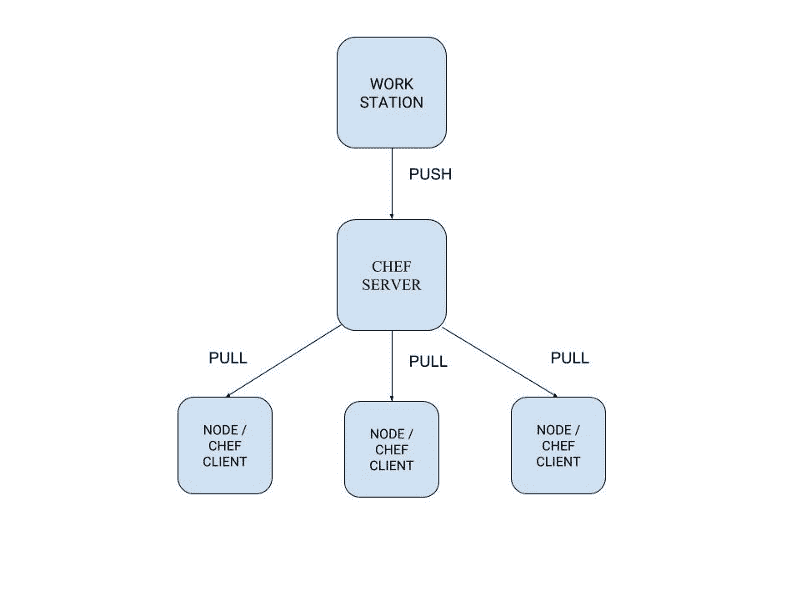
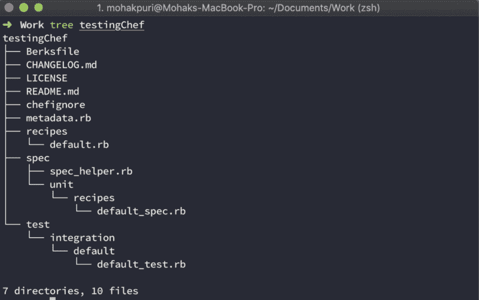
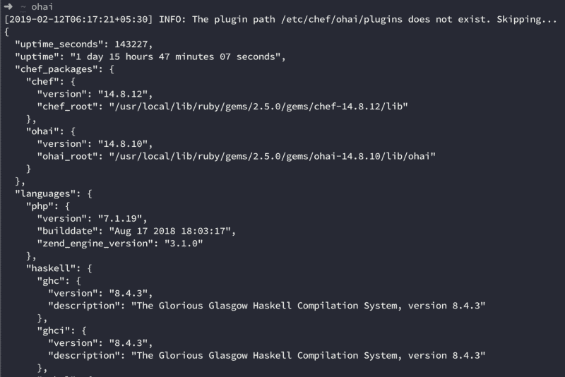
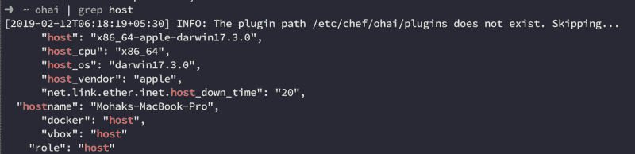
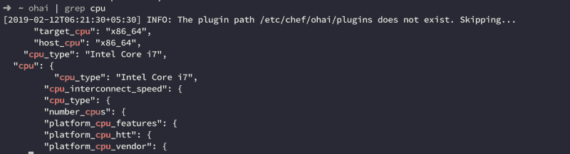
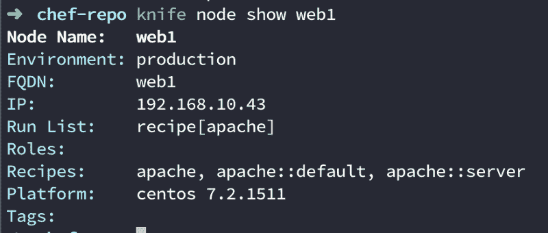
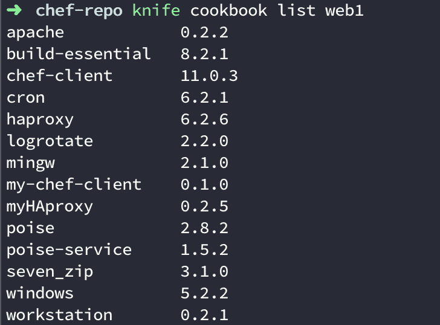

# 厨师和基础设施作为代码的完全初学者指南

> 原文：<https://www.freecodecamp.org/news/an-introduction-to-chef-and-infrastructure-as-code-7d8ad2689b8/>

莫哈克·普里

# 厨师和基础设施作为代码的完整初学者指南

在过去的几周里，我一直在深入研究《厨师》。虽然文档很好，但是有很多次我都没有任何头绪。所以我会对厨师做一个深入的介绍。如果你根本没有听说过 Chef(就像我几个月前一样),不要担心，我会解释这一切。


credits: Google

### 厨师是什么，为什么？

> Chef 是一个强大的自动化平台，可以将基础设施转化为代码。Chef 可以自动配置、部署和管理整个网络中的基础设施，无论其规模如何。

但是基础设施作为代码意味着什么呢？假设您有一个需要部署在单台机器上的 Java 应用程序。你不需要自动化，你可以手动完成。

但是，如果单台机器无法处理负载，而您需要在 10、50 或 100 多台机器上部署应用程序，会发生什么情况呢？这就是厨师的用武之地。您不必在每台机器上手动部署您的应用程序，您可以编写代码来完成这项工作。



Chef

#### 术语

1.  工作站—您的本地机器，也就是您的笔记本电脑。这是你写代码的地方，然后**推**到你的 chef 服务器。
2.  chef Server——这是您所有代码所在的地方。它还包含关于节点的所有信息。
3.  节点即 Chef 客户端——代码需要运行的机器。你可以在学习中使用类似于 travel 的东西，在生产中使用 aws/gcp。您的节点**从您的 chef 服务器获取最新的代码**。

#### chef 入门

首先，我们需要在我们的工作站上安装 **ChefDK** 。chefDK 是 Chef 开发工具包，包含开始使用 Chef 所需的所有工具。你可以在这里安装[的 ChefDK。](https://docs.chef.io/install_dk.html)

安装 ChefDK 后，运行以下命令:

```
chef generate cookbook testingCheftree testingChef
```



Output

这是由 *chef generate cookbook* 命令生成的结构。让我们检查一下每个文件，看看它们都做了些什么。

#### 食谱

菜谱是配置的基本单位，其目的是在其他组件(如食谱、模板、文件等)的帮助下达到某种期望的状态。默认情况下，当你生成一个食谱时，你只能得到一个食谱文件夹。但是，如果您计划使用模板和其他组件，您也可以为它们创建文件夹(我们将在后面讨论)。

假设您想在一台机器上运行一个 java 应用程序。这需要两件事:

1.  您的机器必须安装了 java。
2.  它必须有应用程序才能运行。

然后，您可以运行该应用程序。

因此，您创建了一个 cookbook，当它在一个节点上运行时，会在该节点上安装 java，获取您必须运行的应用程序，并运行该应用程序。

#### 厨师资源

资源是一个 Ruby 块，有四个组件:类型、名称、一个(或多个)属性(带值)和一个(或多个)动作。资源的语法如下:

```
type 'name' do   attribute 'value'   action :type_of_actionend
```

假设您想在您的节点上安装 OpenJDK 7。为此，您可以使用 chef 中可用的*包*资源。

```
package 'java-1.7.0-openjdk' do action :installend
```

*动作:install* 是包资源的默认动作，所以如果您愿意，可以跳过它。

```
package 'java-1.7.0-openjdk'
```

要在您的节点上运行 cronJob，您可以使用 *cron* 资源。

```
cron 'reporting' do  action :create  minute '0'  hour '0'  weekday '1'  command "/srv/app/scripts/daily_report" # Path of script to runend
```

根据您想要实现的目标，有许多内置的厨师资源可供您使用。你可以在这里阅读更多关于他们的信息。

#### 方法

配方是资源的集合，它会使您的节点更接近期望的状态。食谱是用 ruby 写的。

要运行一个配方，我们使用以下命令:

```
chef-client -z pathToRecipe
```

`-z`标志意味着 chef-client 应该在本地模式下运行，因为我们没有连接到任何 chef 服务器。如果您的节点连接到服务器，您不必使用`-z`标志。

```
************************** default.rb ****************************
```

```
/* This is an example recipe to install install httpd (Apache HyperText Transfer Protocol (HTTP) server program), creates a file on the node at /var/www/html/index.html (default path for serving web pages on apache server) and starts the service on a centOS based machine */
```

```
package 'httpd'
```

```
file '/var/www/html/index.html' do  content '<html>This is a placeholder for the home page.<;/html>'end
```

```
service 'httpd' do  action [:enable, :start]end
```

#### 元数据和 Berksfile

当你在写一本食谱时，你不必从第一步开始，因为很有可能有人已经做了类似的东西，你可以扩展他们的工作。

这就是[厨师超市](https://supermarket.chef.io/)的用武之地。它包含了社区食谱，你可以在你自己的食谱中作为*的依赖*。这些依赖项列在 metadata.rb 文件中，甚至列在您的 Berksfile 中。但问题来了:它们有什么不同？

```
************************* Berksfile ********************************source 'https://supermarket.chef.io' # Fetch dependencies from here
```

```
metadata
```

当您在 chef 服务器上上传您的食谱时，您还必须上传您的食谱的依赖项。这就是伯克希尔提供帮助的地方。您只需运行两个简单的命令:

```
berks install berks upload
```

它下载您的食谱的所有依赖项，并将它们全部上传到 chef 服务器。依赖性食谱位于

```
~/.berkshelf/cookbooks/
```

如果您更新了您的 cookbook 并想在 chef 服务器上重新上传它们，那么您必须更新元数据文件中的版本。否则，当您使用 *berks upload* 命令时，新配方不会被上传，除非您强制上传。

```
**************************** metadata.rb ***************************name 'testingChef'maintainer 'The Authors'maintainer_email 'you@example.com'license 'All Rights Reserved'description 'Installs/Configures testingChef'long_description 'Installs/Configures testingChef'version '0.1.0' # Update after changes are made to the cookbookchef_version '>= 12.14' if respond_to?(:chef_version)
```

```
depends 'haproxy', '~> 6.2.6'
```

#### 切菲戈勒

将上传
或分享烹饪书到社区网站时应该忽略的文件/目录放到这个文件中。

#### Ohai

当我们安装 CheckDK 时，我们也用它获得 ohai。每次在您的节点上运行 chef-client 时，chef 都会在此之前运行 ohai。Ohai 收集了很多系统信息。Ohai 收集的属性类型包括但不限于:

*   操作系统
*   网络
*   记忆
*   唱片
*   中央处理器

当运行 ohai 时，您会得到很多输出，所以请注意您想要什么，并相应地编写您的命令。



Running ohai explicitly



Getting host information from ohai



Getting CPU related information from ohai

如果需要，我们可以在食谱中使用所有这些信息。我们所要做的就是引用节点的一个特定属性。

```
if node['hostname'] == "Some hostname" do  // do something only if the nodes hostname matchesend
```

**刀**

Knife 是您用来与 chef 服务器通信的工具。如果您想了解您的节点的任何信息，或者想更新像它们的食谱这样的东西，那么 knife 是一个不错的选择。有十几个刀命令。以下是其中的一些

1.  **刀自举** —该命令用于创建一个新节点，并将其连接到您的 chef 服务器。当引导一个节点时，chef 会在节点上安装 ohai、chef-client 之类的东西，并且它还会自动运行 chef-client。对于该节点的任何后续更改，您需要手动运行 chef-client 来更新您的节点。
2.  **knife node show $ { nodeName }**—该命令用于获取节点信息，包括配方、环境、平台等。



Getting information about your node using Knife

3.**knife cookbook list ＄{ nodeName }**—该命令用于获取与您的节点相关的所有食谱



差不多就是这样！感谢您的阅读，我希望您喜欢这篇文章。

可以在 [Medium](https://medium.com/@mohak1712) 和 [Github](https://github.com/mohak1712) :)上关注我