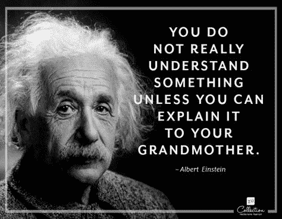

# 我从两年半的软件工程中学到的经验

> 原文：<https://www.freecodecamp.org/news/lessons-from-2-5-years-of-software-engineering-da66891f1b09/>

山姆·奥拉森

# 我从两年半的软件工程中学到的经验

我从 16 岁开始断断续续地编程，但只是在过去的 2.5 年里，才可以说我一直是一名软件工程师。在那段时间里，我在一家大型老牌投资银行的全球团队中工作，目前是一家革命性精算软件初创公司的首席开发人员。我研究过很多令人兴奋的技术，学到了很多。

以下是一些关键的经验和技巧，尤其是我早年的经验，我希望有人在我刚开始工作时与我分享。希望他们对你有帮助。

Photo by [Rubén Menárguez](https://unsplash.com/photos/v_1t1DzfAUA?utm_source=unsplash&utm_medium=referral&utm_content=creditCopyText) on [Unsplash](https://unsplash.com/search/photos/computer?utm_source=unsplash&utm_medium=referral&utm_content=creditCopyText)

### **不一定要完美，只要“足够好”就行**

我们软件工程师喜欢构建东西，自然我们会对我们构建的东西产生依恋。

如果你不是软件工程师，想象一下从零开始制造一辆全新的汽车。想象一下，花几个月或几年的时间，只用你的脑力、努力、决心和团队精神创造一辆汽车。它曾被设计成比其他汽车更快、更好看或者更容易使用。当然，你会喜欢你所建造的东西，并且会依恋它！

因为这种依恋，很容易继续投入时间和精力到一个项目中去继续“完善”它。其实有时候不这样做是很难的！

通常，你并不是在试图为一个问题写出最好、最完美的解决方案——你是在试图为你的团队和利益相关者增加价值。这意味着在有限的时间内解决问题，确保你的代码风格适合更广泛的代码库，并且经过测试，工作正常。

**提示:**了解什么时候解决方案“足够好”。当我为一个项目收集需求时，我一定要问清楚他们的期望是什么，他们对“足够好”的定义是什么。更多阅读:[莫斯科优先技术](https://en.wikipedia.org/wiki/MoSCoW_method)。

提示:此外，请记住，这可能会在整个项目中发生变化，因此定期交流您的关注点以及您的利益相关者希望您的关注点在哪里非常重要。这将使你成为一个更好的开发者……也是一个压力更小的人！

### **没有人知道一切**

很容易认为每个人都知道的比你多，而你不够好，不能做出贡献。这是“冒名顶替综合症”的一种形式，已经有很多关于它的文章。

**我的经历:**当我刚开始在银行工作时，我记得我坐在一个满是我的团队成员的房间里，心想*“我知道的还不够多，还不能称自己为‘软件工程师’”*。我记得我没有信心把这个头衔，以及它所代表的意义，附在自己身上。

我和团队中的一位工程师一起做了一个项目，他已经编程 20 多年了。我们之前没怎么说过话，她绝对是我没有信心向她介绍自己是“软件工程师”的人。我真的很钦佩她以及她在职业生涯中所取得的成就。当我们开始谈论一些功能性的 JavaScript 话题时，我们正在一起对应用程序的后端进行一些修改，这些话题在当天早些时候的一次更广泛的团队会议上出现。

她向我解释，没有任何形式的尴尬，她实际上对现代前端开发知道得不多，她根本没有跟上前面的对话。我很惊讶，关于软件开发，有一些我知道(并且非常了解)而她不知道的东西。我真的很高兴教她我所知道的，并回答她的问题。

教训:这是我第一次真正意识到，在我们这个行业，没有人知道所有的事情。它是如此的广阔和千变万化。所以，如果你不知道所有的事情，不要担心，因为没有人知道。相反，找出对你来说什么是重要的……并学习它！网上有如此多的免费资源，所以你没有理由不去学习它！

教训:如果你不懂什么，对人坦诚相待对你的成长非常重要。任何开发者都应该很乐意向你解释一些东西，如果你承认你不知道的话。如果他们让你因为问了一个问题而感到尴尬，那么这是他们的缺陷，而绝对不是你因为问了一个问题而感到的愚蠢/无知。

### 你对自己的学习道路负责

这是从上述观点引出的。要想真正成功，你必须成为自己学习道路的建筑师。人们会帮忙，但你需要带路。

我的经历:在学校和大学里，我的数学课程总是有一条清晰明确的学习路线。我所有考试的大纲总是很明显。有人为我设计的每个模块都有一个详细说明，对于如何成为一名“优秀”的数学本科生也有明确的定义。当然，我会围绕我的主题阅读，但这对于自我发展/兴趣来说绝对是可选的…我没有*去做*去实现我想要的。

幸运的是，我一直有学习和提高技能的动力。当我多年前开始作为一名软件工程师的旅程时，我对自己的学习道路负责。但是我发现很难明确该做什么和从哪里开始。

**提示**:在网上搜索并与很多人交流后，我开始意识到没有一种单一的学习方式可以让你成为‘软件工程师’，在我们的行业中，你通常不需要有特定的资格/证书。

…但我也意识到，在我交谈过的和读到过的最好的开发人员的技能和知识之间有很多共性。找出重要的要点并专注于这些要点是关键。

提示:有很多资源已经有人为你做了艰苦的工作。

[https://www . udemy . com/the-complete-junior-to-senior-web-developer-roadmap/](https://www.udemy.com/the-complete-junior-to-senior-web-developer-roadmap/)

[https://medium . com/zero tomastery/dont-be-a-junior-developer-the-roadmap-9 FDE 5 cf 384 bb](https://medium.com/zerotomastery/dont-be-a-junior-developer-the-roadmap-9fde5cf384bb)

[**用免费的网络课程、编程项目、面试准备学习编码……**](https://www.freecodecamp.org/)
[*用免费的网络课程、编程项目、面试准备学习编码开发人员岗位。*www.freecodecamp.org](https://www.freecodecamp.org/)[**学习 Node**](https://learnnode.com/)
[*一个高级培训课程，学习用 Node.js、Express、MongoDB 和 friends 构建应用。*learnnode.com](https://learnnode.com/)[**jwa sham/编码-面试-大学**](https://github.com/jwasham/coding-interview-university)
[*一个完整的计算机科学学习计划成为一名软件工程师。-jwa sham/编码-面试-大学*github.com](https://github.com/jwasham/coding-interview-university)

提示:理解如何使用某物和理解某物如何/为什么工作是有区别的。重点学习后者。这有助于我在学习新东西时轻松地翻译我的学习。例如，当我使用 AngularJS1.x 时，我确保理解了如何以及为什么有不同的方法来处理前端框架中的数据流动。

花时间了解客户端框架的基本原理意味着我可以更容易地翻译我的知识，并轻松地掌握 React 的复杂性。这真的缓解了我的学习曲线，帮助我专注于学习重要的东西。这就是为什么我不担心我没有真正与 Angular (2)或 Vue 合作过。

You have to create your own learning path! Photo by [Ugne Vasyliute](https://unsplash.com/photos/Dag9cv89jb4?utm_source=unsplash&utm_medium=referral&utm_content=creditCopyText) on [Unsplash](https://unsplash.com/search/photos/path?utm_source=unsplash&utm_medium=referral&utm_content=creditCopyText)

### 确保你对事情有足够的理解，能够向任何人解释它们！

作为首席开发人员的责任之一是能够创建健壮的功能性代码来解决问题。但是另一个责任是拥有向他人解释复杂事物的技能。

我的经历:我负责领导技术项目，其中一部分涉及与不同客户和内部利益相关者的大量互动。这包括向各种各样的受众解释复杂和精密的概念。例如，我可能在解释使用 React 相对于使用另一个框架(或者没有框架)的好处。)或者解释我们的编译器如何以及为什么发出 AVX。这些都不是容易理解的话题，更是难以解释的话题。

我所学到的:理解你头脑中复杂的事物是如何运作的，和能够向他人解释它们是如何运作的，这两者之间有很大的不同。

此外，举例来说，向另一个有能力的 React 开发人员解释一个困难的 React 挑战是一回事。但是你必须考虑向不同的观众解释概念。例如:一位不具备 React 专业知识的技术同事、一位非技术利益相关者和另一位 React 开发人员。

提示:在你去开会之前，想想如何向这些不同的群体解释某件事情是如何运作的，这将确保你真正理解它。

提示:尽可能使用隐喻来概括一个概念。我花时间使用我们的高性能计算引擎，所以我经常使用“*想象我们的引擎是汽车中的引擎……”的比喻来解释困难的概念，这有助于理解我的观点。*

提示:花时间写文档和带答案的常见问题解答。为此我使用了 [Gitbook](https://www.gitbook.com/?t=11) 和 Word 文档。这有助于我预测别人的问题，也意味着我看起来有所准备，知识渊博。这也有助于通过分享知识为我们的团队增加价值。

**提示:**写博客。我使用媒体来写博客，记录我一直在从事的技术工作。这迫使我阐明事情是如何运作的，并帮助我加深理解。写博客！

### 慢点！

随着我的资历越来越深，我开始以更慢的速度工作。这似乎有悖直觉。当然，你越好，工作越快？！嗯，你几乎是对的。

我在这里的意思是，我放慢了思考和打字的速度……但总体来说，我在为团队增加价值方面变得更有效率了。

当我开始从事这个职业时，我会尽可能快地把我的代码写下来并连接在一起。虽然我的初衷是好的，但从长远来看，这是低效的。

**提示:**现在，当我在写一些代码时，我会通过做以下事情来故意放慢速度:

*   写几行，并强迫自己在写作过程中写下清晰、翔实的评论。这让我在将来更容易修复错误，并帮助其他人理解我的代码。它也迫使我把我的逻辑翻译成英语，这有助于我检查我是否理解它，以及是否有任何错误。
*   花时间为文档写笔记:对于每个项目，我都用 Word/Gitbook 来记录我正在做的事情和做出的决定。这有助于我反思我正在做的事情，以确保我按照我的计划进行，也使在项目结束时编写文档变得更容易。

因此，我现在可能需要 1.5 天而不是 1 天来编写一段代码。但总的来说，我实际上更有效率，因为我创建了更少的技术债务，并且对我的程序如何工作有了更好的理解。

### **解决问题，然后写代码**

解决问题和编写代码来实现该问题的解决方案是有区别的。很容易将这两个挑战混为一谈，这会导致你效率低下。

**提示:**一般来说，用代码编写一个可执行程序来实现你的解决方案是一个单独的练习，也是一个不同的挑战。

我想这就是计划和写一份食谱，然后用物理方法切和烹饪食物来制作一顿饭之间的区别。

**我做了什么:**

*   首先——通过在纸上和便利贴上解决逻辑问题，确保我明白我的解决方案是可行的。例如，我经常使用便笺来表示“如果”语句，然后表示逻辑中的后续分支，这样我就可以在物理上移动了。
*   第二——我在代码中写下清晰的注释，概述代码将会是什么样子。这是我的程序框架。
*   第三，现在我准备好输入我的代码了。至此，我完全理解了我对这个问题的解决方案，并且它已经经历了几次迭代。

这种方法的一个直接好处是，到第三步，我现在可以主要关注编写实现我的逻辑的可执行/可维护/清晰代码的挑战，而不是将这两个挑战混为一谈，这样很难专注于任何一个。

这种技术的另一个好处是，当我进行到第三步时，我已经用几种不同的格式阐述了这个问题。我的大脑从不同的角度用不同的方式思考过一个问题。这意味着任何明显的逻辑错误通常会在过程的早期出现并被修复，这要便宜得多。例如，我移动便笺的速度比我在 IDE 中移动代码的速度更快。

最后一个好处是，从旅行中获得的理解大大增加了。这使得将来谈论我的程序更容易，当我在周五晚上 8 点试图修复一个产品 bug 时更容易记住，并且更容易为我的团队编写文档。这让我成为团队中更有价值的一员。

Solve the problem, then write the code! Photo by [Helloquence](https://unsplash.com/photos/5fNmWej4tAA?utm_source=unsplash&utm_medium=referral&utm_content=creditCopyText) on [Unsplash](https://unsplash.com/search/photos/puzzles?utm_source=unsplash&utm_medium=referral&utm_content=creditCopyText)

### 这比你想象的要有创意得多！

软件开发归结为解决许多逻辑问题。如果你不是开发人员，这可能看起来不太可能，但是这涉及到大量的创造性思维。

人们经常说“我没有创造力”，因为他们认为有创造力意味着能够在一张纸上画画。但是软件工程允许我在很多方面使用我的创造性技能。例如，将现有的功能和 API 结合在一起以创建全新的东西，从另一个网站的简洁拖放功能中获得灵感并将其合并到一个项目中，或者甚至看着艺术作品并思考如何用 D3.js 创建新的可视化

大多数人可以理解音乐家或画家在海滩散步时受到启发，然后回家花一晚上的时间记录下他们在“失去”灵感之前的奇妙想法。我在软件开发方面有过许多类似的经历，然而人们听到这些往往会感到惊讶。

Be inspired — After a routine drive in my car I was inspired to create progress monitors for a web page similar to these dials. Photo by [Marek Szturc](https://unsplash.com/photos/ttqUsX1G3aE?utm_source=unsplash&utm_medium=referral&utm_content=creditCopyText) on [Unsplash](https://unsplash.com/search/photos/dashboard?utm_source=unsplash&utm_medium=referral&utm_content=creditCopyText)

### 软件更多的是关于人而不是代码

随着年龄的增长，这一点对我来说越来越清晰。

确保成为人们想一起工作和在他们身边的人。

我身边有很多有才华的聪明人，他们不明白如果你粗鲁/傲慢/无用/不礼貌，那么人们就不会想和你一起工作，也不会分享他们的时间和精力来帮助你。你不会实现你的潜力。

这似乎是显而易见的，但是我向你保证，我已经看到很多人忽视了这一点，他们并没有取得他们应该取得的成功。这里我说的是所有年龄、背景、资历等的人。

### **结论**

在过去的 2.5 年里，我取得了巨大的成就，能够从一些了不起的人身上学到东西，我真的很幸运。我现在的重点是承担更多的技术领导责任，并继续通过在线课程增加我的知识。

感谢我以前和现在的团队以及社区中的每一个人，他们一路帮助了我。我期待着我旅程的下一步！