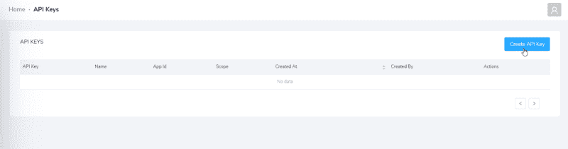
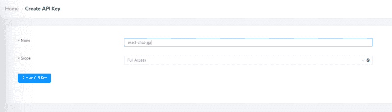
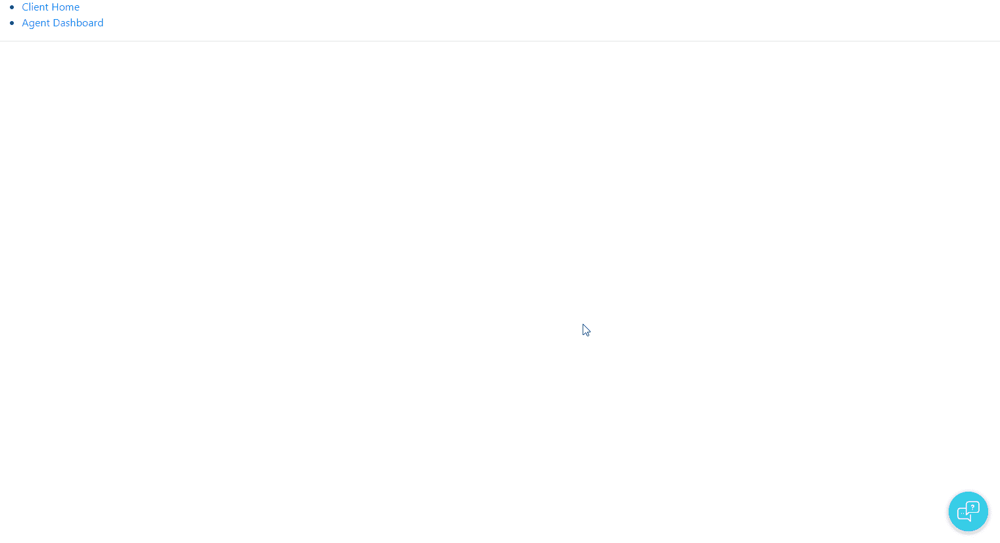
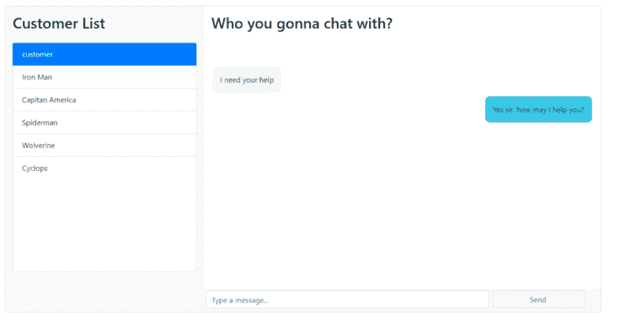
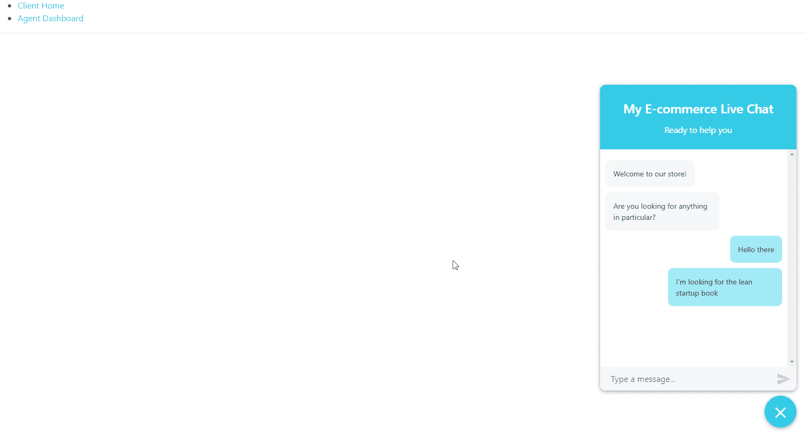

# 如何使用 React 构建客户支持实时聊天小部件

> 原文：<https://www.freecodecamp.org/news/how-to-build-a-customer-support-live-chat-widget-with-react-ca228b3cea11/>

实时聊天是一种经过验证的客户支持方法。由于一个代理可以同时帮助许多客户，所以速度快，效率高。最重要的是，在购买过程中，你越快回答顾客的问题，顾客就越有可能购买。

那么，如何将实时聊天集成到 React 应用程序中呢？

在本教程中，我将向您展示如何将实时聊天功能集成到 React 应用程序中，而无需担心维护自己的聊天服务器和架构。

这是我们将要构建的预览:


为了支持我们的聊天应用程序，我们将使用 CometChat Pro。

CometChat Pro 是一个强大的通信 API，可以让你在应用程序中添加聊天功能。通过简单的集成和清晰的文档，您只需几行代码就可以将实时聊天功能添加到您的应用程序中，您很快就会看到这一点。如果你想跟进，你可以在这里创建一个免费账户[。](https://www.cometchat.com/pro)

除了 CometChat，我们还将使用以下技术:

*   [创建 React 应用](https://github.com/facebook/create-react-app)
*   [反应-聊天-小工具](https://github.com/Wolox/react-chat-widget)
*   [快递](https://expressjs.com/)
*   [自举](https://getbootstrap.com/)
*   [轴](https://github.com/axios/axios)
*   [react-md](https://react-md.mlaursen.com/) (仅旋转组件)

我鼓励你继续学习，但是如果你想直接跳到代码，你可以在 [GitHub](https://github.com/cometchat-pro-samples/react-customer-support-live-widget) 上找到这个应用程序的完整代码。

### 首先，创建你的 [CometChat](https://cometchat.com/pro) 应用程序

为了支持您的聊天应用程序，您将使用 CometChat。然而，在集成 CometChat 之前，您必须首先创建一个 CometChat 应用程序。

要创建一个 CometChat 应用程序，进入 CometChat 仪表盘(如果你还没有免费的 CometChat 帐户，现在是注册的好时机[点击+图标。](http://app.cometchat.com/)

我把我的应用程序命名为“反应-聊天-窗口小部件”,但是你可以把你的应用程序命名为任何你喜欢的名字。

我们将有两种类型的用户连接到我们的聊天:打开聊天小部件的客户和一个支持代理，他们将访问聊天并从仪表板响应查询。用户是 CometChat 中的一个基本概念，你可以在这里阅读更多关于[的内容。](https://prodocs.cometchat.com/docs/concepts#section-users)

因为我们可能会有很多客户，对于每个连接到我们聊天的客户，我们需要动态地创建一个 CometChat 用户。但是，因为只有一个代理，所以我们可以提前从仪表板创建一个“代理”用户。

为此，请单击浏览，然后转到用户选项卡。在这里，您可以单击创建用户:


对于用户 ID，我写“电子商务代理”，对于名称，我写“演示代理”。我建议你使用相同的值，如果你跟着做的话。在任何情况下，都要记下用户 ID，因为以后需要引用它。

在我们从仪表板转到代码之前，我们应该创建一个 CometChat 完全访问密钥。

在同一页面上，单击 API 密钥选项卡，然后创建 API 密钥:



我把我的键叫做“react-chat-api ”,但是你在这里写什么并不重要。

记下您的 API 密钥和应用程序 ID，因为像代理用户 ID 一样，您稍后会需要它们。

### 设置 Express

在上一步中，我们创建了一个完整的访问密钥，我们可以用它来动态创建 CometChat 用户。虽然我们可以在客户端做到这一点，但这意味着在公共场合共享我们的私有完全访问密钥，这是不行的。

为了避免这个问题，我们将创建一个简单的 Express 服务器:

1.  使用完全访问密钥创建 CometChat 用户
2.  返回身份验证令牌(稍后将详细介绍)
3.  返回 CometChat 用户列表，供稍后在仪表板中使用

好吧，我们开始吧。

首先，为您的 Express 应用程序创建一个新的空目录并运行``npm init -y``:

```
mkdir react-express-chat-widget
cd react-express-chat-widget
npm init -y
```

接下来，安装 Express 和 axios:

```
npm install express axios
```

然后，在一个名为`sever.js`的文件中粘贴:

```
const express = require('express');
const axios = require('axios');
const app = express();

// enter CometChat Pro configurations here
const appID = '{appID}';
const apiKey = '{apiKey}';
const agentUID = '{agentUID}';

const url = 'https://api.cometchat.com/v1';

const headers = {
  'Content-Type': 'application/json',
  appid: appID,
  apikey: apiKey,
};
```

在上面的文件中，我们:

1.  存储我们之前创建的应用程序凭证和代理用户 ID
2.  定义 CometChat API `url`以便于访问
3.  用我们的`appID`和`apiKey`创建一个`headers`对象。我们将把这个头和每个请求一起发送给 CometChat

在同一个文件中，现在让我们定义一个路由来处理创建新的 CometChat 用户。

为了创建一个新用户，我们需要发送一个 POST 请求，其中包含用户的 UID 和名称。

在本教程中，我们将为所有客户硬编码相同的名称—我们将称每个客户为“客户”—但是 UID 必须是唯一的。对于 UID，我们可以使用`new Date().getTime()`来生成一个随机 ID。

将以下代码添加到`server.js`:

```
app.get('/api/create', (req, res) => {
  // data for new user
  const data = {
  // you can use your own logic to generate random UID and name
  // only uid has to be unique
    uid: new Date().getTime(),
    name: 'customer',
  };
  axios
    .post(`${url}/users`, JSON.stringify(data), {
      headers,
    })
    .then(response => { 
    // user is created, fetch auth token
      requestAuthToken(response.data.data.uid)
        .then(token => {
          console.log('Success:' + JSON.stringify(token));
          // token is returned to client
          res.json(token); 
        })
        .catch(error => console.error('Error:', error));
    })
    .catch(error => console.error('Error:', error));
});

// this function will fetch token
const requestAuthToken = uid => {
  return new Promise((resolve, reject) => {
    axios
      .post(`${url}/users/${uid}/auth_tokens`, null, {
        headers,
      })
      .then(response => {
        console.log('New Auth Token:', response.data);
        resolve(response.data.data);
      })
      .catch(error => reject(error));
  });
};
```

当此路线被调用时，Express 将:

*   用正确的`headers`和新用户的信息向[https://api.cometchat.com/v1/users/](http://api.cometchat.com/v1/users)发送一个 POST 请求
*   获取新用户的身份验证令牌
*   最后，将其返回给调用者

我们还创建了一个名为`requestAuthToken`的函数来帮助获取认证令牌。

接下来，在同一个文件中，让我们创建一个身份验证路由，我们可以调用它来为返回的用户创建令牌:

```
//...

app.get('/api/auth', (req, res) => {
  const uid = req.query.uid;
  // if you have your own login method, call it here.
  // then call CometChat for auth token
  requestAuthToken(uid)
    .then(token => {
      console.log('Success:' + JSON.stringify(token));
      res.json(token);
    })
    .catch(error => console.error('Error:', error));
});

//...
```

最后，让我们创建一个函数来返回用户列表，不包括代理。

稍后我们将从仪表板调用这个端点，以显示代理可以与之对话的用户列表(当然，代理不想与自己对话，所以我们从列表中过滤掉他们):

```
//...

app.get('/api/users', (req, res) => {
  axios
    .get(`${url}/users`, {
      headers,
    })
    .then(response => {
      const { data } = response.data;
      const filterAgentData = data.filter(data => {
      // filter agent out from the list of users
        return data.uid !== agentUID;
      });
      res.json(filterAgentData);
    })
    .catch(error => console.error('Error:', error));
});
//...
```

在`server.js`的最底部，运行服务器:

```
const PORT = process.env.PORT || 5000;
app.listen(PORT, () => {
  console.log(`Listening on port ${PORT}`);
});
```

如果您一直在关注，那么现在`server.js`应该是这样的:

```
const express = require('express');
const axios = require('axios');
const app = express();

const appID = '{appID}';
const apiKey = '{apiKey}';
const agentUID = '{agentUID}';

const url = 'https://api.cometchat.com/v1';

const headers = {
  'Content-Type': 'application/json',
  appid: appID,
  apikey: apiKey,
};

app.get('/api/create', (req, res) => {
  const data = {
    uid: new Date().getTime(),
    name: 'customer',
  };
  axios
    .post(`${url}/users`, JSON.stringify(data), {
      headers,
    })
    .then(response => {
      requestAuthToken(response.data.data.uid)
        .then(token => {
          console.log('Success:' + JSON.stringify(token));
          res.json(token);
        })
        .catch(error => console.error('Error:', error));
    })
    .catch(error => console.error('Error:', error));
});

app.get('/api/auth', (req, res) => {
  const uid = req.query.uid;
  requestAuthToken(uid)
    .then(token => {
      console.log('Success:' + JSON.stringify(token));
      res.json(token);
    })
    .catch(error => console.error('Error:', error));
});

const requestAuthToken = uid => {
  return new Promise((resolve, reject) => {
    axios
      .post(`${url}/users/${uid}/auth_tokens`, null, {
        headers,
      })
      .then(response => {
        console.log('New Auth Token:', response.data);
        resolve(response.data.data);
      })
      .catch(error => reject(error));
  });
};

app.get('/api/users', (req, res) => {
  axios
    .get(`${url}/users`, {
      headers,
    })
    .then(response => {
      const { data } = response.data;
      const filterAgentData = data.filter(data => {
        return data.uid !== agentUID;
      });
      res.json(filterAgentData);
    })
    .catch(error => console.error('Error:', error));
});

const PORT = process.env.PORT || 5000;
app.listen(PORT, () => {
  console.log(`Listening on port ${PORT}`);
});
```

在一个终端窗口中，运行`node server.js`并寻找一条消息，上面写着“监听端口 5000”。现在是用 curl 或 [Postman](https://www.getpostman.com/) 测试端点的好时机，但是我们会相信它们能工作并继续向客户端前进。

### 设置 react 应用程序

在您的目录中，运行`npx create-react-app`来搭建一个新的 React 应用程序:

```
npx create-react-app client
```

您的文件夹结构应该如下所示:

```
|-- express-react-chat-widget
    |-- package-lock.json
    |-- package.json
    |-- server.js
    |-- client
        |-- .gitignore
        |-- package-lock.json
        |-- package.json
        |-- public
        |-- src
```

准备好 React 应用程序后，导航到`client`目录安装以下模块:

```
cd client
npm install @cometchat-pro/chat react-chat-widget react-router-dom bootstrap react-md-spinner
```

Create React app 对于引导一个 React app 确实很有用，但是它也会生成很多我们不需要的文件(测试文件等等)。

在我们进入代码之前，删除`client/src`目录中的所有内容——我们将从头开始。

首先，创建一个包含您的应用 ID 和代理 UID 的`config.js`文件:

```
// client/src/config.js
const config = {
  appID: '{appID}',
  agentUID: '{agentUID}',
}
export default config;
```

这是一个样板文件，我们可以在任何地方使用它来引用我们的 CometChat 凭证。

当我们处理样板文件时，让我们也借此机会创建一个`index.css`文件:

```
body {
  margin: 0;
  padding: 0;
  font-family: -apple-system, BlinkMacSystemFont, "Segoe UI", "Roboto", "Oxygen",
    "Ubuntu", "Cantarell", "Fira Sans", "Droid Sans", "Helvetica Neue",
    sans-serif;
  -webkit-font-smoothing: antialiased;
  -moz-osx-font-smoothing: grayscale;
}

code {
  font-family: source-code-pro, Menlo, Monaco, Consolas, "Courier New", monospace;
}

.message {
  overflow: hidden;
}

.balon1 {
  float: right;
  background: #35cce6;
  border-radius: 10px;
}

.balon2 {
  float: left;
  background: #f4f7f9;
  border-radius: 10px;
}
```

我们稍后将从仪表板中引用它。

现在，在名为`index.js`的文件中粘贴以下内容:

```
import React from 'react';
import ReactDOM from 'react-dom';
import 'bootstrap/dist/css/bootstrap.css';
import './index.css';
import App from './App';
import { CometChat } from '@cometchat-pro/chat';
import config from './config';

CometChat.init(config.appID)
ReactDOM.render(<App />, document.getElementById('root'));
```

在这里，我们导入 Bootstrap、CometChat 和我们在初始化 CometChat 和呈现我们的`App`之前刚刚创建的配置文件。

如果你一直在跟踪，你会注意到我们还没有定义`App`——让我们现在就定义吧。

在一个名为`App.js`的文件中:

```
import React from 'react';
import { BrowserRouter as Router, Route, Link } from 'react-router-dom';
import Client from './Client';
import Agent from './Agent';

const App = () => {
  return (
    <Router>
      <React.Fragment>
        <ul>
          <li>
            <Link to='/'>Client Home</Link>
          </li>
          <li>
            <Link to='/agent'>Agent Dashboard</Link>
          </li>
        </ul>
        <hr />
        <Route exact path='/' component={Client} />
        <Route path='/agent' component={Agent} />
      </React.Fragment>
    </Router>
  );
}
export default App;
```

这里，我们定义两条路线:

*   客户与代理聊天的`/`或`"Customer home"`路线
*   和`/agent`或`"Agent Dashboard"`路线，以便快速方便地访问仪表板

让我们首先解决面向客户的组件。我们称之为客户端组件。

### 创建客户端组件

我们的客户端组件将有两个主要职责:

1.  当客户首次连接时，通过我们的 Express 服务器创建一个新的 CometChat 用户
2.  实时发送和接收消息。

创建一个名为`Client.js`的文件，并粘贴以下内容:

```
// Client.js

import React, {Component} from 'react';
import { Widget, addResponseMessage, addUserMessage, dropMessages } from 'react-chat-widget';
import { CometChat } from '@cometchat-pro/chat';
import config from './config';
import 'react-chat-widget/lib/styles.css';

const agentUID = config.agentUID;
const CUSTOMER_MESSAGE_LISTENER_KEY = "client-listener";
const limit = 30;

class Client extends Component {
  componentDidMount() {
    addResponseMessage('Welcome to our store!');
    addResponseMessage('Are you looking for anything in particular?');
  }

  render() {
    return (
      <div className='App'>
        <Widget
          handleNewUserMessage={this.handleNewUserMessage}
          title='My E-commerce Live Chat'
          subtitle='Ready to help you'
        />
      </div>
    );
  }

  createUser = async () => {
    const response = await fetch(`/api/create`)
    const result = await response.json()
    return result;
  }

  handleNewUserMessage = newMessage => {
    console.log(`New message incoming! ${newMessage}`);
    var textMessage = new CometChat.TextMessage(
      agentUID,
      newMessage,
      CometChat.MESSAGE_TYPE.TEXT,
      CometChat.RECEIVER_TYPE.USER
    );
    let uid = localStorage.getItem("cc-uid");
    if (uid === null) {
    // no uid, create user
      this.createUser().then(
        result => {
          console.log('auth token fetched', result);
          localStorage.setItem("cc-uid",result.uid)
          // do login
          CometChat.login(result.authToken)
          .then(user => {
            console.log("Login successfully:", { user });
            CometChat.sendMessage(textMessage).then(
              message => {
                console.log('Message sent successfully:', message);
              },
              error => {
                console.log('Message sending failed with error:', error);
              }
            );
            // create listener
            CometChat.addMessageListener(
              CUSTOMER_MESSAGE_LISTENER_KEY,
              new CometChat.MessageListener({
                onTextMessageReceived: message => {
                  console.log("Incoming Message Log", { message });
                  addResponseMessage(message.text);
                }
              })
            );
          })
      },
      error => {
        console.log('Initialization failed with error:', error);
      })
    } else {
      // we have uid, do send
      CometChat.sendMessage(textMessage).then(
        message => {
          console.log('Message sent successfully:', message);
        },
        error => {
          console.log('Message sending failed with error:', error);
        }
      );
    }
  };
  componentWillUnmount() {
    CometChat.removeMessageListener(CUSTOMER_MESSAGE_LISTENER_KEY);
    CometChat.logout();
    dropMessages();
  }
}

export default Client;
```

哇，有很多新代码。我们来分解一下。

`render`函数非常简单，它主要是渲染[反应聊天窗口部件](https://github.com/Wolox/react-chat-widget)。

大部分代码专用于在名为`handleNewUserMessage`的函数中处理客户发送的新消息。

简言之，我们首先检查客户 UID 是否存在于 localStorage 中。如果是，我们将使用这个 UID 让用户登录并发送消息。否则，我们调用`createUser()`并使用返回值登录。这个`createUser`函数调用我们在前面的教程中定义的端点。

最后，在名为`componentWillUnmount`的 React 生命周期函数中，我们记得移除消息监听器。

在继续之前，这里有一个小提示:在上面的代码中，我们可以在`package.json`中添加一个[代理](https://facebook.github.io/create-react-app/docs/proxying-api-requests-in-development)选项，而不是在我们的前端键入服务器 url 和端口`("localhost:5000/users"`或类似的东西。这将允许我们写`/users"`而不是`//localhost:5000/users"`:

```
"browserslist": [
  ">0.2%",
  "not dead",
  "not ie <= 11",
  "not op_mini all"
],
"proxy": "http://localhost:5000"
```

应用程序应该是这样的:



如你所见，你可以发送和接收信息，但如果我们刷新页面，聊天信息将全部消失，这是不好的。

为了解决这个问题，我们将设置`componentDidMount`方法在`localStorage`中查找客户 UID，这样当客户刷新页面时，他们可以从他们停止的地方继续聊天。

一旦找到，我们将使用这个 UID 启动一系列方法来[登录，获取以前的消息](https://prodocs.cometchat.com/docs/js-messaging#section-fetch-previous-messages)和[为传入的消息创建监听器](https://prodocs.cometchat.com/docs/js-messaging#section-receive-messages)。

```
componentDidMount() {
  addResponseMessage('Welcome to our store!');
  addResponseMessage('Are you looking for anything in particular?');

  let uid = localStorage.getItem("cc-uid");
  // check for uid, if exist then get auth token
 if ( uid !== null) {
   this.fetchAuthToken(uid).then(
     result => {
       console.log('auth token fetched', result);
       // SDK login
       CometChat.login(result.authToken)
       .then( user => {
         console.log("Login successfully:", { user });
         // listen to incoming message and fetch previous messages
         this.createMessageListener();
         this.fetchPreviousMessages();

      })
     },
     error => {
       console.log('Initialization failed with error:', error);
     }
   );
 }
}

// The functions used above

fetchAuthToken = async uid => {
  const response = await fetch(`/api/auth?uid=${uid}`)
  const result = await response.json()
  return result;
}

createMessageListener = () => {
  CometChat.addMessageListener(
    CUSTOMER_MESSAGE_LISTENER_KEY,
    new CometChat.MessageListener({
      onTextMessageReceived: message => {
        console.log("Incoming Message Log", { message });
        addResponseMessage(message.text);
      }
    })
  );
}

fetchPreviousMessages = () => {
  var messagesRequest = new CometChat.MessagesRequestBuilder()
  .setUID(agentUID)
  .setLimit(limit)
  .build();
  messagesRequest.fetchPrevious().then(
    messages => {
      console.log("Message list fetched:", messages);
      // add messages to the widget chat bubbles
      messages.forEach( message => {
        if(message.receiver !== agentUID){
          addResponseMessage(message.text);
        } else {
          addUserMessage(message.text)
        }
      });
    },
    error => {
      console.log("Message fetching failed with error:", error);
    }
  );
}
```

现在，如果我们刷新页面，应用程序将尝试登录 CometChat，并通过从`localStorage`中查找我们的客户 UID 来自动获取以前的消息。好东西！

不过，还有一个小问题。就目前而言，代理仍然没有办法回复客户的信息。

我们将通过构建代理仪表板来解决这个问题，在这里我们的代理可以查看和回复来自客户的聊天消息。

我们已经完成了`Client.js`文件，所以在继续编码`Agent.js`文件☕之前，你可以喝杯咖啡

### 创建代理组件

代理仪表板的主要功能是从 CometChat Pro 中抓取所有客户，并将任何来自新客户的消息显示到客户列表聊天中，供代理点击和回复。核心功能与客户端非常相似:



使用 CometChat，您可以轻松地创建多个代理，但是为了保持简单并避免用户管理，我们只有一个代理，这是我们之前创建的。

创建一个名为`Agent.js`的组件并设置初始状态:

```
import React, {Component} from 'react';
import {CometChat} from '@cometchat-pro/chat';
import MDSpinner from "react-md-spinner";
import config from './config';

const agentUID = config.agentUID;
const AGENT_MESSAGE_LISTENER_KEY = 'agent-listener'
const limit = 30;

class Agent extends Component {
  state = {
    customers: [],
    selectedCustomer: '',
    chat: [],
    chatIsLoading: false,
    customerIsLoading:true
  }
}
```

在同一个文件中，创建一个`componentDidMount`方法:

```
componentDidMount(){
  this.fetchAuthToken(agentUID).then(
    authToken => {
      console.log('auth token fetched', authToken);
      CometChat.login(authToken)
      .then( user => {
        console.log("Login successfully:", { user });
        // after login, fetch all users
        // put them into customer state
        this.fetchUsers().then(result => {
          this.setState({
            customers: result,
            customerIsLoading: false
          })
        });

        CometChat.addMessageListener(
          AGENT_MESSAGE_LISTENER_KEY,
          new CometChat.MessageListener({
            onTextMessageReceived: message => {
              let {customers, selectedCustomer, chat} = this.state;
              console.log("Incoming Message Log", { message });
              // check incoming message
              // if from the same customer agent is currently chatting
              // push a new chat item into chat state
              if(selectedCustomer === message.sender.uid){
                chat.push(message);
                this.setState({
                  chat
                })
              } else {
              // if new customer, push a new customer into customer state
                let aRegisteredCustomer = customers.filter( customer => {
                 return customer.uid === message.sender.uid }); 
                if(!aRegisteredCustomer.length){
                  customers.push(message.sender)
                  this.setState({
                    customers
                  })
                }
              }
            }
          })
        );
     })
    },
    error => {
      console.log('Initialization failed with error:', error);
    }
  );
}

fetchUsers = async () => {
  const response = await fetch(`/api/users`)
  const result = await response.json()
  return result;
}
```

上面的代码中发生了很多事情，这里有一个纲要可以帮助你理解:

1.  首先，我们自动登录我们的代理，并从服务器获取所有用户供代理聊天
2.  接下来，我们创建一个传入消息监听器。每次在选定的对话中收到消息时，我们会将其推送到聊天状态，然后更新 UI
3.  如果传入的消息不是来自当前选择的对话，我们将检查新消息是否来自注册客户。如果没有，我们会将新客户推送到客户状态。

您可能会认出我们创建的 Express API 来获取注册用户的列表。我们用它来填充仪表板左侧的用户列表。我们将使用引导类和前面定义的`index.css`文件的组合将列表放在左侧。

接下来，让我们创建渲染函数。它将呈现一个对话界面，使用 Bootstrap 样式。为了使代码更容易理解，我们将把`CustomerList`和`ChatBox`分成它们自己的组件，您可以在同一个文件中定义它们:

```
render() {
  return(
    <div className='container-fluid'>
      <div className='row'>
        <div className='col-md-2'></div>
        <div className="col-md-8 h-100pr border rounded">
          <div className='row'>
            <div className='col-lg-4 col-xs-12 bg-light' style={{ height: 658 }}>
            <div className='row p-3'><h2>Customer List</h2></div>
            <div className='row ml-0 mr-0 h-75 bg-white border rounded' 
            style={{ height: '100%', overflow:'auto' }}>
            {/* The CustomerList component */}
            <CustomerList {...this.state} selectCustomer={this.selectCustomer}/>
            </div>
            </div>
            <div className='col-lg-8 col-xs-12 bg-light'  style={{ height: 658 }}>
              <div className='row p-3 bg-white'>
                <h2>Who you gonna chat with?</h2>
              </div>
              <div className='row pt-5 bg-white' 
              style={{ height: 530, overflow:'auto' }}>
              {/* The ChatBox component */}
              <ChatBox {...this.state} />
              </div>
              <div className="row bg-light" style={{ bottom: 0, width: '100%' }}>
              <form className="row m-0 p-0 w-100" onSubmit={this.handleSubmit}>

              <div className="col-9 m-0 p-1">
                <input id="text" 
                  className="mw-100 border rounded form-control" 
                  type="text" 
                  name="text" 
                  ref="message"
                  placeholder="Type a message..."/>
              </div>
              <div className="col-3 m-0 p-1">
                <button className="btn btn-outline-secondary rounded border w-100" 
                  title="Send" 
                  style={{ paddingRight: 16 }}>Send</button>
              </div>
              </form>
              </div>  
            </div>
          </div>
        </div>
      </div>
    </div>
  )
}
```

`Chatbox`组件:

```
class ChatBox extends Component {
  render(){
    const {chat, chatIsLoading} = this.props;
    if (chatIsLoading) {
      return (
        <div className='col-xl-12 my-auto text-center'>
          <MDSpinner size='72'/>
        </div>
      )
    }
    else {
    // simple mapping of array from props
      return (
        <div className='col-xl-12'>
          { 
            chat
            .map(chat => 
              <div key={chat.id} className="message">
                <div className={
                  `${chat.receiver !== agentUID ? 'balon1': 'balon2'} p-3 m-1`
                  }>
                  {chat.text}
                </div>
              </div>)
          }  
        </div>
      )
    }
  }
}
```

`CustomerList`组件:

```
class CustomerList extends Component {
  render(){
    const {customers, customerIsLoading, selectedCustomer} = this.props;
    if (customerIsLoading) {
      return (
        <div className='col-xl-12 my-auto text-center'>
          <MDSpinner size='72'/>
        </div>
      )
    }
    else {
      // simple mapping of array from props
      return (
        <ul className="list-group list-group-flush w-100">
          { 
            customers
            .map(customer => 
              <li 
                key={customer.uid} 
                className={
                  `list-group-item ${customer.uid === selectedCustomer ? 'active':''}`
                } 
                onClick={ () => this.props.selectCustomer(customer.uid) }>
                  {customer.name} 
              </li>)
          }                
        </ul>
      )
    }
  }
}
```

这构成了我们 UI 的基础，但我们仍然无法发送消息。

要发送消息，我们必须为代理提交新消息时创建一个处理程序。现在，如何发送消息对您来说应该很熟悉了，因为我们也将进行与在客户端组件中相同的`sendMessage`调用。

```
handleSubmit = event => {
  event.preventDefault();
  let message = this.refs.message.value;
  var textMessage = new CometChat.TextMessage(
    this.state.selectedCustomer,
    message,
    CometChat.MESSAGE_TYPE.TEXT,
    CometChat.RECEIVER_TYPE.USER
  );

  CometChat.sendMessage(textMessage).then(
    message => {
      let {chat} = this.state;
      console.log('Message sent successfully:', message);
      chat.push(message);
      this.setState({
        chat
      })
    },
    error => {
      console.log('Message sending failed with error:', error);
    }
  );
  this.refs.message.value='';
}
```

我们还希望代理能够像我们为客户所做的那样查看历史消息:

```
selectCustomer = uid => {
  this.setState({
    selectedCustomer: uid
  }, ()=> {this.fetchPreviousMessage(uid)})
}

fetchPreviousMessage = uid => {
  this.setState({
    hat: [],
    chatIsLoading: true
  }, () => {
    var messagesRequest = new CometChat.MessagesRequestBuilder()
    .setUID(uid)
    .setLimit(limit)
    .build();
    messagesRequest.fetchPrevious().then(
       messages => {
        console.log("Message list fetched:", messages);
        this.setState({
          chat: messages,
            chatIsLoading: false
        })
      },
      error => {
        console.log("Message fetching failed with error:", error);
      }
    );
  });
}
```

当组件卸载时，请记住删除消息侦听器:

```
componentWillUnmount(){
  CometChat.removeMessageListener(AGENT_MESSAGE_LISTENER_KEY);
  CometChat.logout();
}
```

如果你有任何问题，你可以在 GitHub 上参考完整的[代理](https://github.com/cometchat-pro-samples/react-customer-support-live-widget/blob/master/client/src/Agent.js)文件。

查看最终产品:



如果你想知道这些超级英雄用户来自哪里，当你创建一个新的应用程序时，他们是由 CometChat Pro 自动创建的。在生产中使用应用程序之前，不要忘记删除它们。

现在，支持代理和您的客户都准备好互相聊天了。您可以在单独的窗口中打开客户端主页和代理仪表板并进行尝试。

恭喜你！

### 结论

我们为 React 应用程序制作了自己的实时聊天窗口小部件，而且一点也不花时间！事实上，CometChat Pro 只需编写几行代码就可以发送和接收信息。您不需要创建自己的聊天服务器和架构。它还拥有比仅仅制作一个聊天工具更多的功能。

如果您想扩展这个应用程序，请尝试让客户能够使用 CometChat 发送[条媒体消息](https://prodocs.cometchat.com/docs/js-messaging#section-send-media-message)。

页（page 的缩写）如果你正在努力学习 React，你可能会发现 React 是一个很好的帮助。点击这里查看！

