# 如何通过 ESP32 和 Mongoose OS 使用 GCP 云物联网核心查看天气

> 原文：<https://www.freecodecamp.org/news/gcp-cloudiotcore-esp32-mongooseos-1st-5c88d8134ac7/>

关于 freecodecamp.org 的这个职位没有保留。最新版本在介质上:[https://Medium . com/free-code-camp/GCP-cloudiotcore-esp32-mongooseos-1st-5c 88d 8134 AC 7](https://medium.com/free-code-camp/gcp-cloudiotcore-esp32-mongooseos-1st-5c88d8134ac7)

本帖是新手到**谷歌云平台-云物联网核心**的分步教程。这些设备是运行**猫鼬操作系统**的 **ESP32 Wifi 芯片**。为了浏览他的教程，首先介绍了概念，然后介绍了简单的**物联网系统** **测量天气数据**的设置。

**现场试玩在这里:**【https://hello-cloud-iot-core.firebaseapp.com/ 

**GitHub for last section****(用 Firebase 记录、存储和可视化天气数据)**在这里:*****[https://github.com/olivierlourme/iot-store-display](https://github.com/olivierlourme/iot-store-display)***

*****本帖由第二人完成:**看[这里](https://medium.com/@o.lourme/gcp-cloudiotcore-esp32-mongooseos-2nd-config-state-encrypt-7c5e937e5be9)。***

### ***介绍***

#### ***1)历史***

***在之前的一个 3 帖系列[ [链接](https://medium.com/@o.lourme/our-iot-journey-through-esp8266-firebase-angular-and-plotly-js-part-1-a07db495ac5f)、[链接](https://medium.com/@o.lourme/our-iot-journey-through-esp8266-firebase-angular-and-plotly-js-part-2-14b0609d3f5e)、[链接](https://medium.com/@o.lourme/our-iot-journey-through-esp8266-firebase-angular-and-plotly-js-part-3-644048e90ca4) ]中，我们使用了一个 **ESP8266 Wifi 芯片**定期测量光度，并将获得的数据反馈给一个数据库。数据集最终被生动地绘制到一个 web 应用程序上(参见这里的 live plot:[[link](https://esp8266-rocks.firebaseapp.com/)])。我们大量使用 **Firebase 产品**(实时数据库、云功能、SDK 和托管)来实现我们的目标。***

***这个项目运行良好，耗电很少，我们喜欢开发它，但是:***

*   *****这个项目可以处理几个相连的传感器**。设置一组 100 个传感器将需要大量(严格的)人工干预，并且监控它们也将具有挑战性。事实上，我们没有一个中心位置来管理我们的系统。***
*   *****Arduino IDE** 和 **Arduino core for ESP8266** 对于发现 ESP8266 来说是很棒的，但是它们**很快就不够用了**:IDE 文件管理真的很基础，芯片里只有一个程序，**没有操作系统** **为物联网**提供有用的 API。***
*   *****FirebaseArduino** **库**，允许 ESP8266 将数据推送到 Firebase 实时数据库，**是实验性的**。应该改进一些功能，如身份验证。目前，我们使用的“秘密”类型身份验证赋予了 ESP8266 对整个数据库的管理权限！***
*   ***最终， **ESP8266 SPI 闪存没有被设计为加密**。在我们的第一篇文章[ [链接](https://medium.com/@o.lourme/our-iot-journey-through-esp8266-firebase-angular-and-plotly-js-part-1-a07db495ac5f) ]中，我们展示了在读取这个内存时恢复 Wifi 密码是多么容易。***

> ***总之，这个过去的项目不能用于工业领域。它更像是概念验证的原型。我们从中学到了很多，但今天**我们想开发一个专业且完全安全的解决方案，能够以简单的方式管理大量连接的传感器**。***

***这就是为什么我们决定:***

*   *****调查 Google 云平台-云物联网核心** [ [链接](https://cloud.google.com/iot-core/) ] 管理我们的系统:设备设置、供应、认证、监控；***
*   *****从 ESP8266 转移到 ESP32** ，提供内存加密；***
*   *****在我们的 ESP32s 中运行猫鼬 OS** [ [链接](https://mongoose-os.com/)。这个操作系统接受用 Javascript(JS)编写的程序，并提供许多 API 来处理时间、MQTT 协议、传感器、供应等。它很容易与主要的物联网平台接口，包括谷歌云平台-云物联网核心。***

#### *****2)关于 ESP32 Wifi 芯片的一句话*****

***ESP32 Wifi 芯片是我们这里描述的著名的 ESP8266 的继承者:[ [链接](https://medium.com/@o.lourme/our-iot-journey-through-esp8266-firebase-angular-and-plotly-js-part-1-a07db495ac5f)。与它相比，每个功能都有所增强(速度高达 240 MHz，两个内核，520 kiB RAM，GPIOs 数量，各种外设等。)而且还有一些新的(蓝牙:遗留/BLE，**4 MiB-闪存加密能力**，**密码硬件加速** : AES，SHA-2，RSA，ECC，RNG)。网上有很多关于 ESP32 的资源。下面一个是关于我们将使用的 **ESP32 DEVKIT V1 开发板**并给出其引脚排列:[ [链接](https://randomnerdtutorials.com/esp32-pinout-reference-gpios/)。***

***关于各种各样的 ESP32 芯片和开发套件也有广泛的资源:[http://esp32.net/](http://esp32.net/)。在他们的主页上，搜索“ESP32 DevKit”或“GeekCreit”会链接到我们的 ESP32 DEVKIT V1 的[原理图](https://github.com/SmartArduino/ESP/blob/master/SchematicsforESP32.pdf)。该开发板嵌入了官方的 Espressif ESP32-WROOM-32 芯片，在 Banggood 的价格约为 6 欧元。***

### ***通过我们的使用案例解释基本的物联网概念***

***那么，我们将在哪里测试所有这些新工具呢？***

> ***为了通过云物联网核心来说明物联网概念，我们选择构建**一个气象站** **来报告不同地方的湿度和温度**。***

***为了简单起见，我们只处理两个地方:室内(“室内”)和室外(“室外”)。更多的地方就看你自己处理了。***

#### ***1)项目硬件:ESP32 和 DHT22***

***在这些地方，我们将安装一个连接的传感器(**“一个设备”**)，它由一个 **DHT22** **湿度/温度传感器**(描述:[链接](https://learn.adafruit.com/dht)、数据表:[链接](https://cdn-shop.adafruit.com/datasheets/Digital+humidity+and+temperature+sensor+AM2302.pdf)、4 欧元 at Banggood) 连接到一个 **ESP32 DEVKIT V1** 开发板。DHT22 遵循一种“单线”协议。每个 ESP32 将为操作系统安装**mongose OS**。它安装在一个 ESP32 上，一个 Hello，World！和使用 DHT22 的测试在下面的部分中给出。***

***下面给出了 DHT22 的规格。后来，我们认为准确性数字有点乐观，但这不是我们今天关心的问题。***

***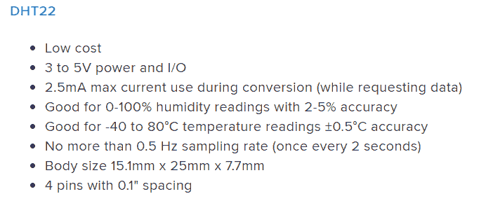

DHT22 sensor characteristics ([[link](https://learn.adafruit.com/dht/overview)])*** 

***我们已经可以构建两次下面的程序集(一次用于室内，一次用于室外)。目前，电力将来自连接到我们主机的 USB 连接器。在生产中，电力可能来自电力库。***

***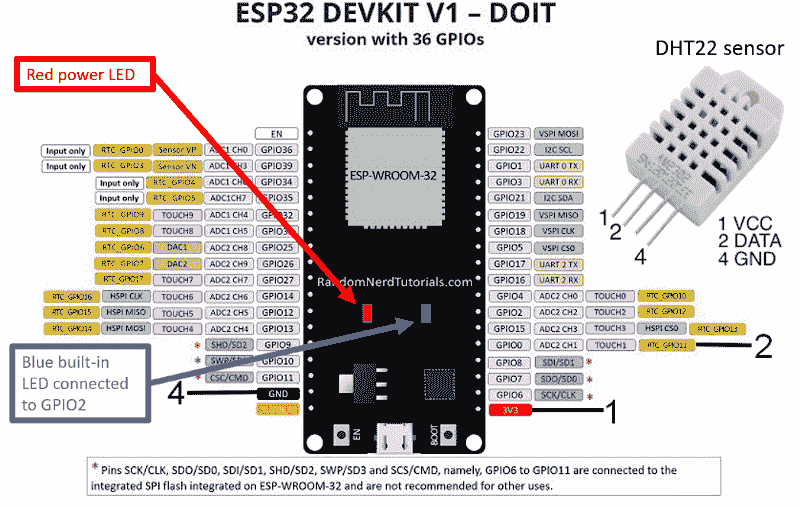

Assembly Diagram — ESP32 DEVKIT V1 and DHT22 sensor constitute a “device”. Pinout is here : [[link](https://randomnerdtutorials.com/esp32-pinout-reference-gpios/)]*** 

***硬件就这些了！项目的其余部分使用谷歌的**无服务器解决方案**。我们现在描述它们…***

#### ***2)项目架构:云物联网核心和 Firebase***

***所有这些“项目架构”部分都是理论性的，没有要执行的步骤。它的目的是介绍与物联网相关的词汇和概念，尤其是当这个领域涉及谷歌云解决方案时。***

***以下是我们项目的总体架构:***

***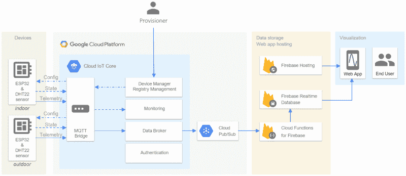

Project architecture*** 

****注意:*在我们的设备和云物联网核心之间没有**网关**，因为它们“说”MQTT。***

****注:*设备也可以通过其 **HTTP 桥**与云物联网核心通信。由于它的性能不如 **MQTT 桥**(参见比较:[ [link](https://cloud.google.com/iot/docs/concepts/protocols) )，我们将在稍后的注册表配置中禁止这种通信。将访问限制在必要的范围内是一种好的做法。***

***让我们分三个部分来解释这种架构:***

*   ***“从设备到云发布/订阅”描述了经典的谷歌物联网架构。***
*   ***“从云发布/订阅到数据存储和可视化”，描述了我们利用数据所做的选择。***
*   ***“附加配置和状态主题”完成了本架构演示。***

*****从设备到云发布/订阅*****

*   ***云物联网核心***

*****云物联网核心**是谷歌云平台服务，我们在**注册的每台设备**都会向其发送温度/湿度数据。当这样的数据被发送时，我们说**设备发布一个遥测事件**(有时也称为“遥测消息”)。***

****注:*定价详情在此:【[链接](https://cloud.google.com/iot/pricing)。对于只有几台设备的小项目，你被收费的可能性很小。***

*   ****MQTT****

***这个发布是通过一个 **MQTT 连接**完成的。MQTT 是基于发布/订阅的消息协议；大多数时候，它是通过 TCP [ [链接](https://en.wikipedia.org/wiki/MQTT) ](或者更好:通过 TLS，TLS 本身是通过 TCP)。遥测消息必须由设备(MQTT 客户端)发布到云物联网核心“MQTT 桥”(MQTT 服务器)的 **MQTT 主题**中，该主题的名称必须遵循以下格式:***

```
***`/devices/{device-id}/events`***
```

****注意:*主题名称中的子文件夹是可能的。我们在这里不需要这个功能，但可以查看[ [链接](https://cloud.google.com/iot/docs/how-tos/mqtt-bridge#publishing_telemetry_events)，因为它有时会很有用。***

***`{device-id}`对每个设备都是唯一的。在我们的例子中，Mongoose OS 从 ESP32 的 MAC 地址的最后 3 个字节创建它。例如，它可以是`esp32_ABB3B4`。***

*   ****服务质量(QoS)****

***MQTT 规范描述了发布到主题时的三个**服务质量(QoS)** 级别([ [链接](https://cloud.google.com/iot/docs/how-tos/mqtt-bridge#quality_of_service_qos)):***

***> QoS 0，消息最多传递一次；***

***> QoS 1，消息至少传递一次；***

***> QoS 2，消息只传递一次。***

***云物联网核心不支持 QoS 2。QoS 1 优于 QoS 0。所以 **QoS 1 就是我们要采用的那个**。猫鼬操作系统可以做到这一点。***

*   ****安全****

***关于**安全性**，在我们的 mongose OS/云物联网核心上下文中，MQTT 通信通过**TLS**([link](https://cloud.google.com/iot/docs/how-tos/mqtt-bridge#mqtt_server))进行，因此(1)确保设备连接到云物联网核心 MQTT 服务器(CA 的证书存储在 mongose OS`ca.pem`文件中)，(2)数据交换将是私有的，(3)将检查数据完整性。另一方面，使用云物联网核心的**设备认证** ([ [链接](https://cloud.google.com/iot/docs/how-tos/mqtt-bridge#device_authentication) ])是通过使用 **JSON Web 令牌(JWT)** 的每设备公钥/私钥认证来执行的。设备使用其私钥执行 JWT 的签名部分，云物联网核心使用相关公钥对其进行验证。Mongoose OS tools 处理这种密钥生成和分发，我们很快会在下面几段名为“云物联网核心项目中的设备注册”的部分中看到这一点。在本节中，我们还将了解如何通过执行内存加密(防止逆向工程)在设备上安全地存储私钥。***

****注意:*除了 JWT 设备认证之外，为了增加安全性，可以从云物联网核心向设备施加 TLS(因此每个设备也有一个公钥证书等)。).这是一个我们不会使用的选项，但它在这里被描述为[用于 Mongoose OS 端(参见“mutual TLS”)，在这里被描述为](https://mongoose-os.com/docs/mongoose-os/api/net/mqtt.md)[用于云物联网核心端。很高兴知道 AWS IoT 强加了这种相互 TLS，无条件([](https://cloud.google.com/iot/docs/how-tos/credentials/verifying-credentials) [link](https://docs.aws.amazon.com/iot/latest/developerguide/iot-security-identity.html) )。***

*   ****注册表****

***具有相同目的的设备在**注册表**中重新分组。***

*   ****云发布/订阅****

*****来自属于同一注册表的所有设备的遥测数据然后被*转发*到云发布/订阅主题**(云发布/订阅是 GCP 的产品[ [链接](https://cloud.google.com/pubsub/)，而不是专门的云物联网核心产品)。云发布/订阅主题的名称遵循以下模式:***

```
***`projects/id-of-google-cloud-project/topics/name-of-telemetry-topic`***
```

***因此，如果我们将我们的谷歌云项目称为`hello-cloud-iot-core`，如果我们选择`weather-telemetry-topic`作为我们的发布/订阅遥测主题的名称，如果最终我们的注册表被称为`weather-devices-registry`，我们迟早会在**谷歌云控制台**中获得这种视图:***

***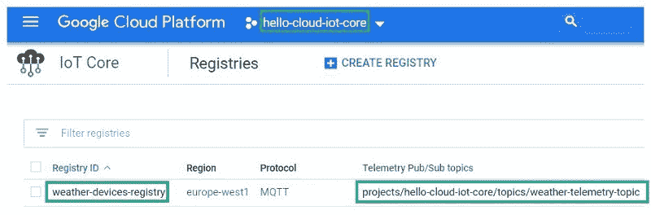

Project ID, registry ID and telemetry Pub/Sub topic name in Google Cloud Console*** 

***但是不要紧张，一切都会一步一步解释清楚的。***

****注意:*如这里所说(【[链接](https://cloud.google.com/iot/docs/how-tos/mqtt-bridge#publishing_telemetry_events))，云发布/订阅主题中的每条消息都包含设备发布的遥测消息的副本，以及一些**消息属性**，最重要的可能是`deviceID`，允许我们将一些接收到的数据与发布它的设备进行匹配。***

****注:*我们说了很多关于 **Pub(lish)** ，但是 **Sub(scribe)** 在哪里？事实上，我们将使用 Google Cloud 命令行界面快速创建一个云发布/订阅(一个“拉”订阅)，以便查看发布到遥测主题的消息。在本文的后面，我们将创建一个 Firebase Cloud 函数来响应每个发布，这将自动创建另一个订阅(这次是“推送”订阅)。***

*****从云发布/订阅到数据存储和可视化*****

***我们遵循本文开头给出的项目架构图的正确部分:***

***

Project Architecture — Weather data storage and visualization*** 

***发布到云发布/订阅主题将**触发 Firebase 云功能**，该功能将自己**用新数据完成 Firebase 实时数据库**。由 **Firebase Hosting** 托管的一个 web 应用程序将会生动地从 Firebase 实时数据库中绘制数据，就像我们在以前的帖子中所做的一样:[ [link](https://medium.com/@o.lourme/our-iot-journey-through-esp8266-firebase-angular-and-plotly-js-part-3-644048e90ca4) 。***

***在谷歌生态系统中还有其他选择来存储/处理/可视化数据。 [Alvaro Viebrantz](https://www.freecodecamp.org/news/gcp-cloudiotcore-esp32-mongooseos-1st-5c88d8134ac7/undefined) 的真好帖子[链接](https://medium.com/google-cloud/build-a-weather-station-using-google-cloud-iot-core-and-mongooseos-7a78b69822c5)帮了我们用**大查询**([链接](https://cloud.google.com/bigquery/))和**数据工作室**([链接](https://datastudio.google.com))。***

*****附加的“配置”和“状态”主题*****

***在本帖开头给出的项目架构图上，我们看到除了遥测之外还有另外两个数据流:**Config**([link](https://cloud.google.com/iot/docs/how-tos/config/configuring-devices))和**State**([link](https://cloud.google.com/iot/docs/how-tos/config/getting-state)):***

***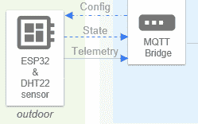

Config and State data flows*** 

***事实上，云物联网核心服务可以将**配置更新消息**发布到设备已经订阅的特殊主题(【[链接](https://cloud.google.com/iot/docs/how-tos/config/configuring-devices))。当我们需要设备通过更新其相关传感器的参数、通过改变深度睡眠周期、移动伺服电机等进入新状态*，例如*时，这是有用的。***

***为了提高效率，每台设备每秒钟不应该有超过一条这种类型的消息。这样的消息是一个任意的用户定义的 blob(我们将使用 JSON)，最大为 64kb。最后，这个特殊 MQTT 主题的名称是强制性的:***

```
***`/devices/{device-id}/config`***
```

***另一方面，设备可以发布关于其状态 ([ [链接](https://cloud.google.com/iot/docs/how-tos/config/getting-state))**，** *的**消息，例如***可用 RAM 的数量、按钮的状态等，发布到云物联网核心已经自动订阅的特定主题。它通常用于查看之前发送到设备的配置消息是否达到了预期效果。***

***为了提高效率，这种发布在每台设备上每秒不应超过一次。这样的消息是一个任意的用户定义的 blob(我们将使用 JSON)，最大为 64kb。最后，设备向其发布状态数据的主题必须具有以下名称:***

```
***`/devices/{device-id}/state`***
```

****注:*从云物联网核心向设备发送**命令**也是可以的:见[ [链接](https://cloud.google.com/iot/docs/how-tos/commands)但我们不会举例说明。***

> ***但目前，我们将专注于遥测技术。在这次旅程之后，在“即将到来”的帖子中，我们将展示如何处理`*config*`和`*state*`特殊主题。***

***2019 . 3 . 29 更新:关于`config`和`state`专题的这个帖子出来了:【[链接](https://medium.com/@o.lourme/gcp-cloudiotcore-esp32-mongooseos-2nd-config-state-encrypt-7c5e937e5be9)。***

### *****在设备上安装 Mongoose 操作系统*****

#### ***1)对猫鼬操作系统的简短描述***

*****mongose OS**([[链接](https://mongoose-os.com/)，[ [链接](https://lwn.net/Articles/733297/))是一款面向物联网的智能操作系统，可在多个芯片上运行，包括 ESP8266 和 ESP32。Mongoose OS 与物联网的主要参与者合作([ [link](https://mongoose-os.com/about.html) ])。它附带了一个名为 **mos** 的开发工具，可以在 UI 中工作，也可以使用命令行终端(就像 Windows 中的`cmd.exe`)。无论哪种情况，我们都将编写`mos`命令。还有一个叫 mDash 的设备管理 app 但是我们没有尝试。**提供了大量处理大多数网络和传感器协议的 API。**程序可以用 C/C++和 JS 两种语言编写。***

***最后，YouTube 上有一个 12 教程系列，非常有用:***

 ***[https://www.youtube.com/embed/videoseries?list=PLNOffh-6mSoRfxD4wTvRziUDUiSLSyJKE](https://www.youtube.com/embed/videoseries?list=PLNOffh-6mSoRfxD4wTvRziUDUiSLSyJKE)*** 

****注:*我们用的是 Mongoose OS 社区版，免费，在 Apache 2.0 下授权。***

#### ***2)在 ESP32 上安装 Mongoose 操作系统***

***必须在每台设备上执行此安装。***

***我们前往 Mongoose OS 网站的**开发者版块**([[链接](https://mongoose-os.com/docs/quickstart/setup.md))，以执行本资源中给出的列表的**前七个步骤**:***

***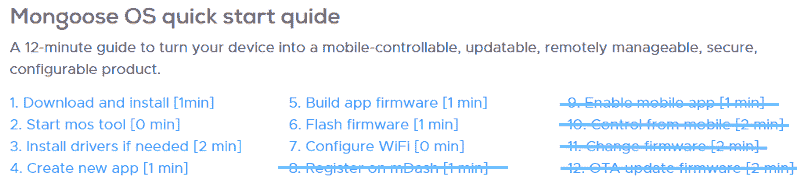

Mongoose OS setup steps*** 

*****第一步**、**第二步**、**第三步**都是琐碎的。在步骤#3，不要忘记通过 USB 电缆将设备连接到主机。***

***对于**步骤#4** “创建新应用”，我们选择将该应用称为`app1`。当网站上显示的`mos clone https://github.com/mongoose-os-apps/demo-js app1`完成后，mos 工具自动转到刚刚创建的`app1/`文件夹。***

***在`app1/fs/`文件夹中，有一个名为`init.js`的源文件。这是一个演示文件，能够与不同的物联网平台通信(当然，如果它们已配置)。我们将基本上测试它，并很快根据我们的目的简化它。***

***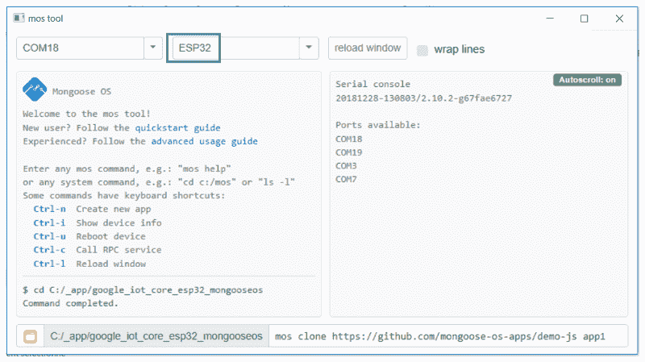

**mos tool** launched in a UI ; ESP32 selected; Serial console (on the right) is by default at 115200 bds, ESP32’s default speed.*** 

*****步骤#5** “构建应用固件”通过`mos build`命令启动(如果从命令行终端启动，而不是从 mos 工具启动，则将`--arch esp32`添加到该命令中)。这可能需要一段时间，但通常我们只需要执行一次构建。在此之后，我们有更多的文件。一个叫做`app1/build/fw.zip`的包含了操作系统和`init.js`的二进制文件。它将在下一步被闪存到 ESP32。***

*****步骤#6** 用`mos flash`命令启动“闪存固件”。通常只需要做一次。即使后来我们更改了一些文件(比如说`init.js`，我们也会使用`mos put`命令将文件从主机上传到**本地设备的文件系统**。当然，该命令仅在刷新过程后可用。***

****注意:*对于全新的 ESP32，固件刷新步骤可能会很棘手。使用我们的 ESP32 DEVKIT V1，我们在控制台中有消息(这是第一个优点！)报告无法连接到 ESP32 ROM 的问题。通过按下启动按钮(靠近 USB 连接器)重试闪烁，最终成功闪烁。不过，要准备好等一两分钟。***

***然后，设备自动重启并执行`init.js`。我们每秒在 mos 控制台(或任何串行终端@115200 bds)中获得以下信息:***

***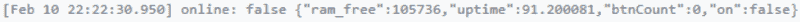

Console after initial ESP32 flash firmware with Mongoose OS*** 

***在**步骤#7** 中，我们将 ESP32 连接到我们的 wifi 网络(我们使用 mos 工具):***

```
***`mos wifi WIFI_NETWORK_NAME WIFI_PASSWORD`***
```

***设备将在获得 IP 地址并通过联系 SNTP 服务器同步时间后自行重启。然后，我们 ping 我们的设备，检查其互联网连接。***

****注意:*我们通过在 mos 工具中点击 **CTRL+i** ，或者通过键入`mos call Sys.GetInfo`来获取设备信息(例如 IP 地址)。***

****注意:*我们通过在 mos 工具中点击 **CTRL+u** ，或者通过键入`mos call Sys.Reboot`来重置设备。***

****注意:*步骤#5、#6 和#7 可能是“配置脚本”的开始，如果我们有许多设备要设置，这将非常有用。如果所有设备都相同，*，例如*只有 ESP32，则可选择重新运行步骤#5。***

#### ***3) ESP32“你好，世界！”用 Mongoose 操作系统编程***

***为了习惯 Mongoose OS JS 的编程风格和 mos 工具，让我们编写一个小程序，其目的是使蓝色内置 LED 闪烁并在控制台上打印消息。**这个 led 连接到 ESP32 DEVKIT V1 的 GPIO2 引脚**(见本文开头的组装图)。在我们的主机上，让我们用这个替换`app1/fs/init.js`的内容:***

```
***`/*
 ESP32 DEVKIT V1 - Mongoose OS
 Built-in LED blink and console log
 This blue LED is connected to GPIO2.
 See: 
 - https://mongoose-os.com/docs/mos/api/core/mgos_timers.h.md
*/

load('api_config.js');
load('api_gpio.js');
load('api_timer.js');

let pin = 2;

GPIO.set_mode(pin, GPIO.MODE_OUTPUT);

// Call every 2 seconds
Timer.set(2000, Timer.REPEAT, function() {
  let value = GPIO.toggle(pin);
  print(value ? 'Tick' : 'Tock');
}, null);`***
```

***从 mos 工具或命令行终端，我们将该文件上传到 Mongoose OS 文件系统，最后我们重新启动设备:***

```
***`mos put fs/init.js
mos call Sys.Reboot`***
```

***蓝色 led 应该闪烁，我们应该交替看到控制台上印刷的`Tick`和`Tock`。***

#### ***4)用猫鼬操作系统进行 DHT22 测试***

***在这篇文章的开始，有一个装配图显示如何连接 DHT22 传感器与 ESP32 开发套件 V1。我们选择将 **DHT22 数据引脚** **连接到 ESP32 DEVKIT V1** 的 GPIO0。***

***所以，这里是另一个简短的`init.js`程序。这个定期打印到串行控制台 DHT22 测量值(温度和湿度——作为 JSON 中的一个对象，还没有 MQTT 发布):***

```
***`/*
 ESP32 DEVKIT V1 - Mongoose OS
 DHT22 sensor measures are sent to console.
 DHT22 data pin is connnected to GPIO0.
 See: 
 - https://mongoose-os.com/docs/quickstart/develop-in-js.md
 - https://mongoose-os.com/docs/mos/api/drivers/dht.md
*/

load('api_config.js');
load('api_dht.js');
load('api_timer.js');

let pin = 0;
let dht = DHT.create(pin, DHT.DHT22);

Timer.set(5000, true, function() { // timer period is in ms
  let msg = JSON.stringify({temperature: dht.getTemp(), humidity: dht.getHumidity()});
  print(msg);
}, null);`***
```

***然后:***

```
***`mos put fs/init.js
mos call Sys.Reboot`***
```

***而这就是我们上传`init.js`程序重启设备后得到的相关控制台。湿度以%为单位，温度以摄氏度为单位:***

***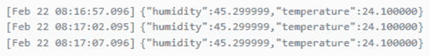

DHT22 measures as printed to console. A bit too accurate, isn’t it ?*** 

***数字似乎有一个很长的小数部分，但这将在稍后的云函数中得到解决。***

****注意:*出于教学目的，我们在这篇文章中选择了像`temperature`或`humidity`这样的显式长键名。这将对以后存储在 NoSQL 数据库(Firebase 实时数据库)中的数据量产生影响，因为这些键将在每个测量中重复。较短的键名可能是个好主意。***

#### ***5)让我们将数据发布到 MQTT 遥测主题***

*****这是我们最后一个程序，准备与云物联网核心合作的程序！**在之前的节目中，我们只是在已经讨论过的遥测主题上增加了一个出版物:`/devices/{device-id}/events`。***

***请注意，消息是以 JSON 发布的，这有助于以后使用 Firebase Cloud 函数对消息发布做出反应来检索内容。***

```
***`/*
 ESP32 DEVKIT V1 - Mongoose OS
 DHT22 sensor measures are sent to console.
 DHT22 data pin is connnected to GPIO0.
 Publishes weather data to the appropriate topic.

 See: 
 - https://mongoose-os.com/docs/quickstart/develop-in-js.md
 - https://mongoose-os.com/docs/mos/api/drivers/dht.md
 - https://mongoose-os.com/docs/mos/api/net/mqtt.md
*/

load('api_config.js');
load('api_dht.js');
load('api_timer.js');
load('api_mqtt.js');

// Telemetry topic must have this name:
let topic = '/devices/' + Cfg.get('device.id') + '/events';

let pin = 0;
let dht = DHT.create(pin, DHT.DHT22);

Timer.set(5000, true, function() { // timer period is in ms
  let msg = JSON.stringify({temperature: dht.getTemp(), humidity: dht.getHumidity()});
  // Publish message with a QoS 1
  // MQTT.pub() returns 1 in case of success, 0 otherwise.
  let ok = MQTT.pub(topic, msg, 1); 
  print(ok, msg);
}, null);`***
```

***我们将这个文件命名为`init.js`，上传到 Mongoose 文件系统，然后引发一次重置:***

```
***`mos put fs/init.js
mos call Sys.Reboot`***
```

****注意:*这些命令可以附加到我们前面提到的“供应脚本”中。***

***运行时，最后一个程序将数据打印到控制台，但无法将数据发布到云物联网核心的 MQTT 桥(`MQTT.pub()`返回 0):***

***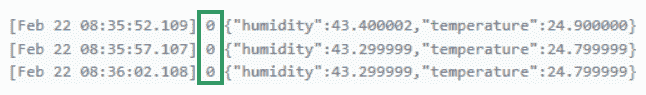

Telemetry data can still not be published as we haven’t set up a Google Cloud project yet.*** 

***事实上，我们还没有建立任何谷歌云项目，更不用说注册任何设备了。让我们现在就做吧！***

### ***云物联网核心项目设置***

#### ***1) Google Cloud SDK 安装***

***首先，我们需要**安装谷歌云软件开发工具包**，因为我们将不得不在命令行终端键入一些`**gcloud**` **命令**。在编写的时候，它需要 Python 2.7。在 Python 3.5 上就不行了。Google Cloud SDK 下载页面([ [link](https://cloud.google.com/sdk/downloads) ])提供了内部捆绑了 Python 的 SDK 版本(如果你确定你还没有安装 Python 并且不想处理这个 Python 点的话)。***

***然后，云物联网核心需要一些**测试版的`gcloud`命令**。因此，在命令行终端中，从任何文件夹，我们键入:***

```
***`gcloud components install beta`***
```

***这两个步骤只需做一次！***

****注意:*谷歌物联网核心上的以下大部分动作可以通过三种方式执行:***

*   ***用**谷歌云控制台**(在网络上)***
*   ***用不同语言的一些 API***
*   ***用**命令行界面在**终端，键入`gcloud`命令。***

***我们将使用后者来配置东西，我们将用谷歌云控制台(在网络上)来检查事实。***

#### ***2)谷歌云项目设置***

***我们现在跟随 Mongoose OS 网站的指南:[ [链接](https://mongoose-os.com/docs/quickstart/cloud/google.md)。***

```
***`# Commands indicated in this grey frame have to be done just once to configure the Google Cloud project! They can be performed from any folder.

# Get authenticated with Google Cloud
gcloud auth login

# Create cloud project. We chose hello-cloud-iot-core as PROJECT_ID
gcloud projects create hello-cloud-iot-core

# Give Cloud IoT Core permission to publish to Pub/Sub topics
gcloud projects add-iam-policy-binding hello-cloud-iot-core --member=serviceAccount:cloud-iot@system.gserviceaccount.com --role=roles/pubsub.publisher

# Set default project for gcloud
gcloud config set project hello-cloud-iot-core

# Create Pub/Sub topic for device telemetry
gcloud beta pubsub topics create weather-telemetry-topic

# Create a Pub/Sub subscription to the just created topic
gcloud beta pubsub subscriptions create --topic weather-telemetry-topic weather-telemetry-subscription

# Create devices registry (we call it weather-devices-registry)

# Precise Pub/Sub topic name for event notifications

# Disallow device connections to the HTTP bridge
gcloud beta iot registries create weather-devices-registry --region europe-west1 --no-enable-http-config --event-notification-config=topic=weather-telemetry-topic

# Say 'yes' to enable API (if prompted).

# But the last command may not work all the same

# if you don't enable billing.

# So, follow the link to enable billing and retry last command.

# It should end up to "Created registry [weather-devices-registry]."`***
```

#### ***3)云物联网核心项目中的设备注册***

***现在让我们将设备注册到项目中！当然是一次一个。 **mos 工具对这个任务真的很有帮助。**从 mos 工具的用户界面或命令行终端启动，放在我们的`app1`文件夹中，我们键入以下命令(如你所见，涉及到项目 id 和注册表名称):***

```
***`# Register device with Cloud IoT Core (do it for each device!)
mos gcp-iot-setup --gcp-project hello-cloud-iot-core --gcp-region europe-west1 --gcp-registry weather-devices-registry`***
```

****注意:*这个命令可能是我们已经提到过两次的“供应脚本”中的最后一个。***

***该命令是一个`mos`命令，它本身会使用`gcloud`命令。将要注册的设备必须通过串行端口连接到我们的主机，因为一些信息将被上传到它，就像密钥、MQTT 桥地址等。***

***的确，我们在 mos 控制台上看到**生成了两个密钥(一个私有，一个公共)**。我们可以在`app1`项目文件夹中检查它们。私有的用于 ESP32，公共的用于谷歌物联网核心。它们在涉及我们前面提到的 JSON Web 令牌的认证过程中使用。***

***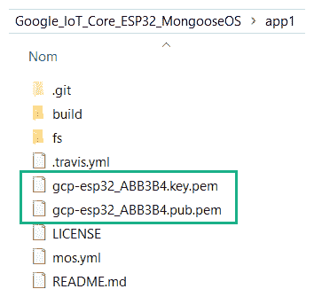

Pair of keys just generated (private and public)*** 

****关于安全性的注意事项:* **私钥不应该以纯文本的形式存储在 ESP32 闪存中**。这就是为什么我们在这个帖子后面描述如何加密这个内存。另外，**私钥文件不应该以纯文本的形式存储在主机开发计算机上**。至少，用密码保护对其内容的访问。***

***当设备重启时，我们在控制台中看到它成功连接到 Google MQTT 桥并发布遥测消息(`MQTT.pub()`返回 1):***

***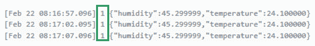

Publications to MQTT bridge are successful. Nice job!*** 

#### ***4)在谷歌云控制台中检查项目设置***

***我们前往[https://console.cloud.google.com/iot/](https://console.cloud.google.com/iot/)检查一切是否配置妥当:***

***

Project ID, registry ID and telemetry Pub/Sub topic name in Google Cloud Console*** 

***点击**注册表 ID** `weather-devices-registry`进入另一个屏幕。在这个新屏幕上单击“Devices”会列出已配置的设备，并提供上次看到它们的详细信息(但这不是实时更新，我们必须刷新页面):***

***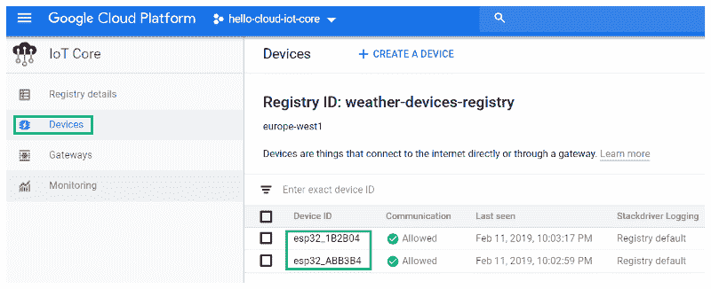

Devices View in Google Cloud Console*** 

***点击**遥测发布/订阅主题**名称进入**发布/订阅控制台**显示我们之前创建的订阅，*即*与遥测主题相关的订阅:***

***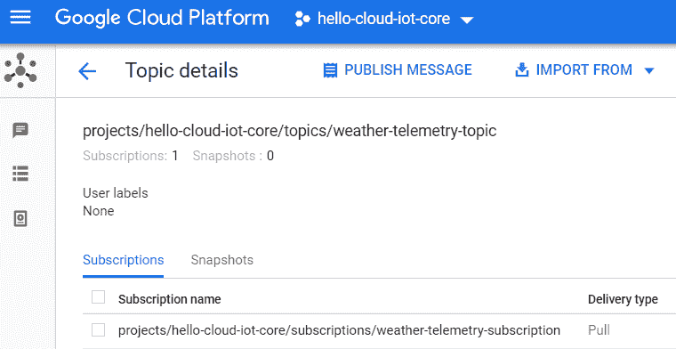

Google Cloud Console (Pub/Sub) — names of topic and related subscription*** 

#### ***5)查看至少一些遥测数据***

***现在，如果能看到设备发布的数据就好了。为此，我们已经创建了订阅。从主机的任何文件夹中，我们键入:***

```
***`gcloud beta pubsub subscriptions pull --auto-ack weather-telemetry-subscription --limit=2`***
```

***这个命令([ [链接](https://cloud.google.com/sdk/gcloud/reference/beta/pubsub/subscriptions/pull))一直持续到 ***2*** 来自我们`weather-telemetry-subscription`订阅的 Pub/Sub 消息。我们可以看到 JSON 中的数据、消息 id 和每条消息的属性列表。其中有`deviceId`属性。不幸的是没有时间戳，我们稍后会看到如何获得它们。***

***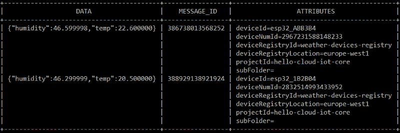

Result of pulling telemetry messages from a subscription*** 

> ***如果你已经达到了这个里程碑，恭喜你！我们现在准备编写一个 Firebase Cloud 函数，对发布/订阅遥测主题的每个发布做出反应！***

### ***用 Firebase 记录、存储和可视化天气数据***

#### ***1)简介***

***我们现在正在处理项目的这一部分:***

***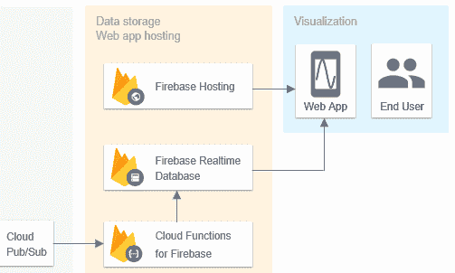

The part we study now*** 

***在该图中，我们看到我们的项目需要 3 个 Firebase 产品:***

***一个 **Firebase 云函数**(更确切地说是“Firebase 的云函数”)必须对遥测主题的任何发布做出反应，以便将该发布的天气数据存储到一个 **Firebase 实时数据库**。这种存储允许天气数据持久化，并被用来提供给由 **Firebase Hosting** 托管的一个网络应用。这个网络应用程序绘制了不同时间的天气数据的实时图表。***

***好消息是可以用一个命令配置所有这些产品。***

#### *****2) Firebase 配置，GitHub 库*****

***我们仍在从事同一个名为`hello-cloud-iot-core`的谷歌云项目。Firebase 将会用它的产品来“增强”这个项目。***

***我们为我们项目的 Firebase 方面制作了一个 GitHub 存储库:***

***[**Olivier lourme/IOT-store-display**](https://github.com/olivierlourme/iot-store-display)
[*通过在 GitHub 上创建一个账户，为 Olivier lourme/IOT-store-display 的发展做出贡献。*github.com](https://github.com/olivierlourme/iot-store-display)***

***在您最喜欢的开发文件夹中克隆这个存储库，并转到新创建的目录:***

```
***`c:\_app>git clone https://github.com/olivierlourme/iot-store-display
c:\_app>cd iot-store-display`***
```

*****全球消防基地配置*****

****注意:*我们假设你已经安装了 **Firebase 工具**(*即* Node.js 已经安装并且`npm install -g firebase-tools`已经运行，详见 [link](https://firebase.google.com/docs/functions/get-started) )。***

***让我们执行 Firebase 初始化:***

```
***`c:\_app\iot-store-display>firebase init`*** 
```

***第一步是选择我们想要使用的 Firebase 产品:***

***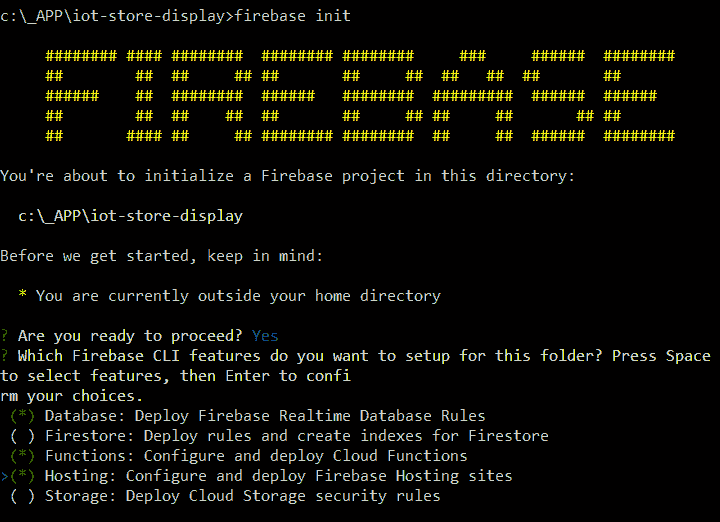

Choosing Firebase products*** 

***然后，系统会提示我们将当前目录(`iot-store-display`)与一个列出的 Firebase 项目关联起来。问题是我们的项目`hello-cloud-iot-core`没有出现在列表中，因为在成为 Firebase 项目之前，它也是一个 Google Cloud 项目！阅读[道格·斯蒂文森](https://www.freecodecamp.org/news/gcp-cloudiotcore-esp32-mongooseos-1st-5c88d8134ac7/undefined)关于 Firebase 和谷歌云关系的帖子:【[链接](https://medium.com/google-developers/whats-the-relationship-between-firebase-and-google-cloud-57e268a7ff6f)和[ [链接](https://medium.com/google-developers/firebase-google-cloud-whats-different-with-cloud-functions-612d9e1e89cb)】。***

***为了克服这个问题，首先我们按 CTRL+C 来停止这个初始化过程，然后我们转到位于 https://console.firebase.google.com[的 **Firebase 控制台**。我们选择“添加项目”:](https://console.firebase.google.com)***

***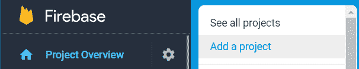

Firebse Console — Add a project*** 

***我们可以看到我们的项目(带有 Google Cloud 徽标)并选择它:***

***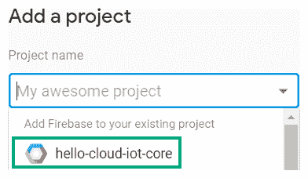

Fierbase Console — Even Google Cloud projects are listed.*** 

****注意:*如果 Google Cloud 项目本身有计费计划，您可能会被要求确认 Firebase 计费计划。***

***太好了！我们用`firebase init`命令重启 Firebase 初始化，这一次我们的 Google Cloud 项目`hello-cloud-iot-core`被列出。我们选择它:***

***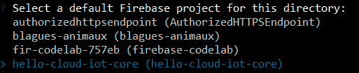

Our `**iot-store-display**` directory is associated with **hello-cloud-iot-core** project.*** 

****注意:*如果你仍然看不到你的项目，你可能没有正确的谷歌账户登录到 Firebase。在这种情况下，键入`firebase logout`，然后键入`firebase login`。***

*****实时数据库配置*****

***然后，向导会询问一个关于实时数据库及其规则的问题:保存它们的文件名。我们保留默认名称。将这些规则放在项目目录下的一个文件中比我们在过去的文章中去 Firebase 控制台更实际。我们将在后面详述这些规则。***

***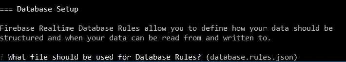

Name of file storing Realtime Database rules*** 

*****云功能配置*****

***以下是我们对向导关于功能设置的回答:***

***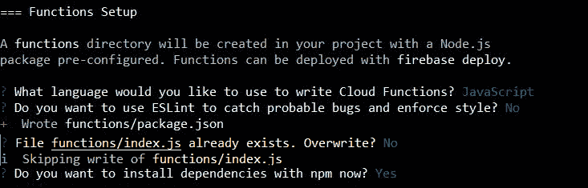

Cloud Functions setup*** 

***当然，我们选择不覆盖从 [GitHub](https://github.com/olivierlourme/iot-store-display) 获得的`functions/index.js`文件。***

*****Firebase 托管配置*****

***以下是我们对向导关于主机设置的回答:***

***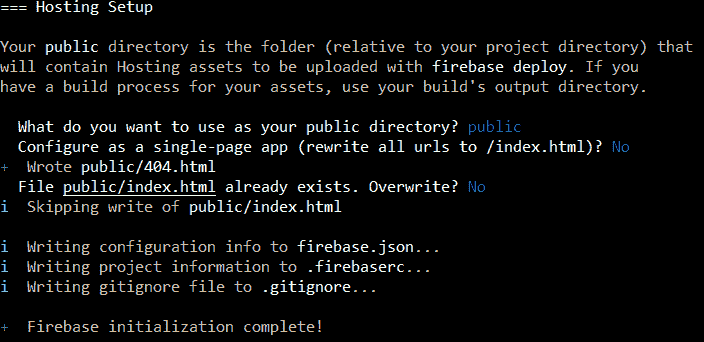

Hosting setup*** 

***当然我们选择不覆盖从 [GitHub](https://github.com/olivierlourme/iot-store-display) 获得的`public/index.html`文件。***

*****正在部署(不是现在！)*****

***稍后，如果我们想要部署我们对 3 个产品所做的一些更新，我们可以全局键入:***

```
***`c:\_app\iot-store-display>firebase deploy`***
```

***但是如果我们只想分别部署:***

*   ***更新的数据库规则，***
*   ***更新了云功能，***
*   ***更新的 web 应用程序，***

***我们分别键入:***

```
***`firebase deploy --only database
firebase deploy --only functions
firebase serve --only hosting (local deployment) OR firebase deploy --only hosting (remote deployment)`***
```

#### ***3)发布/订阅触发云功能***

*****简介*****

***在过去的一篇文章中，我们解释过我们可以编写 **Firebase Cloud 函数**来触发一些谷歌产品上发生的事件。***

***[**第二帖，共三帖。我们的物联网之旅通过 ESP8266、Firebase 和 plotly . js**](https://medium.com/@o.lourme/our-iot-journey-through-esp8266-firebase-angular-and-plotly-js-part-2-14b0609d3f5e)
[*Firebase 云函数为推送到 Firebase 实时数据库的每个值附加一个时间戳。*medium.com](https://medium.com/@o.lourme/our-iot-journey-through-esp8266-firebase-angular-and-plotly-js-part-2-14b0609d3f5e)***

*****Cloud Pub/Sub** 就是这些产品中的一个，因此每次有消息发布到 Pub/Sub 主题时都可能触发一个功能:[ [链接](https://firebase.google.com/docs/functions/pubsub-events)。***

***因此，如果 Firebase Cloud 函数在每个针对`weather-telemetry-topic`主题的发布上被触发，那么查看它的日志将允许我们查看遥测主题的活动。***

***云函数的代码必须将每个新发布的数据存储到与我们的项目相关的 Firebase 实时数据库中。***

*****云函数源代码*****

***源代码的开头是这样的:***

```
***`exports.detectTelemetryEvents = functions.pubsub.topic('weather-telemetry-topic').onPublish(
    (message, context) => {...`***
```

***完整的云函数源代码在名为`index.js`的文件中。这个文件在 [GitHub](https://github.com/olivierlourme/iot-store-display) 上我们`iot-store-display`目录的`functions`文件夹里。它被充分评论了，所以运行和研究它，它很短，并不复杂。***

*****云功能部署*****

***是时候部署云功能了:***

```
***`c:\_app\iot-store-display>firebase deploy --only functions`***
```

*****云函数验证*****

***一旦部署了云函数，我们就可以查看云函数日志，除此之外，我们还会看到我们在`index.js`末尾编写的`console.log(`Device=${deviceId}...)`的结果。***

***去哪里看那些日志？我们有两个机会:***

*   ***在消防基地控制台([https://console.firebase.google.com](https://console.firebase.google.com)):***

***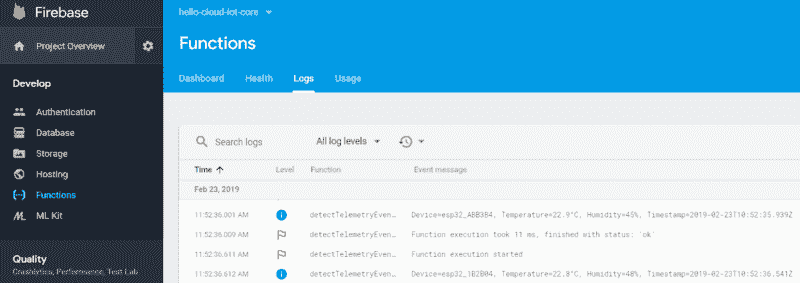

Firebase Console — Firebase Cloud Functions logs*** 

*   ***在谷歌云控制台([https://console.cloud.google.com/functions/](https://console.cloud.google.com/functions/)):***

***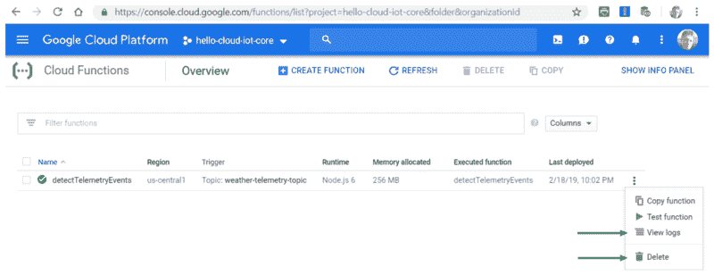

Google Cloud Console — Access to **Cloud Function logs** and to **Cloud Function deletion***** 

***我们更喜欢后一种解决方案，因为日志更清晰:***

***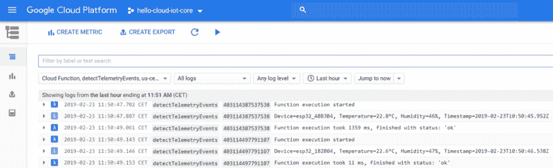

Google Cloud Console- Cloud Functions logs*** 

***关于存储，这是每个设备发布 2 次遥测数据后 Firebase 实时数据库中的内容。数据当然是按照我们在`index.js`中指定的设备进行分类的:***

***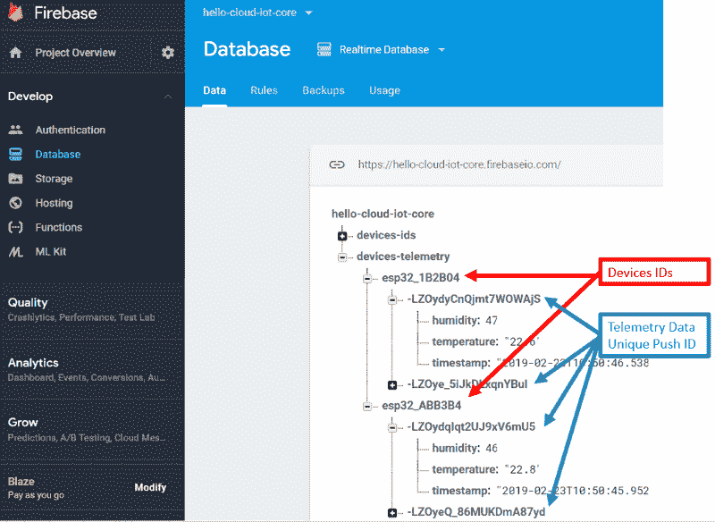

Firebase Console — Realtime Database after 2 telemetry data publications per device*** 

****注意:*不要忘记**如果你不使用谷歌服务器上的云功能**，否则你可能会达到调用限额或为你不使用的服务付费，如下所示:【[链接](https://medium.com/@o.lourme/our-iot-journey-through-esp8266-firebase-angular-and-plotly-js-part-2-14b0609d3f5e)】。功能删除要在谷歌云控制台上进行(见“删除”，上面 3 张截图)。***

****注意:*无论`database.rules.json`文件的内容是什么，云函数对数据库都有管理权限。在这一步中，`database.rules.json` 文件仍然是非常严格的。编辑完成后，不要忘记部署它们。***

```
***`{
  "rules": {
    ".read": false,
    ".write": false
  }
}`***
```

#### ***4)使用 Firebase 和 plotlys.js 可视化天气数据的 web 应用程序***

*****简介*****

****注意:*我们现在正在构建一个“自制的”(并且令人满意的)数据可视化解决方案。对于增强的用户界面(仪表板等。)，也许你应该调查一下我们已经在这篇文章的其他地方提到过的 Data Studio。***

***我们专注于**构建一个小型 web** 应用，由 **Firebase 托管**托管。这个网络应用程序**生动地绘制**存储在 Firebase 实时数据库中的数据。我们使用[plottly](https://www.freecodecamp.org/news/gcp-cloudiotcore-esp32-mongooseos-1st-5c88d8134ac7/undefined)([https://plot.ly/javascript/](https://plot.ly/javascript/))作为绘图库。我们熟悉这项工作，因为我们在以前的帖子中已经承担了类似的工作:***

***[**第 3 帖，共 3 帖。我们的物联网之旅通过 ESP8266、Firebase 和 Plotly.js**](https://medium.com/@o.lourme/our-iot-journey-through-esp8266-firebase-angular-and-plotly-js-part-3-644048e90ca4)
[*一个由 Firebase Hosting 托管的 web 应用订阅来自 Firebase 实时数据库和 plot 的数据流……*medium.com](https://medium.com/@o.lourme/our-iot-journey-through-esp8266-firebase-angular-and-plotly-js-part-3-644048e90ca4)***

***今天的不同之处在于，我们必须:***

*   ***画几个图表:温度*对*时间，湿度*对*时间，***
*   ***在每个图表中，每个器件都有一个曲线图。***

*****数据库规则&设备-ids 节点*****

***关于数据库规则，现在的`database.rules.json`文件应该是什么？web 应用程序需要将`device-telemetry`节点的**读为**。如果你仔细看之前给出的实时数据库截图，还有一个节点叫做`devices-ids`。***

***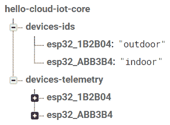

Firebase Console — Detail of devices-ids node in Realtime Database*** 

***您需要在 Firebase 控制台中手动创建**这个`devices-ids`节点，并适当地填充它，以便 web 应用程序正常工作。这是一种简单的方法，可以向 web 应用程序声明我们想要绘制的设备，并为设备提供别名。在 [GitHub](https://github.com/olivierlourme/iot-store-display) 中给出的`public/script.js`文件的注释中充分解释了它的作用和必要性。*****

****注意:*一个改进可以是一个表单(通过认证访问)，一旦完成，调用一个脚本来生成这个`devices-ids`节点。***

***这个`devices-ids`节点也需要被 web app 读取。所以`database.rules.json`文件最终应该变成:***

```
***`{
  "rules": {
    "devices-ids": {
      ".read": true,
      ".write": false
    },
    "devices-telemetry": {
      ".read": true,
      ".write": false
    }
  }
}`***
```

***这些新规则在编辑和保存后，必须与以下内容一起部署:***

```
***`c:\_app\iot-store-display>firebase deploy --only database`***
```

*****Web app 源代码*****

***web 应用程序源代码位于我们的`hello-cloud-iot-core`文件夹的`public`目录中，或者位于 [GitHub](https://github.com/olivierlourme/iot-store-display) 中。文件夹的内容，尤其是`script.js`，都有完整的注释，所以你知道在哪里学习(和提高！)它。***

****注意:*我们在这个演示中只有两个设备，但是源代码对于 *x* 设备是可以的，只要你在`devices-ids`节点中声明它们。***

*****Web 应用本地部署和验证*****

***出于测试目的，Firebase Hosting 可以启动一个本地实时服务器:***

```
***`c:\_app\iot-store-display>firebase serve --only hosting`***
```

***我们前往`http://localhost:5000`，我们很高兴得到这个消息:***

***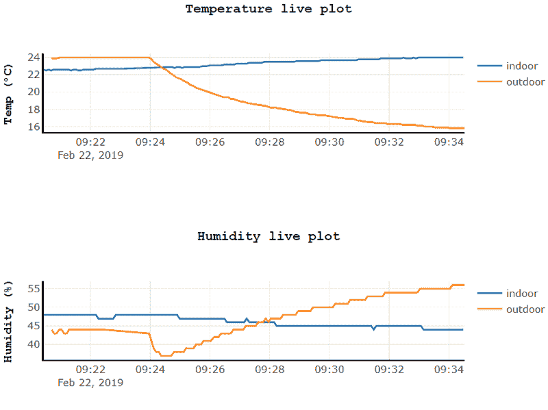

At last the charts we wanted!*** 

*****Web app 远程部署*****

***最后，Firebase 为我们提供了 web 应用的托管服务，并允许我们通过 https 访问它:***

```
***`c:\_app\iot-store-display>firebase deploy --only hosting`***
```

***我们很快获得了我们的 web 应用程序的公共 URL:[https://hello-cloud-iot-core.firebaseapp.com](https://hello-cloud-iot-core.firebaseapp.com)***

***

Web app deployment is complete!*** 

****注意:*如果你有自己的域，可以把你的 Firebase web app 连接到它上面。参见[链接](https://firebase.google.com/docs/hosting/custom-domain)。***

### ***结论***

***在这篇文章中，我们发现了如何将 **ESP32** 、**mongose OS**和**云物联网核心**结合起来，获得一个严肃、安全和专业的物联网项目。现在我们知道，只要能连接到 Wifi，就可以快速配置 10，100… 1000 台设备来获取整个地区的天气数据。现在，设备是集中管理的，很容易配置和监控它们。但是我们可以更进一步！***

***的确，除了这个帖子，还有第二个([ [链接](https://medium.com/@o.lourme/gcp-cloudiotcore-esp32-mongooseos-2nd-config-state-encrypt-7c5e937e5be9))。在里面:***

*   ***我们将重点关注 ESP32 闪存**内存加密**，以实现完全安全的系统。***
*   ***我们将看到如何使用`config`特殊主题，允许我们从谷歌云控制台在设备上**触发一个动作。*****
*   ***我们将看到如何使用`state`专题，允许**设备向谷歌云平台传达关于其当前状态**的信息。***

***我们希望你喜欢这篇很长的帖子，并且你学到了一些东西！如果您有任何问题或改进建议，请随时联系我…***