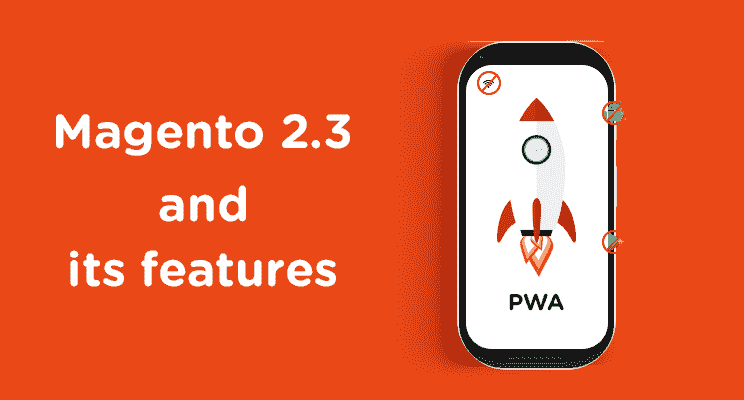

# 以下是 Magento 2.3 所有重要特性的分析

> 原文：<https://www.freecodecamp.org/news/heres-a-breakdown-of-all-the-important-features-of-magento-2-3-a83ad3a017bf/>

作者:桑托什·孙达拉扬

# 以下是 Magento 2.3 所有重要特性的分析

Magento 2.3 终于来了，它有了显著的增强和惊人的特性。有些功能非常棒，以至于你可能想现在就把你的在线商店升级到 Magento 2.3！

#### 那么，Magento 2.3 中的那些特性是什么呢？

Magento 2.3 包含了令人难以置信的功能，例如:

*   PWA 使企业能够提供卓越的移动体验，
*   多源库存用于管理各种来源的库存，
*   具有拖放界面功能的页面生成器，可简化内容管理，以及
*   仅在 Magento Commerce 中提供的带有高级搜索选项的 Elasticsearch 现在在 Magento 开源中也可以使用。

现在让我们来看一下这些特性。

### 1.PWAs

在过去的几年里，渐进式网络应用(PWAs)一直是设计和应用社区中最热门的话题。2017 年， [Magento 正式宣布](https://magento.com/news-room/press-releases/magento-reimagine-mobile-commerce-progressive-web-apps)将与 Google 合作，在 2018 年为 Magento 带来原生 PWA 功能。

PWAs 可以提供类似于移动应用的丰富体验，并具有可以提高转化率的功能。使用 PWAs 的客户将**拥有与使用实际应用**相似的体验。它们还提供无缝滚动体验和页面间的轻松转换。这里有更多关于[Magento PWA](https://www.codilar.com/blog/magento-pwa/?utm_source=medium&utm_medium=magento-2-3-features)的内容，你也可以[点击这里](http://pwa.codilar.in/)查看现场 Magento PWA 演示，亲自看看功能。

#### 1.1 使用 PWAs 有什么好处？

**难以置信的速度** — PWAs 使用各种优化策略来更快地加载网站内容，从而改善客户体验。

**离线支持** —访问者可以在离线模式下或互联网不稳定时部分或全部访问和使用 PWAs。

**跨浏览器兼容性** — PWAs 可以在几乎所有主流网络浏览器上运行良好，如 Chrome、Firefox、Safari 和 Edge。

**响应式设计** —高度响应式设计方法用于在台式机、手机和平板设备上提供一致的体验。此外，PWAs 采用移动优先战略，这将有助于促进销售，因为销售的主要部分是通过移动电话进行的。

**添加到主屏幕** —客户可以将 PWA 站点添加到他们手机的主屏幕。这将使他们能够通过直接点击主屏幕来启动 PWA。因此，客户不必先去浏览器，然后再去网站。这可以增加在线流量并改善客户体验。

**推送通知** —企业可以通过 PWAs 向客户发送推送通知。推送通知是出现在移动设备上的消息弹出窗口。例如，如果你的企业正在运行一个有限的优惠，发送一个同样的推送通知会增加客户参与优惠的机会。这可以显著提高转化率。

如果你是一名开发者，这份官方的 Magento PWA 文档会对你构建 Magento PWA 有所帮助。

#### 1.2 Magento 为什么使用 PWAs？

2018 年，几乎 63.5%的电子商务销售通过手机进行，到 2020 年，这一比例预计将达到 70.4%。

即使在 2018 年黑色星期五期间，移动和平板设备也占据了[几乎一半的在线销售额](https://techcrunch.com/2018/11/23/black-friday-ecommerce/)。因此，难怪 Magento 正在寻找有效开发移动商务市场的方法。PWAs 是 web 开发中的下一件大事，所以 Magento 已经决定将 PWAs 整合到它的在线商店中。

### 2.多源库存(MSI)

这可能是处理多种来源库存的企业主和商店管理员最喜欢的功能。

有了多源库存(MSI ),就有可能在**不同地点和运输网络**有效、轻松地管理库存。早些时候，为了使用这一功能，企业必须安装第三方扩展。MSI 包括跨各种来源的库存跟踪、设置规则以按计划控制操作的选项等功能。

### 3.页面生成器(仅适用于 Magento Commerce)

页面生成器功能是 Magento 内容管理系统(CMS)的一个很好的补充。如果你不得不一直使用 HTML 和 CSS，处理一个站点和它的内容是一件困难的工作。所以 Magento 想出了页面生成器。

内容管理系统对于电子商务网站至关重要，因为各种内容格式(如图像、文本和视频)用于提供产品信息。内容呈现的方式和内容表达的内容同样重要。此外，管理内容应该更容易，更省时。

WordPress 是目前最好的 CMS 系统之一，被数百万网站使用。WordPress 成功的两个主要原因是其用户友好的界面和 SEO 优化的本质。由于 WordPress 更像是博主和正规网站的目的地，所以预计它会有这些功能。Magento 还决定通过在现有的 CMS 中添加 Page Builder 来为店主提供一个类似的但更强大的 CMS。

Page Builder 有一个**拖放界面和一个灵活的网格系统**，可以帮助非技术企业主轻松处理他们网站上的内容。商店老板可以将内容与商业相结合，为他们的客户提供有影响力的体验。

无需前端开发人员即可创建和启动新的页面、类别和产品。

它目前在早期采用者计划中可用。若要参与，请通过[PageBuilderEAP@adobe.com](mailto:PageBuilderEAP@adobe.com)联系 Magento。

### 4.弹性搜索

到目前为止，弹性搜索仅适用于 Magento Commerce 版本。从 2.3 开始，这个功能也将在 Magento 开源软件中提供。

Elasticsearch 提供高级搜索功能，如按属性过滤**。**模糊查询也是 Elasticsearch 的一个属性，它为用户输入的拼写错误的关键字提供正确的建议。它还可以提供预测性的搜索结果，为客户节省时间和精力。此外，它可以快速交付结果，并且数据库在很大程度上是可伸缩的，因为它使用了分布式搜索。

这可以帮助客户通过使用过滤选项来缩小搜索范围。

### Magento 2.3 对开发者意味着什么？

Magento 2.3 也给开发者带来了惊喜。由脸书正式引入的 GraphQL 已经被合并到 Magento 2.3 中。由于声明式模式，升级和安装过程现在更容易了。Magento 2.3 中包含了对 PHP 7.2 的支持。还添加了异步 API 和 Web APIs

#### 1.GraphQL

GraphQL 是 PWAs **即使在慢速网络**上也能工作的主要原因。它由脸书于 2015 年发布，是构建 API 的最佳方法之一。

这种查询语言使得 PWAs 只请求准确的数据。因为 GraphQL 只请求少量的精确数据，所以它允许 PWAs 甚至在弱网络上运行。

如果这很难理解，让我用简单的话来说。GraphQL 是一种语法，它发送从服务器获取数据和在客户端加载数据的请求。

#### 2.声明性模式

在 Magento 2.3 中，升级和安装过程因声明性模式而变得更加容易。它使用一个 XML 文件来改变模式，从而消除了对大量数据库脚本的需求。

使用声明式模式的另一个主要优点是回滚功能。对模块进行的数据库更改可以回滚到以前的版本。

#### 3.PHP 7.2

看起来 Magento 决定只提供最好的。Magento 决定增加对最新 PHP 7.2 版本的支持。由于 PHP 已经正式宣布[对 PHP 5.6 的支持将于 2018 年](http://php.net/supported-versions.php)结束，Magento 的这一举动并不意外。如果你的在线商店是建立在 Magento 1.x 的任何一个版本上，它很可能运行在 PHP 5.6 上。未能[保护你的 Magento 1.x 网站](https://www.codilar.com/blog/secure-magento-1-running-on-php-5-6-with-php-7-2/)将使其易受黑客攻击。

PHP 7.2 在性能和安全性方面有很多改进。使用 PHP 7.2 的 Magento 网站会更快，每秒可以处理更多的请求。还有，7.2 也更加安全稳定。

#### 4.异步 API 和批量 API

[异步 API](https://devdocs.magento.com/guides/v2.3/rest/asynchronous-web-endpoints.html)可以处理大量的 API 请求，而不需要服务器做出响应。在以前的版本中，Magento 使用 REST API，它会等待一段时间来处理响应。

这个支持异步执行的消息队列特性只在 Magento Commerce 中可用。现在已经扩展到 Magento 开源了。

[批量 Web API](https://devdocs.magento.com/guides/v2.3/rest/bulk-endpoints.html)将允许 REST APIs 使用多个实体的有效负载。这些 API 消除了往返开销的传统方法。

### 该不该升级到 Magento 2.3？

考虑到 PWAs、MSI、性能升级等特性，**强烈推荐**切换到 Magento 2.3。特别是随着 pwa 在电子商务行业的蓬勃发展，未能利用 pwa 的在线商店将把他们的客户流失到利用 pwa 的竞争对手手中。

Magento 2.3 有超过 30 个 Magento 核心安全补丁，双因素认证和 Google reCAPTCHA。

***

如果你有任何建议，请在评论区告诉我。

*最初发表于[www.codilar.com](https://www.codilar.com/blog/magento-2-3-features/)。*