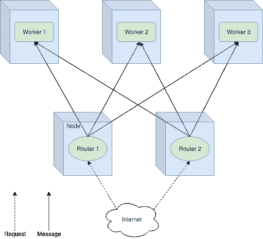
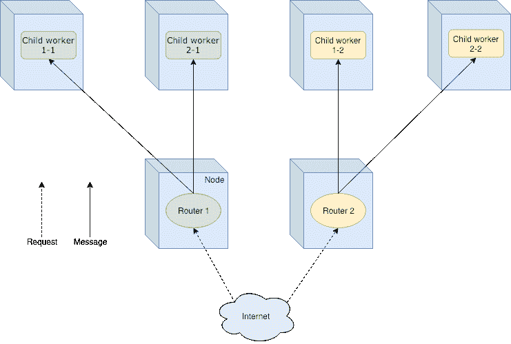
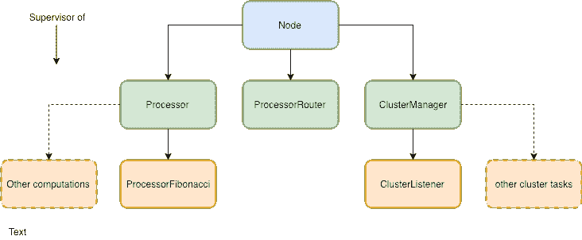

# 如何用 Akka 集群制作一个简单的应用程序

> 原文：<https://www.freecodecamp.org/news/how-to-make-a-simple-application-with-akka-cluster-506e20a725cf/>

如果你读过我之前关于 [Scalachain](https://github.com/elleFlorio/scalachain) 的故事，你可能会注意到它远不是一个分布式系统。它缺乏与其他节点正常工作的所有功能。另外，由单个节点组成的区块链是无用的。由于这个原因，我决定是时候解决这个问题了。

既然 Scalachain 是 Akka 供电的，为什么不趁机玩玩 Akka 集群呢？我创建了一个[简单项目](https://github.com/elleFlorio/akka-cluster-playground)来修补一下 [Akka 集群](https://doc.akka.io/docs/akka/2.5/index-cluster.html)，在这个故事中，我将分享我的经验。我们将创建一个包含三个节点的集群，使用[集群感知路由器](https://doc.akka.io/docs/akka/2.5/cluster-routing.html#weakly-up)来平衡它们之间的负载。一切都将在 Docker 容器中运行，我们将使用 docker-compose 来简化部署。

好了，我们走吧！？

#### Akka 集群快速介绍

Akka 集群为创建分布式应用程序提供了强大的支持。最佳用例是在分布式环境中，您有一个想要复制 N 次的节点。这意味着所有 N 个节点都是运行相同代码的对等节点。Akka 集群为您提供了现成的同一个集群中的成员发现。使用集群感知路由器，可以平衡不同节点中参与者之间的消息。也可以选择平衡策略，让负载平衡变得轻而易举！

实际上，您可以在两种类型的路由器之间进行选择:

**组路由器** —向其发送消息的参与者——称为被路由者——使用其参与者路径来指定。路由器共享在集群中创建的路由。在本例中，我们将使用一个组路由器。



Group Router

**池路由器** —路由器是由路由器创建和部署的，因此它们是参与者层次结构中的子节点。路由器之间不共享路由。这是主副本场景的理想选择，在这种场景中，每个路由器都是主路由器，而它的路由器是副本路由器。



Pool Router

这只是冰山一角，所以我邀请您阅读官方文档以获得更多见解。

#### 用于数学计算的群集

让我们描绘一个用例场景。假设设计一个系统根据请求执行数学计算。系统是在线部署的，因此它需要一个 REST API 来接收计算请求。内部处理器处理这些请求，执行计算并返回结果。

现在处理器只能计算斐波纳契数。我们决定使用一个节点集群来在节点之间分配负载并提高性能。Akka 集群将处理集群动态和节点之间的负载平衡。好，听起来不错！

#### 参与者层次结构

首先:我们需要定义我们的演员层次。系统可以分为三个功能部分:业务逻辑、**集群管理**和**节点**本身。还有一个**服务器**，但它不是一个参与者，我们将在后面讨论。

**业务逻辑**

应用程序应该做数学计算。我们可以定义一个简单的`Processor` actor 来管理所有的计算任务。我们支持的每一个计算都可以在一个特定的 actor 中实现，这将是一个【actor 的子 actor。这样，应用程序是模块化的，更容易扩展和维护。现在，`Processor`的独生子将成为`ProcessorFibonacci`演员。我想你能猜到它的任务是什么。这应该足够开始了。

**集群管理**

为了管理集群，我们需要一个`ClusterManager`。听起来很简单，对吧？这个角色处理与集群相关的所有事情，比如在被请求时返回它的成员。记录集群内部发生的事情会很有用，所以我们定义了一个`ClusterListener` actor。这是`ClusterManager`的子节点，订阅集群事件日志。

**节点**

演员是我们层级的根源。它是我们系统与 API 通信的入口点。`Processor`和`ClusterManager`是它的孩子，还有`ProcessorRouter`演员。这是系统的负载平衡器，在`Processor`之间分配负载。我们将把它配置为集群感知路由器，这样每个`ProcessorRouter`都可以向每个节点上的`Processor`发送消息。



Actor hierarchy

#### 执行元实现

是时候实施我们的演员了！首先，我们实现与系统业务逻辑相关的参与者。然后我们继续讨论集群管理的参与者，最后是根参与者(`Node`)。

**处理器 Fibonacci**

这个 actor 执行斐波那契数的计算。它接收一个包含要计算的数字和要回复的演员的引用的`Compute`消息。参考很重要，因为可能有不同的请求方。请记住，我们是在分布式环境中工作的！

一旦收到`Compute`消息，`fibonacci`函数计算结果。我们将它包装在一个`ProcessorResponse`对象中，以提供执行计算的节点的信息。这将有助于稍后查看循环策略的运行情况。

然后将结果发送给我们应该回复的演员。很简单。

```
object ProcessorFibonacci {
  sealed trait ProcessorFibonacciMessage
  case class Compute(n: Int, replyTo: ActorRef) extends ProcessorFibonacciMessage

  def props(nodeId: String) = Props(new ProcessorFibonacci(nodeId))

  def fibonacci(x: Int): BigInt = {
    @tailrec def fibHelper(x: Int, prev: BigInt = 0, next: BigInt = 1): BigInt = x match {
      case 0 => prev
      case 1 => next
      case _ => fibHelper(x - 1, next, next + prev)
    }
    fibHelper(x)
  }
}

class ProcessorFibonacci(nodeId: String) extends Actor {
  import ProcessorFibonacci._

  override def receive: Receive = {
    case Compute(value, replyTo) => {
      replyTo ! ProcessorResponse(nodeId, fibonacci(value))
    }
  }
}
```

**处理器**

参与者管理特定的子处理器，比如斐波那契处理器。它应该实例化子处理器并将请求转发给它们。现在我们只有一个子处理器，所以`Processor`接收一种消息:`ComputeFibonacci`。此消息包含要计算的斐波那契数。一旦接收到，要计算的数字连同`sender()`的引用一起被发送到`FibonacciProcessor`。

```
object Processor {

  sealed trait ProcessorMessage

  case class ComputeFibonacci(n: Int) extends ProcessorMessage

  def props(nodeId: String) = Props(new Processor(nodeId))
}

class Processor(nodeId: String) extends Actor {
  import Processor._

  val fibonacciProcessor: ActorRef = context.actorOf(ProcessorFibonacci.props(nodeId), "fibonacci")

  override def receive: Receive = {
    case ComputeFibonacci(value) => {
      val replyTo = sender()
      fibonacciProcessor ! Compute(value, replyTo)
    }
  }
}
```

**集群监听器**

我们希望记录关于集群中发生的事情的有用信息。如果需要的话，这可以帮助我们调试系统。这就是`ClusterListener`演员的目的。在启动之前，它向自己订阅集群的事件消息。参与者对类似于`MemberUp`、`UnreachableMember`或`MemberRemoved`的消息做出反应，记录相应的事件。当`ClusterListener`停止时，它会取消订阅集群事件。

```
object ClusterListener {
  def props(nodeId: String, cluster: Cluster) = Props(new ClusterListener(nodeId, cluster))
}

class ClusterListener(nodeId: String, cluster: Cluster) extends Actor with ActorLogging {

  override def preStart(): Unit = {
    cluster.subscribe(self, initialStateMode = InitialStateAsEvents,
      classOf[MemberEvent], classOf[UnreachableMember])
  }

  override def postStop(): Unit = cluster.unsubscribe(self)

  def receive = {
    case MemberUp(member) =>
      log.info("Node {} - Member is Up: {}", nodeId, member.address)
    case UnreachableMember(member) =>
      log.info(s"Node {} - Member detected as unreachable: {}", nodeId, member)
    case MemberRemoved(member, previousStatus) =>
      log.info(s"Node {} - Member is Removed: {} after {}",
        nodeId, member.address, previousStatus)
    case _: MemberEvent => // ignore
  }
}
```

**集群管理器**

负责管理集群的参与者是`ClusterManager`。它创建`ClusterListener`角色，并根据请求提供集群成员列表。它可以被扩展以增加更多的功能，但是现在这已经足够了。

```
object ClusterManager {

  sealed trait ClusterMessage
  case object GetMembers extends ClusterMessage

  def props(nodeId: String) = Props(new ClusterManager(nodeId))
}

class ClusterManager(nodeId: String) extends Actor with ActorLogging {

  val cluster: Cluster = Cluster(context.system)
  val listener: ActorRef = context.actorOf(ClusterListener.props(nodeId, cluster), "clusterListener")

  override def receive: Receive = {
    case GetMembers => {
      sender() ! cluster.state.members.filter(_.status == MemberStatus.up)
        .map(_.address.toString)
        .toList
    }
  }
}
```

**处理器路由器**

处理器之间的负载平衡由`ProcessorRouter`处理。它是由`Node` actor 创建的，但是这次所有需要的信息都在系统的配置中提供了。

```
class Node(nodeId: String) extends Actor {

  //...

  val processorRouter: ActorRef = context.actorOf(FromConfig.props(Props.empty), "processorRouter")

  //...
}
```

让我们分析一下`application.conf`文件中的相关部分。

```
akka {
  actor {
    ...
    deployment {
      /node/processorRouter {
        router = round-robin-group
        routees.paths = ["/user/node/processor"]
        cluster {
          enabled = on
          allow-local-routees = on
        }
      }
    }
  }
  ...
}
```

首先要指定到路由器 actor 的路径，也就是`/node/processorRouter`。在该属性中，我们可以配置路由器的行为:

*   `router`:这是消息负载均衡的策略。我选了`round-robin-group`，但是还有很多其他的。
*   `routees.paths`:这些是到参与者的路径，这些参与者将接收由路由器处理的消息。我们在说:*“当你收到一条消息，寻找这些路径对应的行动者。根据策略选择一个，并将消息转发给它。”*因为我们使用集群感知路由器，所以路由器可以在集群的任何节点上。
*   我们是在集群中运营吗？答案当然是`on`！
*   这里我们允许路由器在其节点中选择一个被路由者。

使用这种配置，我们可以创建一个路由器来平衡处理器之间的工作负载。

**节点**

我们的演员层级的根是`Node`。它创建子参与者— `ClusterManager`、`Processor`和`ProcessorRouter` —并将消息转发给正确的参与者。这里没什么复杂的。

```
object Node {

  sealed trait NodeMessage

  case class GetFibonacci(n: Int)

  case object GetClusterMembers

  def props(nodeId: String) = Props(new Node(nodeId))
}

class Node(nodeId: String) extends Actor {

  val processor: ActorRef = context.actorOf(Processor.props(nodeId), "processor")
  val processorRouter: ActorRef = context.actorOf(FromConfig.props(Props.empty), "processorRouter")
  val clusterManager: ActorRef = context.actorOf(ClusterManager.props(nodeId), "clusterManager")

  override def receive: Receive = {
    case GetClusterMembers => clusterManager forward GetMembers
    case GetFibonacci(value) => processorRouter forward ComputeFibonacci(value)
  }
}
```

#### 服务器和 API

我们集群的每个节点都运行一个能够接收请求的服务器。`Server`创建我们的 actor 系统，并通过`application.conf`文件进行配置。

```
object Server extends App with NodeRoutes {

  implicit val system: ActorSystem = ActorSystem("cluster-playground")
  implicit val materializer: ActorMaterializer = ActorMaterializer()

  val config: Config = ConfigFactory.load()
  val address = config.getString("http.ip")
  val port = config.getInt("http.port")
  val nodeId = config.getString("clustering.ip")

  val node: ActorRef = system.actorOf(Node.props(nodeId), "node")

  lazy val routes: Route = healthRoute ~ statusRoutes ~ processRoutes

  Http().bindAndHandle(routes, address, port)
  println(s"Node $nodeId is listening at http://$address:$port")

  Await.result(system.whenTerminated, Duration.Inf)

}
```

[Akka HTTP](https://doc.akka.io/docs/akka-http/current/index.html) 驱动服务器本身和 REST API，公开三个简单的端点。这些端点在`NodeRoutes`特征中定义。

第一个是`/health`，检查一个节点的健康状况。如果节点启动并运行，它会用一个`200 OK`来响应

```
lazy val healthRoute: Route = pathPrefix("health") {
    concat(
      pathEnd {
        concat(
          get {
            complete(StatusCodes.OK)
          }
        )
      }
    )
  }
```

`/status/members`端点使用集群的当前活动成员进行响应。

```
lazy val statusRoutes: Route = pathPrefix("status") {
    concat(
      pathPrefix("members") {
        concat(
          pathEnd {
            concat(
              get {
                val membersFuture: Future[List[String]] = (node ? GetClusterMembers).mapTo[List[String]]
                onSuccess(membersFuture) { members =>
                  complete(StatusCodes.OK, members)
                }
              }
            )
          }
        )
      }
    )
  }
```

最后一个(但不是最不重要的)是`/process/fibonacci/n`端点，用于请求`n`的斐波那契数。

```
lazy val processRoutes: Route = pathPrefix("process") {
    concat(
      pathPrefix("fibonacci") {
        concat(
          path(IntNumber) { n =>
            pathEnd {
              concat(
                get {
                  val processFuture: Future[ProcessorResponse] = (node ? GetFibonacci(n)).mapTo[ProcessorResponse]
                  onSuccess(processFuture) { response =>
                    complete(StatusCodes.OK, response)
                  }
                }
              )
            }
          }
        )
      }
    )
  }
```

它用一个包含结果的`ProcessorResponse`以及发生计算的节点的 id 来响应。

#### 集群配置

一旦我们有了所有的参与者，我们需要配置系统作为一个集群运行！文件是魔法发生的地方。为了更好地展示，我将把它分成几部分，但是你可以在这里找到完整的文件[。](https://github.com/elleFlorio/akka-cluster-playground/blob/master/src/main/resources/application.conf)

让我们开始定义一些有用的变量。

```
clustering {
  ip = "127.0.0.1"
  ip = ${?CLUSTER_IP}

  port = 2552
  port = ${?CLUSTER_PORT}

  seed-ip = "127.0.0.1"
  seed-ip = ${?CLUSTER_SEED_IP}

  seed-port = 2552
  seed-port = ${?CLUSTER_SEED_PORT}

  cluster.name = "cluster-playground"
}
```

这里我们简单地定义了节点和种子的 ip 和端口，以及集群名称。我们设置一个默认值，如果指定了新值，我们就覆盖它。集群的配置如下。

```
akka {
  actor {
    provider = "cluster"
    ...
    /* router configuration */
    ...
  }
  remote {
    log-remote-lifecycle-events = on
    netty.tcp {
      hostname = ${clustering.ip}
      port = ${clustering.port}
    }
  }
  cluster {
    seed-nodes = [
      "akka.tcp://"${clustering.cluster.name}"@"${clustering.seed-ip}":"${clustering.seed-port}
    ]
    auto-down-unreachable-after = 10s
  }
}
...
/* server vars */
...
/* cluster vars */
}
```

Akka 集群是建立在 Akka Remoting 之上的，所以我们需要正确地配置它。首先，我们指定我们要用 Akka 集群说`provider = "cluster"`。然后我们将`cluster.ip`和`cluster.port`绑定到`netty` web 框架的`hostname`和`port`。

群集需要一些种子节点作为其入口点。我们将它们设置在`seed-nodes`数组中，格式为`akka.tcp://"{clustering.cluster.name}"@"{clustering.seed-ip}":”${clustering.seed-port}”`。现在我们有一个种子节点，但我们以后可能会添加更多。

在一段时间内无法访问某个成员后,`auto-down-unreachable-after`属性将该成员设置为 down。正如官方文件中所解释的那样，这只能在开发期间使用。

好了，群集配置完毕，我们可以进入下一步了:对接和部署！

#### 对接和部署

为了创建节点的 Docker 容器，我们可以使用 [sbt-native-packager](https://www.scala-sbt.org/sbt-native-packager) 。它的安装很简单:将`addSbtPlugin("com.typesafe.sbt" % "sbt-native-packager" % "1.3.15")`添加到`project/`文件夹中的`plugin.sbt`文件中。这个神奇的工具有一个创建 Docker 容器的插件。它允许我们在`build.sbt`文件中配置 Dockerfile 的属性。

```
// other build.sbt properties

enablePlugins(JavaAppPackaging)
enablePlugins(DockerPlugin)
enablePlugins(AshScriptPlugin)

mainClass in Compile := Some("com.elleflorio.cluster.playground.Server")
dockerBaseImage := "java:8-jre-alpine"
version in Docker := "latest"
dockerExposedPorts := Seq(8000)
dockerRepository := Some("elleflorio")
```

一旦我们设置了插件，我们就可以运行命令`sbt docker:publishLocal`来创建 docker 映像。运行命令，品尝神奇…？

我们有了节点的 Docker 映像，现在我们需要部署它并检查一切是否正常。最简单的方法是创建一个`docker-compose`文件，该文件将生成一个种子和几个其他节点。

```
version: '3.5'

networks:
  cluster-network:

services:
  seed:
    networks:
      - cluster-network
    image: elleflorio/akka-cluster-playground
    ports:
      - '2552:2552'
      - '8000:8000'
    environment:
      SERVER_IP: 0.0.0.0
      CLUSTER_IP: seed
      CLUSTER_SEED_IP: seed

  node1:
    networks:
      - cluster-network
    image: elleflorio/akka-cluster-playground
    ports:
      - '8001:8000'
    environment:
      SERVER_IP: 0.0.0.0
      CLUSTER_IP: node1
      CLUSTER_PORT: 1600
      CLUSTER_SEED_IP: seed
      CLUSTER_SEED_PORT: 2552

  node2:
    networks:
      - cluster-network
    image: elleflorio/akka-cluster-playground
    ports:
      - '8002:8000'
    environment:
      SERVER_IP: 0.0.0.0
      CLUSTER_IP: node2
      CLUSTER_PORT: 1600
      CLUSTER_SEED_IP: seed
      CLUSTER_SEED_PORT: 2552
```

我不会花时间去浏览它，因为它很简单。

#### 让我们运行它！

是时候测试我们的工作了！一旦我们运行了`docker-compose up`命令，我们将有一个由三个节点组成的集群启动并运行。`seed`将在`:8000`端口响应请求，而`node1`和`node2`在`:8001`和`:8002`端口响应请求。用不同的端点玩一会儿。您将看到，按照循环策略，每次对斐波那契数的请求将由不同的节点计算。那很好，我们为自己的工作感到骄傲，可以出去喝杯啤酒庆祝一下！？

#### 结论

我们到此为止。在这十分钟里，我们学到了很多东西:

*   Akka 集群是什么，能为我们做什么。
*   如何用它创建一个分布式应用程序。
*   如何为集群中的负载平衡配置组路由器。
*   如何使用 docker-compose 对所有内容进行 docker 化和部署。

你可以在我的 [GitHub repo](https://github.com/elleFlorio/akka-cluster-playground) 中找到完整的应用。您可以随意贡献或使用它！？

再见！？