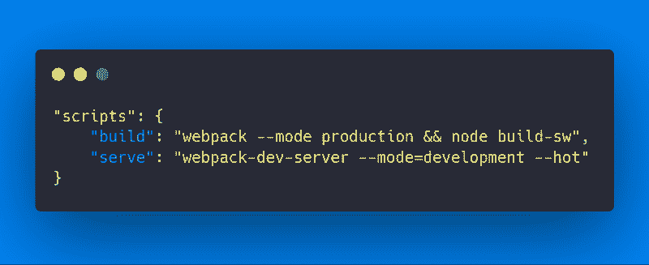
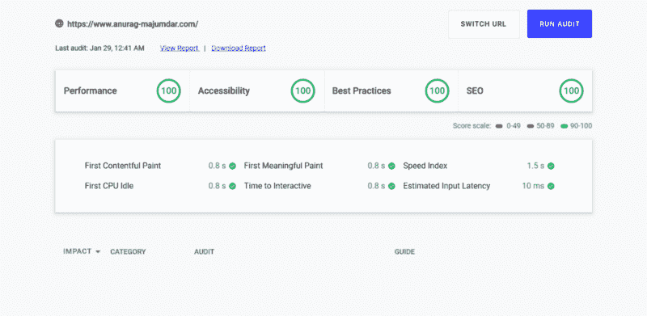

# 如何用 Webpack 和渐进式 web 技术编写简单的现代 JavaScript 应用程序

> 原文：<https://www.freecodecamp.org/news/how-to-write-simple-modern-javascript-apps-with-webpack-and-progressive-web-techniques-a30354eab214/>

作者:Anurag Majumdar

# 如何用 Webpack 和渐进式 web 技术编写简单的现代 JavaScript 应用程序


你有没有想过在你的下一个项目中用最简单的设置制作现代 JavaScript 应用程序？

如果是这样，那你来对地方了！

JavaScript 框架的存在是为了帮助我们以一种通用的方式构建具有大多数通用特性的应用程序。但是大多数应用程序可能不需要框架的所有强大功能。仅仅使用一个框架来满足特定的需求(尤其是中小规模的项目)可能有些矫枉过正。

今天，我将向您展示一种方法，让您可以使用现代功能并构建自己的定制 Web 应用程序。如果您愿意，也可以在示例应用程序的基础上构建自己的框架。这完全是可有可无的。普通 JavaScript 的强大功能使我们能够遵循自己的编码风格，而不管使用什么工具。

### 我们需要什么

在开始之前，让我们快速浏览一下我们需要的特性。

#### 建筑规划

为了确保快速加载和一致的体验，我们将使用以下模式:

*   应用程序外壳架构
*   PRPL ( **P** ush， **R** ender， **P** re-cache， **L** azy loading)模式

#### 构建设置

我们需要一个良好的定制构建设置，因此我们将使用 Webpack，并满足以下要求:

*   ES6 和动态导入支持
*   SASS 和 CSS 支持
*   定制开发和生产设置
*   客户服务人员构建

#### 最低限度的 JavaScript 特性

我们将触及最少的 JavaScript 特性，以使我们离开地面并产生我们需要的输出。我将向您展示我们如何在日常应用程序中使用现有的 JavaScript ES6 特性。他们在这里:

*   ES6 模块
*   动态导入
*   对象文字语法或 ES6 类语法
*   ES6 箭头功能
*   ES6 模板文字

在本文的最后，GitHub 上有一个示例应用程序演示及其源代码。我们再深入调查一下，好吗？？

### 建筑规划

**渐进式网络应用**的出现有助于带来新的架构，以使我们的第一幅画更有效。结合**应用外壳**和 **PRPL** 模式可以产生一致的响应和类似应用的体验。

#### 什么是 App Shell & PRPL？

**App Shell** 是一种用于构建**渐进式 Web 应用**的架构模式，在这种模式下，你运送最少的**关键资源** 来加载你的站点。这基本上包括了第一次油漆的所有必要资源。您也可以使用服务工作者来缓存关键资源。

**PRPL** 指以下:

*   为初始路由推送关键资源(尤其是使用 HTTP/2)。
*   在最初的路线下。
*   **P** 重新缓存剩余的路线或资产。
*   当需要时(特别是当用户需要时)，加载应用程序的一部分。

#### 这些架构在代码中是什么样子的？

将**应用外壳**和 **PRPL** 模式一起使用来实现最佳实践。

应用程序外壳看起来有点像下面这段代码:

```
<!DOCTYPE html>
<html lang="en">

<head>
    <meta charset="utf-8" />
    <meta name="viewport" content="width=device-width, initial-scale=1.0" />
    <meta http-equiv="X-UA-Compatible" content="ie=edge" />
    <!-- Critical Styles -->
    <style>
        html {
            box-sizing: border-box;
        }

        *,
        *:after,
        *:before {
            box-sizing: inherit;
        }

        body {
            margin: 0;
            padding: 0;
            font: 18px 'Oxygen', Helvetica;
            background: #ececec;
        }

        header {
            height: 60px;
            background: #512DA8;
            color: #fff;
            display: flex;
            align-items: center;
            padding: 0 40px;
            box-shadow: 1px 2px 6px 0px #777;
        }

        h1 {
            margin: 0;
        }

        .banner {
            text-decoration: none;
            color: #fff;
            cursor: pointer;
        }

        main {
            display: flex;
            justify-content: center;
            height: calc(100vh - 140px);
            padding: 20px 40px;
            overflow-y: auto;
        }

        button {
            background: #512DA8;
            border: 2px solid #512DA8;
            cursor: pointer;
            box-shadow: 1px 1px 3px 0px #777;
            color: #fff;
            padding: 10px 15px;
            border-radius: 20px;
        }

        .button {
            display: flex;
            justify-content: center;
        }

        button:hover {
            box-shadow: none;
        }

        footer {
            height: 40px;
            background: #2d3850;
            color: #fff;
            display: flex;
            align-items: center;
            padding: 40px;
        }
    </style>
    <title>Vanilla Todos PWA</title>
</head>

<body>

    <body>
        <!-- Main Application Section -->
        <header>
            <h3><a class="banner"> Vanilla Todos PWA </a></h3>
        </header>
        <main id="app"></main>
        <footer>
            <span>&copy; 2019 Anurag Majumdar - Vanilla Todos SPA</span>
        </footer>

        <!-- Critical Scripts -->
        <script async src="<%= htmlWebpackPlugin.files.chunks.main.entry %>"></script>

        <noscript>
            This site uses JavaScript. Please enable JavaScript in your browser.
        </noscript>
    </body>
</body>

</html>
```

App Shell (index.html)

您可以看到应用程序外壳由最基本的标记作为框架组成。

第 9–82 行:标记中引入了关键样式，以确保直接解析 CSS，而不是将其链接到另一个文件。

**第 89–96 行**:主应用程序外壳标记；这些区域稍后将由 JavaScript 操作(尤其是第 93 行的 main 标记内的内容)。

第 99 行:这是脚本发挥作用的地方。**异步**属性有助于在下载脚本时不阻塞解析器。

app shell 还强制执行 **PR** PL 模式的**推送** & **渲染**阶段。当浏览器解析 HTML 以在屏幕上形成像素时，就会发生这种情况。它很容易找到所有的关键资源。另外，**关键脚本**负责通过 DOM 操作(**渲染**)显示**初始路线**。

但是，如果我们不使用服务工作者来缓存 shell，它对将来的重新加载和性能优势没有任何用处。

下面的代码片段显示了一个服务工作者，它缓存应用程序所需的 shell 和所有静态资产。

```
var staticAssetsCacheName = 'todo-assets-v3';
var dynamicCacheName = 'todo-dynamic-v3';

self.addEventListener('install', function (event) {
    self.skipWaiting();
    event.waitUntil(
      caches.open(staticAssetsCacheName).then(function (cache) {
        cache.addAll([
            '/',
            "chunks/todo.d41d8cd98f00b204e980.js","index.html","main.d41d8cd98f00b204e980.js"
        ]
        );
      }).catch((error) => {
        console.log('Error caching static assets:', error);
      })
    );
  });

  self.addEventListener('activate', function (event) {
    if (self.clients && clients.claim) {
      clients.claim();
    }
    event.waitUntil(
      caches.keys().then(function (cacheNames) {
        return Promise.all(
          cacheNames.filter(function (cacheName) {
            return (cacheName.startsWith('todo-')) && cacheName !== staticAssetsCacheName;
          })
          .map(function (cacheName) {
            return caches.delete(cacheName);
          })
        ).catch((error) => {
            console.log('Some error occurred while removing existing cache:', error);
        });
      }).catch((error) => {
        console.log('Some error occurred while removing existing cache:', error);
    }));
  });

  self.addEventListener('fetch', (event) => {
    event.respondWith(
      caches.match(event.request).then((response) => {
        return response || fetch(event.request)
          .then((fetchResponse) => {
              return cacheDynamicRequestData(dynamicCacheName, event.request.url, fetchResponse.clone());
          }).catch((error) => {
            console.log(error);
          });
      }).catch((error) => {
        console.log(error);
      })
    );
  });

  function cacheDynamicRequestData(dynamicCacheName, url, fetchResponse) {
    return caches.open(dynamicCacheName)
      .then((cache) => {
        cache.put(url, fetchResponse.clone());
        return fetchResponse;
      }).catch((error) => {
        console.log(error);
      });
  }
```

Service Worker

**第 4–17 行**:服务工作者的 install 事件帮助缓存所有的静态资产。在这里，你可以缓存应用外壳资源(CSS，JavaScript，图片等。)用于第一条路线(根据应用程序外壳)。此外，您可以缓存应用程序的剩余资产，确保整个应用程序也可以离线运行。这种与主应用程序外壳分离的静态资产缓存确保了 PR **P** L 模式的**预缓存**阶段。

**第 19–38 行:**激活事件是清理未使用的缓存的地方。

**第 40–63 行**:这些代码行有助于从缓存中获取资源，如果它们在缓存中或进入网络。此外，如果进行网络调用，则资源不在缓存中，而是放入一个新的单独的缓存中。这个场景有助于缓存应用程序的所有动态数据。

总而言之，架构的大部分部分都已经涵盖了。唯一剩下的部分就是 PRP **L** 模式的**懒装**阶段。我将从 JavaScript 的角度来讨论这个问题。

### 我们的构建设置

没有构建设置，什么是好的架构结构？拯救网络背包。还有其他工具，如包裹，汇总等。但是我们应用于 Webpack 的任何概念都可以应用于任何这样的工具。

我将把这些概念映射到插件上，这样你就可以掌握工作流设置的基础知识。这是为您自己的应用程序开始一个良好的可重用构建配置的最重要的一步。

我知道对于像我们这样的开发人员来说，从头开始配置 Webpack 或任何工具是多么困难。下面这篇文章给了我灵感，帮助我创建了自己的构建设置:

Webpack 4 的故事以及如何最终以正确的方式配置它。已更新。

如果您在构建设置中遇到任何问题，请参考上面的链接。现在让我们看看构建所需的概念。

#### ES6 和动态导入支持

Babel 是一个流行的移植程序，它帮助我们将 ES6 的特性移植到 ES5。我们将需要以下软件包来使巴贝尔与 webpack 一起工作:

*   @babel/core
*   @ babel/plugin-语法-动态-导入
*   @babel/preset-env
*   巴别塔核心
*   巴别塔装载机
*   巴别预设环境

这里有一个样本 babelrc 供参考:

```
{
    "presets": ["@babel/preset-env"],
    "plugins": ["@babel/plugin-syntax-dynamic-import"]
}
```

Sample babelrc file for use with Webpack

在 babel 设置过程中，我们需要在预置中加入下面的**第二行**以使 babel 能够将 ES6 向下传输到 ES5，并在中加入**第三行**插件以启用 Webpack 的动态导入支持。

下面是 babel 如何与 Webpack 一起使用:

```
module.exports = {
    entry: {
        // Mention Entry File
    },
    output: {
        // Mention Output Filenames
    },
    module: {
        rules: [
            {
                test: /\.js$/,
                exclude: /node_modules/,
                use: {
                    loader: 'babel-loader'
                }
            }
        ]
    },
    plugins: [
        // Plugins
    ]
};
```

Webpack config for babel setup

**第 10–17 行**:babel loader 用于在 webpack.config.js 中设置 babel transpilation 流程。为简单起见，配置的其他部分已被删除或注释掉。

#### SASS 和 CSS 支持

要设置 SASS 和 CSS，您需要以下软件包:

*   sass-loader
*   css 加载程序
*   样式加载器
*   MiniCssExtractPlugin

下面是配置的样子:

```
module.exports = {
    entry: {
        // Mention Entry File
    },
    output: {
        // Mention Output Filenames
    },
    module: {
        rules: [
            {
                test: /\.js$/,
                exclude: /node_modules/,
                use: {
                    loader: 'babel-loader'
                }
            },
            {
                test: /\.scss$/,
                use: [
                    'style-loader',
                    MiniCssExtractPlugin.loader,
                    'css-loader',
                    'sass-loader'
                ]
            }
        ]
    },
    plugins: [
        new MiniCssExtractPlugin({
            filename: '[name].css'
        }),
    ]
};
```

Webpack config for SASS & CSS support

**第 17–25 行**:这是装载机注册的区域。

**第 29–31 行**:因为我们使用插件来提取 CSS 文件，所以我们在这里使用了**minicsextractplugin**。

#### 定制开发和生产设置

这是构建过程中最重要的部分。我们都知道，我们需要一个开发和生产构建设置来开发应用程序，并部署最终的 web 可发布版本。

以下是将要使用的软件包:

*   **clean-webpack-plugin** :用于清理 dist 文件夹内容。
*   **compression-web pack-plugin**:用于压缩 dist 文件夹文件内容。
*   **copy-webpack-plugin** :用于将静态资产、文件或资源从应用程序源复制到 dist 文件夹。
*   **html-webpack-plugin** :用于在 dist 文件夹中创建 index.html 文件。
*   **webpack-md5-hash** :用于散列 dist 文件夹中的应用源文件。
*   **webpack-dev-server** :用于运行本地开发服务器。

以下是最终的 Webpack 配置文件:

```
const path = require('path');
const MiniCssExtractPlugin = require('mini-css-extract-plugin');
const HtmlWebpackPlugin = require('html-webpack-plugin');
const WebpackMd5Hash = require('webpack-md5-hash');
const CleanWebpackPlugin = require('clean-webpack-plugin');
const CopyWebpackPlugin = require('copy-webpack-plugin');
const CompressionPlugin = require('compression-webpack-plugin');

module.exports = (env, argv) => ({
    entry: {
        main: './src/main.js'
    },
    devtool: argv.mode === 'production' ? false : 'source-map',
    output: {
        path: path.resolve(__dirname, 'dist'),
        chunkFilename:
            argv.mode === 'production'
                ? 'chunks/[name].[chunkhash].js'
                : 'chunks/[name].js',
        filename:
            argv.mode === 'production' ? '[name].[chunkhash].js' : '[name].js'
    },
    module: {
        rules: [
            {
                test: /\.js$/,
                exclude: /node_modules/,
                use: {
                    loader: 'babel-loader'
                }
            },
            {
                test: /\.scss$/,
                use: [
                    'style-loader',
                    MiniCssExtractPlugin.loader,
                    'css-loader',
                    'sass-loader'
                ]
            }
        ]
    },
    plugins: [
        new CleanWebpackPlugin('dist', {}),
        new MiniCssExtractPlugin({
            filename:
                argv.mode === 'production'
                    ? '[name].[contenthash].css'
                    : '[name].css'
        }),
        new HtmlWebpackPlugin({
            inject: false,
            hash: true,
            template: './index.html',
            filename: 'index.html'
        }),
        new WebpackMd5Hash(),
        new CopyWebpackPlugin([
            // {
            //     from: './src/assets',
            //     to: './assets'
            // },
            // {
            //     from: 'manifest.json',
            //     to: 'manifest.json'
            // }
        ]),
        new CompressionPlugin({
            algorithm: 'gzip'
        })
    ],
    devServer: {
        contentBase: 'dist',
        watchContentBase: true,
        port: 1000
    }
});
```

Final Webpack Config

**第 9–77 行:**整个 webpack 配置是一个带有两个参数的函数。这里我使用了 **argv** ，即在运行 webpack 或 webpack-dev-server 命令时发送的参数。

下图显示了 package.json 中的脚本部分。



npm scripts in package.json

因此，如果我们运行 **npm run build** 它将触发生产构建，如果我们运行 **npm run serve** 它将触发本地开发服务器的开发流程。

**第 44–77 行**:这些行显示插件和开发服务器配置需要如何设置。

**第 59–66 行**:这些行是需要从应用程序源复制的任何资源或静态资产。

#### 客户服务人员构建

因为我们都知道为缓存而再次写入所有文件的名称是多么乏味，所以我创建了一个定制的服务工作者构建脚本，用于捕获 **dist** 文件夹中的文件，然后将它们作为缓存内容添加到服务工作者模板中。最后，服务人员文件将被写入**区**文件夹。

我们谈到的关于服务工作者文件的概念是相同的。下面是实际运行的脚本:

```
const glob = require('glob');
const fs = require('fs');

const dest = 'dist/sw.js';
const staticAssetsCacheName = 'todo-assets-v1';
const dynamicCacheName = 'todo-dynamic-v1';

let staticAssetsCacheFiles = glob
    .sync('dist/**/*')
    .map((path) => {
        return path.slice(5);
    })
    .filter((file) => {
        if (/\.gz$/.test(file)) return false;
        if (/sw\.js$/.test(file)) return false;
        if (!/\.+/.test(file)) return false;
        return true;
    });

const stringFileCachesArray = JSON.stringify(staticAssetsCacheFiles);

const serviceWorkerScript = `var staticAssetsCacheName = '${staticAssetsCacheName}';
var dynamicCacheName = '${dynamicCacheName}';
self.addEventListener('install', function (event) {
    self.skipWaiting();
    event.waitUntil(
      caches.open(staticAssetsCacheName).then(function (cache) {
        cache.addAll([
            '/',
            ${stringFileCachesArray.slice(1, stringFileCachesArray.length - 1)}
        ]
        );
      }).catch((error) => {
        console.log('Error caching static assets:', error);
      })
    );
  });
  self.addEventListener('activate', function (event) {
    if (self.clients && clients.claim) {
      clients.claim();
    }
    event.waitUntil(
      caches.keys().then(function (cacheNames) {
        return Promise.all(
          cacheNames.filter(function (cacheName) {
            return (cacheName.startsWith('todo-')) && cacheName !== staticAssetsCacheName;
          })
          .map(function (cacheName) {
            return caches.delete(cacheName);
          })
        ).catch((error) => {
            console.log('Some error occurred while removing existing cache:', error);
        });
      }).catch((error) => {
        console.log('Some error occurred while removing existing cache:', error);
    }));
  });
  self.addEventListener('fetch', (event) => {
    event.respondWith(
      caches.match(event.request).then((response) => {
        return response || fetch(event.request)
          .then((fetchResponse) => {
              return cacheDynamicRequestData(dynamicCacheName, event.request.url, fetchResponse.clone());
          }).catch((error) => {
            console.log(error);
          });
      }).catch((error) => {
        console.log(error);
      })
    );
  });
  function cacheDynamicRequestData(dynamicCacheName, url, fetchResponse) {
    return caches.open(dynamicCacheName)
      .then((cache) => {
        cache.put(url, fetchResponse.clone());
        return fetchResponse;
      }).catch((error) => {
        console.log(error);
      });
  }
`;

fs.writeFile(dest, serviceWorkerScript, function(error) {
    if (error) return;
    console.log('Service Worker Write success');
});
```

Custom Service Worker build setup

**第 8–18 行**:这是 dist 文件夹的所有内容被捕获为一个数组 **staticAssetsCacheFiles 的地方。**

**第 22–85 行**:这是我们之前谈到的服务工作者模板。概念是完全相同的，只是我们在模板中引入了变量，这样我们就可以重用服务工作者模板，方便将来使用。这个模板也是必需的，因为我们需要根据**第 33 行**将 **dist** 文件夹的内容添加到缓存中。

**第 87–90 行**:最后，一个新的服务工作者文件将连同其来自服务工作者模板 **serviceWorkerScript** 的内容一起被写入 **dist** 文件夹。

运行上述脚本的命令是 **node build-sw** ，它应该在 **webpack - mode 生产**完成后运行。

这个服务人员构建脚本在轻松缓存文件方面确实帮了我很多。由于其简单性和解决缓存问题的极大便利性，我目前正在将它用于我自己的兼职项目。

如果你们想使用一个与渐进式 Web 应用程序相关的特性库，可以使用[工具箱](https://developers.google.com/web/tools/workbox/)。这个库做了一些非常好的东西，并且有一些你可以控制的惊人的特性。

#### 最后看一下包装

下面是一个包含所有依赖项的 package.json 文件示例:

```
{
  "name": "vanilla-todos-pwa",
  "version": "1.0.0",
  "description": "A simple todo application using ES6 and Webpack",
  "main": "src/main.js",
  "scripts": {
    "build": "webpack --mode production && node build-sw",
    "serve": "webpack-dev-server --mode=development --hot"
  },
  "keywords": [],
  "author": "Anurag Majumdar",
  "license": "MIT",
  "devDependencies": {
    "@babel/core": "^7.2.2",
    "@babel/plugin-syntax-dynamic-import": "^7.2.0",
    "@babel/preset-env": "^7.2.3",
    "autoprefixer": "^9.4.5",
    "babel-core": "^6.26.3",
    "babel-loader": "^8.0.4",
    "babel-preset-env": "^1.7.0",
    "clean-webpack-plugin": "^1.0.0",
    "compression-webpack-plugin": "^2.0.0",
    "copy-webpack-plugin": "^4.6.0",
    "css-loader": "^2.1.0",
    "html-webpack-plugin": "^3.2.0",
    "mini-css-extract-plugin": "^0.5.0",
    "node-sass": "^4.11.0",
    "sass-loader": "^7.1.0",
    "style-loader": "^0.23.1",
    "terser": "^3.14.1",
    "webpack": "^4.28.4",
    "webpack-cli": "^3.2.1",
    "webpack-dev-server": "^3.1.14",
    "webpack-md5-hash": "0.0.6"
  }
}
```

Sample package.json for the custom build setup

请记住，Webpack 会经常更新，社区中会不断发生变化，新插件会取代现有插件。因此，记住构建设置所需的概念而不是实际使用的包是很重要的。

### JavaScript 特性

我们都有一个选择:要么为我们的应用程序要使用的某些特性编写我们自己的框架，比如变化检测、路由、存储模式、redux 等，要么为这些特性提取已经存在的包。

现在，我将讨论构建应用程序的布局并使其运行所需的最基本的特性。稍后，您可以将自己的框架或包添加到应用程序中。

#### ES6 模块

我们将使用 ES6 导入和导出语句，并将每个文件视为一个 ES6 模块。这个特性通常被 Angular 和 React 等流行框架使用，非常方便。借助我们的 Webpack config，我们可以充分利用导入和导出语句的能力。

```
import { appTemplate } from './app.template';
import { AppModel } from './app.model';

export const AppComponent = {
  // App Component code here...
};
```

import & export statements in action

#### 对象文字语法或 ES6 类语法

构建组件是我们应用程序中非常重要的一部分。我们也可以选择使用最新的 web 标准，比如 Web 组件，但是为了简单起见，我们可以继续使用 object literal 语法或 ES6 class 语法。

类语法的唯一问题是我们需要实例化它，然后导出它。所以为了使事情更简单，我继续使用组件架构的对象字面语法。

```
import { appTemplate } from './app.template';
import { AppModel } from './app.model';

export const AppComponent = {

    init() {
        this.appElement = document.querySelector('#app');
        this.initEvents();
        this.render();
    },

    initEvents() {
        this.appElement.addEventListener('click', event => {
            if (event.target.className === 'btn-todo') {
                import( /* webpackChunkName: "todo" */ './todo/todo.module')
                    .then(lazyModule => {
                        lazyModule.TodoModule.init();
                    })
                    .catch(error => 'An error occurred while loading Module');
            }
        });

        document.querySelector('.banner').addEventListener('click', event => {
            event.preventDefault();
            this.render();
        });
    },

    render() {
        this.appElement.innerHTML = appTemplate(AppModel);
    }
};
```

**第 4–32 行:**我们导出了一个名为 **AppComponent** 的对象，它可以立即在应用程序的其他部分使用。

您也可以继续使用 ES6 类语法或标准 Web 组件，并在这里实现更具声明性的代码编写方式。为了简单起见，我选择用一种更强制性的方法来编写演示应用程序。

#### 动态导入

还记得我说过错过了 **PRPL** 模式的“L”吗？动态导入是向前推进并延迟加载我们的组件或模块的方法。因为我们一起使用了**应用外壳**和 **PRPL** 来缓存外壳和其他路由资产，所以动态导入从缓存而不是网络导入惰性组件或模块。

注意，如果我们只使用**应用外壳**架构，应用的剩余资产，即**块**文件夹的内容，将不会被缓存。

**第 15–19 行:**指 App 组件代码；这是动态导入大放异彩的地方。如果我们点击一个具有类 **btn-todo，**的按钮，那么只有这个 **TodoModule** 被加载。顺便说一下， **TodoModule** 只是另一个由一组对象组件组成的 JavaScript 文件。

#### ES6 箭头函数和 ES6 模板文字

特别是当我们想要确保函数中的关键字 **this** 时，应该使用箭头函数，它应该引用声明箭头函数的周围上下文。除此之外，这些函数确实有助于创建简洁的速记语法。

```
export const appTemplate = model => `
    <section class="app">
        <h3> ${model.title} </h3>
        <section class="button">
            <button class="btn-todo"> Todo Module </button>
        </section>
    </section>
`;
```

上面的例子是一个被定义为 arrow 函数的模板函数，它接受一个模型并返回一个包含模型数据的 HTML 字符串。字符串插值是在 **ES6 模板文字**的帮助下进行的。模板文字的真正好处是**多行字符串**和**将模型数据插值**到字符串中。

这里有一个处理组件模板和生成可重用组件的小技巧:使用 **reduce** 函数来累积所有 HTML 字符串，如下例所示:

```
const WorkModel = [
    {
        id: 1,
        src: '',
        alt: '',
        designation: '',
        period: '',
        description: ''
    },
    {
        id: 2,
        src: '',
        alt: '',
        designation: '',
        period: '',
        description: ''
    },
    //...
];

const workCardTemplate = (cardModel) => `
<section id="${cardModel.id}" class="work-card">
    <section class="work__image">
        
    </section>
    <section class="work__designation">${cardModel.designation}</section>
    <section class="work__period">${cardModel.period}</section>
    <section class="work__content">
        <section class="work__content-text">
            ${cardModel.description}
        </section>
    </section>
</section>
`;

export const workTemplate = (model) => `
<section class="work__section">
    <section class="work-text">
        <header class="header-text">
            <span class="work-text__header"> Work </span>
        </header>
        <section class="work-text__content content-text">
            <p class="work-text__content-para">
                This area signifies work experience
            </p>
        </section>
    </section>
    <section class="work-cards">
        ${model.reduce((html, card) => html + workCardTemplate(card), '')}
    </section>
</section>
`;
```

A sample for generating work cards in work template

上面这段代码确实做了大量的工作。简单而直观。它确实遵循了一些来自框架的灵感。

**第 1–19 行**:这是一个示例模型数组，reduce 函数可以在其上运行，以提供可重用的模板特性。

第 53 行:这一行完成了将多个可重用组件生成为一个 HTML 字符串的所有魔术。reduce 函数将累加器作为第一个参数，将数组的每个值作为第二个参数。

由于这些简单的特性，我们已经有了一个应用程序结构。他们说，学习一个特性的最好方法是把它付诸实践，所以我们来了。？

### 应用程序演示

祝贺你来到这里！

这篇文章确实涵盖了很多特性，掌握所有的概念和技术需要一些时间。

这是一个待办事项应用程序的演示，它包含了本文中讨论的所有特性。[点击此处](https://vanilla-todos-pwa.firebaseapp.com/)访问网站。


Vanilla Todos Demo

[点击此处](https://github.com/anurag-majumdar/vanilla-todos-pwa)获取 GitHub 资源库的链接。为了更好地理解本文中提到的概念性示例，您可以随意克隆存储库并浏览代码。

### 样品生产应用程序

生产站点是一个投资组合，使用本文中指定的确切功能从头开始设计、开发和工程。**单页应用**被分解成定制**模块**和**组件**。

普通 JavaScript 的灵活性和强大功能是独一无二的，确实有助于产生一些惊人的结果。

[点击此处](http://www.anurag-majumdar.com)前往该网站。以下是该网站的运行情况:


Custom Portfolio

一定要访问这个网站，感受一下。这里的演示中没有准确地产生颜色。投入该场地的工程产生了以下结果:



Portfolio Lighthouse Results

以前从未在任何科目上得过满分。？

### 结论

有几个项目我们可能希望使用普通的 JavaScript 而不是框架来构建，以便快速获得某些结果。我写这篇文章是为了帮助开发人员使用一个简单的定制设置来构建他们未来的项目。

关于香草框架最好的部分是开发者可以根据不同的用例自由地塑造他们的工程思维模式。无论是命令式还是声明式编程，创建或使用最新的现有功能。只要我们生产出具有良好代码可维护性的一致且高性能的应用程序，我们的工作就完成了。

黑客快乐！？

### 我的其他帖子

在[https://medium.com/@anurag.majumdar](https://medium.com/@anurag.majumdar)找我

#### 网络发展

*   渐进式 Web 应用程序外壳:在 1 秒内加载网站的关键！
*   [“Super”和 JavaScript ES6 中的“Extends”——理解棘手的部分](https://medium.com/beginners-guide-to-mobile-web-development/super-and-extends-in-javascript-es6-understanding-the-tough-parts-6120372d3420)
*   [聚脂填料简介&它们的用途](https://medium.com/beginners-guide-to-mobile-web-development/introduction-to-polyfills-their-usage-9cd6db4b1923)

#### 生活事件

*   Udacity 的谷歌移动网络奖学金挑战赛及其辉煌的效果！