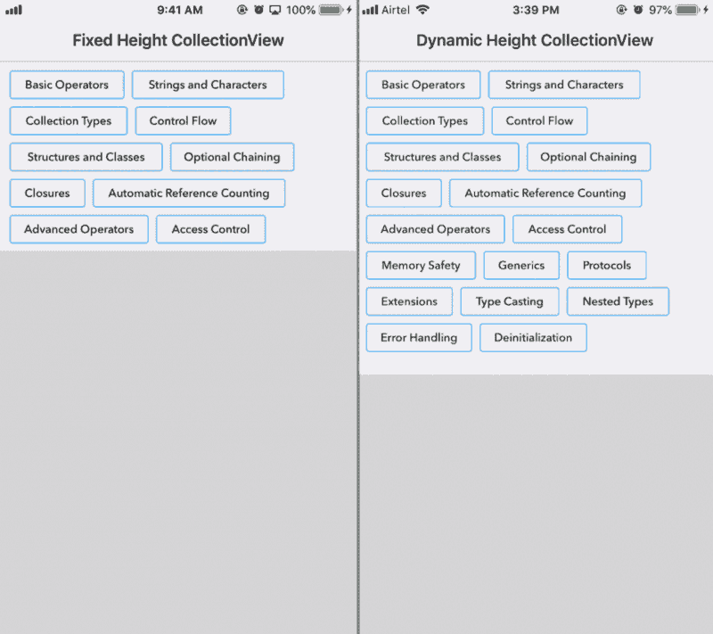
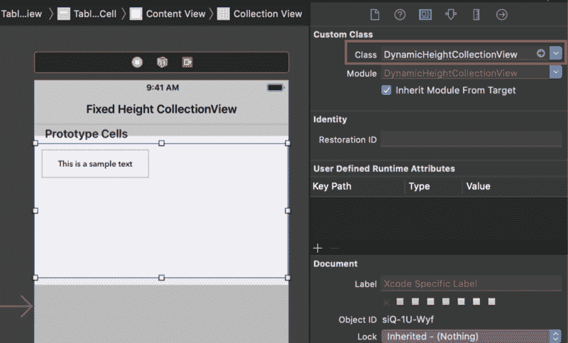

# 如何在你的 iOS 应用中动态显示身高采集视图

> 原文：<https://www.freecodecamp.org/news/how-to-make-height-collection-views-dynamic-in-your-ios-apps-7d6ca94d2212/>

作者帕亚尔·古普塔

# 如何在您的 iOS 应用程序中动态显示收藏视图的高度

#### 充满活力，就像生活一样…


表格视图和集合视图一直是 iOS 应用开发中不可或缺的一部分。我们都可能遇到过与它们相关的各种问题。在本文中，我们将讨论一个与集合视图相关的问题陈述。

### 问题陈述

假设我们在一个`UITableViewCell`中有一个`UICollectionView`和大约 20 个`UICollectionViewCells`，我们需要在其中垂直渲染。有了给定的数据源，我们肯定可以在眨眼之间实现它。

现在是实际的问题陈述——我们需要`UITableViewCell`根据它的内容动态调整它的高度。此外，`UICollectionView`必须能够一次性显示所有单元格，即不允许滚动。

长话短说: ***让一切充满活力……***



**Fixed and Dynamic Height Collection View**

### 让我们开始编码吧

iOS 中的视图根据其内容计算其高度，因为没有提供高度限制。同样适用于`UITableViewCell`。

现在，我们将在我们的`tableViewCell`中保留一个单个的`collectionView`，它的`leading, top, trailing and bottom constraints`设置为 0。


**View Hierarchy**

既然我们没有给`collectionView`提供任何高度约束，也不知道它的`contentSize`，那么`tableViewCell`将如何计算它的高度呢？

#### **解决方案**

根据`contentSize`动态计算`collectionView’s`高度是一个简单的 3 步过程。

**1。**子类`UICollectionView`并覆盖其`layoutSubviews()`和`intrinsicContentSize`，即

上述代码将使`intrinsicContentSize`无效，并将使用`collectionView`的实际`contentSize`。上面的代码也考虑到了`custom layout`。

**2。**现在，将`DynamicHeightCollectionView`设置为`storyboard`中的`collectionView’s`类。



**3。**最后一件事，为了使更改生效:在重新加载`collectionView’s`数据后，您需要在`collectionView`上调用`layoutIfNeeded()`,即

```
func configure(with arr: [String]) {   self.arr = arr   self.collectionView.reloadData()   self.collectionView.layoutIfNeeded() //Here..!!!}
```

现在你知道了！

### 示例项目

您可以从[这里](https://github.com/pgpt10/DynamicHeightCollectionView)下载示例项目。

### 进一步阅读

别忘了阅读我的其他文章:

1.  [Swift 4 中关于 Codable 的一切](https://hackernoon.com/everything-about-codable-in-swift-4-97d0e18a2999)
2.  [你一直想知道的关于 iOS 通知的一切](https://medium.freecodecamp.org/ios-10-notifications-inshorts-all-in-one-ad727e03983a)
3.  [深层拷贝与浅层拷贝——以及如何在 Swift 中使用它们](https://medium.freecodecamp.org/deep-copy-vs-shallow-copy-and-how-you-can-use-them-in-swift-c623833f5ad3)
4.  [iOS 11 编码:如何将&拖放到收藏&表](https://hackernoon.com/drag-it-drop-it-in-collection-table-ios-11-6bd28795b313)
5.  [关于 iOS 10 中的今日扩展(Widget)你需要知道的一切](https://hackernoon.com/app-extensions-and-today-extensions-widget-in-ios-10-e2d9fd9957a8)
6.  [uicollectionview 单元格选择变得简单..！！](https://hackernoon.com/uicollectionviewcell-selection-made-easy-41dae148379d)

如果您有任何问题，请随时发表评论。