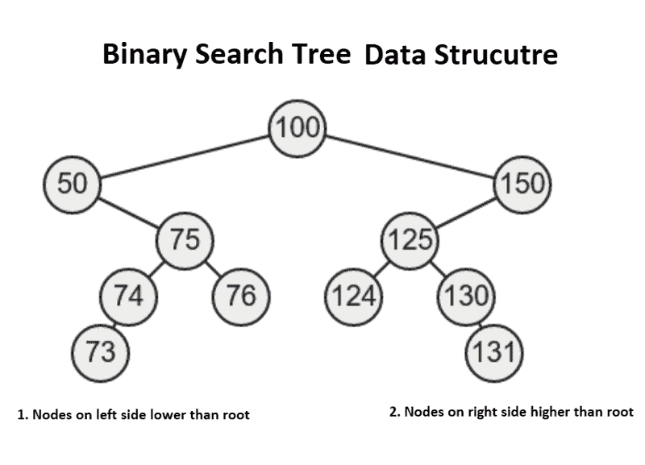
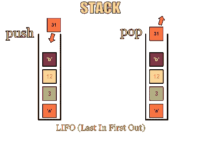
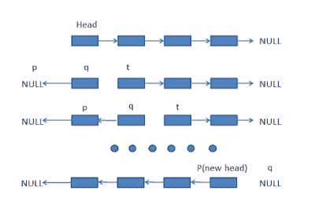
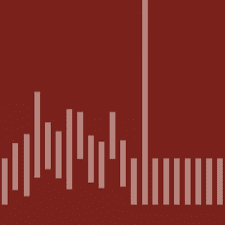
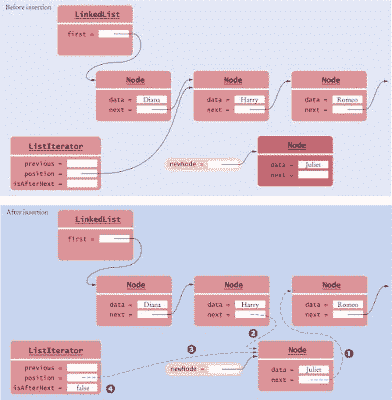

# 我最喜欢的深入学习数据结构和算法的免费课程

> 原文：<https://www.freecodecamp.org/news/these-are-the-best-free-courses-to-learn-data-structures-and-algorithms-in-depth-4d52f0d6b35a/>

作者:javinpaul

对于程序员来说，数据结构和算法是最基本的话题，无论是找工作还是做好工作。良好的数据结构和算法知识是编写好代码的基础。

如果你熟悉基本的数据结构，如[数组](http://javarevisited.blogspot.sg/2015/06/top-20-array-interview-questions-and-answers.html)、[字符串](http://javarevisited.blogspot.com/2015/01/top-20-string-coding-interview-question-programming-interview.html#axzz54hiGw48b)、[链表](http://javarevisited.blogspot.sg/2017/07/top-10-linked-list-coding-questions-and.html)、树、地图，以及高级数据结构如 tries、自平衡树如 AVL 树等。，您将知道何时使用哪种数据结构，并计算代码的 CPU 和内存开销。

即使你不需要编写自己的数组、链表或哈希表，鉴于每个主要的编程 SDK 都提供了它们，例如 JDK 或 C++ STL 库，你也需要理解它们，这样你才能在正确的地方使用它们。

使用正确的数据结构可以显著提高算法的性能。

理想情况下，我们都应该在学校和大学里学习[数据结构](https://hackernoon.com/10-data-structure-algorithms-and-programming-courses-to-crack-any-coding-interview-e1c50b30b927)和[算法](https://dzone.com/articles/10-coding-interview-preparation-courses-crack-a-pr)，但这很少涉及到。大多数程序员，包括我自己，在我们的计算机科学课程中只了解了一种数据结构，但我们并没有真正了解它们在现实世界中的重要性，这就是为什么我们没有更好地理解它们。

对我们来说，它们只是算法和数据结构，例如一些概念，而不是一个可以用来编写好程序的工具。我们不知道脸书会用它们来存储我们的详细信息，也不知道谷歌会用它们来存储网页和搜索查询链接。

> 无论如何，永远不会太晚。

如果你认为你的数据结构知识没有达到标准或者你想提高你的数据结构知识，那么你来对地方了。

之前我分享了一些[学习数据结构和算法的免费书籍](http://javarevisited.blogspot.sg/2016/05/5-free-data-structure-and-algorithm-books-in-java.html#axzz4uXETWjmV)，而在这篇文章中，你将了解到一些最好的网上免费提供的数据结构和算法课程。

### 学习数据结构和算法的免费课程

下面是我列出的一些学习数据结构和算法的最好的课程，也是免费的。很多程序员认为免费资源不好，这是不对的。

尽管它们有时不符合付费资源的质量和覆盖范围，但事实上，它们是最好的资源。

您可以使用这些课程来熟悉基本的数据结构并学习一些基础知识。

从面试的角度来看，其中一些特别好，所以你可以把它们和你用来准备[编程工作面试](http://www.java67.com/2018/05/top-75-programming-interview-questions-answers.html)的任何一本书一起使用。

## 课程# 1:C 语言中的数据结构概念

这是另一个免费的在线算法和数据结构培训课程，旨在教授计算机编程中的基本数据结构。

课程中讲授的数据结构包括使用 C 编程语言的[栈](http://www.java67.com/2013/08/ata-structures-in-java-programming-array-linked-list-map-set-stack-queue.html)、[队列](http://javarevisited.blogspot.sg/2017/03/difference-between-stack-and-queue-data-structure-in-java.html#axzz4rZnFiEOx)、[链表](https://javarevisited.blogspot.com/2015/02/simple-junit-example-unit-tests-for-linked-list-java.html)。

这门[课程](https://click.linksynergy.com/fs-bin/click?id=JVFxdTr9V80&subid=0&offerid=323058.1&type=10&tmpid=14538&RD_PARM1=https%3A%2F%2Fwww.udemy.com%2Fdata-structures-in-c%2F)的主要目标是让学生和软件工程师想象不同的数据结构是如何工作的。

[**Data Structures Concepts in C**](https://click.linksynergy.com/fs-bin/click?id=JVFxdTr9V80&subid=0&offerid=323058.1&type=10&tmpid=14538&RD_PARM1=https%3A%2F%2Fwww.udemy.com%2Fdata-structures-in-c%2F)

这并不是一个详尽的课程，但是你将会学到[栈](https://javarevisited.blogspot.com/2017/03/how-to-implement-stack-in-java-using-array-example.html)、队列和[链表](https://javarevisited.blogspot.com/2017/03/how-to-reverse-linked-list-in-java-using-iteration-and-recursion.html#axzz5bAq1c3jf)。

简而言之，对于刚接触数据结构的程序员和那些刚学习编程语言并想了解数据结构工作原理的人来说，这是一门很好的课程。

## 课程#2:算法第一部分- Coursera

这是罗伯特·塞奇威克在 Courera 上开设的涵盖算法和数据结构的两部分系列课程的第一部分。

在这一部分，你将学习到基本的数据结构，如[链表](http://javarevisited.blogspot.sg/2017/07/top-10-linked-list-coding-questions-and.html#axzz4xXS86IVo)、[栈](https://javarevisited.blogspot.com/2017/03/difference-between-stack-and-queue-data-structure-in-java.html)、队列、[二叉树](https://javarevisited.blogspot.com/2015/10/how-to-implement-binary-search-tree-in-java-example.html)和[哈希表](http://javarevisited.blogspot.sg/2011/02/how-hashmap-works-in-java.html#axzz5B9NXhuQw)，以及搜索和排序算法，如[二分搜索法](https://javarevisited.blogspot.com/2017/04/recursive-binary-search-algorithm-in-java-example.html)、[快速排序](https://javarevisited.blogspot.com/2014/08/quicksort-sorting-algorithm-in-java-in-place-example.html)、[合并排序](http://www.java67.com/2018/03/mergesort-in-java-algorithm-example-and.html)、[插入排序](https://javarevisited.blogspot.com/2014/12/insertion-sort-algorithm-in-java-to-array-example.html)等。

[Algorithms Part 1](http://bit.ly/algorithms-part1)

您还将了解日常应用中使用的核心数据结构和算法，并理解选择每个数据结构以及[遍历](http://www.java67.com/2017/05/binary-tree-post-order-traversal-in-java-without-recursion.html)、检索和更新算法所涉及的权衡。

本课程的所有功能都是免费提供的，但不提供结业证书。

### **课程#3:算法-第二部分**

这是由计算机科学教授罗伯特·塞奇威克和凯文·韦恩教授的两部分免费在线课程系列的第二部分，涵盖了数据结构和算法。

罗伯特·塞奇威克也是《算法第四版 的作者，这是 Java 开发人员最受欢迎的算法书籍之一。

在本部分的[中，您将学习图形和字符串处理算法。](http://bit.ly/algorithms-part2)

您还将学习应用程序开发中使用的一些高级数据结构和算法。

谈到社会证明，[算法第一部分](http://bit.ly/algorithms-part1)和[算法第二部分](http://bit.ly/algorithms-part2)都是非常值得推荐的课程，并且有着令人印象深刻的评论和评级。

[Algorithms — Part 2](http://bit.ly/algorithms-part2)

## 课程#4。Java 中的数据结构

这是一门关于数据结构、算法和复杂性分析的介绍性[在线课程。它将教你使用 Java 语言设计、实现和分析基本数据结构。](http://bit.ly/2zLGO3B)

这门课程最棒的部分是实际例子的数量，它关注的是直觉而不是公式和数学证明。

[**Data Structure in Java**](http://bit.ly/2zLGO3B)

[课程](http://bit.ly/2zLGO3B)为“复杂性分析”提供了一个很好的介绍，这使得发现一个性能很差(和很好)的程序成为可能，甚至不需要执行它。

以上是网上提供的一些免费的数据结构和算法课程。你可以用这些课程按照自己的节奏学习数据结构和算法。

它们可能并不全面，但确实提供了一个很好的介绍。一旦你走完了这些课程，你可以挑一本像这样的好书来进一步补充你的知识。

## 课程#5。易于高级的数据结构

更新:这个课程不再是免费的，但它是一个很棒的课程，可能对你来说是值得的。Udemy 的这个[数据结构和算法课程](https://click.linksynergy.com/deeplink?id=JVFxdTr9V80&mid=39197&murl=https%3A%2F%2Fwww.udemy.com%2Fintroduction-to-data-structures%2F)是为所有想从绝对基础到高级水平学习数据结构的人准备的。

这个[课程](https://click.linksynergy.com/deeplink?id=JVFxdTr9V80&mid=39197&murl=https%3A%2F%2Fwww.udemy.com%2Fintroduction-to-data-structures%2F)并不期望你有任何数据结构的先验知识，但是一个 [Java](http://www.java67.com/2018/08/top-10-free-java-courses-for-beginners-experienced-developers.html) 的基本先验知识是有帮助的。

作者@William Fiset 是谷歌的软件工程师，也是前 T2 ACM-ICPC 世界决赛选手，拥有优秀的计算机编程和解决问题的能力。

谈到社会证明，[课程](https://click.linksynergy.com/deeplink?id=JVFxdTr9V80&mid=39197&murl=https%3A%2F%2Fwww.udemy.com%2Fintroduction-to-data-structures%2F)有超过 25，000 名学生，平均 4.1 分，683 分，令人印象深刻。

简而言之，这是一个学习所有关于数据结构知识的完整指南。

Easy to Advanced Data Structures

对于希望从面试角度学习数据结构和算法的计算机科学学生和在职软件专业人员来说，这也是一门理想的课程。

因此，如果你想在亚马逊、T2、谷歌、T4、微软或脸书等基于产品的公司找到工作，你可以通过这门课程开始准备。

#### **进一步学习**

*   [数据结构和算法:使用 Java 进行深入研究](https://click.linksynergy.com/fs-bin/click?id=JVFxdTr9V80&subid=0&offerid=323058.1&type=10&tmpid=14538&RD_PARM1=https%3A%2F%2Fwww.udemy.com%2Fdata-structures-and-algorithms-deep-dive-using-java%2F)
*   [数据结构和算法—第 1 部分和第 2 部分](https://pluralsight.pxf.io/c/1193463/424552/7490?u=https%3A%2F%2Fwww.pluralsight.com%2Fcourses%2Fads-part1)
*   [准备技术编程/编码工作面试的 10 本书](http://www.java67.com/2017/06/10-books-to-prepare-technical-coding-job-interviews.html)
*   [每个程序员都应该读的 10 本算法书](http://www.java67.com/2015/09/top-10-algorithm-books-every-programmer-read-learn.html)
*   [面向 Java 开发人员的五大数据结构和算法书籍](http://javarevisited.blogspot.sg/2016/05/5-free-data-structure-and-algorithm-books-in-java.html#axzz4uXETWjmV)
*   [从 0 到 Java 中的数据结构&算法](https://click.linksynergy.com/fs-bin/click?id=JVFxdTr9V80&subid=0&offerid=323058.1&type=10&tmpid=14538&RD_PARM1=https%3A%2F%2Fwww.udemy.com%2Ffrom-0-to-1-data-structures%2F)
*   [数据结构与算法分析-面试](https://click.linksynergy.com/fs-bin/click?id=JVFxdTr9V80&subid=0&offerid=323058.1&type=10&tmpid=14538&RD_PARM1=https%3A%2F%2Fwww.udemy.com%2Fdata-structure-and-algorithms-analysis%2F)

#### 结束语

谢了。你坚持到了文章的结尾。祝您的编程之旅好运！这当然不会很容易，但通过学习这些课程，你比其他人更接近掌握数据结构和算法。

如果你喜欢这篇文章，那么请分享给你的朋友和同事，别忘了在 Twitter 上关注 [javinpaul](https://twitter.com/javinpaul) ！