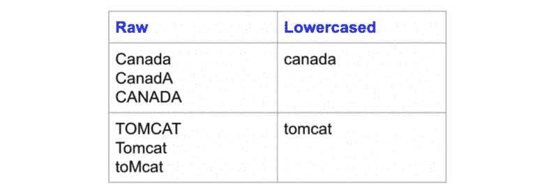
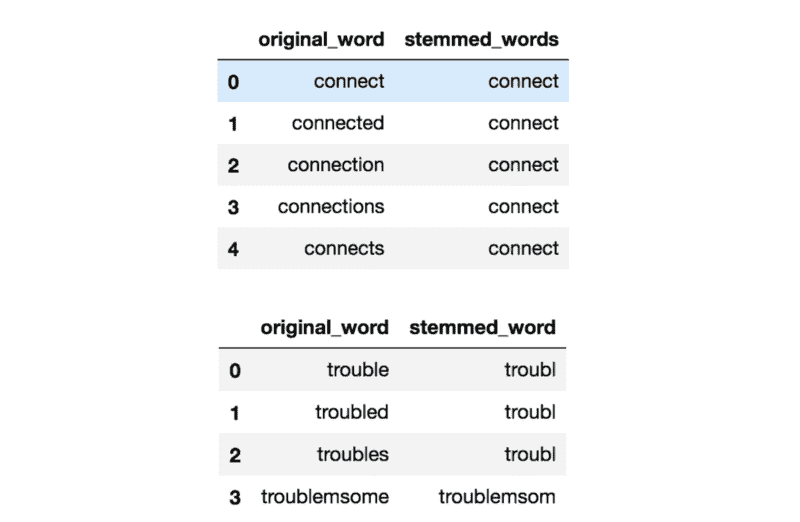
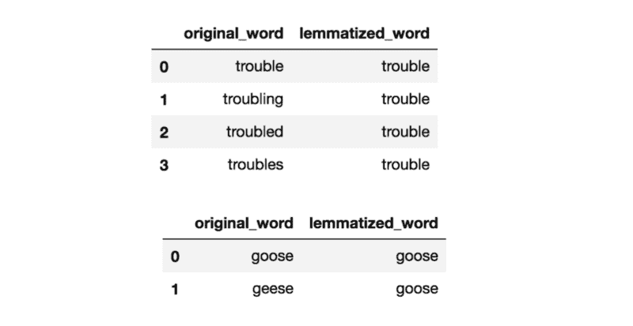
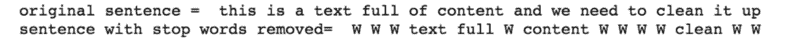
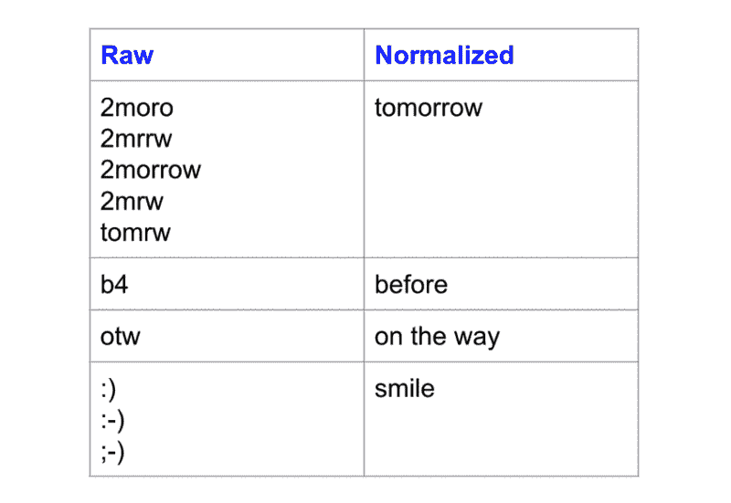
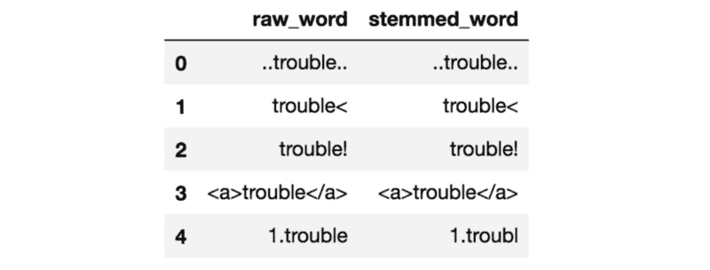
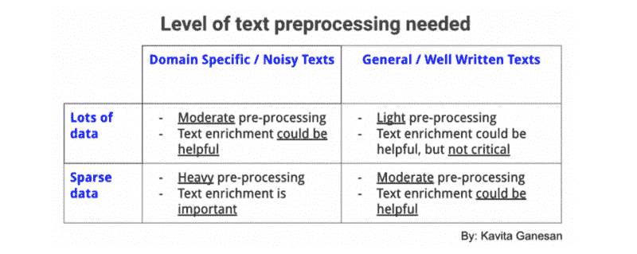

# 关于自然语言处理和机器学习的文本预处理

> 原文：<https://www.freecodecamp.org/news/all-you-need-to-know-about-text-preprocessing-for-nlp-and-machine-learning-bc1c5765ff67/>

作者:卡维塔·加内桑

根据最近的一些对话，我意识到文本预处理是一个被严重忽视的话题。与我交谈过的一些人提到了他们的 NLP 应用程序的不一致的结果，但他们意识到他们没有对他们的文本进行预处理，或者对他们的项目使用了错误的文本预处理。

考虑到这一点，我想解释一下什么是文本预处理，文本预处理的不同方法，以及估计您可能需要多少预处理的方法。对于那些感兴趣的人，我也做了一些[文本预处理代码片段](https://github.com/kavgan/nlp-text-mining-working-examples/tree/master/text-pre-processing)供你尝试。现在，让我们开始吧！

### 什么是文本预处理？

对你的文本进行预处理简单地说就是把你的文本变成一种对你的任务来说***可预测的形式。这里的任务是方法和领域的结合。例如，用 tfidf (approach)从 Tweets (domain)中提取热门关键词就是一个*任务*的例子。***

> ***任务=方法+领域***

**一个任务的理想预处理可能成为另一个任务的噩梦。所以请注意:文本预处理不能直接从一个任务转移到另一个任务。**

**让我们举一个非常简单的例子，假设你正试图在一个新闻数据集中发现常用词。如果您的预处理步骤涉及删除[停用词](http://kavita-ganesan.com/what-are-stop-words/)，因为其他任务使用了它，那么您可能会错过一些常用词，因为您已经删除了它。所以真的，这不是一个放之四海而皆准的方法。**

### **文本预处理技术的类型**

**有不同的方法来预处理你的文本。这里有一些你应该知道的方法，我会试着强调每种方法的重要性。**

#### **用小写字体书写**

**尽管经常被忽视，但是将文本数据全部小写是最简单也是最有效的文本预处理方式之一。它适用于大多数文本挖掘和 NLP 问题，在数据集不是很大的情况下会有所帮助，并对预期输出的一致性有很大帮助。**

**最近，我的一个博客读者训练了一个用于相似性查找的[单词嵌入模型](http://kavita-ganesan.com/gensim-word2vec-tutorial-starter-code/)。他发现输入大写的不同变化(例如“canada”与“Canada”)给了他不同类型的输出或根本没有输出。这可能是因为数据集混合了单词“Canada”的大小写，并且没有足够的证据让神经网络有效地学习不太常见的版本的权重。当你的数据集很小时，这种类型的问题一定会发生，小写是处理稀疏性问题的一个很好的方法。**

**以下是小写如何解决稀疏性问题的示例，其中大小写不同的相同单词映射到相同的小写形式:**

**

Word with different cases all map to the same **lowercase** form** 

**小写非常有用的另一个例子是搜索。想象一下，你正在寻找包含“美国”的文档。但是，没有显示任何结果，因为“美国”被索引为**“美国”。**现在，我们该怪谁呢？设置界面的 U.I .设计师还是设置搜索索引的工程师？**

**虽然小写应该是标准做法，但我也遇到过保留大写很重要的情况。例如，预测源代码文件的编程语言。Java 中的单词`System`和 python 中的`system`有很大不同。两者的小写使得它们相同，导致分类器丢失重要的预测特征。虽然小写的*通常是有帮助的*，但它可能不适用于所有的任务。**

#### **堵塞物**

**词干化是将单词(如 troubled，trouble)中的词形变化减少到其词根形式(如 trouble)的过程。这种情况下的“根”可能不是真正的根词，而只是原词的规范形式。**

**词干提取使用一种粗略的启发式过程，即砍掉单词的词尾，希望能正确地将单词转换成其词根形式。所以单词“麻烦”、“困扰”和“麻烦”实际上可能被转换成`troubl`而不是`trouble`，因为末端被切掉了(ughh，多么粗糙！).**

**词干提取有不同的算法。最常见的算法是 [Porters 算法](https://tartarus.org/martin/PorterStemmer/)，这也是已知的对英语有效的经验算法。这里有一个波特·斯特梅尔的词干实例:**

**

Effects of stemming inflected words** 

**词干对于处理稀疏性问题以及标准化词汇表非常有用。特别是在搜索应用中，我在词干提取方面取得了成功。其想法是，如果说你搜索“深度学习班”，你也想表面文档提到“深度学习 ***班*** ”以及“深度 ***学*** 班”，尽管后者听起来不太对。但是你知道我们要做什么。您希望匹配一个单词的所有变体，以显示最相关的文档。**

**然而，在我之前的大部分文本分类工作中，词干处理只能在一定程度上帮助提高分类精度，而不是使用更好的工程特征和文本丰富方法，如使用单词嵌入。**

#### **词汇化**

**表面上的词汇化与词干化非常相似，目标是去除词形变化并将单词映射到其词根形式。唯一的区别是，术语化试图以正确的方式来实现它。它不只是砍掉一些东西，它实际上是将单词转化为实际的词根。例如，单词“better”可以映射为“good”。它可能会使用字典，如用于映射的 WordNet 或一些特殊的基于规则的 T2 方法。下面是一个使用基于 WordNet 的方法进行词汇化的例子:**

**

Effects of Lemmatization with WordNet** 

**根据我的经验，对于搜索和文本分类来说，词汇化并没有比词干化带来更大的好处。事实上，根据您选择的算法，与使用非常基本的词干分析器相比，它可能会慢得多，并且您可能必须知道所讨论的单词的词性才能获得正确的词条。[本文](https://arxiv.org/pdf/1707.01780.pdf)发现，对于具有神经架构的文本分类，词条化对准确度没有显著影响。**

**我个人会谨慎地使用词汇化。额外的开销可能值得，也可能不值得。但是您可以尝试一下，看看它对您的性能指标有什么影响。**

#### **停用词删除**

**停用词是一种语言中的一组常用词。英语中停用词的例子有“a”、“the”、“is”、“are”等。使用停用词背后的直觉是，通过从文本中移除低信息量的词，我们可以专注于重要的词。**

**例如，在搜索系统的上下文中，如果您的搜索查询是*“什么是文本预处理？”*，你想让搜索系统关注那些谈论`text preprocessing`的文档，而不是谈论`what is`的文档。这可以通过阻止分析停用词表中的所有单词来实现。停用词通常应用于搜索系统、文本分类应用、主题建模、主题提取等。**

**根据我的经验，停用词去除虽然在搜索和主题提取系统中有效，但在分类系统中并不重要。然而，它确实有助于减少所考虑的特征的数量，这有助于保持您的模型大小合适。**

**下面是一个停用词删除的例子。所有停止字都被替换为虚拟字符， **W** :**

**

Sentence before and after stop word removal** 

**[停用词表](http://kavita-ganesan.com/what-are-stop-words/)可以来自预先建立的集合，或者你可以为你的域名创建一个[自定义列表。一些库(例如 sklearn)允许你删除出现在 X%的文档中的单词，这也可以给你一个停用词删除效果。](http://kavita-ganesan.com/tips-for-constructing-custom-stop-word-lists/)**

#### **正常化**

**一个被高度忽视的预处理步骤是文本规范化。文本规范化是将文本转换成规范(标准)形式的过程。例如，单词“gooood”和“gud”可以转换为“good”，这是它的规范形式。另一个例子是将几乎相同的单词，如“停用词”、“停用词”和“停用词”映射到“停用词”。**

**文本规范化对于嘈杂的文本很重要，例如社交媒体评论、文本消息和博客帖子的评论，其中缩写、拼写错误和使用词汇外单词(oov)很普遍。[这篇论文](https://sentic.net/microtext-normalization.pdf)表明，通过对推文使用文本标准化策略，他们能够将情感分类准确率提高约 4%。**

**以下是标准化前后的单词示例:**

**

Effects of Text Normalization** 

**注意这些变化是如何映射到同一个标准形式的。**

**根据我的经验，文本规范化甚至对分析[高度非结构化的临床文本](http://kavita-ganesan.com/general-supervised-approach-segmentation-clinical-texts/)非常有效，在这些文本中，医生以非标准的方式记笔记。我还发现它对于常见同义词和拼写差异的[主题提取](https://githubengineering.com/topics/)非常有用(例如，主题建模、主题建模、主题建模、主题建模)。**

**不幸的是，与词干化和词汇化不同，没有标准化文本的标准方法。这通常取决于任务。例如，规范化临床文本的方式可能与规范化 sms 文本消息的方式不同。**

**一些常见的文本规范化方法包括字典映射(最简单)、统计机器翻译(SMT)和基于拼写校正的方法。[这篇有趣的文章](https://nlp.stanford.edu/courses/cs224n/2009/fp/27.pdf)比较了使用基于字典的方法和 SMT 方法来标准化文本消息。**

#### **噪声消除**

**去噪就是去除那些会干扰你文本分析的`characters` `digits`和`pieces of text`。去噪是最基本的文本预处理步骤之一。它还高度依赖于领域。**

**例如，在推文中，噪音可以是除了标签以外的所有特殊字符，因为它表示可以表征推文的概念。噪音的问题在于，它会在您的下游任务中产生不一致的结果。让我们以下面的例子为例:**

**

Stemming **without** Noise Removal** 

**请注意，上面所有的原始单词都包含一些环境噪声。如果你对这些单词进行词干分析，你会发现词干分析的结果看起来并不太好。它们都没有正确的词干。然而，通过在[本笔记本](https://github.com/kavgan/nlp-text-mining-working-examples/blob/master/text-pre-processing/Text%20Pre-Processing%20Examples.ipynb)中应用的一些清理，结果现在看起来好多了:**

**

Stemming **with** Noise Removal** 

**当涉及到文本挖掘和 NLP 时，去噪是你应该首先考虑的事情之一。有各种方法可以消除噪音。这包括*标点删除*、*特殊字符删除*、*数字删除、html 格式删除、特定领域关键词删除*、*(例如，retweet 的“RT”)、源代码删除、标题删除*等等。这完全取决于你在哪个领域工作，以及你的任务需要什么样的噪声。我的笔记本中的[代码片段展示了如何做一些基本的噪声去除。](https://github.com/kavgan/nlp-text-mining-working-examples/tree/master/text-pre-processing)**

#### **文本丰富/扩充**

**文本丰富包括用以前没有的信息来扩充原始文本数据。文本丰富为原始文本提供了更多的语义，从而提高了其预测能力和对数据进行分析的深度。**

**在信息检索示例中，扩展用户的查询以改善关键词的匹配是一种增强形式。类似于`text mining`的查询可能会变成`text document mining analysis`。虽然这对人类来说没有意义，但它可以帮助获取更相关的文档。**

**你可以在如何丰富你的文本方面变得很有创造力。您可以使用 [**词性标注**](https://en.wikipedia.org/wiki/Part-of-speech_tagging) 来获得文本中单词的更详细信息。**

**例如，在文档分类问题中，单词 **book** 作为**名词**出现可能导致与 **book** 作为**动词**不同的分类，因为一个用于阅读的上下文，另一个用于预订某物的上下文。[这篇文章](http://www.iapr-tc11.org/archive/icdar2011/fileup/PDF/4520a920.pdf)讲述了如何使用名词和动词的组合作为输入特征来改进中文文本分类。**

**然而，随着大量文本的可用性，人们已经开始使用[嵌入](https://en.wikipedia.org/wiki/Word_embedding)来丰富单词、短语和句子的含义，用于分类、搜索、摘要和一般的文本生成。在基于深度学习的 NLP 方法中尤其如此，其中[单词级嵌入层](https://keras.io/layers/embeddings/)非常常见。您可以从[预先建立的嵌入](https://blog.keras.io/using-pre-trained-word-embeddings-in-a-keras-model.html)开始，也可以创建自己的嵌入并在下游任务中使用。**

**丰富文本数据的其他方法包括[短语提取](http://kavita-ganesan.com/how-to-incorporate-phrases-into-word2vec-a-text-mining-approach/#.XHCcJ1xKg2w)，将复合词识别为一个(也称为组块)[同义词扩展](http://aclweb.org/anthology/R09-1073)和[依存解析](http://www.cs.virginia.edu/~kc2wc/teaching/NLP16/slides/15-DP.pdf)。**

### **你都需要吗？**

****

**不完全是，但是如果你想要好的、一致的结果，你确实必须做一些事情。为了给你一个最低限度应该是什么的概念，我把它分解为 ***必须做*** 、 ***应该做*** 和 ***任务依赖*** 。在决定你是否真的需要它之前，任何属于任务相关的东西都可以进行定量或定性的测试。**

**记住，少即是多，你要保持你的方法尽可能优雅。你增加的开销越多，当你遇到问题的时候，你需要剥离的层就越多。**

### **必须做:**

*   **噪声消除**
*   **小写(在某些情况下可能取决于任务)**

### **应该做:**

*   **简单标准化—(例如，标准化相近的相同单词)**

### **依赖于任务:**

1.  **高级规范化(例如，处理词汇表之外的单词)**
2.  **停用词删除**
3.  **词干化/词汇化**
4.  **文本丰富/扩充**

**因此，对于任何任务，你应该做的最起码的事情就是尝试小写你的文本并去除噪声。产生噪声的原因取决于您所在的领域(参见噪声消除部分)。你也可以做一些基本的标准化步骤以获得更多的一致性，然后系统地添加你认为合适的其他层。**

### **一般经验法则**

**并非所有任务都需要相同级别的预处理。对于一些任务，你可以用最少的。然而，对于其他人来说，数据集是如此嘈杂，如果你没有足够的预处理，它将是垃圾进垃圾出。**

**这是一个通用的经验法则。这并不总是正确的，但在大多数情况下是可行的。如果您在一个相当一般的领域中有许多写得很好的文本要处理，那么预处理就不是非常关键了；你可以只做最少的事情(例如，使用所有维基百科文本或路透社新闻文章训练一个单词嵌入模型)。**

**然而，如果您在一个非常狭窄的领域中工作(例如，关于保健食品的 Tweets ),并且数据稀疏且嘈杂，那么您可以从更多的预处理图层中受益，尽管您添加的每个图层(例如，停用词移除、词干化、规范化)都需要作为有意义的图层进行定量或定性验证。下表总结了应该对文本数据执行多少预处理:**

****

**我希望这里的想法能够引导您走向项目的正确预处理步骤。记住，*少即是多*。我的一个朋友曾经向我提到，他是如何让一个大型的电子商务搜索系统变得更有效率，更少错误，仅仅是通过抛弃多层*不需要的*预处理。**

### **资源**

*   **[使用 NLTK 和 regex 进行基本文本预处理的 Python 代码](https://github.com/kavgan/nlp-text-mining-working-examples/blob/master/text-pre-processing/Text%20Preprocessing%20Examples.ipynb)**
*   **[构建自定义停用词表](http://kavita-ganesan.com/tips-for-constructing-custom-stop-word-lists/)**
*   **[短语提取的源代码](https://kavgan.github.io/phrase-at-scale/)**

### **参考**

*   **更新的论文列表，请见[我的原始文章](http://kavita-ganesan.com/text-preprocessing-tutorial/#Relevant-Papers)**

**[***关注我的博客***](http://kavita-ganesan.com/subscribe/#.XHmu_5NKhuV) ***从应用的角度持续学习文本挖掘、NLP 和机器学习。*****

*****本文原载于【kavita-ganesan.com】*****