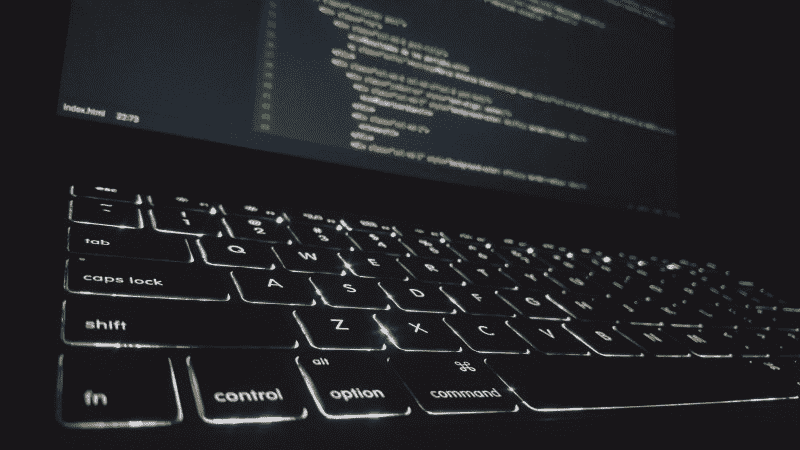

# 成就伟大软件工程师的品质

> 原文：<https://www.freecodecamp.org/news/qualities-of-great-software-engineers-621f4094f5ab/>

凯勒·泰勒

# 伟大软件工程师的素质

这些年来，我注意到人们的一些共同特征对公司来说非常有价值。这些工程师很聪明，但这不是他们伟大的原因。他们倾向于始终如一地做一些其他工程师不做的事情。我已经抓住了其中的一些品质，并将它们归结为任何工程师都可以使用的概念。

> ***免责声明:*** *这些并不总是容易做到的事情。在我职业生涯的某个阶段，我个人在这些品质上都有所欠缺。我认为这些“指导原则”适用于任何想成为伟大工程师的人，但这并不是一个全面的清单。你对“伟大”工程师的定义可能与我不同。*

### 训练成为一名消防员

当我还是一名年轻的新面孔工程师时，我的经理给我上了第一堂宝贵的课。他说，

> "如果你想对你的公司有价值，做一个奔向大火的人."

他并没有鼓励我去把自己扔进火里(尽管我确信有时我应该这样做)，而是鼓励我成为一名愿意——也有能力——解决大问题的工程师。

“火”可以是任何东西，从一个讨厌的产品 bug，到一个主要服务的令人生畏的重构。不是每个人都能扑灭这些大火。解决难题的意愿是第一步，但这还不够。你必须真的有能力灭火。

为这些重要时刻做准备并不容易。您必须致力于理解您的系统的架构和设计。系统越复杂，花费的时间就越多。

我发现了几种帮助我做好救火准备的方法:

*   为您的应用/服务创建 HLD ( [高级设计](https://en.wikipedia.org/wiki/High-level_design))
*   记录复杂的代码片段
*   逐行调试代码中的公共流
*   花时间钻研你遇到的任何你不理解的代码
*   研究您的团队使用的技术并成为专家

当你做单独的任务时，留意你不明白的任何事情。**不接受事物*【刚工作】*** *。*每次接触代码，你都有机会建立自己的理解。这就是为什么训练成为一名“消防员”如此艰难。为火灾做好准备可能是一项单调乏味的日常工作。

伟大的工程师是坚持做这些事情的人。他们愿意跳到他们不知道如何解决的问题上。他们倾向于比一般的工程师挖掘得更深，因为他们想要真正理解事物。这和智力无关。这是一种思维模式。

**要点:**致力于深入了解你的应用。当棘手的问题出现时，要乐于投入并灭火。

### 认识瓶颈

你经历过多少次这样的情况？

> 开发者 A:“我去部署最新的变更，好吗？一旦我手动更新了每个静态文件并删除了本地配置设置，我就可以上传它了”。

> 新开发人员:“等等，你每次部署都手动编辑这些文件？”

> 开发商 A:“是啊，挺痛苦的。当我们犯了一个错误时，我们也中断过几次生产。挺烦的。”

> 新开发人员:“这似乎是一个糟糕的部署方式。”

> 开发商 A:“是的，我们真的应该解决这个问题。

不幸的是，对于软件团队来说，这是一个非常普遍的问题。团队工作流程中重要或常见的部分是手动的、脆弱的、缓慢的。偶尔，团队会意识到这是一个问题并解决它。至少，他们可能会在待办事项中制作一张卡片。

> 真正的问题是没有人认识到瓶颈

那么你从哪里开始寻找呢？一个好的起点是考虑自动化一切。从您手动执行的最关键的任务开始。您的团队是否有每个人都为每个拉请求手动运行的测试，以确保它们通过？为什么不把它连接到一个 CI 服务器上，比如 [Jenkins](https://jenkins.io/) 或者 [Travis CI](https://travis-ci.org/) ，然后用 web 钩子直接在 pull 请求中显示结果呢？

您的团队成员是否花时间审查代码样式和格式？为什么不在每次提交时使用 Git 钩子，用像 [Husky](https://github.com/typicode/husky) 和 [lint-staged](https://github.com/okonet/lint-staged) 这样的工具自动 lint 你的代码呢？

这些优化很容易被忽略。团队将这些痛点视为“事物的本来面目”，而不是优化的候选对象。伟大的工程师倾向于思考这些问题。他们花时间来修复它们，由此产生的变化对整个团队来说是巨大的胜利。

> *我最近读了 [Accelerate:精益软件和 DevOps 的科学:构建和扩展高性能技术组织](https://www.amazon.com/Accelerate-Software-Performing-Technology-Organizations-ebook/dp/B07B9F83WM) ，发现这是一个很好的资源。它让我们深入了解最佳工程实践，以及它们如何影响团队绩效和快乐。它也有助于向公司领导层和产品团队证明利用许多其他公司的数据解决团队瓶颈的合理性。*

**要点:**寻找团队开发过程中的瓶颈或部署管道。努力优先解决最重要的问题，以提高团队的生活质量。

### 不要盲从现有的模式

工程师喜欢模式。关于最佳编程模式以及如何使用它们的书籍成千上万。不幸的是，并不是所有的代码模式都应该被重用。

偶尔，我会检查一个拉请求，发现一段奇怪的或者写得很差的代码。当我问为什么要这样写时，答案通常都是一样的:“以前就是这么做的。我只是从别处抄来的”。

> 打破旧模式是建立新模式的第一步

开发者复制现有代码的倾向是科技债务的最大原因之一。允许这些更改很容易，因为它看起来像生产中的其他代码。

伟大的工程师在重用现有代码时非常小心。这适用于编写和审查代码。他们倾向于问这样的问题:

*   复制的代码是解决问题的最好方法吗？
*   如果它与现有的一段代码相似，我们是否可以将它合并到一个模块中以减少重复？
*   由于新代码和现有代码之间的细微差异，是否存在任何逻辑错误？
*   这个代码符合我的团队的最新标准和设计讨论吗？

这些原则也适用于对旧代码段进行更新。我们很容易在不做任何修复的情况下，偷偷将代码更改为过时或编写糟糕的代码部分，但伟大的工程师很少会这样做。他们倾向于接受[持续重构](https://martinfowler.com/bliki/OpportunisticRefactoring.html)的概念。

这并不意味着每次代码更新都会导致大规模重构。改进可以是(通常是)各种简单的事情:

*   改进变量或函数名
*   将一个复杂的大函数分解成几个小函数
*   将复制在几个地方的逻辑抽象成一个共享组件

伟大的工程师不断思考改进代码的方法，并且几乎总是让代码处于比他们发现时更好的状态。

> 我最近读了马丁·福勒写的《重构:改进现有代码的设计》一书，发现这是一个关于重构的很好的资源。

**收获**:不断地重新评估代码结构、模式和设计。复制粘贴代码是万恶之源。总是让代码处于比发现时更好的状态。

### 结论

任何软件工程师都可以将这些品质应用到他们的工作中。很难做到始终如一。有些特征要求你愿意在工作的许多方面付出额外的努力。如果你愿意在这些品质上努力，你会成为一名更好的软件工程师。

这个简短的列表是基于我自己的经历，但是我很想听听其他人的想法。在你的经历中，伟大的工程师往往具备哪些品质？请让我知道！