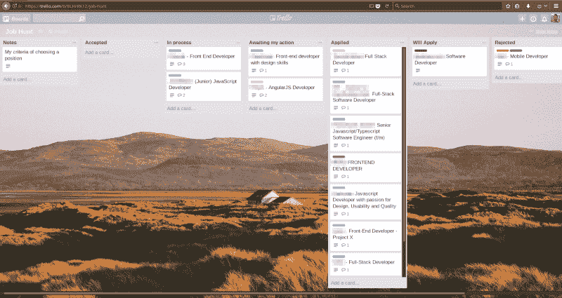

# 我是如何从 00b 实习生成为工程团队领导的

> 原文：<https://www.freecodecamp.org/news/how-i-got-from-n00b-intern-to-engineering-team-lead-8320c5a2e3f9/>

科斯蒂斯·马里纳基斯

# 我是如何从 00b 实习生成为工程团队领导的

#### 回想起来，我所学到的一切。

When I see a rocket launching gracefully into the sky, I always think about all the hard work and engineering that led up to ***everything*** going according to plan.

> 首先，现实检查:
> 如果你正在寻找 10 分钟的 abs，零到英雄与这一个怪异的把戏类的文章，你不会在这里找到它。实现任何有意义的事情都是困难的，需要长时间坚持不懈的努力。

#### 你从哪里开始并不重要

我不是在好地方长大的。在那里，青少年时期的任何学习在我的同龄人中是完全不酷的。据统计，如果你没有在这种环境中长大，你已经领先了。

12 年多来，我一直是一名计算机科学学生。即使我快完成了，过了这么久，我还是没有拿到计算机科学学位。

这些年来，我做过你能想到的各种工作。有些地方很糟糕。但是我如何进入一个每个人都要求至少 3 年工作经验的行业呢？

我花了很长时间才意识到，开始总是最难的，需要最长时间才能忘记。尤其是当你身处其中的时候，似乎永远都不会平静。

然而，事实是，今天的工程行业比以往任何时候都更加多样化。每个人(足够了解自己的人)都有一个完美的定位。

事实上，工程需求的增长速度超过了工程供应的满足速度。这导致赤字不断增加。具体来说，现在全世界对优秀工程师的需求非常高。所以，即使你只是等待，你找工作只会越来越容易。打好你的牌，潜在的机会就会飞升。

以下是我一路走来学到的一些东西。

#### 表现得像你想成为的人

凡事都要尽力去做。这意味着，无论你做什么，都要努力多做一点。想想*你最好的*正如[四个协议](https://www.youtube.com/watch?v=TArfs_dljDM)中定义的那样。

为了获得非凡的结果，你需要付出非凡的努力。尽最大努力当然不能保证什么，但不满足于“足够好”是你获得其他人可能永远得不到的东西的唯一途径。

永远保持真诚的好奇心，永远不要停止学习。我怎么强调这一点都不为过。直到今天，我仍然每天在 YouTube 上观看 1 - 3 场技术会议演讲，而且我已经看了很多年了。我是一个*非常*慢的读者，所以这可以解决我的问题，但对你来说，它可能是中等文章或技术书籍，或者研磨 Udemy 课程或其他任何东西。如果你没有这种与生俱来的好奇心，那么我强烈建议你重新考虑你的职业选择。

当你做好一件事情后，总是问自己如何能做得更好。然后研究你的方法，然后做得更好！处理边缘情况，优化安全性和性能，重构为更干燥和更干净的代码或添加功能-这些都无关紧要。只要遵循这个指导方针，你就会学到很多！

找一个让你兴奋的项目，全身心投入进去。让它引领你发现你所缺乏的知识，拥抱它，让它成为你和你日常生活的一部分。

不久前，我差点创办了一家金融科技初创公司。这个项目过早地结束了，但是没关系。我在工作中所学到的，以及我在销售这项技术过程中所获得的经验是有回报的，证明了我的努力和兴趣。

申请在*小*公司实习(不超过 50 人)。你将在真实的工作环境中学习新事物，并以真实的结果来驱动你。另外，这也是在同一个地方获得初级职位的途径，绕过了 3 年工作经验的要求。

照顾好你自己。说真的。把自己想象成生活中一个你爱的、在乎的人。相应地对待自己。食物、睡眠、运动、冥想、乐趣；为了他们自己的利益，试着说服那个人在所有这些方面做得更好。拥有这种态度将会产生一个功能性和表演性的身心。你可以在一辆又慢又臭的公共汽车上，或者在一辆时髦又快的敞篷车上，用扬声器播放你最喜欢的音乐，来一次公路旅行。你的选择。

#### 你永远不会得到你没有要求的东西

你不能总是得到你想要的，但如果你尝试，有时你会得到你需要的。

尽可能多地申请你能找到的感兴趣的工作(indeed.com，glassdoor.com，stack overflow . com/jobs)。这意味着你事先已经对自己感兴趣的东西有了足够好的定义。

不要害怕看国外。事实上，这才是你应该优先考虑的。这是一个保证让你走出舒适区的方法。还有什么更好的方法来更好地在你的手艺和作为一个人成长呢！如今，许多公司提供搬迁或签证奖金等福利。搜它，求它。

绝对*适用于你认为自己不配的有趣工作！你很有可能低估了自己，高估了其他人。你不知道你和这些招聘经理收到的其他简历相比到底如何，最后，你永远也不会知道！只要试一试或试 20 下，就免费了！最坏的情况是你不会被接受。*

*永远诚实，把你的弱点当成荣誉徽章。尽管如此，如果可以的话，还是要努力去润色那些离群值。*

#### *一如既往，营销是关键*

*营销适用于一切:从咖啡店的咖啡师因为喜欢你而更加照顾你，到你的个人关系。这没关系。从本质上来说，市场营销是一门以一种从受众的角度来看有趣且有价值的方式传达信息的艺术。营销，如果不准确，确实可能具有欺骗性——但是如果运用得当，这是让你自己被理解的最好方式。*

*你需要像向顾客推销你的产品或服务那样推销自己。这意味着给自己打上烙印，有一个登陆页面，密切注意用来描述自己的措辞/文案。最终目标是激发招聘人员的兴趣，让他们脱颖而出，让他们希望你加入他们的团队，或者至少希望更多地了解你。然而，试图迷惑他们是行不通的。他们的 BS 探测器相当灵敏。*

*无论如何都要让自己多样化。一封不寻常的求职信，一个填充的 GitHub 帐户，堆栈溢出活动，一个个人网站，一个可读的简历风格，一些论坛的存在，任何事情——做得更多！*

*仔细考虑你的求职信。第一印象是最重要的，如果一封普通的求职信，你进入招聘程序的机会就已经被打破了。*

*做你自己。在面试中，不要对表现或结果抱有任何期望。没有。零。忘掉这一切吧！就让这一切过去吧，和招聘人员或者和你谈话的任何人做你自己。不要试图让自己看起来聪明，但也不要太内向(除非这就是你真实的样子或者你那天的感受)。别胡思乱想，全身心地投入到面试中去。*

#### *有系统*

*这又回到了扮演角色。*

*把事情写下来。你申请了哪里，什么时候，你要求了什么，面试时谈了什么，他们对你的答复，你的其他笔记可能是标签，你是否得到了一份工作，那是什么……都记录下来。*

*有一个存放所有笔记的中心位置。我用了特雷罗，但它可以是任何东西。*

**

*在被问及你的期望薪资之前，计算一下你在每个城市/职位的预计支出(粗略计算一下税金，乘以`0.66`)。Numbeo 可以帮你。*

*别忘了，不管你的技能/经验水平如何，你都可以——也应该——[谈判](https://www.kalzumeus.com/2012/01/23/salary-negotiation/)(但只是在收到报价之后)。*

*以我的经验来看，做一个失败者，然后脱颖而出，总比试图过早地达到过高的标准要好。*

#### *要有耐心，要有毅力*

*没有什么是一夜之间发生的。在我申请实习之前，我至少练习了 2 年以上。在我开始申请之前，我花了大约一个月的时间来建立我的 GitHub、Stack Overflow、个人网站、研究工作。*

*任何有意义的事情都是艰难而费时的。 10 分钟——腹肌绝招不存在。*

*拥抱失败。预料你会失败。你会辞职的。你会丢球。然后你会再次捡起来，每一次，并再次承诺。*

*[失败了，再来！失败，重新提交！失败，重新提交！失败，重新提交！](https://youtu.be/ojfIA2zjzfw?t=22)(无限期)*

*任何时候，当你不得不做出任何选择时，把它投射到你想要结束的方向，选择最合适的选项(提示:通常这是你最害怕做的一个)。坚持运用这一点，成功是不可避免的*。**

**留在路上，继续凿…直到你到达那里！**

**…然后你会最终意识到一直以来都没有明确的“那里”)。但是现在你仍然在你开始的地方之外，这是唯一重要的事情。**

**

Don’t let your dreams be dreams. [Just DO it!](https://www.youtube.com/watch?v=ZXsQAXx_ao0)** 

#### **祝你好运，网络上的朋友！？**

> **如果你觉得这是值得你花时间，请点击？以便其他人可以在媒体上看到它。**

> **感谢您的关注。马尼纳克**