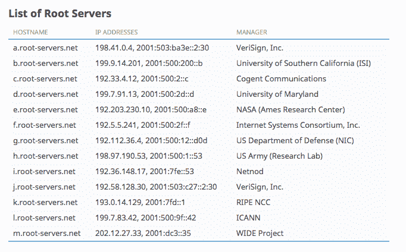
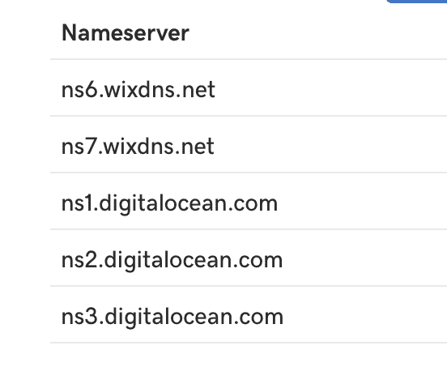

# 域名系统介绍

> 原文：<https://www.freecodecamp.org/news/understanding-the-domain-name-servers-46c6bcf9afa3/>

作者:苏梅德·尼姆卡德

# 域名系统介绍

如果你了解互联网的工作原理或计算机网络的工作原理，你可能都听说过或知道域名系统(DNS)。如果你不熟悉 DNS，我建议你去看看我以前的博客文章，这篇文章主要是关于计算机网络的。

主机名本身不能告诉我们我们试图与之通信的特定机器/硬件位于世界的什么地方。因此，所有通信都是通过 IP 地址完成的。

域名服务器是将主机名映射到运行服务的机器/硬件的 IP 地址的设备。

在这篇文章中，我将详细解释 DNS 查询的类型、DNS 服务器的类型和 DNS 记录的类型。

### DNS 解析器

DNS 解析器是互联网服务提供商(ISP)使用的计算机，用于在其数据库中查找用户请求的特定主机名。然后，他们将用户重定向到映射的 IP 地址。它们在 DNS 解析中起着至关重要的作用。

DNS 解析器也缓存数据。例如，我的网站`example.com`目前托管在一台 IP 地址为`35.195.226.230`的机器上。因此，世界各地的 DNS 解析器的缓存映射如下:

`example.com` - &克`t; 35.195.226.` 230

设想一下，在未来，如果我想把我的网站托管在世界上任何一台 IP 地址为，比如说，`35.192.247.235`的服务器上。世界上所有 DNS 解析器的 DNS 缓存在一段时间内仍将使用旧的 IP 地址。这可能会导致在 DNS 完全传播之前，无法通过传统方式访问网站。

DNS 解析器缓存中的记录会保留一段时间，这段时间称为生存时间(简称 TTL)。

这是记录缓存在 DNS 解析器中的时间。这可以在您购买域名的注册商的仪表板中进行设置。

注意:从现在开始，我将在这篇博文中只把 DNS 解析器称为解析器。

### DNS 服务器的类型

#### **根 DNS 服务器**

根 DNS 服务器拥有所有 TLD 域服务器的地址。在从主机名获取 IP 地址的过程中，请求首先会遇到根 DNS 服务器。

截至 2016 年，全球共有 13 个根域名服务器。这并不意味着只有 13 台机器来处理来自世界各地的请求负载——在底层有多台服务器来处理负载。

不同的组织管理根 DNS 服务器:

Credits: https://iana.org

#### **TLD 域名服务器**

这些是根据顶级域名分类的域名。它们通常是迭代查询在根 DNS 服务器之后遇到的下一个服务器。它们存储主机名的 TLD 特定记录。

比方说，如果我们请求一个 IP 地址`medium.com`，那么 TLD 域服务器将为。com”TLD 疑惑道。TLD 域服务器将权威 DNS 服务器的地址返回给解析器。

Fig. TLD Name servers pointing to the Authoritative Name servers

现在，问题出现了:TLD 域名服务器如何知道权威域名服务器的地址？答案很简单:当你从 Godaddy 或 Namecheap 等注册服务商处购买任何域名时，注册服务商也会将域名告知 TLD 域名服务器。因此它能够联系权威的名称服务器。

如今，一些注册服务商提供使用第三方权威域名服务器的能力。如上图所示，您可以在注册商的仪表板中设置权威域名服务器。

#### **权威 DNS 服务器**

这些最终会被解析器反复查询。它们存储 A 型、NS、CNAME、TXT 等的实际记录。

因此，它们会返回主机名的 IP 地址(如果有)。如果它甚至在权威的 DNS 服务器中也不可用，那么他们会抛出一个带有特定消息的错误，并且在域名服务器中搜索 IP 地址的过程结束。

### DNS 查询的类型

有三种类型的 DNS 查询:

**递归**:用户对解析器进行递归查询。这实际上是在进行任何 DNS 查找时进行的第一个查询。

解析者可以是您的 ISP 或您的网络管理员，但通常在大多数情况下都是 ISP。

**非递归:**在非递归查询中，解析器知道答案并立即响应，而无需对任何其他名称服务器进行任何进一步的查询。这是因为本地 DNS 服务器在其本地缓存中存储了 IP 地址，或者它只是直接查询权威的名称服务器。它们碰巧明确地保存了记录，这最终避免了递归查询。

**迭代**:当解析器由于可能没有缓存结果而无法返回结果时，就会发生迭代查询。因此，它向根 DNS 服务器发出请求。并且根 DNS 服务器知道在哪里可以找到特定的 TLD 域服务器。

因此，举例来说，如果我们试图获取比如说`medium.com`的 IP 地址，那么根域服务器将在其中存储`.com` TLD 服务器的地址，然后将它发送回解析器。然后，解析器向 TLD 服务器请求 IP 地址。TLD 域名服务器可能不知道，但它知道`medium.com`的权威 DNS 服务器的地址。

好了，理论到此为止。让我们通过流程图来理解它:

Fig. DNS Resolution

让我们逐步分解上图:

1.  用户向带有主机名的解析器发出请求，希望获得其 IP 地址。这是一个递归查询。
2.  解析器在其高速缓存中进行查找，以查看它是否存在于其中。
3.  如果是，它就把它返回给用户。
4.  如果没有缓存，它会向全球的根 DNS 服务器发出迭代请求。截至 2016 年，从 A — M 命名的根 DNS 服务器有 13 个，现在根 DNS 服务器查找请求域的 TLD。例如，如果主机名是`medium.com`，那么 TLD 就变成了”。并且根 DNS 服务器具有针对“的条目。它将结果返回给解析器。解析器必须拥有所有根域名服务器的地址。如果不是这样，DNS 查找首先可能会失败。
5.  现在，解析器再次向 TLD 域服务器发出迭代请求，请求该域的 IP 地址。然后，TLD 域服务器返回所请求域的权威服务器的地址。
6.  截至目前，我相信，你可能明白什么是权威的 DNS 服务器。它们包含主机名映射到 IP 地址的实际记录，因此 IP 地址返回给解析器(解析器再返回给用户)。
7.  如果在权威名称服务器中没有找到匹配的记录，则会抛出一条错误消息“DNS_PROBE_FINISHED_NXDOMAIN ”,表明没有所请求主机名的记录。
8.  在请求通过的所有域名服务器中，请求的主机名的结果被缓存，以便当任何其他用户请求同一个域时，记录将已经存在于 DNS 缓存中。
9.  总而言之，执行 DNS 查找最多需要四次查询。但是，执行查找几乎不需要几毫秒。

#### **DNS 传播的概念**

考虑，你有你的网站托管与一些供应商一样，数字海洋在任何机器与 IP "x "，你想转移网站托管到任何其他机器与不同的 IP 地址说" y "。您必须更改权威记录中的 IP 地址，以便流量导航到新的 IP 地址。

即使您更新了注册商/域名服务器仪表板中的记录，也需要一些时间才能反映到世界上所有解析器的缓存中。DNS 传播可能需要 24-72 小时，但通常会更快，因为大多数 ISP 保持低 TTL。

就是这样！

感谢您阅读这篇文章。如果你有任何问题，请在下面的评论中提问，并与你想分享的人分享这篇文章。

下一集见。玩得开心。谢谢你。

你可以看看我关于计算机网络的另一篇文章，这篇文章详细解释了它们:

[**什么是计算机网络以及如何真正理解它们**](https://medium.freecodecamp.org/computer-networks-and-how-to-actually-understand-them-c1401908172d)
[*无论您是开发领域的新手，还是已经构建了很长时间的人，或者即使您是……*medium.freecodecamp.org](https://medium.freecodecamp.org/computer-networks-and-how-to-actually-understand-them-c1401908172d)

如果你喜欢我的作品，你可以给我买杯咖啡，地址是:

[**给苏迈德·尼姆卡德买杯咖啡——BuyMeACoffee.com**](http://buymeacoffee.com/lunaticmonk)
[*大家好，我是苏迈德，我的工作是建造、打破和重建事物。*buymeacoffee.com](http://buymeacoffee.com/lunaticmonk)

请随时在 Twitter 上联系我。