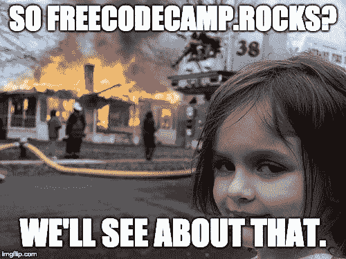
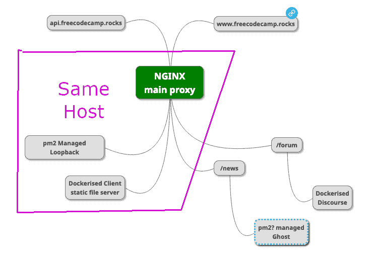
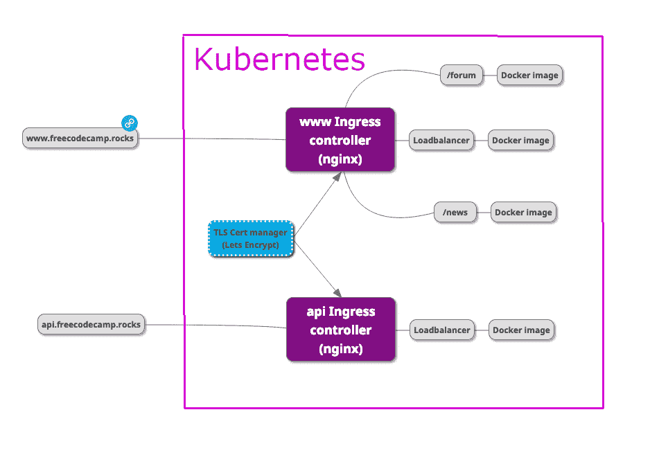
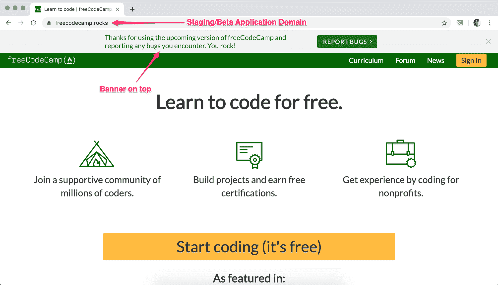

# 打破它。那告诉我们你是怎么打破的。

> 原文：<https://www.freecodecamp.org/news/break-it-then-tell-us-how/>

freeCodeCamp 学习平台的最新版本现已在 freeCodeCamp.rocks 上线。

我们正在对它进行测试，试图在 freeCodeCamp.org 上发布所有这些新代码之前发现新的错误。

如果你很好奇，下面是当前 freeCodeCamp.rocks 基础设施的样子:

下面是它可能很快会变成的样子:

大多数改进都是看不见的——到处都是速度的提升，安全性和正常运行时间的提高。

我们正在努力使所有这些变化都生效，这样我们就可以偿还一些技术债务。

然后，我们将继续致力于 2019 年的三大举措。(它们还没有在 freeCodeCamp.rocks 上上线，但我对它们非常感兴趣，所以我将继续与您分享它们):

### 倡议#1:国际化

我们已经将 freeCodeCamp 的课程和指南翻译成了五种主要的世界语言:

*   阿拉伯语
*   中国人
*   葡萄牙语
*   俄语
*   西班牙语

我们计划为这些语言社区部署并行的 freeCodeCamp 前端，所有这些前端都连接到相同的共享数据库。并且希望为这些语言中的每一种语言主持单独的论坛。

### 倡议#2:课堂模式

已经有数百名高中、大学、职业培训项目甚至监狱的教师将 freeCodeCamp 作为他们课程的一部分。

但是对于老师来说还是有点繁琐的过程。我们正在构建课堂工具，允许教师分配部分 freeCodeCamp 课程，并轻松可视化学生的进度。

### 倡议#3:学习小组的更好工具

freeCodeCamp 社区在世界各地的城市拥有超过 2000 个本地学习小组。许多这样的学习小组每周都聚在一起编码。其中一些甚至举办黑客马拉松和会议。

这些学习小组是以分散的方式运行的，主要是在脸书。他们中的大多数都有学习小组负责人，负责策划活动，并寻找当地赞助商提供场地。我们计划更好地支持这些研究小组的领导者、他们的成员和他们的赞助者。

所以我们决定建立我们自己的开源工具来组织这些学习小组和他们的活动。通过这种方式，学习小组可以完全控制他们的数据，并且我们可以根据他们的需要逐步构建新的功能。

## 如何帮助:打破东西

几个月来，我们一直致力于这些改进，我们的面孔与新代码如此接近，以至于我们很难发现错误。这就是你进来的地方。

在您的帮助下，我们可以在人们在生产中遇到问题之前解决很多问题。

转到 [freeCodeCamp.rocks](https://www.freeCodeCamp.rocks) 开始玩吧。freeCodeCamp.rocks 有自己的沙盒数据库，所以不用担心会损坏你的任何数据。你在 freeCodeCamp.rocks 上做的任何事情都不会在测试期后被保存。

在那里创建一个帐户。(注意:GitHub/谷歌/脸书的登录在 freeCodeCamp.rocks 上不工作，所以使用基于电子邮件的登录)。然后完成一些挑战，阅读一些指南文章，做任何你想做的事情。

然后——如果你发现了一个 bug——点击顶部横幅中的“报告 bug”按钮来创建一个 GitHub 问题——最好有截图和尽可能多的细节，这样我们就可以尝试重现这个 bug。

我们感谢您报告您遇到的错误，并帮助改进 freeCodeCamp.org。你真棒！