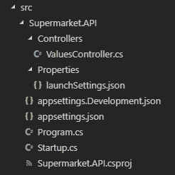

# 关于如何用 ASP.NET 核心构建 RESTful APIs 的精彩指南

> 原文：<https://www.freecodecamp.org/news/an-awesome-guide-on-how-to-build-restful-apis-with-asp-net-core-87b818123e28/>

由伊凡德罗·戈麦斯

本文将逐步指导如何实现干净、可维护的 RESTful APIs。

## 概观

RESTful 并不是一个新名词。它指的是一种架构风格，其中 web 服务从客户端应用程序接收数据并向其发送数据。这些应用程序的目标是集中不同客户端应用程序将使用的数据。

选择正确的工具来编写 RESTful 服务是至关重要的，因为我们需要关心可伸缩性、维护、文档和所有其他相关方面。ASP.NET 核心为我们提供了一个强大的、易于使用的 API 来实现这些目标。

在本文中，我将向您展示如何使用 ASP.NET 核心框架为“几乎”真实的场景编写一个结构良好的 RESTful API。我将详述一些常见的模式和策略来简化开发过程。

我还将向您展示如何集成通用框架和库，例如[实体框架核心](https://docs.microsoft.com/en-us/ef/core/)和[自动映射器](https://automapper.org/)，以交付必要的功能。

## 先决条件

我希望你了解面向对象的编程概念。

尽管我将涉及到 C#编程语言的许多细节，我还是建议你对这个主题有一个基本的了解。

我还假设你知道什么是 REST，HTTP 协议如何工作，什么是 API 端点，什么是 T2 JSON T3。[这里有一个关于这个主题的很棒的入门教程](https://medium.freecodecamp.org/restful-services-part-i-http-in-a-nutshell-aab3bfedd131)。最后一个要求是您理解关系数据库是如何工作的。

为了和我一起编码，你必须安装[。NET Core 2.2](https://dotnet.microsoft.com/download) ，还有 [Postman](https://www.getpostman.com/) ，我要用来测试 API 的工具。我推荐你用代码编辑器比如 [Visual Studio Code](https://code.visualstudio.com/) 来开发 API。选择您喜欢的代码编辑器。如果你选择这个代码编辑器，我建议你安装 [C#扩展](https://code.visualstudio.com/docs/languages/csharp)来更好地突出代码。

您可以在本文末尾找到指向该 API 的 Github 资源库的链接，以查看最终结果。

## 范围

让我们为一家超市编写一个虚构的 web API。假设我们必须实现以下范围:

*   创建一个 RESTful 服务，允许客户端应用程序管理超市的产品目录。它需要公开端点来创建、读取、编辑和删除产品类别，如乳制品和化妆品，还需要管理这些类别的产品。
*   对于类别，我们需要存储它们的名称。对于产品，我们需要存储它们的名称、计量单位(例如，按重量计量的产品为 KG)、包装中的数量(例如，如果产品是一包饼干，则为 10)以及它们各自的类别。

为了简化示例，我不会处理库存产品、产品运输、安全性和任何其他功能。给定的范围足以向您展示 ASP.NET 核心如何工作。

要开发这个服务，我们基本上需要两个 API 端点:一个管理类别，一个管理产品。就 JSON 通信而言，我们可以考虑如下响应:

**API 端点:** `/api/categories`

**JSON 响应(针对 GET 请求):**

```
{
  [
    { "id": 1, "name": "Fruits and Vegetables" },
    { "id": 2, "name": "Breads" },
    … // Other categories
  ]
}
```

**API 端点:** `/api/products`

**JSON 响应(针对 GET 请求):**

```
{
  [
    {
      "id": 1,
      "name": "Sugar",
      "quantityInPackage": 1,
      "unitOfMeasurement": "KG"
      "category": {
        "id": 3,
        "name": "Sugar"
      }
    },
    … // Other products
  ]
}
```

让我们开始编写应用程序。

## 步骤 1 —创建 API

首先，我们必须为 web 服务创建文件夹结构，然后我们必须使用[。NET CLI 工具](https://docs.microsoft.com/en-us/dotnet/core/tools/?tabs=netcore2x)来搭建一个基本的 web API。打开终端或命令提示符(这取决于您使用的操作系统)并按顺序键入以下命令:

```
mkdir src/Supermarket.API

cd src/Supermarket.API

dotnet new webapi
```

前两个命令只是为 API 创建一个新目录，并将当前位置更改为新文件夹。最后一个生成一个遵循 Web API 模板的新项目，这就是我们正在开发的应用程序。您可以阅读更多关于这些命令和其他项目模板，您可以生成[检查此链接](https://docs.microsoft.com/en-us/dotnet/core/tools/dotnet-new?tabs=netcore21)。

新目录现在将具有以下结构:



Project Structure

### 结构概述

一个 ASP.NET 核心应用程序由一组在`Startup`类中配置的[中间件](https://docs.microsoft.com/en-us/aspnet/core/fundamentals/middleware/?view=aspnetcore-2.2)(附加到应用程序管道的应用程序的小部分，处理请求和响应)组成。如果你以前已经使用过像 [Express.js](https://expressjs.com/) 这样的框架，这个概念对你来说并不陌生。