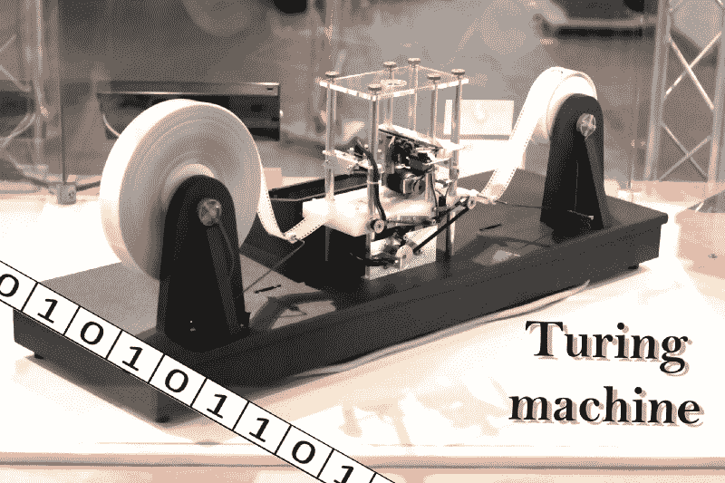

# 图灵机交互式模拟器如何帮助你理解算法

> 原文：<https://www.freecodecamp.org/news/how-the-turing-machine-interactive-simulator-can-help-you-understand-algorithms-a0fa88d0e057/>

作者耶戈·古格莱塔

# 图灵机交互式模拟器如何帮助你理解算法

让我们用一种模拟图灵机的新方法和程序来提醒自己 0 和 1 都是从哪里开始的。

很多读到这里的人可能知道我在说什么。但是对于那些不知道的人，我将解释什么是图灵机以及它如何与模拟器一起工作。