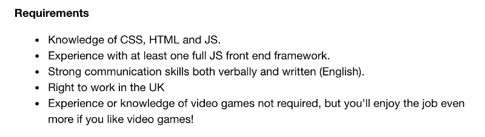
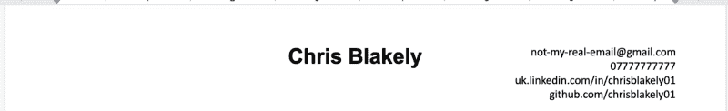
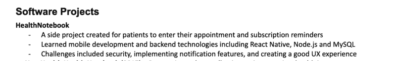
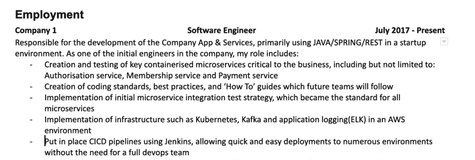
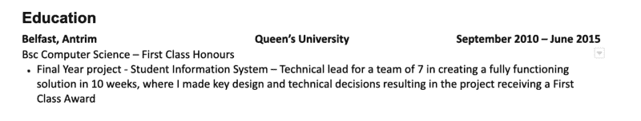

# 如何用几个简单的步骤写一份优秀的初级开发人员简历

> 原文：<https://www.freecodecamp.org/news/how-to-write-an-awesome-junior-developer-resume-in-a-few-simple-steps-316010db80ec/>

你已经看到了你梦想中的初级开发人员的招聘广告，并且正在考虑申请。是时候写那份简历了！没有什么比坐在一张白纸前不知道如何开始更好的了，对吗？

简历是招聘人员看到的第一样东西。这是进入面试过程的大门，也可能是得到你梦想中的工作和得不到工作的区别。有了一张 A4 纸，你会想确保它在检查中。

### 进入正确的心态

在开始你的简历之前，进入正确的心态是很重要的。信不信由你，你的态度会在简历中体现出来。在我自己招聘初级开发人员的职位上，很容易区分“真正想要这份工作”的人和“有点想要这份工作”的人。

对自己和自己能力的信心很重要。所以在你开始之前，站在镜子前，放上洛基主题曲(或者任何让你兴奋的东西)，告诉自己你很棒。

招聘人员对初级开发人员的主要要求是:

*   对技术的基本掌握
*   对技术的热情和一定程度的好奇心
*   愿意学习

他们知道你正处于职业生涯的开端。你不会从第一天起就被期望领导团队和设计系统。他们正在寻找有潜力，但也能为企业带来价值的人。

你想让招聘人员相信你有这些特质，你是这份工作的合适人选。

所以要勇敢，要自信，为你目前所取得的成就感到骄傲。—让我们把这些都写在纸上。

### 一份好的初级开发人员简历需要具备哪些条件？

招聘人员平均会花 15 秒浏览你的简历。是的，在阅读这一段的时间内，招聘人员会决定你是否要进入下一个面试阶段。

那么，你如何将所有重要的信息塞进值得阅读的 15 秒钟内呢？

*   保持简单。花哨的模板可能看起来不错，但招聘人员不在乎。有清晰的标题，漂亮的行间距，一致的，易读的字体。
*   保持在 1-2 页。
*   比起长段落，更喜欢简短的要点
*   简洁明了。尽量避免仅仅为了添油加醋而添油加醋

### 为公司量身定做

记住，你是在试图让公司相信你是初级开发人员的合适人选。然而，如果这个职位是 Python 开发人员，把你的简历集中在 JavaScript 和 React.js 上不会让你走得太远。

所以，研究一下你申请的职位，围绕列出的标准集中你的所有观点:

An example of the requirements expected from a junior developer

所以，如果你要申请这份工作，你要确保你的简历有大量关于项目和技能的细节，显示你知道前端开发。还有，提一下你有多爱电子游戏也无妨！；)

### 你应该如何组织一份简历？

招聘人员在简历中寻找的基本结构是:

*   个人详细信息/联系方式
*   工作经历(包括实习和非软件开发相关)
*   软件项目
*   教育
*   额外的经验和奖励
*   技术

虽然这个要看你的情况。确保把你最有价值/印象最深刻的部分放在靠近顶部的地方。

如果你是计算机相关专业的毕业生，有实习经历，这种结构很好。

然而，如果你是一个自学成才的开发人员，没有以前的经验，提高你的软件项目部分接近顶端，因为这将使你脱颖而出。

### 个人详细信息、联系方式、链接

这是容易的部分。在标题中保持简洁。你需要在中间写上你的名字，以及一些联系方式和 GitHub 的链接(如果有的话)。在这里尽量少用空间，我们有更多的技术问题要谈！

The header of my resume. Just my name and some contact info.

### 软件项目

如果你之前没有软件开发经验，这是你大放异彩的机会。对于初级开发人员的角色，招聘人员会关注这一部分，看看你是否具备工作所需的必要技能。

同样，即使你有实习经验，列出 1-2 个附带项目也会给人留下深刻印象，增加你获得面对面面试的机会。

列出 3-5 个你在 freeCodeCamp(一个编码训练营)或其他项目中完成的最好的项目。

确保每个项目展示不同的东西，

*   前端开发技能，
*   后端开发技能，
*   手机 app 开发技巧，
*   与最终用户合作，
*   UX/设计技能，
*   协作和团队工作技能，
*   挑战性问题

…等等。对于每个项目，列出以下内容:

*   使用的技术
*   项目的简短描述
*   你运用的技能和解决的问题

Short and to the point — Description, Skills, Technologies

将每个链接到你的 GitHub，或者更好的是，如果你有托管的话，放一个链接到 URL。你的代码不必完美。尽管要确保你的代码是专业的。当你的代码免受窥探时，拥有有趣的注释和变量可能看起来是个好主意，但招聘人员可能不这么认为。

利用这个机会展示你对技术和学习新事物的热情。请记住，这是招聘人员在寻找初级开发人员时所寻找的！

例如，你可以说:

> *“我遇到了*一些问题*，所以我用 React.js 和 Node.js 构建了一个 web 应用，它做了*一些很棒的事情*。还有，我真的很好奇学习服务器端开发"*

简单，但是有效。

### 雇用

你可以在这里列出你的工作经历(例如实习和以前的工作)。

没有发展相关的就业历史？请添加你最近的工作经历。例如，如果你是会计，把它写下来。

如果可以的话，加上你之前工作过的两份工作。

对于每一项，您都需要添加您的角色、公司名称以及您在该角色上花费的时间。

列出你在那里工作的项目，以及你在那个职位上完成的事情。这是我以前的一个角色的例子:

I achieved this layout using tables and hiding the borders in MS Word. No fancy designs here!

不要简单地陈述你做了什么，而是为什么你有所作为。例如，你可以说，

> “我致力于将社交登录和注册添加到应用程序中”

我想这没什么，它表达了我的意思。但不如这样:

> “负责社交登录和注册。这带来了快速便捷的登录，以及更多的注册和付费客户。”

这不仅简明扼要地概述了你做了什么，而且还说明了它对业务的影响。记住，公司正在寻找能产生影响的人。

但是如果没有之前的实习或者软件开发经验可谈呢？

别担心，你仍然可以列出你以前工作中的项目。这里的主要目的是向招聘人员展示你能够管理项目，能够在团队中工作，并且能够有效地为企业的成功做出贡献。

### 教育

你的简历进展顺利！现在是最后一些信息的时候了。

你应该加上你拥有的最高资格。添加几行关于你已经完成的最后一年的项目/论文也是一个好主意。如果你认为自己在*就业*和*软件项目*部分有点轻松，这会有所帮助。

在这一点上，你简历上的空间可能是有限的，所以尽量保持简短:

Remember to keep your resume consistent!

### 成就、爱好和技能

如果你有任何成就和成绩，请加上；比如领导活动或者奖项。如果你在业余时间参加聚会或会议，把这一点很好地添加到你的简历中。这将强化你的技能和对技术的热情。

最后，你想用你的技术相关技能增加 1-2 个客户。简单的逗号分隔列表就可以了。这有助于招聘人员快速了解你的专业领域。

### 不要做什么

*   尽量不要重复自己。如果你提到你使用 JavaScript，没有必要重复很多次
*   省略一般术语，例如，“我能与团队成员沟通”，而是展示如何沟通，例如，“在团队项目 X 中工作表明我能很好地沟通”。
*   不要撒谎。如果你以前没有使用过某种语言，那就把它从你的简历中去掉。有可能你会在面试中被发现，没有人希望这样。
*   不要因为项目或成就不完整而忽略它们，如果它增加了价值，就把它加进去！

*感谢阅读！*

我目前正在创建一系列指南、文章和视频课程，来帮助你踏上 web 开发之旅。如果你想成为其中的一员，请务必通过 [chrisblakely.dev](https://www.chrisblakely.dev/#sign-up) 加入邮件列表！