# 我如何重现脸书的微互动来发现特征

> 原文：<https://www.freecodecamp.org/news/how-facebook-designs-microinteractions-for-feature-discovery-c79cfe998a77/>

作者约纳坦·多伦

# 我如何重现脸书的微互动来发现特征

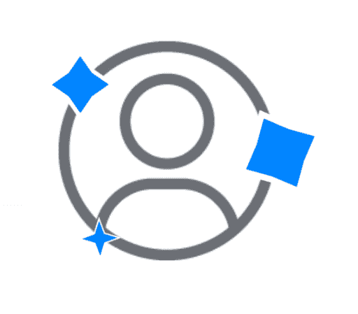

**演示定位** —示例在 Codesandbox.io 托管的 Vue.js 配置中，为了在导航后到达纯 HTML/SCSS 逻辑，单击`components`文件夹→然后单击`spark.vue`文件→HTML 被包裹在`<templa` te >标签周围→SCSS 只是被包裹了一个`round &`lt；style > tags 就这样→享受！:)

对于那些只想看代码示例的人来说，这里的[就是](https://codesandbox.io/s/z3x7vl176m)。

*如果你想直接挑战，点击[这里](#4c58)*

****一个微交互*** *是一个单次使用的、微妙的视觉队列，它将你的注意力吸引到状态的变化上。咖啡壶上的电源灯，或者按钮悬停时的颜色变化就是两个例子。*

#### 为什么？谁啊。！什么！？和一些方向

设计师和前端开发人员偶尔会遇到的一个常见的 UX 问题是**需要引入一个新特性**或暴露一个“隐藏得很好”的特性，由于某种原因，可能是功能混乱、设计糟糕或其他原因**用户很少与应用程序的该区域或特性进行交互**。

无论是您的公司希望开始从用户那里获得使用数据反应和反馈的新功能，还是由于某种原因很少使用的现有功能，这个问题都存在，我们在我们的行业中不时会遇到。

我在**脸书手机应用程序上发现了这个非常可能的解决方案。**脸书的交互设计师和前端开发人员决定从我的应用内导航栏中移除某个动作，并放置一个新的动作——我个人资料的快速链接。无论是他们专门研究了我的行为，还是这是一种更强烈的现象，在我看来，这绝对是一项有价值的事业。

#### 第一手的 UX 问题——解决了

我经常发现自己在寻找通过脸书应用程序浏览我的个人资料的最快方法。在大多数情况下，我会将视线转移到应用程序中的几个区域，进行视觉搜索，并点击几个充满期待的区域，以到达我的最终目的地，直到我最终到达我的个人资料(当然，这取决于你在会话期间处于哪个应用程序状态或屏幕)——总而言之，至少可以说这是一次不太愉快的体验。

在我看来，脸书，更确切地说是交互设计师和前端开发人员一起炮制了这个独特的解决方案，完美地解决了这个问题。

在我看来，他们试图传达的信息是，有一些新的、闪亮的、有趣的东西被赋予了我们用户。这类似于一份礼物，它向我们发出信号，表明这个新行为的解开和拆封将带给我们一个**般的愉快和渴望的体验。**此外，当瞥一眼脸书手机应用程序的静态屏幕时，唯一移动的部分是这个奇妙的闪闪发光的微交互——一个清晰的行动号召信号。

让我们来深入探讨一下这样一个强大的、精心设计的微操作和一个微操作狂热者(像我一样)是如何引发探索之旅的！

Original — Facebook telling me a new option is now available in my taskbar that I often use

My version — or wait is this the original? I am a bit confused…

#### 简单却强大而迷人

一个看似简单的 UI 元素——这三个简单的蓝色闪光短暂地出现在头像图标上——暗示着这个元素是一个“闪亮的新”礼物，让用户来解开，哦，兴奋——我等不及了！

一个据称简单的修饰和一个极简的头像图标——融合在一起成为一个优雅、聪明和简单的微交互，驻留在脸书移动应用程序的一个非常静态或空闲的屏幕上。这立即促使观察用户与这个 UI 元素进行交互，并发现它隐藏的优点——一个量身定制、正确设计和实现的行动号召。

#### 迎接挑战

对微交互的简单分析让事情变得非常清楚——找到一个相似或精确的图标将是一项相对简单的任务，而设计一个“火花”效果将是相当复杂的部分。

我邀请你跳上我的思维过程“列车”,分享我在实现预期最终结果的道路上形成想法、实验和发现洞察力的经验。

我也希望你能像我一样，通过利用 CSS `clip-path`属性来解决这个挑战，了解它的来龙去脉，从而学到一些新东西。

事不宜迟，让我们开始:)我上前将效果分解成更小、更易管理和直观的迷你挑战。

#### 剪辑？！路径！？精心制作…

`clip-path`是一个 CSS 属性，它切掉(剪辑)一个区域，该区域设置元素的哪一部分将被显示，而外面的部分被隐藏。

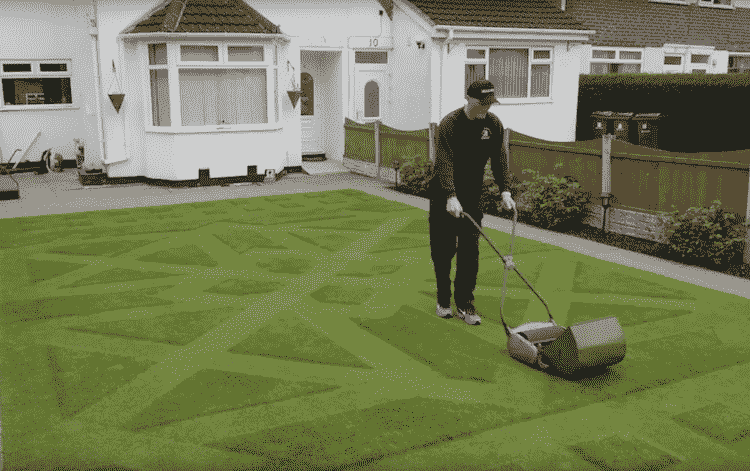

A developer using clip-path to make an intricate shape on his HTML Element

允许我们用 CSS 创建复杂的形状，将一个元素剪成某种形状(如圆形、三角形、椭圆形、多边形等等)。只要两个过渡形状具有相同的点数(坐标 x，y ),我们就可以进一步自由地在形状之间制作动画，并接收现成的淡入过渡和变形效果。

Me experimenting with clip-path to create some basic shapes

#### 动画分解

A single “Spark” effect in the microinteraction

将我的注意力集中在一个元素上，使得剖析每个被激活的动画变得更加容易。因此，我决定如下:

1.  `transform: scale(...)` —沿着动画生命周期从 0 到 1 再回到 0。
2.  我花了一点时间才意识到，这个忍者之星旋转到一个正方形再转回来总共是 180 度(从它的出现阶段到它的结束位置，其中火花也消失了)。
3.  `clip-path: polygon(...)` —这部分可能是这个单一火花效应挑战中更复杂和有趣的挑战之一，因此，我将在下面更详细地讨论它。

#### 缩放——火花效应的基石

元素缩放的时机对效果的“闪光”起着至关重要的作用，因为元素的快速出现和消失很大程度上就是一个火花的组成部分——一次短暂的闪亮访问，为我们的眼睛提供了暂时的愉悦。

#### 旋转——模糊线条，火花效果的“粘合剂”

随着缩放过渡，当元素第一次出现并立即开始从左向右旋转时，旋转使其更加生动和完整。这迫使人眼聚焦在由这种闪亮或闪光的感觉装饰的图标上。

#### 变形形状的纯 CSS 方式—剪辑路径:多边形(…)

有一定的限制，这是实现 CSS 形状变形效果的“本地”方式。

**已知问题**——在我们接触这项技术之前，我们开发人员必须清楚的第一个也是最重要的限制是 ***开始形状和结束形状中的坐标数量必须相等*** *—* 将**正方形**变成**矩形**是一种完美、简单的用法，可以与这项技术无缝配合。

#### 做实验

老实说，这几乎是我第一次在真实的工作相关用例中使用`clip-path:Polygon()`。因此，我决定冒险进行一些实验，以便在着手处理具体的挑战之前更好地理解它的输入和输出。

#### 实验 1——一种简单的方法——正方形→四点星形

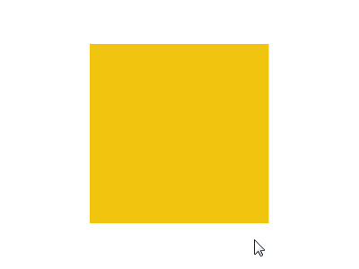

Square → 4-Point-Star Morphing on hover

哇，这只是我的第一次实验，我已经对`clip-path`:)感到兴奋了，尽管这里发生了一些非常奇怪的事情…变形方向似乎表现得很奇怪。原因很简单:原始形状共有 8 个坐标点，其中 4 个堆叠在每个角坐标上，因此导致了这种奇怪的变形行为。

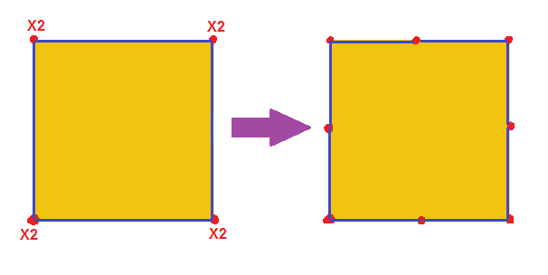

2 points(coordinates) stacked on each corner → 8 equally spread points along the square sides

进一步实验后，我发现了这个奇妙的工具，并利用它开始处理百分比而不是像素。我还可以用它在线编辑我的形状。总的来说，我强烈推荐尝试一下——这是 [Clippy](http://bennettfeely.com/clippy/) ！

#### 实验 2——调整的变形方向——正方形→四角星形

根据我的计划，下面的 gif 显示了一个简化的方法，我用一个 200 像素乘 200 像素的正方形来尝试解决这个问题:

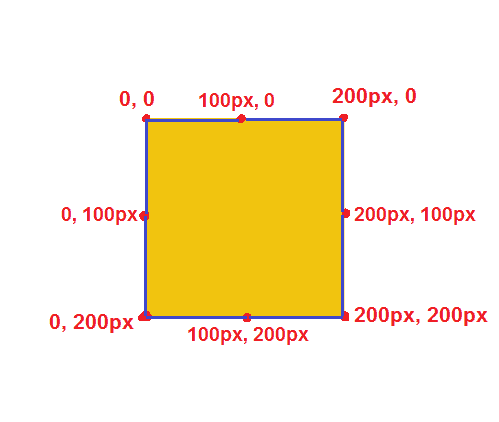

Planning the morphs step by step frames

一个简单的坐标调整——将 4 个隐藏点平均分布在正方形上(角之间)——将有望产生更平滑的变形效果，并指向正确的方向(分别垂直和水平),指向两个形状的中心，而不是像以前那样指向对角线方向:

Aha Success! — The Morphing effect looks decent now

#### 实验 3——八角形→正方形

Single Spark Element — slowed down to see the Octagon and Square Phases

如果我们仔细地反复观察上面的单火花效果，我们会短暂地注意到在动画的某个地方，大约 50%的火花变成了八边形。此外，在八边形之前和之后的阶段，火花变形为正方形。

这似乎是一个很简单的任务，不是吗？我想我应该使用`clip-path`将我之前的正方形变形为八边形，就像上面的 gif。现实有一点不同，我必须改变初始形状，绘制它的`polygon(...)`有点不同，以便在转换时在八角形内有正方形。

`clip-path`的操作方式是使用属性在元素中创建所需的剪辑区域，因为我的原始正方形占据了元素的整个区域。我不能用当前的坐标分配在这个区域之外变形。

必须做一些调整——我现在还转向使用百分比来支持来自父元素的形状的动态宽度/高度。

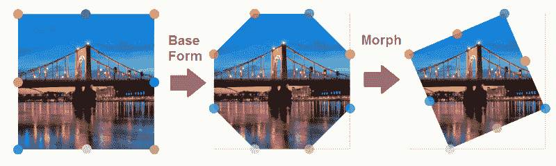

瞧——我们取得了一些进展，现在我们有了一个八边形，它可以转换成正方形，然后再转换回来。但是等等…我们还没完呢！

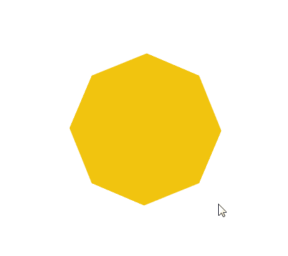

Breathing Octagons are real?!

#### 实验 4—八角形→四角星形→背面(全循环)

现在我们知道八边形是变形形状的最大外观，我们可以使我们的变形形状更加精确，并在其实际相位 4 点星形→八边形→背面之间转换，如下所示:

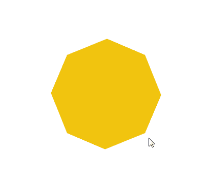

That’s more like it

#### 实验 5—缩放和无限循环动画

所以我开始了这个实验，首先从悬停事件转移到一个即时触发的无限动画，首先使用`scale(...)`变换使星星分别出现和消失，如下所示:

Now you see me, now you don’t — demo [*here*](https://codesandbox.io/s/j4z7nvzwry)

#### 实验 6—旋转、开始和结束位置

再做一些调整，使星星在开始位置放大到最大尺寸，并用`transform:rotate(180deg)`确定它的最终位置

It’s-A Rotating, Mario! — demo [*here*](https://codesandbox.io/s/m4x0kq0l3y)

#### 边境挑战

经过一段时间的试验，我意识到我目前所完成的不会令人满意。在最初的例子中，似乎当火花出现在最初的微交互中的图标上方时，它们沿着形状有某种白色的边界，随着形状通过其`keyframes`的每一步而变形:

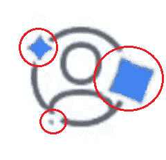

A bit enlarged — but it is clear that borders are present along the morphing

#### 实验 6——建立一个随着火花变化的边界

在互联网上搜索解决方案、堆栈溢出和文章中的其他建议来解决这个问题后，我明白这个挑战是非常独特的。我找不到任何具体的方法来解决我的问题。事实上，我的边界必须“坚持”的形状，而它变形更复杂的事情。所以我冒险做了一些测试，直到找到解决办法。

一个“火花克隆”正好呈现在我的主要火花元素之前，作为一个兄弟元素，这是一个完美的解决方案。两者都必须通过`justify-content: center`和`align-items: center`垂直和水平定位到其包装的中心，以实现以下目的:

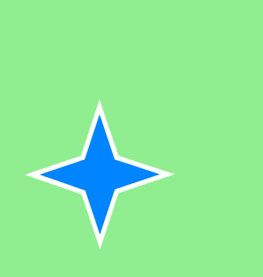

但是强尼等等！你如何确保克隆体在变形动画中跟随它的兄弟？在尝试同时制作父母和孩子的动画并经历了一些奇怪的浏览器问题或错误后，我发现使用`flex`的兄弟方法提供了最佳解决方案，如下所示:

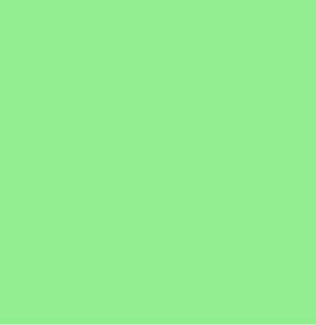

Siblings animating simultaneously created a perfectly adjusting border — demo [*here*](https://codesandbox.io/s/q3yw5lo8zq)

### 将这些点连接起来

在这个时间点上，我已经感觉到这个项目中的艰难挑战已经告一段落。我现在要做的就是找到一个类似的头像图标，位置 3 火花，手动调整他们的位置，直到我满意为止，并调整他们的宽度/高度，直到我达到最终结果。

An enlarged version to better see how things work

The final Microinteraction — demo [here](https://codesandbox.io/s/z3x7vl176m)

### 摘要

总而言之，我喜欢挑战自己，重新创建这个微交互。我学到了很多关于我们日常生活中一个看似简单的元素(就像我们使用的软件的开发者发出的点击新图标的邀请)实际上不仅仅是一组完美定时和正确定向的元素和动画。

这种量身定制的微交互是一件艺术品。它是一个独特的 UI 元素，被精心设计来解决一个难题。在我们的案例中，脸书的开发人员修改了我的手机应用程序的导航栏，删除了一个我不常使用的图标，并用一个允许我执行一个我一直在努力寻找并多次想要执行的操作的图标取而代之——回到我的个人资料。

这是一个聪明的决定，一个驻留在静态屏幕中的精心制作的微交互。它是屏幕上唯一移动的部分，虽然在屏幕上非常小，但图标边缘闪亮的星星吸引了我的眼睛和手指自动点击它。现在我更加欣赏它背后的工作和思想——所以感谢脸书的交互设计师和前端开发人员构建了这么棒的微交互！

### 结论

我鼓励你们敢于尝试通过构思和实验来解决困难的 UI 和 UX 问题。虽然达到最终结果并获得成功是件好事，而且可能有点自我提升，但我认为这是经历中不太重要的一部分。

在我看来，你冒险经历的旅程，带着你的实验、思考和咨询他人的技能，是最精彩的部分。简而言之，你所经历的学习和领悟过程比目的地更重要，也更有意义。

#### 评论家

非常感谢这些伟大的人对我的文章草稿的帮助和反馈，你们太棒了！；)——[贾里德·m·斯波尔](https://www.freecodecamp.org/news/how-facebook-designs-microinteractions-for-feature-discovery-c79cfe998a77/undefined) [约尼·魏斯布罗德](https://www.freecodecamp.org/news/how-facebook-designs-microinteractions-for-feature-discovery-c79cfe998a77/undefined) [奥菲尔·奥瓦迪亚](https://www.freecodecamp.org/news/how-facebook-designs-microinteractions-for-feature-discovery-c79cfe998a77/undefined) [马頔·维什涅维斯基](https://www.freecodecamp.org/news/how-facebook-designs-microinteractions-for-feature-discovery-c79cfe998a77/undefined)

### 现在怎么办？

我会感谢反馈，掌声，分享。当然，你可以在这里找到所有的代码、演示&一个可以玩的真实沙盒，以及为了方便使用而组织起来的 API 文档[。](https://codesandbox.io/s/z3x7vl176m)

更多我推荐的关于**产品设计的帖子，UX &前端** :
[中拍手用香草 JS](https://medium.com/@yonatandoron/how-i-implemented-the-medium-clap-from-scratch-4a16ac90ad3b) 重新创建——全攻略指南
[星级——让 SVG 再次伟大](https://uxdesign.cc/star-rating-make-svg-great-again-d4ce4731347e)——一步一步的代码教程

更多 **Vue 组件** :
[Vue 动态下拉](https://github.com/JonathanDn/vue-dropdown) —一个可定制的、易于使用的优雅下拉
[Vue 动态星级](https://github.com/JonathanDn/vue-stars-rating) —一个动态 Vue 星级组件(类似 google play)

我是 Jonathan Doron，一名对以用户为中心的前端和模块化客户端架构有着极大热情的 Web 开发人员。

这些天让我兴奋的是探索**交互设计**的海洋，更具体地说是**微交互**以及它们对我们生活的影响。我通过重新创建现有的交互以及设计我自己的交互来做到这一点，作为我寻求加深我在该领域的知识的一部分。

欢迎你关注我，发微博或给我发信息，有任何问题，反馈或建议！— [推特](https://twitter.com/jodoron)