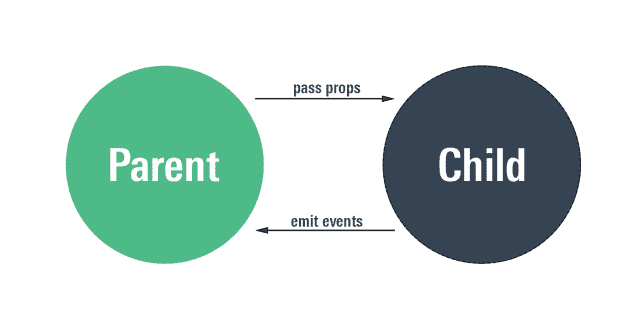

# 如何在 ReactJS 中更新组件的属性——哦，是的，这是可能的

> 原文：<https://www.freecodecamp.org/news/how-to-update-a-components-prop-in-react-js-oh-yes-it-s-possible-f9d26f1c4c6d/>

作者:Dheeraj DeeKay

# 如何在 ReactJS 中更新组件的属性——哦，是的，这是可能的

如果你读过 React 官方文档(你应该读，因为它是 React 上的一个很好的资源)，你会注意到[这几行文字](http://this.props.onNameChanged('New name')):

> 无论你声明一个组件[为函数还是类](https://reactjs.org/docs/components-and-props.html#function-and-class-components)，它绝不能修改自己的道具。
> React 非常灵活，但它有一个严格的规则:
> **所有 React 组件必须表现得像关于它们的道具的纯函数一样。**

道具是永远不会更新的。我们要照原样使用它们。听起来很僵硬，对吧？但是 React 在这个规则后面有它的理由，我很相信他们的推理。不过，唯一的警告是，在某些情况下，我们可能需要启动一个道具的更新。我们很快就会知道怎么做。

考虑来自父组件的以下代码行:

`<MyChild childName={this.state.parentName}` / >

这是每个 React dev 可能都熟悉的一个简单的行。您正在调用子组件。在这样做的同时，您也将父对象的状态(`parentName`)传递给了子对象。在子组件中，这个状态将作为`this.props.childName.`被访问。

现在，如果需要更改名称，`parentName`将在父节点中更改，并且该更改将自动传递给子节点，就像 React 机制一样。这种设置适用于大多数场景。

但是，如果您需要更新子组件的 prop，并且所需的更改知识和更改它的触发器只有子组件知道，该怎么办？考虑到反应的方式，数据只能从上到下流动，即从父到子。那么，我们如何与家长沟通，要求更换道具呢？

虽然这是反模式的，不推荐使用，但是编写这种语言的开发人员已经把我们包括在内了。惊喜！

我们可以通过复试来实现。我知道，一点也不奇怪！它们似乎对我们面临的每一个问题都很有用。好吧，好吧，现在怎么办？



想象一下，如果上面对孩子的调用被修改成这样:

`<MyChild childName={this.state.parentName} onNameChange={this.onChange}` / >

现在，除了道具`childName`之外，我们的贫困儿童还暴露了一个名为`onNameChange`的事件。这是解决问题的方法。我们的孩子已经尽了自己的责任。现在轮到家长做要求做的事了。它不需要烦恼。它所需要做的就是定义一个函数`onChange`为

```
function onChange(newName) {   this.setState({ parentName: newName });}
```

就是这样。现在，无论何时何地，只要我们希望在子组件中更新`parentName`属性，我们所要做的就是调用``this.props.onNameChange(' My New name')`,瞧！你会得到你想要的。就是这样。搞定了。

希望这很容易理解。让我在评论中知道任何困难或不同的方式可以使它变得更容易。谢了。

***最后一件事。***

React 反驳了这一点，他们说得很对。这是反模式的。因此，每当你遇到这种情况时，检查一下你是否能提升你的状态，或者是否有任何方法可以分解你的组件。这听起来可能有点乏味，但要知道这是 React 中应该有的方式！

快乐编码。