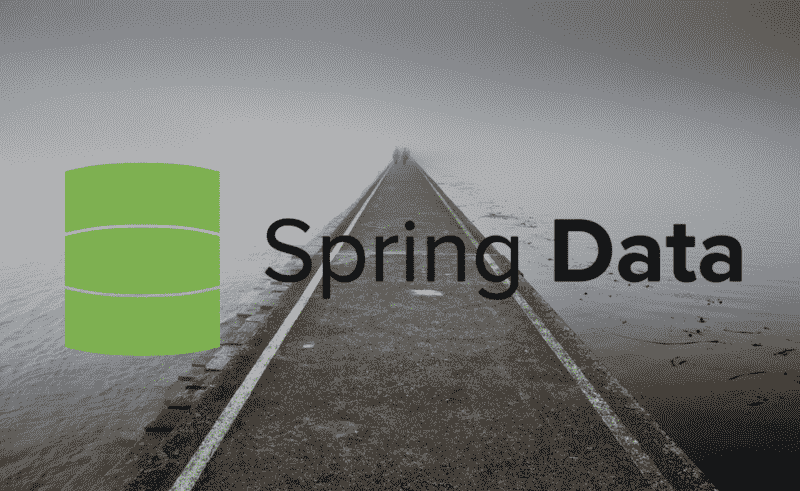

# Spring 和 R2DBC 的反应式关系数据库访问简介

> 原文：<https://www.freecodecamp.org/news/an-introduction-to-reactive-relational-database-access-with-spring-and-r2dbc-1a9447d4b122/>

丹尼尔·牛顿

# Spring 和 R2DBC 的反应式关系数据库访问简介



[Jetty](https://pixabay.com/en/jetty-fog-pier-dawn-lake-light-1850884/) By [Pexels](https://pixabay.com/en/users/pexels-2286921/)

不久前，JDBC 驱动程序的一个反应式变体被发布，称为 R2DBC。它允许数据异步传输到任何订阅它的端点。将 R2DBC 这样的反应式驱动程序与 Spring 结合使用，WebFlux 允许您编写一个完整的应用程序来异步处理数据的接收和发送。

在这篇文章中，我们将关注数据库，从连接到数据库，最后保存和检索数据。为此，我们将使用 Spring 数据。与所有 Spring 数据模块一样，它为我们提供了开箱即用的配置。这减少了我们为设置应用程序而需要编写的样板代码的数量。最重要的是，它在数据库驱动程序上提供了一个层，使简单的任务变得更容易，更困难的任务变得不那么痛苦。

对于这篇文章的内容，我使用了 Postgres 数据库。在撰写本文时，只有 Postgres、H2 和微软 SQL Server 拥有自己的 R2DBC 驱动程序实现。

我之前写过两篇关于反应式 Spring 数据库的文章，一篇关于 [Mongo](https://lankydanblog.com/2017/07/16/a-quick-look-into-reactive-streams-with-spring-data-and-mongodb/) ，另一篇关于 [Cassandra](https://lankydanblog.com/2017/12/11/reactive-streams-with-spring-data-cassandra/) 。您可能已经注意到，这两个数据库都不是 RDBMS 数据库。现在已经有其他的反应式驱动可以使用很长时间了(我在将近 2 年前写了 Mongo 帖子)，但是在为 RDBMS 数据库写反应式驱动的时候，它仍然是一个相当新的东西。这篇文章将遵循类似的格式。

此外，我还写了一篇关于使用我在介绍中提到的 [Spring WebFlux](https://lankydanblog.com/2018/03/15/doing-stuff-with-spring-webflux/) 的帖子。如果您有兴趣开发一个完全反应式的 web 应用程序，请随意查看。

### 属国

这里有几点需要指出。

你使用 Spring Boot 越多，你就越习惯于为你想做的酷事情导入一个单独的`spring-boot-starter`依赖项。例如，我希望会有一个`spring-boot-starter-r2dbc`依赖项，但是不幸的是，没有。还没有。

简而言之，这个库是较新的，在编写本文时，它还没有自己的 Spring Boot 模块，该模块包含它需要的任何依赖项以及通过自动配置实现的更快设置。我确信这些东西会在某个时候出现，并使设置 R2DBC 驱动程序变得更加容易。

现在，我们需要手动填充一些额外的依赖项。

此外，R2DBC 库只有里程碑版本(更多的证据表明它们是新的),所以我们需要确保引入 Spring Milestone 存储库。我可能会需要更新这个职位，在未来当它得到一个发布版本。

### 连接到数据库

由于 Spring Data 为我们做了很多工作，唯一需要手动创建的 Bean 是包含数据库连接细节的`ConnectionFactory`:

这里首先要注意的是`AbstractR2dbcConfiguration`的扩展。这个类包含了我们不再需要手动创建的 Beans。实现`connectionFactory`是该类的唯一要求，因为它是创建`DatabaseClient` Bean 所必需的。这种结构是 Spring 数据模块的典型结构，所以在尝试不同的数据模块时感觉非常熟悉。此外，我希望一旦自动配置可用，这种手动配置将被删除，并通过`application.properties`单独驱动。

我已经在这里包含了`port`属性，但是如果您没有使用 Postgres 配置，那么您可以依赖于默认值`5432`。

由`PostgresqlConnectionFactory`定义的四个属性:`host`、`database`、`username`和`password`是使其工作的最低要求。少于此数，您将在启动时遇到异常。

使用这种配置，Spring 能够连接到正在运行的 Postgres 实例。

这个例子中最后一条值得注意的信息是`@EnableR2dbcRepositories`的使用。这个注释指示 Spring 寻找任何扩展 Spring 的`Repository`接口的存储库接口。这被用作检测 Spring 数据仓库的基本接口。在下一节中，我们将对此进行更深入的探讨。从这里得到的主要信息是，您需要使用`@EnableR2dbcRepositories`注释来充分利用 Spring Data 的功能。

### 创建 Spring 数据仓库

如上所述，在这一节中，我们将研究如何添加一个 Spring 数据存储库。这些存储库是 Spring Data 的一个很好的特性，这意味着您不需要编写大量额外的代码来简单地编写一个查询。

不幸的是，至少在目前，Spring R2DBC 不能像其他 Spring 数据模块那样推断查询(我确信这将在某个时候添加)。这意味着您将需要使用`@Query`注释并手工编写 SQL。让我们来看看:

这个接口扩展了`R2dbcRepository`。这依次延伸到`ReactiveCrudRepository`，然后向下延伸到`Repository`。`ReactiveCrudRepository`提供了标准的 CRUD 功能，据我所知，`R2dbcRepository`没有提供任何额外的功能，而是一个为更好的情景命名而创建的接口。

`R2dbcRepository`接受两个通用参数，一个是实体类，它将其作为输入并产生输出。第二个是主键的类型。因此在这种情况下，`Person`类由`PersonRepository`管理(有意义)，而`Person`中的主键字段是一个`Int`。

这个类和`ReactiveCrudRepository`提供的函数的返回类型是`Flux`和`Mono`(这里看不到)。这些是 Spring 用作默认反应流类型的项目反应器类型。`Flux`表示多个元素的流，而`Mono`是单个结果。

最后，正如我在前面的例子中提到的，每个函数都用`@Query`进行了注释。语法非常简单，SQL 是注释中的一个字符串。`$1`(更多输入为`$2`、`$3`等)代表输入到功能中的值。一旦您完成了这些，Spring 将处理剩下的工作，并将输入传递给它们各自的输入参数，收集结果并将其映射到存储库的指定实体类。

### 快速浏览实体

这里就不多说了，只是简单的展示一下`PersonRepository`使用的`Person`类。

实际上，这里有一点需要说明。`id`已被设置为可空，并提供了默认值`null`以允许 Postgres 自己生成下一个合适的值。如果这不可为空，并且提供了一个`id`值，那么 Spring 实际上会在保存时尝试运行更新，而不是插入。有其他方法可以解决这个问题，但我认为这已经足够好了。

该实体将映射到下面定义的`people`表:

### 亲眼目睹这一切

现在让我们看看它实际上在做什么。下面是一些插入一些记录并以几种不同方式检索它们的代码:

关于这段代码，我要提一件事。很有可能它在没有实际插入或读取某些记录的情况下执行。但是，仔细想想，还是有道理的。反应式应用程序意味着异步地做事情，因此这个应用程序已经开始在不同的线程中处理函数调用。如果不阻塞主线程，这些异步进程可能永远不会完全执行。出于这个原因，这段代码中有一些`Thread.sleep`调用，但是为了保持整洁，我将它们从示例中删除了。

运行上面代码的输出类似于下面这样:

```
[ main] onSubscribe(FluxConcatMap.ConcatMapImmediate)[ main] request(unbounded)[actor-tcp-nio-1] onNext(Person(id=35, name=Dan Newton, age=25))[actor-tcp-nio-1] onNext(Person(id=36, name=Laura So, age=23))[actor-tcp-nio-1] onComplete()[actor-tcp-nio-2] findAll - Person(id=35, name=Dan Newton, age=25)[actor-tcp-nio-2] findAll - Person(id=36, name=Laura So, age=23)[actor-tcp-nio-4] findAllByName - Person(id=36, name=Laura So, age=23)[actor-tcp-nio-5] findAllByAge - Person(id=35, name=Dan Newton, age=25)
```

这里要带走一些东西:

*   `onSubscribe`和`request`出现在调用`Flux`的主线程上。只有`saveAll`输出这个，因为它包含了`log`功能。将它添加到其他调用中会导致记录到主线程的相同结果。
*   包含在 subscribe 函数中的执行和`Flux`的内部步骤在不同的线程上运行。

这与您在实际应用程序中如何使用反应式流的真实表现相去甚远，但希望演示如何使用它们，并提供一些关于它们如何执行的见解。

### 结论

总之，由于 R2DBC 驱动程序和 Spring 数据在上面构建了一个层，使一切都变得更加整洁，反应流已经出现在一些 RDBMS 数据库中。通过使用 Spring Data R2DBC，我们能够创建到数据库的连接并开始查询它，而不需要太多代码。

虽然春天已经为我们做了很多，但它还可以做得更多。目前，它不支持 Spring Boot 自动配置。这有点烦人。但是，我相信很快就会有人着手做这件事，并把一切做得比现在更好。

这篇文章中使用的代码可以在我的 [GitHub](https://github.com/lankydan/spring-data-r2dbc) 上找到。

如果你觉得这篇文章很有帮助，你可以在 Twitter 上关注我，地址是 [@LankyDanDev](https://twitter.com/LankyDanDev) 来了解我的新文章。

[查看丹·牛顿的所有帖子](https://lankydanblog.com/author/danknewton/)

*最初发布于[lankydanblog.com](https://lankydanblog.com/2019/02/16/asynchronous-rdbms-access-with-spring-data-r2dbc/)2019 年 2 月 16 日。*