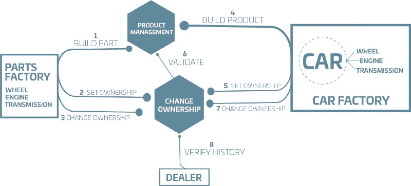
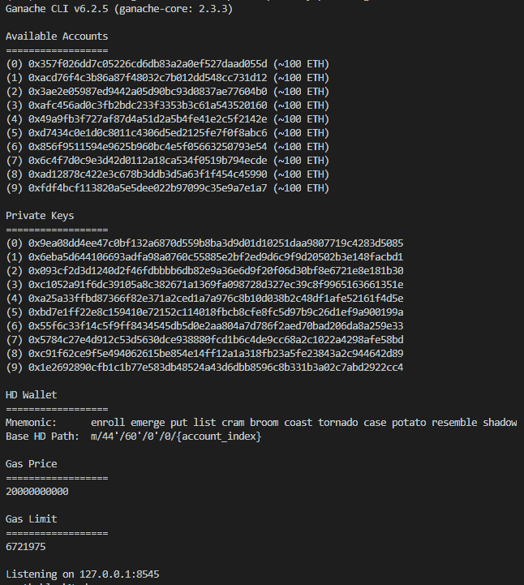
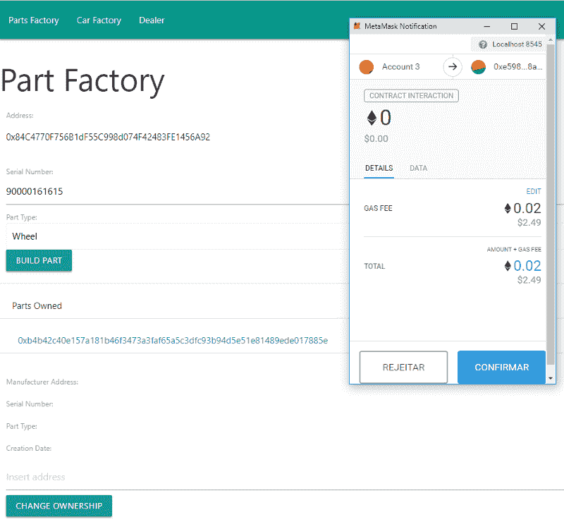
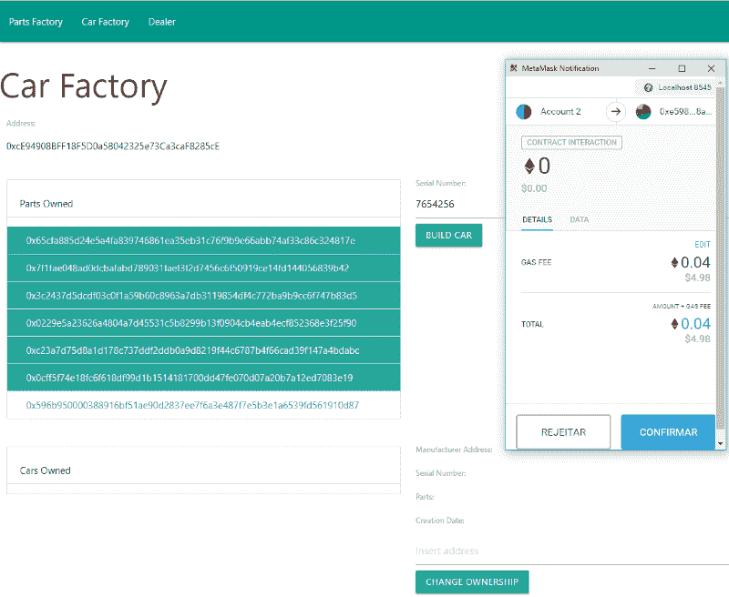
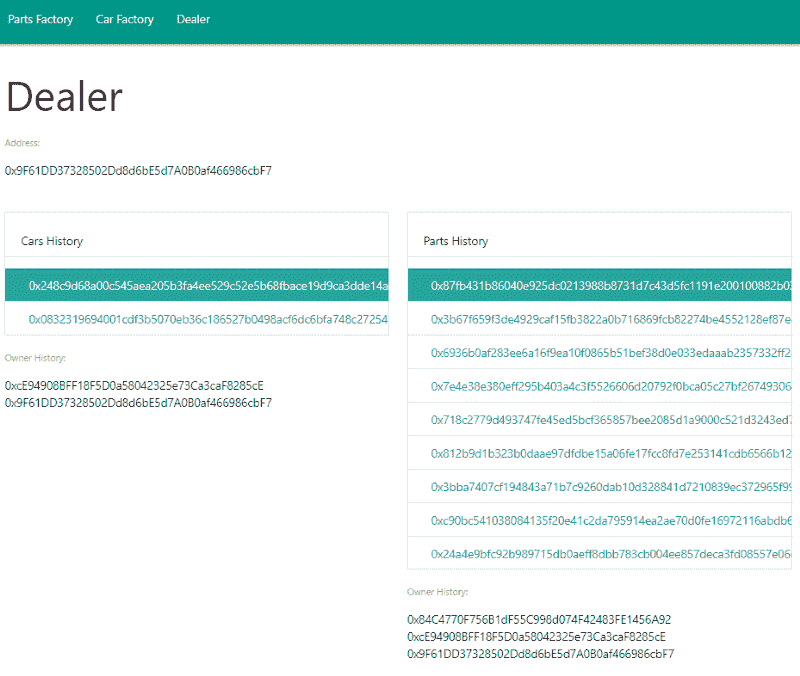

# 如何利用以太坊构建汽车制造供应链系统

> 原文：<https://www.freecodecamp.org/news/how-to-build-a-car-manufacturing-supply-chain-system-using-ethereum-cbb87144cde5/>

马塞洛·俄罗斯潜水

# 如何利用以太坊构建汽车制造供应链系统


Image by [PIRO4D](https://pixabay.com/pt/users/piro4d-2707530/?tab=about) on [Pixabay](https://pixabay.com/pt/produ%C3%A7%C3%A3o-circuito-global-2612056/)

在 [Daitan](http://www.daitan.com/) 这里，我们一直在寻找新的技术来帮助我们的客户更有效地解决他们的问题。最近，区块链引起了我们和我们客户的极大关注。

在本文中，我们的目标是介绍一种基于区块链平台实现您自己的供应链应用程序的实用方法！

该系统被用于解决我认为应用区块链给出最高价值的一个问题:供应链。

这个应用程序最近在 PoCs 上被探索了很多，大公司已经在他们的运营中试验这个应用程序了。

使用区块链来解决这类问题是一个很好的选择，因为我们可以受益于该技术固有的透明性和高效的来源跟踪。

由于这篇文章是简单的，不是一个完整的项目，我们将简化这个问题。

最后，我们仍然有一个端到端的系统，可以证明该技术对这一组特定问题的适用性。

### 选择平台

目前有很多平台允许您制作自己的区块链或为自己的项目使用公共区块链，因此我们将利用一个平台，而不是从头开始构建。

这些项目得到了来自企业和开源社区的很多支持，所以我们相信使用一个是解决大多数问题的最实用的途径，允许我们关注业务逻辑而不是基础设施。

对于我们的演示，我们选择了[以太坊项目](https://www.ethereum.org/)。它是一个流行的平台，所有可用的开发工具都使得在其上实现解决方案变得容易。

### **制造业的故事**

我们已经建立了领域，但是我们具体打算做什么呢？
让我们描述一个简单的汽车制造问题，以及这个过程中涉及的参与者。

首先，我们有零件工厂，负责生产车轮、车身零件、发动机和变速器。工厂使用“产品管理”智能合同通知每个零件生产，该合同将保留每个零件和产品的详细信息。

此外，工厂通过调用“ChangeOwnership”智能契约中的方法来声明它是特定部件的所有者，该契约将保留每个部件和产品的所有者历史。

在链条上更进一步，我们有一个汽车厂，从零件厂购买零件来制造汽车。“ChangeOwnership”合同是我们保留这种类型的操作的地方，所以我们有另一种方法允许零件厂将零件所有权转移给汽车厂。

有了足够的零件，汽车厂终于可以开始制造汽车了。类似于零件厂通知其工作的方式，汽车厂现在使用“产品管理”智能合同来陈述特定的汽车装配。每辆汽车都有一组属性，比如序列号，还有一个零件列表，将汽车与特定零件联系起来。

所有权由“变更所有权”合同控制，因此汽车工厂将汽车所有权设定为自己所有。

最后，我们将经销商添加到场景中，他们可以从工厂购买汽车，后者可以使用“ChangeOwnership”转让汽车所有权。区块链存储了涉及该车或组成该车的任何零件的每一笔交易，因此经销商(或任何其他零件)可以跟踪某一特定商品所经历的一切。在我们的例子中，这种跟踪将通过观察事务生成的事件来完成。当我们分析代码时，这一点会变得很清楚。

完整的产品流程见下图:



Car Manufacturing Supply Chain

我们知道要做什么，但我们仍然需要用一些工具来武装自己，以实现开发。

### **环境和工具**

首先，我们需要明确区分以太坊生态系统的网络。主网络(称为 Mainnet)是真正的应用程序所在的地方，每个以太单元都有真正的价值。

这意味着只要以太坊本身存在，你在那里记录一切就必然存在。此外，乙醚只能通过采矿或用真金白银购买来获得。

使用这个网络来开发演示似乎不是一个好主意，所以有其他更好的网络来支持开发。这些网络可以是公共网络，比如 Rinkeby，或者你甚至可以创建自己的以太坊网络！

虽然使用像 Rinkeby 这样的公共测试网络为我们提供了一种更好的方法来验证我们的 DApp(分散式应用程序)，但我们将创建自己的网络来缩短交易接受时间，并最大限度地简化开发。

我们用来创建网络的工具叫做 [Ganache](https://truffleframework.com/ganache) 。

Ganache 是一个简单的工具，可以创建一个本地以太网，你可以像连接主网络一样连接它。它还为您提供 10 个帐户，每次运行 100 乙醚。

我喜欢生活在终端上，所以我将使用 [ganache-cli](https://github.com/trufflesuite/ganache-cli) ，这是 Ganache 的命令行版本，是一个基于 NodeJS 的工具，可以与 npm 一起安装:

`npm install -g ganache-cli`

要运行，只需执行`ganache-cli`即可！当您运行 CLI 时，它将为您的钱包生成一个助记符。助记符是一个 12 个单词的短语，它是生成帐户私钥以及钱包的基础。

输出如下图所示:



保存助记符以备后用。每当您需要再次运行 Ganache 时，您都可以通过提供带有-m 参数的助记符来保留相同的帐户:

`ganache-cli -m "now frame tenant chronic oven cube minute immune leaf clock demand volume"`

**注意:Ganache 创建的助记符不安全，不应用于以太坊网络上的钱包**

现在我们有了自己的网络，我们需要能够测试和部署我们的合同。这是由另一个名为 [Truffle](https://truffleframework.com/truffle) 的工具完成的，它是与 Ganache 相同的开发套件的一部分。Truffle 也可以与 npm 一起安装，所以只需运行:

`npm install -g truffle`

我们将使用 Truffle 来准备我们的项目结构，所以运行`truffle init`并检查创建的文件夹结构:

```
ethereum-supply-chain|-contracts| — Migrations.sol|-migrations| — 1_initial_migration.js|-testtruffle-config.js
```

*   合同:包含我们的智能合同的代码
*   迁移:包含我们合同的部署说明
*   测试:包含合同的测试
*   Truffle-config.js(或 truffle.js，取决于您的操作系统):主配置文件，指向我们可以部署到的以太坊网络

配置文件附带了很多内容，但是大部分都是注释的。要将我们的本地网络添加到部署选项中，只需取消注释以下部分(第 49–53 行):

最后，我们需要为我们的用户提供一个接口，让他们与以太坊网络进行交互。

其中一个选择是安装 [Metamask](https://metamask.io/) ，这是一个管理钱包的浏览器插件，也使 web 系统能够与以太坊网络通信。

安装后，Metamask 提供了一个界面来检查不同网络上的钱包资金。每当 web 系统需要涉及支付的操作时，Metamask 都会请求用户批准。

要安装它，只需进入他们的[网站](https://metamask.io/)并选择你浏览器的扩展。

安装完成后，Metamask 需要创建或导入一个 wallet，因此选择“使用种子短语导入”并粘贴您从 ganache-cli 获得的助记符。

**注意:Metamask 目前处于测试阶段，所以无论何时使用它都要记住这一点，并遵循配置后给出的说明**

这就是我们现在所需要的，让我们开始研究代码吧！

### **智能合约转手**

我们需要做的第一件事是实现每个智能合约背后的逻辑，因此我们从“产品管理”开始。

这个合同应该有一个注册零件的方法和另一个注册产品的方法，即使每个操作的要求非常相似。我们这样做是因为当我们试图制造一个新产品时，我们想检查所有的零件是否都存在。所以我们可以有以下方法:

*   零件注册:给定零件本身的详细信息(类型、序列号和制造日期)、制造它的工厂(工厂 id)和当前所有者(所有者 id)，创建一个映射。
*   产品注册:创建一个映射，给定与零件注册相同的内容，加上产品上每个零件的 id。
*   映射的 Getters，这样我们就可以检查零件和产品的存在并获得它们的详细信息。

我们需要实现的契约代码是:

我们为零件和产品定义了结构，这些结构映射了“构建”我们的零件和产品所需的所有信息，然后我们添加了将保留所有注册项的映射。

`buildPart`方法很简单:它使用一个助手函数将发送者地址和部分信息连接在一个字节数组上，并计算一个散列。这个散列是注册和以后查询数据时使用的密钥，所以我们返回它来帮助开发。

由于当您调用智能合约时，以太坊交易没有被验证和运行，所以我们接收到一个交易哈希，并且不能将其用于我们的 web 应用程序，但是我们可以发出一个调用而不是一个交易来轻松检查结果。

在一个真实的系统中，我们期望制造商提供物理部件的部件散列，但是我们在这里不考虑这种机制。我们知道用于生成散列的信息，所以我们可以在需要时计算它，这正是我们在测试代码和 web 应用程序上所做的。

我们不会覆盖测试代码，这样我们就不会扩展文章，而是在我们的[库](https://github.com/daitan-innovation/ethereum-supply-chain)中检查它！

buildProduct 方法只是 buildPart 方法的一个扩展，它添加了一个简单的检查来保证在尝试创建产品之前所有的部分都已注册。

关于代码，有两件事是毫无价值的:

*   Solidity 自动为公共映射生成 getters，所以我们不需要担心这个！
*   但是当返回数组值时，我们需要担心，这正是我们的产品部件的情况。我们创建了一个“获取零件”功能来满足这一需求。

继续我们的开发，我们将编码“变更所有权”合同。它有一个简单的目的:管理相关方之间的零件和产品转移。

因为我们将在所有权转移操作中使用 IDs，所以我们可以让制造商使用一种方法来注册他们的“初始所有权”,而使用另一种方法来将所有权变更给其他方。

我们只需要接收一个参数，告诉我们是否要注册零件或产品，以了解在“ProductManagement”合同上检查哪个映射，以及在哪里存储当前项目所有者。代码如下:

每当我们试图与零件和产品进行交互时，我们都使用“ProductManagement”实例来查询它们。这突出了智能合约的一个重要方面:您可以使用它们来调用其他智能合约！这样做的一个选择是在合同文件的开头声明合同 ABI，但只声明合同所需的部分。在我们的案例中，这意味着:

为了指向正确的契约，我们只需要在实例化它时传递契约地址，就像这样:

`pm = ProductManagement(prod_contract_add);`

继续“ChangeOwnership”代码审查，我们还可以看到我们定义了两个事件，TransferPartOwnership 和 TransferProductOwnership。事件可以与事务一起记录，这将是我们“跟踪”功能的核心。

每当零件或产品成功转移到另一个帐户时，我们都会发出一个事件。

以 addOwnership 函数为例:我们验证商品是否存在，检查它是否仍未注册，以及制造商是否是询问所有权的人。如果我们验证了所有这些，我们就将制造商存储为零件所有者，并将其作为事件记录在以太坊上。稍后，我们可以从其散列中查询关于该部分的事件，并查看所有传输。

关于这段代码，需要注意的另一点是函数“changeOwnership”:每当汽车改变所有者时，我们也会改变组成它的部件的所有权。关于代码审查已经说得够多了，让我们来看看如何部署它。

### 合同部署

要将我们的合同迁移到以太坊，我们需要在“deployments”文件夹中创建一个简单的部署文件。我们可以基于 Truffle 创建的“1_initial_migration.js”文件，因此我们的代码变成:

我们最终可以通过运行以下命令将代码部署到我们的本地以太网:

`truffle migrate -network development`

运行该命令时，您可能会注意到 ganache-cli 终端输出了许多消息，包括如下内容:

```
Transaction: 0x9fe6d2ece9cdca2f12b574ead7abb7bea7feab316f5cd6ebbd5b713e76850a1dContract created: 0xb6a3c3cf9d1e27e43e5fb12e505d79764748edbe
```

这些代表我们的合同地址，所以保存它们以便以后能够交流。我们将在我们的网络界面上需要这个地址！

### **网络界面动手**

我们的系统现在已经准备好了两个智能合约，我们所需要的就是使用它们的界面。

我们为场景中的每个角色创建了一个页面，因此我们有一个“零件工厂视图”、“汽车工厂视图”和“经销商视图”。我们不会深入讨论为交互而实现的方法的细节，但是让我们给出一个概述来引导您检查代码！

零件工厂交互，如零件注册、所有权添加和所有权转移，可在如下所示的界面上执行。有趣的是，Metamask 为我们进行的每一笔交易都请求许可。



Part Manufacturing Interface

从汽车制造商的角度来看，我们从区块链的记录中获取零件列表，然后选择零件组装汽车，制造汽车，最后我们将所有权转让给经销商。就像零件厂一样，车厂也有自己的接口，如下图。与以太坊的所有交互都使用从它们的属性中创建的 part/car 散列。



Car Manufacturing Interface

最后一个视图来自经销商，对于我们的例子来说，这是最简单的:我们可以只检查汽车和零件的所有者历史。查看下图了解详细信息:



Dealer View with Owner History for Cars and Parts

在幕后，我们使用 web3 库来调用我们的智能合约的方法。该库为我们提供了表示契约和方法的对象，为此我们只需设置:

*   网络位置
*   合同 ABI(智能合同定义)
*   合同地址
*   用于操作的钱包

默认情况下，ganache-cli 在 8545 端口上运行网络，并且每次编译和部署契约时都会生成 ABI(但只有在我们更新代码时才会生成，因此我们不需要更改代码)。

如果需要，可以获取存储在安装程序的“build”文件夹中的值。
我们必须用之前保存的值指定合同地址，因此将以下行更改为您的值:

现在我们已经准备好了与智能合同交互的页面，我们只需要准备使用 web3 提供的对象的函数，我们的系统就完成了！

这些函数基本上是从页面上的输入字段获取数据，然后用它们作为参数调用函数。完整的代码太大了，不适合本文，但是让我们只检查解释与区块链交互的两个部分。首先是:

“window.co”对象是我们的“ChangeOwnership”契约，currentPartOwner 和 addOwnership 都是它提供的方法。这里的区别在于调用它们的函数:call 和 send。
Web3 1.0 要求您指定想要与区块链进行的交互类型:读取或事务。

因此，无论何时使用带有“call”的方法，您都只是从区块链中读取数据，不会花费任何时间，也不会改变链的状态。

另一方面，如果您使用“send ”,您必须发送 gas 来执行操作，这会创建一个事务。正如我们之前说过的，事务不会立即被挖掘，所以在开发真实世界的 Dapps 时要考虑到这一点。

最后，要强调的第二部分是:

还记得我们说过事件将是我们供应链的核心吗？这一行用于从特定类型获取所有事件，通过部分散列过滤结果。

这意味着我们可以获得单个部件发生的所有事情，如果我们愿意，我们还可以使用相同的散列并从“ProductManagement”中调用“parts”来获得部件的详细信息。

很酷吧。

### **结束**

我们完事了。

每当零件制造商想要通知新的零件生产，汽车制造商想要在汽车中组装该零件，或者我们想要将零件和汽车从一个所有者转移到另一个所有者，我们可以简单地使用 web 界面来完成。

我们有一个透明的记录，允许制造商、经销商和买家拥有相同的产品信息。

如果在工厂中发现某个序列号范围的问题，工厂可以检查在哪里处理和解决问题。

反过来也是一样:经销商和买家可以追溯他们产品的零件到工厂，以防他们有问题或需要更换。

基于区块链实现该系统还提供了一个分布式且一致的记录，任何参与者都无法不留痕迹地更改该记录，因此我们避免了违规操作。

我们已经大大简化了供应链场景，但是我们希望这个演示展示了在这种情况下使用区块链的强大功能。现在，您可以开始您的解决方案规划，并将其视为一个实施备选方案。

我希望你喜欢它！