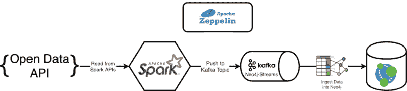
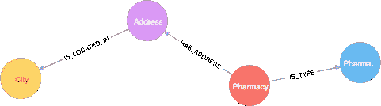
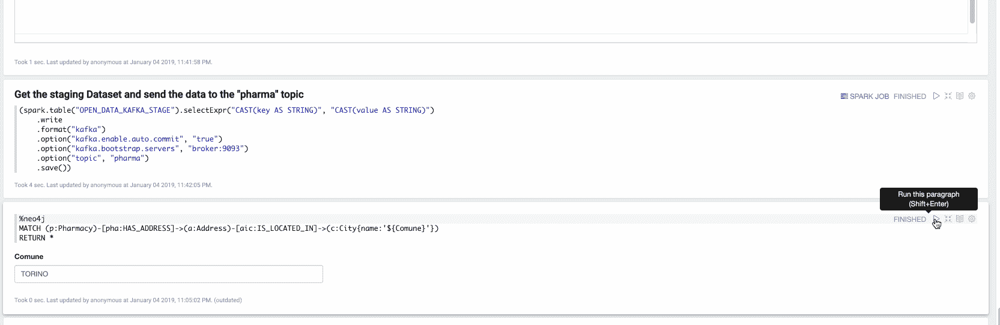

# 如何从 Kafka 流将数据摄取到 Neo4j 中

> 原文：<https://www.freecodecamp.org/news/how-to-ingest-data-into-neo4j-from-a-kafka-stream-a34f574f5655/>

安德烈·桑图尔班诺

# 如何从 Kafka 流将数据摄取到 Neo4j 中

本文是**利用 Neo4j 流**系列的第二部分([第 1 部分在此](https://medium.freecodecamp.org/how-to-leverage-neo4j-streams-and-build-a-just-in-time-data-warehouse-64adf290f093))。我将展示如何结合使用 [**Neo4j Streams**](https://medium.com/neo4j/a-new-neo4j-integration-with-apache-kafka-6099c14851d2) 项目的 Sink 模块和 **Apache Spark** 的结构化流 API，将 Neo4j 引入到您的 **Apache Kafka** 流中。


Photo by [Hendrik Cornelissen](https://unsplash.com/photos/-qrcOR33ErA?utm_source=unsplash&utm_medium=referral&utm_content=creditCopyText) on [Unsplash](https://unsplash.com/search/photos/stream?utm_source=unsplash&utm_medium=referral&utm_content=creditCopyText)

为了展示如何集成它们，简化集成，并让您自己测试整个项目，我将使用[**Apache Zeppelin**](https://towardsdatascience.com/building-a-graph-data-pipeline-with-zeppelin-spark-and-neo4j-8b6b83f4fb70)**——一个简单地允许您与 Neo4j 进行本机交互的笔记本运行程序。**


The result

### 利用 Neo4j 流

Neo4j Streams 项目由三个主要支柱组成:

*   **变更数据捕获**,允许您通过 Kafka 主题传输数据库变更
*   允许消费来自 Kafka 主题的数据流的**接收器**(第一篇文章的主题)
*   一组**程序**,允许你向/从 Kafka 主题产生/消费数据

### Neo4j 流下沉

这个模块允许 Neo4j 使用 Kafka 主题中的数据。它以一种“智能”的方式做到了这一点:允许您定义自己的定制查询。你需要做的是在你的 neo4j.conf 中写下这样的内容:

```
streams.sink.topic.cypher.<TOPIC>=<CYPHER_QUERY>
```

因此，如果您像这样定义一个查询:

```
streams.sink.topic.my-topic=MERGE (n:Person{id: event.id}) \
    ON CREATE SET n += event.properties
```

对于这样的事件:

```
{id:"alice@example.com",properties:{name:"Alice",age:32}}
```

在后台，接收模块将执行如下查询:

```
UNWIND {batch} AS event
MERGE (n:Label {id: event.id})
    ON CREATE SET n += event.properties
```

`batch`参数是一组 Kafka 事件，这些事件从接收器收集并在单个事务中处理，以便最大化执行效率。

继续上面的例子，一个可能的完整表示可以是:

```
WITH [{id:"alice@example.com",properties:{name:"Alice",age:32}},
    {id:"bob@example.com",properties:{name:"Bob",age:42}}] AS batch
UNWIND batch AS event
MERGE (n:Person {id: event.id})
    ON CREATE SET n += event.properties
```

这给了开发人员定义他们自己的业务规则的权力，因为您可以根据您获得的事件选择更新、添加、删除或修改您的图形数据。

### 一个简单的用例:从开放数据 API 获取数据

想象一下，您的数据管道需要从一个开放的数据 API 读取数据，用一些其他内部来源丰富它，并最终将它持久化到 Neo4j 中。在这种情况下，最好的解决方案是使用 Apache Spark。这很容易允许用相同的数据集抽象来管理不同的数据源。

#### 设置环境

转到下面的 [Github repo](https://github.com/conker84/leveraging-neo4j-streams) ，你会发现复制我在本文中呈现的内容所需的全部代码。您需要启动的是 [**Docker**](https://docs.docker.com/) ，然后您可以通过进入目录并从终端执行以下命令来简单地旋转堆栈:

```
$ docker-compose up
```

这将启动整个环境，包括:

*   Neo4j + Neo4j 流模块+ APOC 程序
*   阿帕奇卡夫卡
*   阿帕奇火花
*   阿帕奇齐柏林飞艇



The whole architecture based on Docker containers

进入 Apache Zeppelin @ `http://localhost:8080`你会在目录`Medium/Part 2`中找到一本笔记本“**从开放数据到接收器**”，这就是本文的主题。

#### 开放数据 API

我们将选择意大利卫生部药店的数据集。

#### 定义接收器查询

如果您进入`[d](http://localhost:8080)ocker-compose.yml`文件，您会发现一个对应于接收查询定义的新属性:

```
NEO4J_streams_sink_topic_cypher_pharma: "
MERGE (p:Pharmacy{fiscalId: event.FISCAL_ID}) ON CREATE SET p.name = event.NAME
MERGE (t:PharmacyType{type: event.TYPE_NAME})
MERGE (a:Address{name: event.ADDRESS + ', ' + event.CITY})
  ON CREATE SET a.latitude = event.LATITUDE,
                a.longitude = event.LONGITUDE,
                a.code = event.POSTAL_CODE,
                a.point = event.POINT
MERGE (c:City{name: event.CITY})
MERGE (p)-[:IS_TYPE]-(t)
MERGE (p)-[:HAS_ADDRESS]-(a)
MERGE (a)-[:IS_LOCATED_IN]->(c)"
```

`NEO4J_streams_sink_topic_cypher_pharma`属性定义了来自名为`pharma`的主题的所有数据都将被相应的查询使用。

从上面的查询中得到的图形模型是:



Our data model

#### 笔记本— **从开放数据到汇集数据**

第一步是从开放数据门户下载 CSV，并将其加载到 Spark 数据框架中:

```
val fileUrl = z.input("File Url").toString

val url = new java.net.URL(fileUrl)
val localFilePath = s"/zeppelin/spark-warehouse/${url.getPath.split("/").last}"

val src = scala.io.Source.fromURL(fileUrl)("ISO-8859-1")
val out = new java.io.FileWriter(localFilePath)
out.write(src.mkString)
out.close

val csvDF = (spark.read
    .format("csv")
    .option("delimiter", ";")
    .option("header", "true")
    .load(localFilePath))
```

现在让我们探索一下`csvDF`的结构:

```
root
|-- CODICEIDENTIFICATIVOFARMACIA: string (nullable = true)
|-- CODFARMACIAASSEGNATODAASL: string (nullable = true)
|-- INDIRIZZO: string (nullable = true)
|-- DESCRIZIONEFARMACIA: string (nullable = true)
|-- PARTITAIVA: string (nullable = true)
|-- CAP: string (nullable = true)
|-- CODICECOMUNEISTAT: string (nullable = true)
|-- DESCRIZIONECOMUNE: string (nullable = true)
|-- FRAZIONE: string (nullable = true)
|-- CODICEPROVINCIAISTAT: string (nullable = true)
|-- SIGLAPROVINCIA: string (nullable = true)
|-- DESCRIZIONEPROVINCIA: string (nullable = true)
|-- CODICEREGIONE: string (nullable = true)
|-- DESCRIZIONEREGIONE: string (nullable = true)
|-- DATAINIZIOVALIDITA: string (nullable = true)
|-- DATAFINEVALIDITA: string (nullable = true)
|-- DESCRIZIONETIPOLOGIA: string (nullable = true)
|-- CODICETIPOLOGIA: string (nullable = true)
|-- LATITUDINE: string (nullable = true)
|-- LONGITUDINE: string (nullable = true)
|-- LOCALIZE: string (nullable = true)
```

我们希望关注两个领域:

*   CODICEIDENTIFICATIVOFARMACIA:它“应该”是意大利卫生部给药店的唯一标识符
*   **data fine validata**:表示药店是否仍处于活动状态(如果没有值，则处于活动状态，否则关闭)

我们现在将数据帧保存到名为`OPEN_DATA`的火花温度视图中:

```
csvDF.createOrReplaceTempView("open_data")
```

现在让我们通过过滤数据集的有效记录并重命名一些字段来覆盖`OPEN_DATA`临时视图:

```
%sql
CREATE OR REPLACE TEMP VIEW OPEN_DATA AS
SELECT CODICEIDENTIFICATIVOFARMACIA AS PHARMA_ID,
 INDIRIZZO AS ADDRESS,
 DESCRIZIONEFARMACIA AS NAME,
 PARTITAIVA AS FISCAL_ID,
 CAP AS POSTAL_CODE,
 DESCRIZIONECOMUNE AS CITY,
 DESCRIZIONEPROVINCIA AS PROVINCE,
 DATAFINEVALIDITA,
 DESCRIZIONETIPOLOGIA AS TYPE_NAME,
 CODICETIPOLOGIA AS TYPE,
 REPLACE(LATITUDINE, ‘,’, ‘.’) AS LATITUDE,
 REPLACE(LONGITUDINE, ‘,’, ‘.’) AS LONGITUDE,
 REPLACE(LATITUDINE, ‘,’, ‘.’) || ‘,’ || REPLACE(LONGITUDINE, ‘,’, ‘.’) AS POINT
FROM OPEN_DATA
WHERE DATAFINEVALIDITA <> ‘-’
AND CODICEIDENTIFICATIVOFARMACIA <> ‘-’
```

现在让我们创建必须包含两列的`OPEN_DATA_KAFKA_STAGE`临时视图:

*   **VALUE** : JSON，表示我们要发送给 Kafka 主题的数据
*   **KEY** :标识行的键

你可能会注意到这正是对一个`ProducerRecord:`的最低要求

```
%sql
CREATE OR REPLACE TEMP VIEW OPEN_DATA_KAFKA_STAGE AS
SELECT TO_JSON(
    STRUCT(PHARMA_ID,
        ADDRESS,
        NAME,
        FISCAL_ID,
        POSTAL_CODE,
        CITY,
        PROVINCE,
        TYPE_NAME,
        TYPE,
        LATITUDE,
        LONGITUDE,
        POINT)
    ) AS VALUE,
    PHARMA_ID AS KEY
FROM OPEN_DATA
```

现在让我们通过 spark 将数据发送到`pharma`主题:

```
(spark.table("OPEN_DATA_KAFKA_STAGE").selectExpr("CAST(key AS STRING)", "CAST(value AS STRING)")
    .write
    .format("kafka")
    .option("kafka.enable.auto.commit", "true")
    .option("kafka.bootstrap.servers", "broker:9093")
    .option("topic", "pharma")
    .save())
```

由于本文开头定义的 Cypher 模板，通过 spark 作业流向`pharma`主题的数据现在将从 Neo4j Streams Sink 模块中使用。

现在在最后一段，我们可以探索摄取的数据。在下面的视频中，我们将探索位于都灵的所有药店:



Explore the data just ingested

### 包扎

在第二篇文章中([如果你还没有看第一篇文章的话，请查看第一篇文章](https://medium.freecodecamp.org/how-to-leverage-neo4j-streams-and-build-a-just-in-time-data-warehouse-64adf290f093)),我们已经看到了如何使用 SINK 模块将 Apache Kafka 事件转换成任意的图形结构。您可以通过使用 Apache Spark APIs 以非常简单的方式做到这一点。

在第 3 部分中，我们将发现如何使用 Streams 过程来直接通过 Cypher 查询生成/消费数据，请继续关注！

如果您已经测试过 Neo4j-Streams 模块或通过此笔记本进行过测试，请填写我们的 [**反馈调查**](https://goo.gl/forms/VLwvqwsIvdfdm9fL2) 。

如果您遇到任何问题或有改进我们工作的想法，[请提出 GitHub 问题](http://github.com/neo4j-contrib/neo4j-streams/issues)。