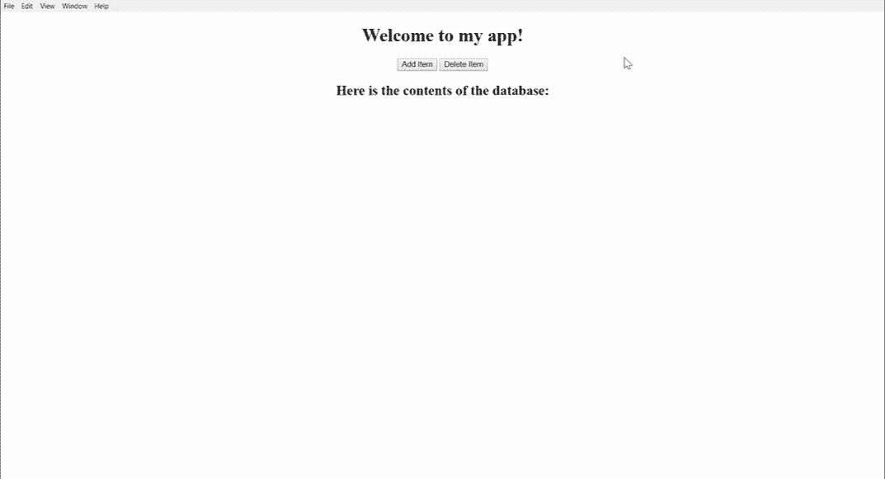

# 如何使用 Angular 和 SQLite3 创建电子 app？

> 原文：<https://www.freecodecamp.org/news/creating-an-electron-app-using-angular-and-sqlite3-24ca7d892810/>

威廉·博克斯

# 如何使用 Angular 和 SQLite3 创建电子 app？


Photo by [Caspar Camille Rubin](https://unsplash.com/@casparrubin?utm_source=medium&utm_medium=referral) on [Unsplash](https://unsplash.com?utm_source=medium&utm_medium=referral)

我最近在尝试用电子设备将我的 Angular web 应用程序转换成桌面应用程序。我在前进的道路上遇到了一些障碍，并决定把我的经历写下来，以便它可以帮助别人。如果你对你的项目有类似的计划，我希望这可能有用。本指南的源代码可以在[这里](https://github.com/wboxx1/typescript-electron-angular6-sqlite3)找到。

### 第一部分:棱角分明

#### 创建样板文件。

出于本指南的考虑，我们将从头开始创建一个新的 Angular 应用程序。我将使用[电子伪造](https://electronforge.io/)来创建样板文件。电子锻造公司提供了几个用于创建样板代码的[模板](https://electronforge.io/templates)，包括一个用于 Angular 2 的模板。首先安装电子锻造 CLI。

```
$ npm i -g electron-forge
```

现在使用 CLI 创建 Angular app 样板文件。

```
$ electron-forge init electron-angular-sqlite3 --template=angular2
$ cd electron-angular-sqlite3
```

forge CLI 将添加运行我们的应用程序所需的基本要素。让我们添加一些额外的目录来存放我们的数据库文件。在 src 下添加一个资产目录，并在它下面放置数据和模型目录。

```
$ mkdir ./src/assets/data ./src/assets/model
```

目录树现在应该如下所示:

```
.
+-node_modules
+-src
|  |
|  +-assets
|  |  |
|  |  +-data
|  |  +-model
|  |
|  +-app.component.ts
|  +-bootstrap.ts
|  +-index.html
|  +-index.ts
|
+-.compilerc
+-.gitignore
+-package-lock.json
+-package.json
+-tsconfig.json
+-tslint.json
```

#### 写点代码。

作为第一步，让我们添加一个匹配数据库模式的模型文件。对于这个简单的例子，让我们创建一个名为 Item 的类。每个项目将包含一个 id 和一个 name 属性。在`src/assets/model/item.schema.ts`将文件保存在项目中。

我们将使用 T[ypeom](http://typeorm.io/#/)进行对象关系映射。首先安装 TypeORM。

```
$ npm install typeorm --save
```

在这里，我们将遵循 TypeORM [指南](http://typeorm.io/#/undefined/step-by-step-guide)来创建模式。完成后，文件应该如下所示:

```
import { Entity, PrimaryGeneratedColumn, Column } from 'typeorm';

@Entity()
export class Item
{
	@PrimaryGeneratedColumn()
	id: number;

	@Column()
	name: string;
}
```

TypeORM 使用了 typescript [装饰器](https://www.typescriptlang.org/docs/handbook/decorators.html)。我们使用实体装饰器来声明我们的条目类 a 表。`@PrimaryGeneratedColumn()`装饰器将`id`声明为我们的惟一标识，并告诉数据库自动生成它。我们将在以后担心链接到数据库的问题。

#### 创建服务。

我们下一个可能的行动是创建一个应用服务，处理从前端到后端的通信。Electron 为这个东西提供了`IpcRenderer`类。`IpcRenderer`是 Electron 的[进程间通信类](https://electronjs.org/docs/api/ipc-main)，用于渲染器进程。基本上，我们想使用`IpcRenderer`向 Electron 的主进程发送消息。这些消息将把信息传递给主进程，以便它能够处理数据库交互。

实现`IpcRenderer`是我们遇到的第一个障碍。Electron 依赖于 window.require()方法，该方法仅在 Electron 的 renderer 进程内部可用。这是一个被详细记录的[问题](https://github.com/electron/electron/issues/7300)。为了解决这个问题，我们可以使用 [ThornstonHans 的 ngx-electronic](https://github.com/ThorstenHans/ngx-electron)包，它将所有暴露给渲染器进程的电子 API 包装成一个单一的电子服务。你可以在这里阅读更多关于这个[的内容。](https://thorsten-hans.com/integrating-angular-and-electron-using-ngx-electron-9c36affca25e)

在我们使用`ngx-electron`之前，我们需要安装它。

```
$ npm install ngx-electron --save
```

现在让我们创建一个服务来处理我们的`IpcRenderer`通信。创建`src/app.service.ts`。

```
import { Injectable } from '@angular/core';

import { Item } from './assets/model/item.schema';

import { ElectronService } from 'ngx-electron';
import { Observable } from 'rxjs/observable';
import { of } from 'rxjs/observable/of';
import { catchError } from 'rxjs/operators';

@Injectable()
export class AppService {
  constructor(private _electronService: ElectronService) {}

  getItems(): Observable<Item[]> {
    return of(this._electronService.ipcRenderer.sendSync('get-items')).pipe(
      catchError((error: any) => Observable.throw(error.json))
    );
  }

  addItem(item: Item): Observable<Item[]> {
    return of(
      this._electronService.ipcRenderer.sendSync('add-item', item)
    ).pipe(catchError((error: any) => Observable.throw(error.json)));
  }

  deleteItem(item: Item): Observable<Item[]> {
    return of(
      this._electronService.ipcRenderer.sendSync('delete-item', item)
    ).pipe(catchError((error: any) => Observable.throw(error.json)));
  }
}
```

在`app.service.ts`中，我们创建了一个名为`AppService`的类，并添加了`@Injectable()`装饰器。这允许我们使用 angular 内置的依赖注入(DI)。在我们的构造函数中，我们创建了一个`ElectronService`类型的局部变量`_electronService`。`ElectronService`类是`ngrx-electron`提供给我们的。它允许我们使用 Electron 的`IpcRender`类而没有任何上述问题。

我们创建了三个函数:一个获取数据库中的所有条目，一个向数据库添加条目，一个删除条目。每个函数将返回一个可观察值。

Observables 是 [RxJs 库](https://angular.io/guide/rx-library)的一部分，它提供了一种异步处理数据库交互的好方法。你可以在这里阅读更多关于 T4 的信息。请注意，使用可观察操作符`of`来表示我们将来自`this._electronService.ipcRenderer.sendSync()`的响应包装为可观察值。

#### 注册服务和编写组件。

服务完成后，让我们进入`src/app.component.ts`并注册 DI。在那里，我们将添加一个简单的 html 模板和函数来处理我们的按钮事件。

```
import { NgModule } from '@angular/core';
import { BrowserModule } from '@angular/platform-browser';
import { Component, OnInit } from '@angular/core';

import { Item } from './assets/model/item.schema';
import { AppService } from './app.service';
import { ElectronService } from 'ngx-electron';

@Component({
  selector: 'App',
  template: `<div style="text-align:center">
    <h1>
        Welcome to {{ title }}!
    </h1>
    <button (click)="addItem()" mat-raised-button>Add Item</button>
    <button (click)="deleteItem()" mat-raised-button>Delete Item</button>
    <h2>Here is the contents of the database: </h2>
    <div>
        <ul style="list-style: none">
            <li *ngFor="let item of itemList">
                {{ item.name }}
            </li>
        </ul>
    </div>
</div>`,
})
export class AppComponent implements OnInit {
  public readonly title = 'my app';
  itemList: Item[];

  constructor(private appservice: AppService) {}

  ngOnInit(): void {
    console.log('component initialized');
    this.appservice.getItems().subscribe((items) => (this.itemList = items));
  }

  addItem(): void {
    let item = new Item();
    item.name = 'Item ' + this.itemList.length;
    this.appservice.addItem(item).subscribe((items) => (this.itemList = items));
  }

  deleteItem(): void {
    const item = this.itemList[this.itemList.length - 1];
    this.appservice
      .deleteItem(item)
      .subscribe((items) => (this.itemList = items));
  }
}

@NgModule({
  imports: [ BrowserModule ],
  declarations: [ AppComponent ],
  bootstrap: [ AppComponent ],
  providers: [ AppService, ElectronService ],
})
export class AppModule {}
```

确保将`AppService`作为提供者添加到`@NgModule`装饰参数中，并且作为私有变量添加到`AppComponent`构造函数中。我们还需要添加`ElectronService`作为提供者。

在组件初始化时，我们希望加载数据库的所有内容并显示出来。为此，我们订阅了自己创建的服务的`addItem()`功能。如果你还记得，我们所有的服务函数都返回可观测量。为了从我们的可观察对象中获取数据，我们订阅它，传递一个在数据被接收时运行的回调函数。在上面的例子中，`(items) => (this.itemList = ite` ms)将在检索到数据库后用数据库的内容填充我们的类 variab `le itemL` ist。

我们遵循类似的策略从数据库中添加和删除项目。每次用数据库的更新内容重新填充`itemList`。

### 第二部分:电子

#### 正在安装 SQLite3。

现在我们已经完成了前端，我们需要创建电子后端。电子后端将处理从前端发送的消息，并管理 sqlite3 数据库。

我们将使用 sqlite3 作为我们的数据库，需要安装它。

```
$ npm install sqlite3 --save
```

我最初使用 sqlite3 和 Electron 时遇到的一个障碍是，sqlite 的原生二进制文件需要重新编译才能用于 Electron。电子锻造公司会帮你搞定的。需要注意的一点是，Electron-Forge 将使用 [node-gyp](https://www.npmjs.com/package/node-gyp) 来编译二进制文件。您可能需要在使用之前正确安装和配置它，包括安装 Python。截至[现在](https://github.com/nodejs/node-gyp/issues/1337)，node-gyp 使用 python 2。如果您的计算机上有多个版本，您必须确保当前版本使用的是正确的版本。

#### 正在连接数据库。

现在让我们打开我们的`src/index.ts`文件并添加一些代码来连接数据库。我们需要做的两件事是，连接到数据库，并添加函数来处理来自渲染器进程的请求。完成后的文件如下所示:

```
import { app, BrowserWindow, ipcMain } from 'electron';
import { enableLiveReload } from 'electron-compile';

import { createConnection } from 'typeorm';

import { Item } from './assets/model/item.schema';

// Keep a global reference of the window object, if you don't, the window will
// be closed automatically when the JavaScript object is garbage collected.
let mainWindow: Electron.BrowserWindow | null;

const isDevMode = process.execPath.match(/[\\/]electron/);

if (isDevMode) enableLiveReload();

const createWindow = async () => {
  const connection = await createConnection({
    type: 'sqlite',
    synchronize: true,
    logging: true,
    logger: 'simple-console',
    database: './src/assets/data/database.sqlite',
    entities: [ Item ],
  });

  const itemRepo = connection.getRepository(Item);

  // Create the browser window.
  mainWindow = new BrowserWindow({
    width: 800,
    height: 600,
  });

  // and load the index.html of the app.
  mainWindow.loadURL(`file://${__dirname}/index.html`);

  // Open the DevTools.
  if (isDevMode) {
    mainWindow.webContents.openDevTools();
  }

  // Emitted when the window is closed.
  mainWindow.on('closed', () => {
    // Dereference the window object, usually you would store windows
    // in an array if your app supports multi windows, this is the time
    // when you should delete the corresponding element.
    mainWindow = null;
  });

  ipcMain.on('get-items', async (event: any, ...args: any[]) => {
    try {
      event.returnValue = await itemRepo.find();
    } catch (err) {
      throw err;
    }
  });

  ipcMain.on('add-item', async (event: any, _item: Item) => {
    try {
      const item = await itemRepo.create(_item);
      await itemRepo.save(item);
      event.returnValue = await itemRepo.find();
    } catch (err) {
      throw err;
    }
  });

  ipcMain.on('delete-item', async (event: any, _item: Item) => {
    try {
      const item = await itemRepo.create(_item);
      await itemRepo.remove(item);
      event.returnValue = await itemRepo.find();
    } catch (err) {
      throw err;
    }
  });
};

// This method will be called when Electron has finished
// initialization and is ready to create browser windows.
// Some APIs can only be used after this event occurs.
app.on('ready', createWindow);

// Quit when all windows are closed.
app.on('window-all-closed', () => {
  // On OS X it is common for applications and their menu bar
  // to stay active until the user quits explicitly with Cmd + Q
  if (process.platform !== 'darwin') {
    app.quit();
  }
});

app.on('activate', () => {
  // On OS X it's common to re-create a window in the app when the
  // dock icon is clicked and there are no other windows open.
  if (mainWindow === null) {
    createWindow();
  }
});

// In this file you can include the rest of your app's specific main process
// code. You can also put them in separate files and import them here.
```

对 TypeORM 和 Electron 的深入解释超出了本
指南的范围，所以我将只简要讨论上面的文件。首先我们需要从 TypeORM 库中导入`createConnection`类。我们还需要导入或项目模式。

正如所料，`createConnection`类将创建一个到我们数据库的连接。我们传递给它一个带有参数的构造函数，比如类型、数据库和实体。Type 是描述我们正在使用的数据库类型的字符串。Database 是指向数据库位置的字符串。实体是我们告诉 TypeORM 期望什么模式的地方。对于我们的目的:类型是' sqlite '，数据库是'。/src/assets/data/database . SQLite '，而 Entities 是我们导入的项目类。

在处理数据库事务时，TypeORM 允许您有两种选择: [EntityManager](http://typeorm.io/#/working-with-entity-manager) 和 [Repository](http://typeorm.io/#/working-with-repository) 。两者都可以让您访问查询数据库的函数，而无需编写 SQL。我们用行`itemRepo = connection.getRepository(Item)`创建一个存储库对象。这使我们能够访问 Item 表的事务方法。

最后一步是创建函数来处理从`IpcRenderer`发送的消息。每个函数将使用我们创建的`itemRepo`对象来访问数据库。每个事务成功完成后，这些函数会将数据库的新状态传递回呈现器。

### 第三部分:运行它！

一切完成后，我们现在可以运行应用程序。电子锻造为我们处理这个过程。我们需要做的就是运行命令:

```
$ npm run start
```

如果一切正确，电子将打开你的应用程序，你可以测试出来。



感谢阅读！