# 公司如何使用协同过滤来了解你到底想要什么

> 原文：<https://www.freecodecamp.org/news/how-companies-use-collaborative-filtering-to-learn-exactly-what-you-want-a3fc58e22ad9/>

像亚马逊和网飞这样的公司怎么知道你到底想要什么？无论是你一直在盯着的那套新扬声器，还是下一集《黑镜》,它们对预测算法的使用都让向你销售东西的工作变得非常高效。

但是尽管我们都喜欢有趣的阴谋论，不，他们不雇佣灵媒。

他们使用更神奇的东西——数学。今天，我们来看看一种叫做协同过滤的方法。

### 协同过滤到底是什么？

正如[杰瑞米·霍华德](https://www.freecodecamp.org/news/how-companies-use-collaborative-filtering-to-learn-exactly-what-you-want-a3fc58e22ad9/undefined)在 [fast.ai](http://course.fast.ai/) 的令人敬畏的深度学习课程中提到的，结构化的深度学习模型如今不太受欢迎。

可能是因为你看不到这样的东西:

Source: [https://cdn.vox-cdn.com/thumbor/NN7jTnph9VCkyyt2nrTFml3XbYw=/0x0:600x338/1200x800/filters:focal(252x121:348x217):no_upscale()/cdn.vox-cdn.com/uploads/chorus_image/image/57380619/ezgif.com_gif_maker__1_.0.gif](https://cdn.vox-cdn.com/thumbor/NN7jTnph9VCkyyt2nrTFml3XbYw=/0x0:600x338/1200x800/filters:focal(252x121:348x217):no_upscale()/cdn.vox-cdn.com/uploads/chorus_image/image/57380619/ezgif.com_gif_maker__1_.0.gif)

但是像协同过滤这样的结构化算法是现实世界中使用最频繁的算法。这就是为什么显示在亚马逊页面底部的东西看起来如此诱人。

Source: [https://www.highspot.com/wp-content/uploads/Amazon_Recommended_Edit.png](https://www.highspot.com/wp-content/uploads/Amazon_Recommended_Edit.png)

协同过滤的基本原理是:**你很可能喜欢和你相似的人喜欢的东西。**

算法的工作就是找到和你有类似购买或观看习惯的人，并向你建议他/她给了很高评价的东西。

它也可以反过来工作。

该算法可以推荐与您之前给予高评价的另一个产品相似的产品。所有这些相似性检查和比较都是通过一些相当简单的线性代数(矩阵数学)来完成的。

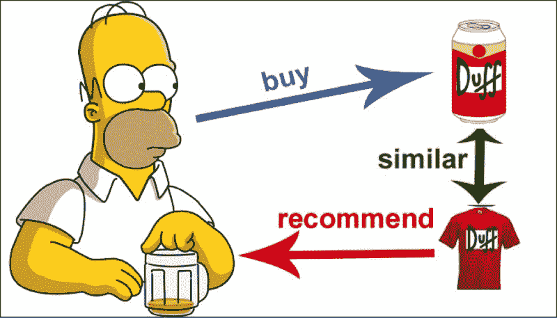

Source: [https://johnolamendy.files.wordpress.com/2015/10/01.png](https://johnolamendy.files.wordpress.com/2015/10/01.png)

#### 真的那么容易吗？

没那么快。在我们开始讨论向量和点积之前，让我们解决任何推荐系统算法面临的一个重要问题— [冷启动问题](https://www.yuspify.com/blog/cold-start-problem-recommender-systems/)。

Source: [https://thermex-systems.com/wp-content/uploads/portathaw-cold-start-system-on-heavy-dump-truck.jpg](https://thermex-systems.com/wp-content/uploads/portathaw-cold-start-system-on-heavy-dump-truck.jpg)

你看，当你有两件事的时候，协同过滤工作得很好:

*   关于每位顾客喜好的大量数据(基于他们之前的高评价)
*   关于每部电影或产品可能迎合哪些观众的大量数据(基于对其评价高的人群类型)。

但是对于新用户和新产品，你没有太多的信息，怎么办？

Source: [https://1843magazine.static-economist.com/sites/default/files/styles/article-main-image-overlay/public/0312ILIN03-web.jpg](https://1843magazine.static-economist.com/sites/default/files/styles/article-main-image-overlay/public/0312ILIN03-web.jpg)

协同过滤在这些情况下不太好用，所以你可能需要尝试其他的方法。一些常见的解决方案包括分析元数据或让新用户通过一些问题来了解他们最初的偏好。

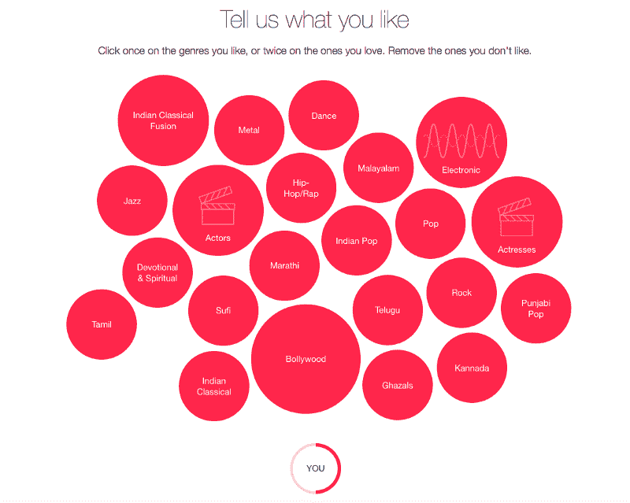

Source: [http://img.techiesparks.com/2015/07/apple-music-artists.png](http://img.techiesparks.com/2015/07/apple-music-artists.png)

### 好了，现在开始酷的部分

像大多数机器学习问题一样，首先看一看数据可能是个好主意。从现在开始，我将使用电影和评级的例子(主要受 fast.ai 课程中使用的 [movielens](https://grouplens.org/datasets/movielens/) 数据集的启发)。

我们将通过建立一个用户表，对照他们给电影的评分来可视化它。

每行代表一个用户，每列代表一部电影。

交叉引用会告诉你用户对一部电影的评价(1-5 分，0 分表示“没看”)。

如果我们的协同过滤模型能够填补空白，我们就认为它是成功的。这意味着它能够预测每个用户会如何评价一部电影，既基于用户的喜好，也基于电影的喜好。

现在谈谈算法。我们将建立两个矩阵:一个用于用户，另一个用于电影。这些称为[嵌入矩阵](https://medium.com/@Petuum/embeddings-a-matrix-of-meaning-4de877c9aa27)。姑且称之为 **W_u** (针对用户)和 **W_m** (针对电影)。

每个矩阵都将被填充以 *e* 维向量(基本上是大小为 *e* 的数组)。你问什么是 *e* ？这是一个神奇的数字，我稍后会提到。现在，就让 *e* 成为你最喜欢的自然数吧。

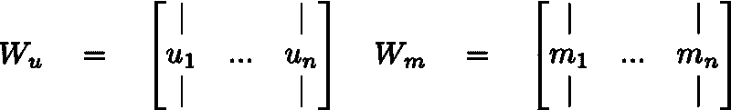

请注意，如果您删除行标题和列标题，上面的表格看起来也像一个矩阵。这不是巧合。如果你熟悉矩阵乘法，你会知道一个 *2*3* 矩阵乘以一个 *3*2* 矩阵得到一个 *2*2* 矩阵。

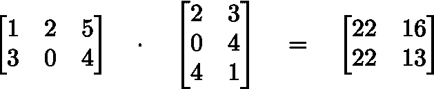

如果你想了解更多关于矩阵乘法的知识，你应该在可汗学院上查看[这个播放列表。](https://www.khanacademy.org/math/precalculus/precalc-matrices/multiplying-matrices-by-matrices/v/matrix-multiplication-intro)

使用同样的逻辑，我们可以将我们的电影和用户矩阵相乘。维度将精确地计算出一个矩阵，该矩阵的大小等于原始表数据集的大小(从技术上讲，您必须转置其中的一个，但我将跳过实现细节)。

如果我们可以了解电影矩阵和用户矩阵中条目的值，理论上，我们可以通过将两者相乘来恢复原始表。

我们有我们的基本事实:原始表。我们需要做的就是计算出以某种方式相乘的数字(也称为权重),从而返回原始表。

进入机器学习的神秘艺术。

我们打算这样做:

*   我们从电影矩阵和用户矩阵中完全随机的数字开始。
*   然后，我们将两者相乘得到另一个矩阵(在这一点上也是完全随机的),看起来像我们的原始表。
*   通过比较我们的预测值和表中的真实值，我们定义了一个损失函数。这基本上是衡量我们的预测评级与实际评级之间的差距。

请注意，我们还必须跳过零，因为我们不希望我们的模型预测任何人的评分为 0。那将是非常无用的。

如果你想要更多关于损失函数的信息，我推荐 [Siraj Raval](https://www.freecodecamp.org/news/how-companies-use-collaborative-filtering-to-learn-exactly-what-you-want-a3fc58e22ad9/undefined) 的[视频](https://www.youtube.com/watch?v=IVVVjBSk9N0)。

找到损失后，我们使用[反向传播](http://colah.github.io/posts/2015-08-Backprop/)和[梯度下降](https://www.youtube.com/watch?v=IHZwWFHWa-w&index=2&list=PLZHQObOWTQDNU6R1_67000Dx_ZCJB-3pi)来优化两个矩阵，以获得正确的值。

嘣！我们完了！

好吧，快速回顾一下:

*   我们有一个表格，上面有每个用户对每部电影的评价。如果用户没有观看电影，表格显示“0”。我们想预测零点。
*   为此，我们构建了两个矩阵，一个用于用户，一个用于电影。每个矩阵基本上只是一堆 *e* 维向量。
*   为了预测评分，我们将这些矩阵相乘得到另一个矩阵，这个矩阵的形状与包含我们预测的表格的形状相同。最初，桌子上只有胡言乱语。
*   但是在使用损失函数找到我们的错误，并采用反向传播和梯度下降的动态组合后，我们现在有了一个模型，可以准确地预测用户会给电影什么评级。太好了。

### ***好吧……但是为什么会起作用呢？***

如果你像我一样，你会明白的。但是你并没有真正明白。这些随机乘法是如何读心术的？为什么我们不能反推原来的表，然后把零填满呢？为什么要经历精心设计的方案，编造*两个*单独的矩阵和*然后*重建表格？为什么？为什么？为什么？耐心点，小蚱蜢。一切都如原力所愿。

还记得我说过我要解决' *e* '之谜吗？现在我是了。

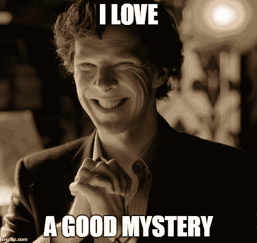

Source: [https://i.imgflip.com/1lai6f.jpg](https://i.imgflip.com/1lai6f.jpg)

回想一下，我们构建的矩阵本质上是向量的堆叠。每个用户一个向量，每个电影一个向量。这不是一个毫无意义的决定。

每个向量都代表了相应用户是什么样的人。它将你的好恶、你的想法和感受、你的希望和恐惧浓缩成一个`numpy.array[]`。

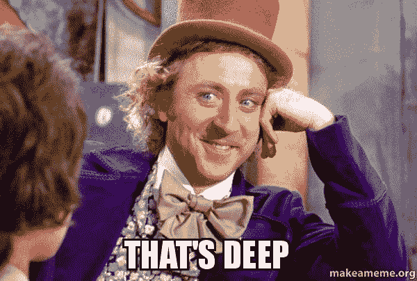

为了更好地理解这一点，让我们放大一个特定的用户向量，假设 *e* =3:

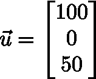

这里，矢量的三个分量是`[100, 0, 50]`。每个部分代表用户的一些特征，机器通过查看他/她以前的评级来学习这些特征。

假设(这并不准确，只是一个类比)这三个组件具有以下含义:

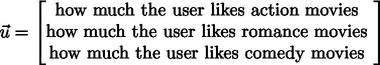

希望您能对向量如何表示用户偏好的想法有所了解。

所以在上面的例子中，我们的好朋友 *u* 显然喜欢动作片，不太喜欢爱情片，也喜欢喜剧片，但没有动作片那么喜欢。

这就是我们的机器学习模型理解人类复杂性的方式——通过将其嵌入到一个 *e* 维向量空间中。

所以 *e* 不过是我们选择的一个小数字(称为超参数)。它越大，我们就能捕捉到更多关于用户的细微信息。但是如果太大，计算时间会太长。

但是等等。天气变得凉爽了。来看一个电影矢量:

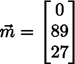

现在，分析组件的(人工解释)含义:

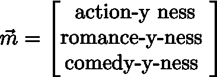

我们的大片《我的 T1》似乎主要是一部爱情片，同时也有一些喜剧成分。我们甚至不用看电影或阅读任何评论就知道这一切！

通过观察什么类型的用户给电影的高评级和低评级，该算法现在可以建立代表电影本质的向量。

最后，考虑一下我们如何使用这些信息。我们有一个用户， *u* 和一部电影， *m* 。两者都是矢量。我们如何预测 *u* 会给 *m* 什么评分？我们使用[点积](https://www.khanacademy.org/math/linear-algebra/vectors-and-spaces/dot-cross-products/v/vector-dot-product-and-vector-length)。

点积是将一个向量的分量乘以另一个向量的分量，然后将结果相加。结果是一个标量(一个常规的、无附加条件的、好的、过时的实数)。

对于我们的例子，u 和 m 的点积是:

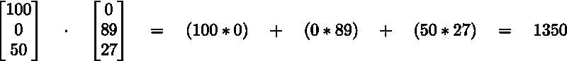

少得可怜的 1350 英镑。嗯，一切都是相对的。但是如果我们没有把两个分量乘以 0，我们会得到一个更大的数字。

很明显，向*大学推荐 *m* 是个坏主意，事实上是个糟糕的主意。*

### 我们可以让我们的模型变得更好

为了获得实际的评级预测，我们通过缩放的 sigmoid 函数压缩标量值，将结果限制在 0 和 5 之间。

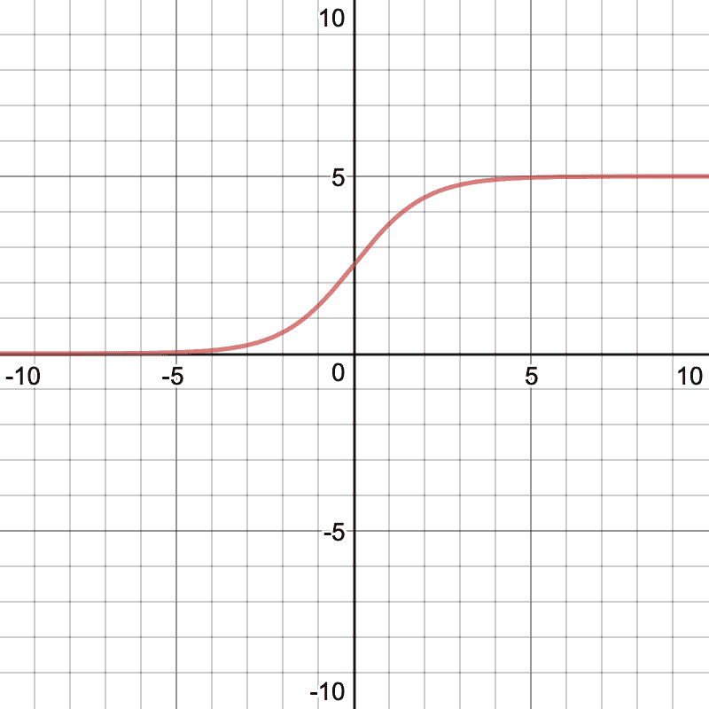

Source: [https://www.desmos.com/calculator/c4omt4vni3](https://www.desmos.com/calculator/c4omt4vni3)

如果你对我们正在做的所有手动波浪状的把戏有点担心，请放心，计算机可以全部解决。

事实上，我们只是让它的工作变得更容易，比如明确地告诉它所有的评级必须大于 0 小于 5。

这里有另一个技巧——在将我们的标量值(称为激活)压缩到 sigmoid 函数中之前，我们可以添加一个称为偏差的小数字， *b* 。会有两个偏向，每个用户一个，每个电影一个。

将这些叠加在一起，我们得到了所有用户(一起)的偏差向量，以及所有电影(一起)的偏差向量。这种偏见解释了为什么有些电影被普遍地喜爱/讨厌，而有些用户通常喜爱/讨厌电影。

就这样，我向你展示了可以控制你的生活(或者至少是你的网上购物/浏览习惯)的等式:

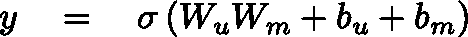

### 这意味着什么？

对我来说，这一切最疯狂的部分是我们在谈论人类的概念。动作，爱情，喜剧，喜欢，不喜欢。都是人的想法。想到它们都可以用一个数学对象来表达，真是令人着迷。

现在我知道，这只是真正明确定义的算法和人类数据。但我认为，矩阵乘法可以教会计算机我们作为个体是谁，这一事实仍然令人难以置信。

毕竟，尽管所有的事情使我们不同——我们喜欢什么，我们长什么样，我们和谁在一起，我们在哪里，我们如何思考，我们如何互动，我们如何感受——对于决定我们买什么，我们看什么，我们和谁说话，我们做什么，我们在哪里花时间，我们不在哪里的机器来说，我们都是同一个线性向量空间的元素。

这是一种美。