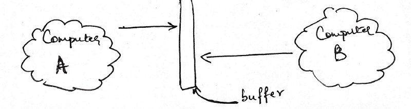
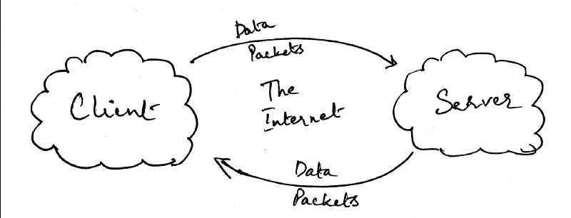
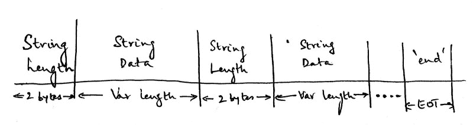

# 互联网是如何说话的

> 原文：<https://www.freecodecamp.org/news/how-the-internet-speaks-1ac4ee385e28/>

### 交流的故事

你有没有想过互联网到底是怎么说话的？一台计算机如何通过互联网与另一台计算机“对话”？

当人们相互交流时，我们使用串成看似有意义的句子的单词。这些句子之所以有意义，是因为我们已经就这些句子的含义达成了一致。可以说，我们已经定义了一个通信协议。

事实证明，计算机通过互联网以类似的方式相互交流。但是，我们言过其实了。人是用嘴交流的，我们先搞清楚电脑的嘴是什么。

#### 进入插座

套接字是计算机科学中最基本的概念之一。您可以使用套接字构建整个互联设备网络。

像计算机科学中的所有其他事物一样，套接字是一个非常抽象的概念。因此，与其定义什么是套接字，不如定义套接字做什么要容易得多。

那么，插座是做什么的？它帮助两台计算机相互通信。它是怎么做到的？它定义了两个方法，分别称为发送和接收的`send()`和`recv()`。

好吧，这些都很好，但是`send()`和`recv()`实际上发送和接收什么呢？当人们移动他们的嘴时，他们交换话语。当套接字使用它们的方法时，它们交换比特和字节。

让我们用一个例子来说明这些方法。假设我们有两台计算机，A 和 B。计算机 A 试图对计算机 B 说些什么。因此，计算机 B 试图听计算机 A 在说什么。这就是它的样子。



Sockets With A Buffer

#### 读取缓冲区

看起来有点奇怪，不是吗？首先，两台计算机都指向中间的一个名为“缓冲区”的栏。

缓冲是什么？缓冲区是一个内存堆栈。它是存储每台计算机数据的地方，由内核分配。

接下来，为什么它们都指向同一个缓冲区？实际上这并不准确。每台计算机都有自己的内核分配的缓冲区，网络在两个独立的缓冲区之间传输数据。但是，我不想在这里讨论网络细节，所以我们假设两台计算机都可以访问位于“中间某处”的同一个缓冲区。

好了，现在我们知道这在视觉上是什么样子了，让我们把它抽象成代码。

```
#Computer A sends data computerA.send(data) 
```

```
#Computer B receives data computerB.recv(1024)
```

这段代码片段做的事情和上面的图片完全一样。除了一个好奇，我们不说`computerB.recv(data)`。相反，我们指定一个看似随机的数字来代替数据。

原因很简单。网络上的数据以比特的形式传输。因此，当我们在 computerB 中接收时，我们指定在任何给定时间点我们愿意接收的*位*的数量。

为什么我一次选了 1024 字节接收？没有具体原因。通常最好以 2 的幂指定您将接收的字节数。我选了 1024，也就是 2 ⁰.

那么，缓冲区是如何解决这个问题的呢？嗯，计算机 A 把它存储的任何数据写入或发送到缓冲区。计算机 B 决定读取或接收存储在该缓冲区中的前 1024 个字节。

好的，太棒了！但是，这两台计算机是如何知道如何相互通信的呢？例如，当计算机 A 向这个缓冲区写入数据时，它怎么知道计算机 B 将获取它呢？换句话说，如何确保两台计算机之间的连接有唯一的缓冲区？

#### 移植到 IPs


Ports And IPs Of Computers

上面的图像显示了我们一直在工作的两台计算机，同时增加了一个细节。沿着一个长条，每台电脑前面都列有一串数字。

将每台计算机前面的长条视为将特定计算机连接到互联网的路由器。每个条上列出的数字被称为*端口*。你的电脑现在有成千上万的可用端口。每个端口都允许一个套接字连接。在上图中，我只显示了 6 个端口，但您已经明白了。

255 以下的端口通常是为系统调用和低级连接保留的。通常建议在高 4 位数的端口上建立连接，如 8000。上图我没有画缓冲区，但是你可以假设每个端口都有自己的缓冲区。

酒吧本身也有一个相关的数字。这个数字被称为 IP 地址。IP 地址有一堆与之相关联的端口。请按以下方式思考:

```
 127.0.0.1                             / | \                            /  |  \                           /   |   \                        8000  8001 8002
```

太好了，让我们在计算机 A 和计算机 b 之间的特定端口上建立一个连接。

```
# computerA.pyimport socket 
```

```
computerA = socket.socket() 
```

```
# Connecting to localhost:8000 computerA.connect(('127.0.0.1', 8000)) string = 'abcd' encoded_string = string.encode('utf-8') computerA.send(encoded_string)
```

以下是`computerB.py`的代码

```
# computerB.py import socket 
```

```
computerB = socket.socket() 
```

```
# Listening on localhost:8000 computerB.bind(('127.0.0.1', 8000)) computerB.listen(1) 
```

```
client_socket, address = computerB.accept() data = client_socket.recv(2048) print(data.decode('utf-8'))
```

看起来我们在代码方面有点超前了，但我还是要一步一步来。我们知道我们有两台计算机，A 和 b。因此，我们需要一台发送数据，一台接收数据。

我任意选择了 A 发送数据，B 接收数据。在这一行`computerA.connect((‘127.0.0.1’, 8000)`中，我让计算机 a 连接到 IP 地址为 127.0.0.1 的端口 8000。

> 注意:127.0.0.1 通常表示本地主机，它引用您的机器

然后，对于计算机 b，我将它绑定到 IP 地址 127.0.0.1 上的端口 8000。现在，你可能想知道为什么我有两个不同的计算机相同的 IP 地址。

那是因为我在作弊。我将使用一台计算机来演示如何使用套接字(为了简单起见，我基本上是从同一台计算机连接到同一台计算机)。通常，两台不同的计算机会有两个不同的 IP 地址。

我们已经知道，只有位可以作为数据包的一部分发送，这就是为什么我们在发送之前对字符串进行编码。同样，我们在计算机 b 上解码字符串，如果你决定在本地运行上述两个文件，确保先运行`computerB.py`文件。如果您首先运行`computerA.py`文件，您将得到一个连接被拒绝的错误。

#### 为客户服务



Transmitting Data Between Client And Server

我敢肯定，对你们中的许多人来说，我到目前为止所描述的是一个非常简单的客户机-服务器模型。事实上，你可以从上面的图像中看到，我所做的只是将计算机 A 替换为客户端，将计算机 B 替换为服务器。

客户端和服务器之间有持续不断的通信流。在前面的代码示例中，我们描述了一次性数据传输。相反，我们想要的是从客户端发送到服务器的持续的数据流。然而，我们也想知道数据传输何时完成，这样我们就可以停止监听。

让我们试着用一个类比来进一步检验这一点。想象下面两个人的对话。


两个人正在努力介绍自己。然而，他们不会试图同时说话。我们假设拉吉先走。然后，John 会等到 Raj 完成自我介绍后，再开始自我介绍。这是基于一些经验的启发，但我们通常可以将上述描述为一个协议。

我们的客户端和服务器需要类似的协议。否则，他们怎么知道什么时候轮到他们发送数据包呢？

我们将做一些简单的事情来说明这一点。假设我们想发送一些数据，这些数据恰好是一个字符串数组。让我们假设数组如下:

`arr = ['random', 'strings', 'that', 'need', 'to', 'be', 'transferred', 'across', 'the', 'network', 'using', 'sockets']`

以上是将要从客户端写入服务器的数据。让我们创建另一个约束。服务器需要接受的数据正好等于该时刻将要发送的字符串所占用的数据。

因此，举例来说，如果客户端要发送字符串'随机'，让我们假设每个字符占用 1 个字节，那么字符串本身占用 6 个字节。6 字节等于 6*8 = 48 位。因此，对于要通过套接字从客户机传输到服务器的字符串“random ”,服务器需要知道它必须访问该特定数据包的 48 位。

这是一个分解问题的好机会。有几件事我们需要先弄清楚。

#### **在 Python 中我们如何算出一个字符串所占的字节数？**

我们可以从计算一个字符串的长度开始。那很简单，只是调用`len()`。但是，我们仍然需要知道字符串占用的字节数，而不仅仅是长度。

我们将首先把字符串转换成二进制，然后找出产生的二进制表示的长度。这应该会给出我们使用的字节数。

会给我们想要的东西

#### **我们如何将每个字符串占用的字节数发送给服务器？**

很简单，我们将把字节数(这是一个整数)转换成该数的二进制表示，并发送给服务器。现在，服务器可以在接收字符串本身之前接收字符串的长度。

#### 服务器如何知道客户端何时发送完所有的字符串？

记住，从对话的类比来看，需要有一种方法来知道数据传输是否已经完成。计算机没有自己可以依赖的试探法。所以，我们会提供一个随机规则。我们会说，当我们发送字符串“end”时，这意味着服务器已经收到了所有的字符串，现在可以关闭连接了。当然，这意味着我们不能在数组的任何其他部分使用字符串' end ',除了最末端。

这是我们目前设计的协议:



Our Simplistic Protocol

字符串的长度是 2 个字节，后面是实际的字符串本身，它的长度是可变的。这将取决于在前一个包中发送的字符串长度，我们将交替发送字符串长度和字符串本身。EOT 代表传输结束，发送字符串“End”意味着不再有数据要发送。

> 注意:在我们继续之前，我想指出一些事情。这是一个非常简单和愚蠢的协议。如果你想知道一个设计良好的协议是什么样的，只需要看看 HTTP 协议就可以了。

让我们把这个编码出来。我在下面的代码中加入了注释，所以它是不言自明的。

太好了，我们有客户了。接下来，我们需要服务器。

我想解释一下上述要点中的几行具体代码。第一个，来自`clientSocket.py`文件。

`len_in_bytes = (len_of_string).to_bytes(2, byteorder='little')`

上面所做的是将一个数字转换成字节。传递给 to_bytes 函数的第一个参数是分配给将`len_of_string`转换为其二进制表示的结果的字节数。

第二个参数用于决定是遵循小端格式还是大端格式。你可以在这里阅读更多相关信息[。现在，只要知道我们将始终坚持这个参数。](https://en.wikipedia.org/wiki/Endianness)

我想看的下一行代码是:

`client_socket.send(string.encode(‘utf-8’))`

我们使用`‘utf-8’`编码将字符串转换成二进制格式。

接下来，在`serverSocket.py`文件中:

```
data = client_socket.recv(2) str_length = int.from_bytes(data, byteorder='little')
```

上面的第一行代码从客户端接收 2 个字节的数据。记得当我们在`clientSocket.py`中将字符串的长度转换成二进制格式时，我们决定将结果存储在 2 个字节中。这就是为什么我们在这里读取相同数据的 2 个字节。

下一行涉及到将二进制格式转换成整数。这里的`byteorder`是“little”，与我们在客户端使用的`byteorder`相匹配。

如果您继续运行这两个套接字，您应该看到服务器将打印出客户机发送的字符串。我们建立了沟通！

#### 结论

好了，我们已经谈了很多了。也就是说，什么是套接字，我们如何使用它们，以及如何设计一个非常简单和愚蠢的协议。如果你想了解更多关于套接字如何工作的知识，我强烈推荐阅读 [Beej 的网络编程指南](https://beej.us/guide/bgnet/html/multi/index.html)。那本电子书里有很多好东西。

当然，您可以将目前为止在本文中读到的内容应用于更复杂的问题，比如将图像从 RaspberryPi 相机传输到您的计算机。好好享受吧！

如果你愿意，你可以在 [Twitter](https://twitter.com/zz_humayun) 或 [GitHub](https://github.com/redixhumayun) 上关注我。你也可以在这里查看我的博客。如果你想联系我，我随时恭候！

*原载于[https://redixhumayun . github . io/networking/2019/02/14/how-the-internet-speaks . html](https://redixhumayun.github.io/networking/2019/02/14/how-the-internet-speaks.html)2019 年 2 月 14 日。*