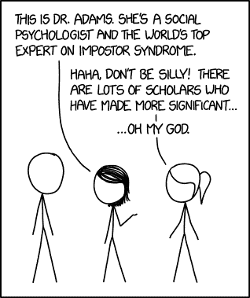
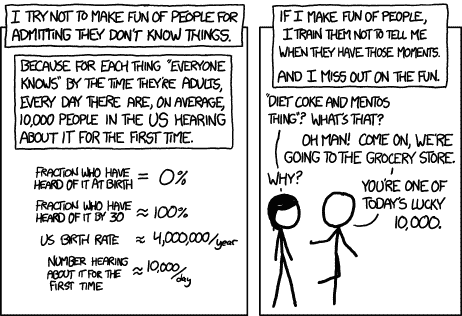

# 你永远不会知道你认为你应该知道的事情的一半——这没关系。

> 原文：<https://www.freecodecamp.org/news/you-will-never-know-half-of-what-you-think-you-should-12c5dc122ca0/>

作者:肯·吉尔布

# 你永远不会知道你认为你应该知道的事情的一半——这没关系。

冒名顶替综合症在软件开发中是真实存在的。在这个行业 20 多年后，我仍然发现自己在想*“我应该知道这个，为什么我还不知道这个？”*

[https://xkcd.com/1954/](https://xkcd.com/1954/)

事实是，我们的行业在不断变化。总有一些热门的新框架或者流行的方法被宣传给社区。当你在网上读到一些新的东西时，似乎每个人都知道这个新的热点。你对自己说:*这是什么，为什么我现在才知道？每个人都已经知道这件事了吗？为什么我是最后一个知道的？*

去年，对我来说是第一次。但是在过去的 20 年里，我用许多技术和框架经历了这个过程:[【Xamarin】](https://en.wikipedia.org/wiki/Xamarin)[。网芯](https://en.wikipedia.org/wiki/.NET_Core)、[。net 标准](https://github.com/dotnet/standard)，可移植类库[，MVVM](https://en.wikipedia.org/wiki/Model%E2%80%93view%E2%80%93viewmodel) ， [MVC](https://www.tutorialspoint.com/mvc_framework/mvc_framework_introduction.htm) ，[面向方面编程](https://flowframework.readthedocs.io/en/stable/TheDefinitiveGuide/PartIII/AspectOrientedProgramming.html)，[函数式编程](https://en.wikipedia.org/wiki/Functional_programming)，[面向对象编程](https://en.wikipedia.org/wiki/Object-oriented_programming)，[组合超过继承](https://en.wikipedia.org/wiki/Composition_over_inheritance)，[测试驱动开发](https://en.wikipedia.org/wiki/Test-driven_development)，[敏捷](https://en.wikipedia.org/wiki/Agile_software_development)， [scrum](https://en.wikipedia.org/wiki/Scrum_%28software_development%29) ，[反转控制](https://en.wikipedia.org/wiki/Inversion_of_control)，  [web 服务](https://en.wikipedia.org/wiki/Web_service)、 [REST](https://en.wikipedia.org/wiki/Representational_state_transfer) 、JSON、XML、NoSQL、文档数据库、websockets、ajax、handlebars、mustache、jquery 以及许多其他技术，这些技术都是以 [pascal](https://en.wikipedia.org/wiki/Pascal_%28programming_language%29) 的方式来来去去的。

这些是这些年来对我来说是新的*事物中的一小部分*。我可以用已经出现和消失的技术和语言来填满这一页。关键是，软件行业是*硬*的，是*进化*的。难怪会感觉你是自己行业的冒牌货。**

**我喜欢学习新事物。如果你想在这一行生存下去，你必须这样做。告诉自己你不是什么都知道，你不可能什么都知道，这是可以的。你周围的同龄人可能比你知道更多/更少/不同的事情。*拥抱那个*。互相学习。当我向另一个开发人员解释和教授一个概念时，我总是会对它有更深的理解。[除非你不得不教别人，否则你永远不会真正学到东西。](https://dzone.com/articles/you-never-really-learn)**

**当冒名顶替综合症发作时，可能会令人沮丧。在浏览网络社区时，你可以发现“*真是个白痴，这家伙不知道 x* ”的心态。在线开发人员可能很残酷，即使他们不认为自己是残酷的。有时候你自己的不安全感会让你觉得人们在贬低你，而事实并非如此。内心的斗争可能是持续不断的，而且会有所缓和。你的同事甚至会助长这种感觉。**

**当你的团队成员或其他开发人员不知道某些事情时，不要贬低他们。而是把它当成一个共同成长的学习机会。**

**

[https://xkcd.com/1053/](https://xkcd.com/1053/)** 

**你可能会发现自己在为自己的决策和代码辩护，这样你就不会看起来(或感觉起来)很愚蠢。这将滋生不安全感，最终每个人都会只顾自己。这些年我明白了，无论你有多好(或多坏)，你都会****起来。你的同事也会。这是你如何处理这种情况，将有助于今后的好或坏的经历。**

**糟糕的工作环境是不允许你犯错误的环境。员工可能会在背后议论彼此。你可能会听到这样的话:“我真不敢相信查理前几天有多蠢。真是个傻逼！”如果你听到一个同事或老板在说另一个员工的坏话，你可以打赌他们也在背后谈论你。[这种有毒的环境](https://medium.com/@jgefroh/toxic-developers-considered-harmful-f7ea1494d4c0)会导致每个人都在自己身边“围着车皮转”。试着改变文化，如果可以的话就离开。**

**愉快的工作环境是团队成员接受他们并非无所不知。在这里，你们可以互相学习，朝着同一个目标努力。努力成为这种开发者。你永远不会知道该知道的一切。接受现实吧。学你不懂的，教你会的。**

**最后，要知道有这种感觉的不只是你一个人。外面有很多人也有这种感觉。随着年龄的增长，我开始接受有些事情我不知道，但其他人会做。你对这种感觉的反应会决定你的成败。我选择接受自己的局限，努力获取更多的知识。**

**-K**