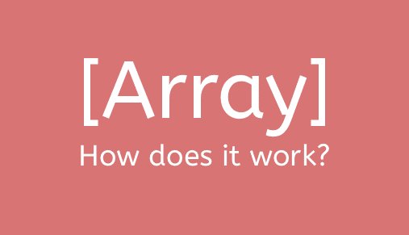

# 阵列工作原理概述

> 原文：<https://www.freecodecamp.org/news/how-arrays-work-the-way-arrays-work-a775bfee519e/>

爱迪生·叶

# 阵列工作原理概述

arrays — how do they work?

在计算机科学中，有一个**线性数据结构**的概念，这意味着数据是以一种线性方式构造的，其中**顺序很重要**。有**数组**和**链表**，但是今天我将主要谈论数组，以及一点点链表。

大多数面向对象的语言都有**数组**，而大多数*函数式语言都有**链表**(参见我的另一篇文章中的原因，在这篇文章的底部提到)。*

这种差异有一个很好的原因，我们将在后面深入探讨。现在，让我们快速看一下这两种数据结构之间的区别。要做到这一点，我们需要回顾一下过去。

### 倒带时间

对象和功能以及我们所知道的关于计算机的一切，基本上都是以比特和字节的形式存储在计算机中的。

在像 Java 和 C 这样的语言中，你必须事先明确声明数组的大小。

> *打住，但是 Ruby 不这么做？*

在 Ruby 中，我们使用`Array`作为线性数据结构。我们可以在一个 Ruby 数组中添加看似无限的东西，对我们来说这无关紧要。

太棒了，不是吗？！这意味着数组是无限大的，对吗？Ruby 是高级语言吗？我们真幸运！

但没那么快。**弹出你的泡泡**

没有无限大小的数组；你在 Ruby 中看到的是我们所说的**动态数组**，它是有代价的。

为了理解什么是动态数组，我们先来看看数组在内存中是如何表示的。由于 MRI Ruby (Matz 的 Ruby 解释器)可以向下编译成 C 代码，我们将看看数组是如何用 C 表示的。

### C-ing 相信

我们将深入一点 C 代码来帮助我们更好地使用 C…:)

在像 C 这样的低级语言中，你必须自己处理指针和内存分配。即使你以前没有和 C 语言打过交道(d *是一个客户，我也没有】,你也可能听过下面这个最著名的例子:*

让我们来分解这段代码:

*   `malloc`背后没有任何魔法含义，字面上代表`memory allocation`
*   `malloc`返回指针
*   接受一个参数，它是你希望程序为你分配的内存大小。
*   告诉程序我们想要存储 100 个整数，所以给我们分配 100 *每个整数所占的空间。
*   `ptr`/指针存储对内存地址的引用。

### 提米存放行李！

如果上面的例子不太有意义，试试这个类比。把内存分配想象成行李门房。它是这样工作的:

*   提米走向柜台，告诉门房他有两件行李，大约有*这个*大，他想把它们放在储藏室。
*   门房看了一眼储藏室，说道:“是的，我们在指定的`B4`区域有一些房间，我们会分配给你存放行李”。
*   他们递给提米一张**接机卡**，上面有指定区域，在我们这里是`B4`。
*   提米很高兴，到处去做任何事情，当他想取行李时，他回到柜台，给他们看他的**取行李卡**。*你看到我的行李了吗？*

在我们的例子中，提米的行李是数据，**提货卡是指针**(它表明提米的包存放在哪里)。门房存放提米行李的地方是**内存块**，计数器是**程序**。

通过显示计数器(**程序** ) Timmy 的卡(**指针/内存地址**，Timmy 可以取回自己的行李(**数据**)。奖金？因为他们确切地知道提米的包存放在哪里，这意味着他们可以相对快速地取回提米的所有行李！

此外，有没有想过为什么要像这样用索引访问数组中的元素？

这是因为数组保存了对内存块的引用，索引告诉它**偏移量**。

打个比方，如果我让你在一个 20 人的队列中寻找提米，你逻辑上必须问每个人他们是不是提米。但是，如果我告诉你提米是第一个人(**你原来的指针**)的第六个(**索引**，你就知道该去哪里找了。

正因为如此，在数组中检索元素很快——程序不必遍历所有 100 个元素来找到你要找的东西。如果你已经有了索引，它只需要把偏移量加到原始内存地址上，你要找的 droid 就在那里了！

### 那么什么是动态数组呢？

我已经告诉了你一些关于数组在内存中是如何表示的，但是现在是时候谈谈一些缺点了。

还记得你必须明确声明你需要的内存量吗？这意味着阵列会找到一个恰好适合你的大小的点。不能保证它能比你现有的容量更大(因为它后面的内存块可能会被占用)。

回到我们的行李类比:想象一下，如果 Timmy 要存放 2 件行李，而`B4`正好可以存放 2 件行李，所以他们将那件行李分配给 Timmy。现在出于某种原因，提米想存放*另一件*行李，但是`B4`不能存放 3 件，只能存放 2 件，那么他们该怎么办？

他们把他现有的所有行李搬到一个可以容纳 3 件以上行李的新地方，然后把它们放在一起。

这是一个昂贵的操作，但这正是内存的工作方式！

在 Ruby 中，你不必在 hand 之前声明一个特定的大小*，但那是因为 Ruby 通过动态数组自动地为你处理它。*

动态数组所做的是，如果数组接近其最大容量，它会自动声明一个新的更大的数组，并将所有现有元素移入其中，然后旧数组被垃圾回收。大多少？生长因子为*通常为*2；将当前数组的大小加倍。

**其实别信我的话**。

Ruby 有一个[对象空间模块](https://ruby-doc.org/core-2.2.0/ObjectSpace.html)，允许我们与内存中的当前对象进行交互。我们可以使用这个模块来查看动态数组的内存使用情况——听起来正是我们想要的！

我写了一个小的 Ruby 脚本来计算动态数组的增长因子。请随意查看这里的，如果您这样做了，您会看到 Ruby 数组有 1.5 倍的增长系数(也就是说，它们在每次复制时都会使数组增大 50%)。

### 我知道什么是数组，什么是链表？

请记住，虽然数组和链表都被认为是线性数据结构，但它们之间有一个很大的区别。

数组中的元素在内存中是一个挨着一个存储的(所以我们可以用索引来快速查找)。但是链表中的节点没有这样的限制(这就是为什么链表没有索引查找)——每一项都可以存储在内存块的任何地方。

这几乎就像提米试图存放 5 件行李，而门房没有空间，决定把它们放得到处都是。听起来毫无条理？

还有，如果它们存放在不同的地方，你怎么知道哪些包是提米的？*提示:只需跟踪下一个节点/包！*在我们的案例中，礼宾员将它们分开存放，但在每件行李上都贴有一个标签，指向下一件行李。

链表中的节点由两部分组成——数据部分和指向下一个节点的指针。这就是他们如何能够保持它的`linear`部分——他们仍然有顺序的概念，他们只是不需要按字面上的顺序存储！

`node = [ data | pointer ]`

例如，给定存储在存储器中的以下示例:

`[C | D] [A | B] [B | C] [D | nil]`

这几个部分看起来顺序不对——但是如果我告诉你第一个元素是`A`，你就能告诉我列表的准确顺序:

`list = [A -> B -> C ->` D - >无】

你可以用链表做很多有趣的事情，我不会在这里深究(还有很多关于 Big O 的事情我没有谈到)。但是已经有很多关于数据结构的好文章了。如果你是在这里做的，我建议你在这里阅读阿里的博客文章。

[**谢 u，下一个:链表介绍**](https://dev.to/aspittel/thank-u-next-an-introduction-to-linked-lists-4pph)
[*在本帖中，我们将通过…* dev.to](https://dev.to/aspittel/thank-u-next-an-introduction-to-linked-lists-4pph) 来谈论“谢 u，下一个”语言中的链表数据结构

你也可以在 [Wiki 这里](https://en.wikipedia.org/wiki/Cons)阅读更多关于清单/缺点的信息。

### 结束语

我最初写这篇文章是为了一个稍微不同的主题——为什么是链表？但是我发现在我能够解释 explore Elixir 为什么使用链表之前，解释数组是如何工作的花了太多时间。所以我把它们分成两篇文章。

在那篇文章中，我讨论了为什么函数式语言使用链表作为它们的线性数据结构。一定要去看看！

[**【仙丹|为什么要链表？】**](https://dev.to/edisonywh/-elixir--why-linked-lists--1e9d)
[*我一直觉得数据结构很酷，但是你知道什么更酷吗？在野外看到它们！当通过…* 开发到](https://dev.to/edisonywh/-elixir--why-linked-lists--1e9d)时

### 来源

1.  [https://medium . com/@ rebo _ dood/ruby-has-a-memory-problem-part-1-7887 bbacc 579](https://medium.com/@rebo_dood/ruby-has-a-memory-problem-part-1-7887bbacc579)——这是我通过要求发现其他`ObjectSpace`方法的地方

*最初发布于[开发到](https://dev.to/edisonywh/how-arrays-work-the-way-arrays-work-3bpg)*