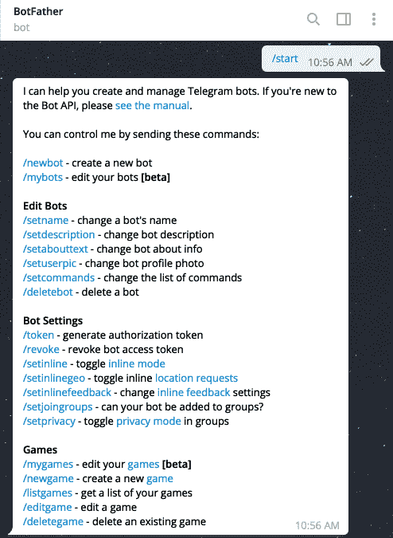
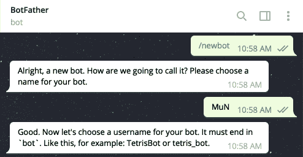
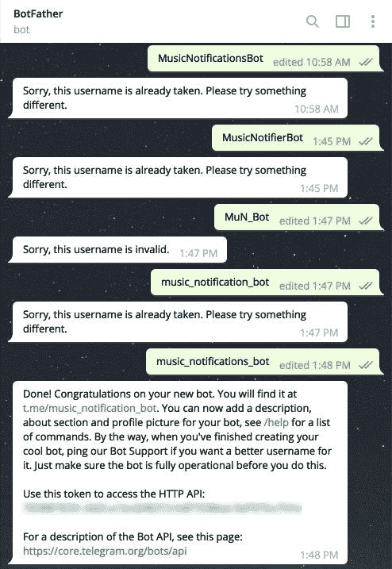
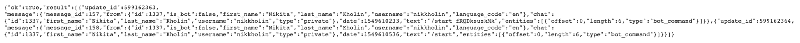
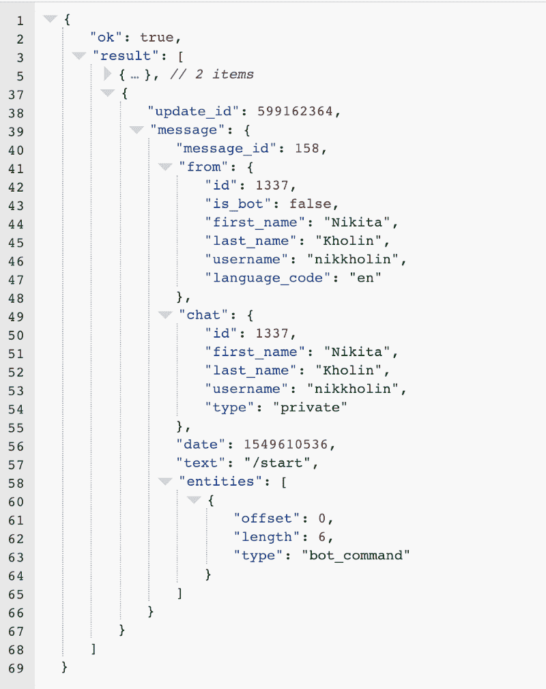
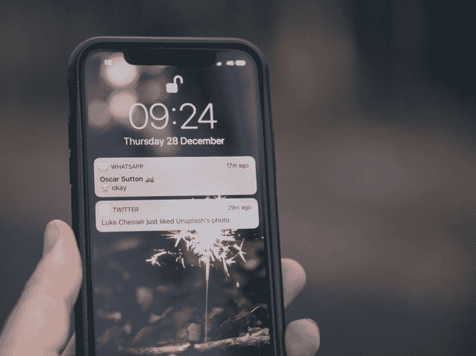

# 如何在你的电报机器人中设置推送通知

> 原文：<https://www.freecodecamp.org/news/telegram-push-notifications-58477e71b2c2/>

尼基塔·科林

# 如何在你的电报机器人中设置推送通知


Photo by [Daria Nepriakhina](https://unsplash.com/@epicantus?utm_source=medium&utm_medium=referral) on [Unsplash](https://unsplash.com?utm_source=medium&utm_medium=referral)

Telegram 是一个伟大的平台，有很多伟大的用户(我自己就是 Telegram 用户)。电报用户接收通知的最佳方式是什么？我们无法确定。也许他们喜欢电子邮件或其他东西。但我们可以猜测，用电报发送通知会非常方便。

如果您想从您的应用程序发送电报通知，您来对地方了。我已经在我的应用程序中添加了这个功能，我很喜欢它。

一个小提示。在本文中，我提供了 Python 代码的例子。但是这些想法并不是 Python 特有的，可以被翻译成另一种语言，不需要任何转换。

所以，事不宜迟，让我们深入了解一下我们如何做到这一点。

### 创建一个电报机器人

首先，你需要创建一个电报机器人。要做到这一点，你需要使用另一个电报机器人。只要和他说话(按开始)。



现在你看到它能做什么了。但是我们感兴趣的是创建一个新的机器人，所以这就是我们将要选择的(`/newbot`)。



你很快就会发现 bot 的名字应该以“bot”结尾。因为你和我一样来的太晚了，大多数机器人的名字都已经有人用了。



但最终，你会为你的机器人找到一个名字，并得到一个我们需要的访问令牌。

现在你有了一个 bot，Telegram 用户可以找到并使用它。但是有一个问题——您不能将来自 Telegram 的用户与您的应用程序中的用户相关联。让我告诉你为什么。

一旦用户按下你的机器人上的“开始”按钮，你将收到一个“更新”。通过访问以下 URL `https://api.telegram.org/bot{bot_token}/getUpdates`(不要忘记在 URL 中使用您的访问令牌)，您甚至可以在您的浏览器中检查所有 bot 的更新。这是我得到的:



什么都看不懂？别担心。您可以通过在浏览器中安装一些 JSON prettifier 扩展来修复它。我为 Chrome 使用了 [JSON 格式器](https://chrome.google.com/webstore/detail/json-formatter/mhimpmpmffogbmmkmajibklelopddmjf)。看起来好多了。



如你所见，我们并没有得到太多关于这个人的信息。从这些信息中，我们可以得到他们的全名。但是如果用户在您的应用程序中提供他们的全名，并且不保证它的唯一性，那就太幸运了。所以我们不能用它来在你的应用程序中寻找用户。

我们得到的另一条信息是用户名。这更有用，因为它在所有电报用户之间是唯一的。但最有可能的是，您的应用程序中没有这种功能。因此，我们需要要求用户在应用程序的某个地方输入他们的用户名。我不确定是否有人会做太多的工作。

关联用户的另一个选择是要求他们向机器人提供他们在应用程序中使用的电子邮件。但这有太多的缺陷:用户可以在输入电子邮件时输入错误，用户可以输入另一个用户的电子邮件并利用系统。这太糟糕了。

我们能做得更好吗？

### 关联用户

我们当然可以。为了关联用户，我们将使用一种叫做[深度链接](https://core.telegram.org/bots#deep-linking)的技术。

首先，您需要为每个用户创建一个随机的唯一令牌。我使用以下代码通过 Python 生成了令牌:

```
from secrets import token_urlsafetoken = token_urlsafe(8)token# => 'uEDbtJFHxKc'
```

然后，您需要保存该令牌，以便以后能够找到使用它的用户。你可以把它保存到你的数据库或者其他地方，比如缓存。我有一个`Notification`模型，所以我向模型的表中添加了一个字段。

```
class Notification(models.Model):    user = models.ForeignKey(User, on_delete=models.CASCADE)	# ...    connect_token = models.CharField(max_length=64, null=True)
```

所以我们生成了`uEDbtJFHxKc`令牌并保存了它。现在我们需要在 telegram bot 的 URL 中使用这个令牌，用户需要单击它来使它工作:

```
telegram_url = 'https://www.telegram.me'bot_name = 'music_notification_bot'token = 'uEDbtJFHxKc'url = f'{telegram_url}/{bot_name}?start={token}'
```

现在我们有了我们的 URL，`'https://telegram.me/music_notification_bot?start=uEDbtJFHxKc'`，是时候向用户展示它了。把它显示在应用程序的任何地方，然后等待用户点击它。

一旦用户上钩并点击“开始”，您应该会收到另一个更新:

```
{    "ok": true,    "result": [        // ...        // previous updates       	// ...		{			"update_id": 599162365,			"message": {                "message_id": 174,                "from": { ... },                "chat": { ... },                "date": 1549788357,                "text": "/start uEDbtJFHxKc",                "entities": [ ... ]        	}        }    ]}
```

我们终于可以确定我们的用户了。`text`字段现在包含了我们的用户令牌。让我们继续把它带出这个领域:

```
bot_token = 'your_bot_token'updates_url = f'https://api.telegram.org/bot{bot_token}/getUpdates'import requestsresponse = requests.get(updates_url).json()text = response['result'][0]['message']['text']text# => '/start uEDbtJFHxKc'splitted_text = text.split(' ')# => ['/start', 'uEDbtJFHxKc']token = splitted_text[-1]# => 'uEDbtJFHxKc'
```

这个令牌可以用来查找用户。您的实现取决于您最初保存令牌的方式。但我是这样做的:

```
notification = Notification.objects.get(channel='telegram', connect_token=token)user = notification.user
```

所以用户按下了“开始”按钮。但是他们看到什么也没发生。至少让我们欢迎他们。


为了欢迎用户，我们需要发现用户已经开始与我们的机器人对话。有两种方法可以做到这一点:轮询和 webhooks。

你已经知道什么是投票了。你已经做到了。或者至少见过我这么做。一旦我们查看了`https://api.telegram.org/bot{bot_token}/getUpdates`页面，我们就进行了一次投票。轮询是不断检查更新，例如每 2 秒钟一次。通过这种方式，我们可以随时知道何时有人与机器人进行了交互。

Webhooks 的方向有所不同。我们不是每两秒钟检查一次更新，而是等待更新发生。当它发生时，Telegram 将发送一个带有更新数据的请求到我们指定的 URL。这样我们可以让我们的和电报服务器都休息一下，等待更新的到来。

如果你有很高的流量，轮询可能会更好，但不幸的是，这是一个例外，所以我决定用 webhook。

### Webhooks


在 Telegram 中设置 webhook 非常简单。你只需要发送一个请求给`https://api.telegram.org/bot{bot_token}/setWebhook?url={your_server_url}`。在你的浏览器中打开这个链接也可以。`your_server_url`是电报将更新发送到的 URL。下面是您应该得到的回应:

```
{    "ok": true,    "result": true,    "description": "Webhook was set"}
```

如果你不相信自己，你可以访问`https://api.telegram.org/bot{bot_token}/getWebhookInfo`来再次确认一切正常。您应该会看到类似这样的内容:

```
{    "ok": true,    "result": {        "url": "https://example.com/your_server_endpoint",        "has_custom_certificate": false,        "pending_update_count": 0,        "max_connections": 40    }}
```

现在。如果有些事情不正常(比如你设置了一个错误的 URL ),你总是可以通过访问`[https://api.telegram.org/bot{bot_token}/deleteWebhook](https://api.telegram.org/bot{bot_token}/deleteWebhook)`删除网页挂钩，然后再次设置网页挂钩。

### 地方发展

在继续之前，我想就地方发展说几句话。Webhooks 不太适合它。网页挂钩被发送到一个网址，很可能你不知道你的电脑的网址。此外，电报网钩要求 URL 是安全的(HTTPS)。

但是这个问题有一个解决方案: [ngrok](https://ngrok.com/) 。ngrok 是一个向世界展示您的本地环境的工具。[下载 ngrok](https://ngrok.com/download) ，安装，用你服务器运行的端口启动。我的服务器运行在`8000`端口上，所以我需要在控制台上运行

```
/path/to/ngrok http 8000
```

然后 ngrok 会给你一个 URL，你可以用它来设置一个 webhook。

### 欢迎用户


现在你已经准备好开发了，让我们欢迎我们的用户——他们正等着呢。

一旦用户点击“开始”，你的电报将发送一个更新到你的服务器的网址。更新中有趣的部分应该是这样的:

```
{    "message": {        "chat": {            "id": 457        },		"text": "/start uEDbtJFHxKc",    }}
```

这是使用消息文本关联用户的最佳时机。还有一个有趣的信息，聊天 ID。聊天 ID 是我们向该用户发送消息所需要的。Telegram 有一个 API 端点来发送类似于这个`https://api.telegram.org/bot{bot_token}/sendMessage?chat_id={chat_id}&text={text}`的消息。我不确定我是否需要解释如何使用它，但下面是我处理 webhook 的代码:

```
import jsonimport requestsdef callback(request):    body = json.loads(request.body)    text = body['message']['text']    token = text.split(' ')[-1]    associate_user_by_token(token)    bot_key = os.environ.get('TELEGRAM_API_KEY')    chat_id = body['message']['chat']['id']	text = "Welcome!"	send_message_url = f'https://api.telegram.org/bot{bot_key}/sendMessage?chat_id={chat_id}&text={text}'	requests.post(send_message_url)
```

如果我们在用户点击著名的“开始”按钮后发送一条欢迎消息，用户就不会再考虑一切是否正常。

### 推送通知



最后，我们来了解一下为什么我们要做所有这些事情——推送通知。您可能希望将应用程序中发生的一些信息通知给用户。比如有人喜欢用户的帖子之类的。我使用 Telegram 来通知用户喜爱的艺术家发布的新音乐。

您已经知道如何发送通知。你只需要用`[https://api.telegram.org/bot{bot_token}/sendMessage?chat_id={chat_id}&text={notification_text}](https://api.telegram.org/bot{bot_token}/sendMessage?chat_id={chat_id}&text={notification_text}.)` [发送一条消息。](https://api.telegram.org/bot{bot_token}/sendMessage?chat_id={chat_id}&text={notification_text}.)

当然，如果您计划不仅在用户与机器人交互时发送通知，您需要将`chat_id`保存在数据库中。

您可能还想在邮件中包含链接或其他格式。在这种情况下，您需要向发送消息 URL 添加另一个参数`parse_mode`。有两个解析选项:Markdown 或 HTML。我使用 Markdown，因为我发现它更容易使用。如果你不熟悉减价，你可以使用 HMTL，但我会推荐你阅读[减价有多容易](https://www.markdownguide.org/basic-syntax)。

下面是带有`parse_mode`参数`[https://api.telegram.org/bot{bot_token}/sendMessage?chat_id={chat_id}&text={notification_text}&parse_mode=markdown](https://api.telegram.org/bot{bot_token}/sendMessage?chat_id={chat_id}&text={notification_text}&parse_mode=markdown.)` [的发送消息 URL 的样子。](https://api.telegram.org/bot{bot_token}/sendMessage?chat_id={chat_id}&text={notification_text}&parse_mode=markdown.)

我在通知文本中添加了新版本的链接，比如 so `{release.date}: {release.artist.name} - [{release.title}]({release.url})`。你可以在这里阅读更多关于如何格式化你的信息[。](https://core.telegram.org/bots/api#formatting-options)

此外，对于像`disable_notification`这样的发送消息 URL，还有[个可用的参数](https://core.telegram.org/bots/api#sendmessage)。总有地方可以探索。

### 结论

现在你应该知道如何

*   使用机器人父亲在电报中创建一个机器人
*   检查更新(什么是更好的方法——web hooks 或轮询)
*   使用深度链接关联用户
*   发送欢迎消息并继续发送通知
*   格式化您发送的邮件

希望这篇文章对你有用。这是关于[门](http://musicnotifier.com/)系列文章的第五部分。请继续关注第六部分。你可以在我的 [GitHub 页面](https://github.com/hmlON)找到[这个项目](https://github.com/hmlON/mun)的代码，还有我的其他项目。如果你喜欢这篇文章，请在下面留下你的评论并关注我。

*最初发布于[https://kholinlabs.com/telegram-push-notifications](https://kholinlabs.com/telegram-push-notifications)2019 年 2 月 12 日。*