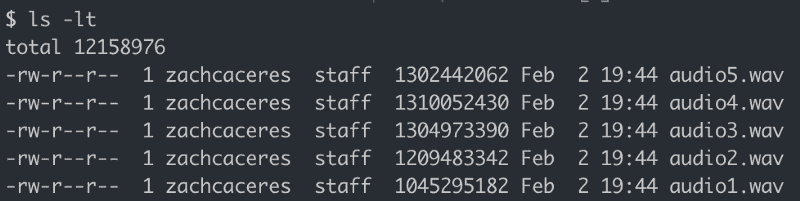
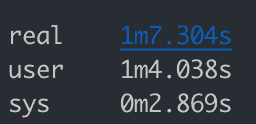
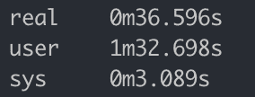
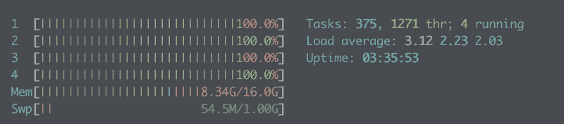
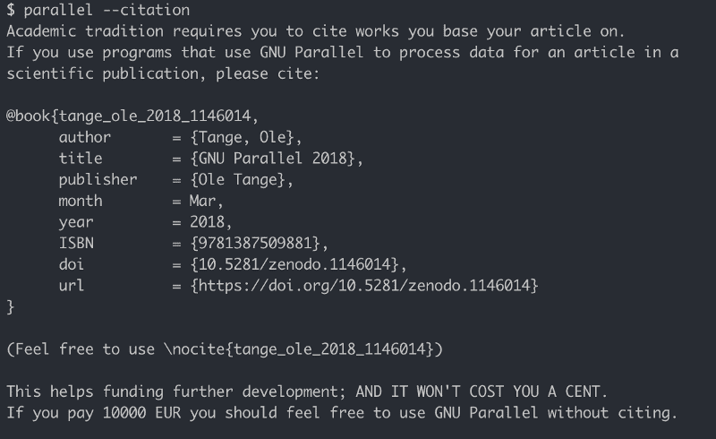

# 如何用 GNU parallel 增强 bash 工作流

> 原文：<https://www.freecodecamp.org/news/how-to-supercharge-your-bash-workflows-with-gnu-parallel-53aab0aea141/>

[GNU](https://www.gnu.org/software/parallel/) [`parallel`](https://www.gnu.org/software/parallel/) 是并行运行作业的命令行工具。

`parallel`很牛逼，属于每个程序员的工具箱。但是一开始我发现[的医生](https://www.gnu.org/software/parallel/man.html)有点让人不知所措。幸运的是，只需几个基本命令，您就可以开始使用`parallel`了。

#### 为什么`parallel`这么有用？

让我们比较一下同一个计算密集型任务的顺序执行和并行执行。

假设你有一个文件夹。要转换成的 wav 音频文件。flac:



.wav files

这些都是相当大的文件，每个文件至少有 10 亿字节。

我们将使用另一个很棒的命令行工具， [ffmpeg](https://ffmpeg.org/) 来转换文件。下面是我们需要为每个文件运行的内容。

```
ffmpeg -i audio1.wav audio1.flac
```

让我们编写一个脚本来依次转换每一个:

```
# convert.sh
ffmpeg -i audio1.wav audio1.flac
ffmpeg -i audio2.wav audio2.flac
ffmpeg -i audio3.wav audio3.flac
ffmpeg -i audio4.wav audio4.flac
ffmpeg -i audio5.wav audio5.flac
```

当从终端调用脚本时，我们可以通过在前面加上`time`来计时任务的执行。`time`将打印执行过程中经过的实际时间。

```
time ./convert.sh
```

我们的剧本一分多钟后结束。



the timing of sequential execution

还不错。但是现在让我们并行运行它！

我们不需要修改我们的剧本。有了`-a`标志，我们可以将我们的脚本直接传送到`parallel`。`parallel`将每一行作为单独的命令运行。

```
parallel -a ./convert.sh
```

使用`parallel`，我们的转换运行了一半多一点的时间。不错！



the timing of parallel execution

只有五个文件，这种差异不是什么大问题。但是对于更大的列表和更长的任务，我们可以用`parallel`节省很多时间。

我在处理一个数据处理任务时遇到了`parallel`,如果按顺序处理，这个任务可能要运行一个小时或更长时间。有了`parallel`，只用了几分钟。

`parallel`动力也取决于你的电脑。我的 MacBook Pro 的 Intel i7 只有 4 核。即使这个小任务也把他们推到了极限:



更强大的计算机可能配备 8、16 甚至 32 核处理器，通过并行化作业节省大量时间。

### 对`parallel`有用

`parallel`的另一个好处是它的简洁和简单。让我们从一个讨厌的 Python 脚本开始，将其转换为对`parallel`的干净调用。

下面是完成音频文件转换的 Python 脚本:

```
import subprocess
path = Path.home()/'my-data-here'
for audio_file in list(path.glob('*.wav')):
    cmd = ['ffmpeg',
           '-i',
           str(audio_file),
           f'{audio_file.name.split(".")[0]}.flac']
    subprocess.run(cmd, stdout=subprocess.PIPE)
```

呀！仅仅转换一些文件就需要考虑很多代码。(这大约需要运行 1.2 分钟)。

让我们把我们的 Python 转换成`parallel`。

### 用`parallel -a`调用脚本

是我们在 bash 脚本中使用的很好的一行程序。

这很好，但是需要您写出想要执行的 bash 脚本。在我们的例子中，我们仍然在`convert.sh`中写出对`ffmpeg`的每个单独调用。

### 管道和字符串插值用`parallel`

幸运的是，`parallel`给了我们一个完全删除`convert.sh`的方法。

下面是我们完成转换必须运行的所有内容:

```
ls *.wav | parallel ffmpeg -i {} {.}.flac
```

我们来分析一下。

我们得到了所有。我们目录中带有`ls *.wav`的 wav 文件。然后我们把这个列表通过管道(`|`)发送给`parallel`。

Parallel 提供了一些有用的方法来做字符串插值，所以我们的文件路径输入正确。

第一个是`{}`，它被`parallel`自动替换为我们输入的一行。

第二个操作符是`{.}`，它将输入一行，但删除所有文件扩展名。

如果我们扩展由`parallel`运行的命令作为第一行输入，我们会看到...

```
ffmpeg -i audio1.wav audio1.flac
```

### 带`Parallel`的参数

事实证明，我们甚至不需要从`ls`管道来完成我们的任务。我们可以变得更简单:

```
parallel ffmpeg -i {} {.}.flac ::: *.wav
```

传递给`parallel`的参数出现在命令之后，由`:::`分隔。在这种情况下，我们的参数是`*.wav`，它将提供所有的列表。我们目录中的 wav 文件。这些文件成为我们快速工作的输入。

有趣的事实:`parallel`由[奥莱·葛覃](http://ole.tange.dk/)建造，于 2011 年发布。根据他的说法，你只需支付 10，000 欧元的适度费用，就可以使用该工具进行研究，而无需引用源论文。



感谢阅读！