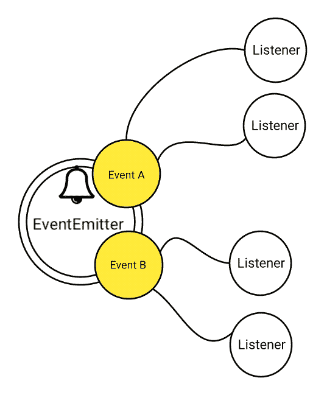
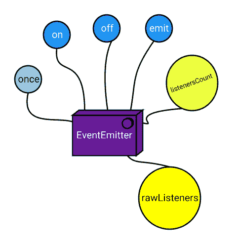
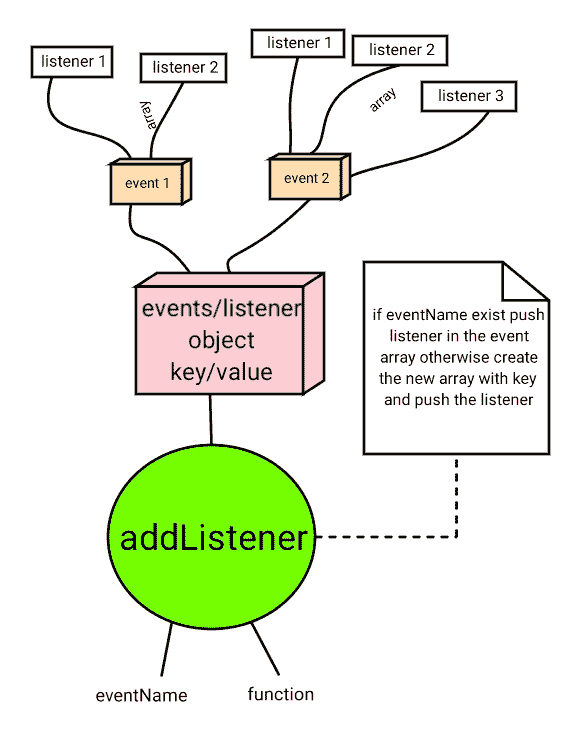
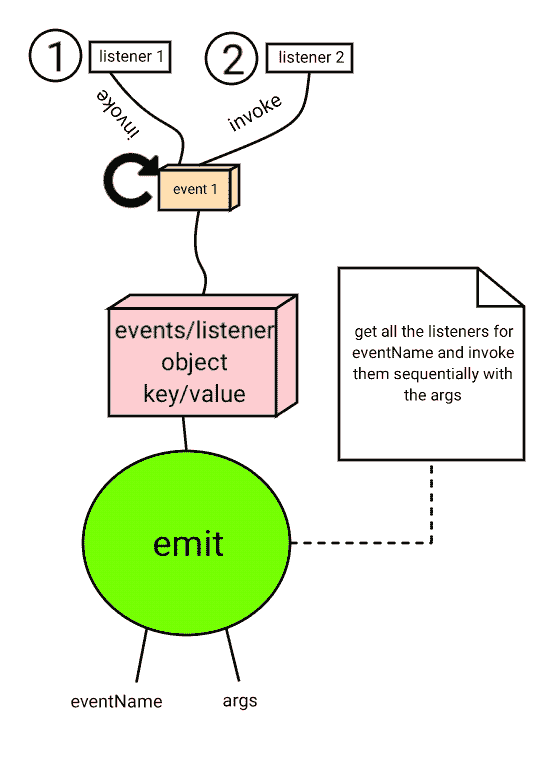

# 如何在 Node.js 中编写自己的事件发射器:分步指南

> 原文：<https://www.freecodecamp.org/news/how-to-code-your-own-event-emitter-in-node-js-a-step-by-step-guide-e13b7e7908e1/>

作者:拉杰什·皮莱

# 如何在 Node.js 中编写自己的事件发射器:分步指南

#### 通过编写小的包/模块来理解节点内部


Mastering the Node.JS Internals

如果你是 Node.js 的新手，在 Medium 和其他地方有很多教程。你可以看看我的文章[所有关于核心节点。比如 JS](https://codeburst.io/all-about-core-nodejs-part-1-b9f4b0a83278) 。

但事不宜迟，让我们进入讨论的主题:“事件发射器”。事件发射器在 Node.js 生态系统中扮演着非常重要的角色。

EventEmitter 是一个促进节点中对象之间通信/交互的模块。EventEmitter 是节点异步事件驱动架构的核心。Node 的许多内置模块都继承自 EventEmitter，包括像 Express.js 这样的突出框架。

这个概念非常简单:发射器对象发出命名事件，这些事件导致先前注册的侦听器被调用。因此，发射器对象基本上有两个主要特征:

*   发出名称事件。
*   注册和注销侦听器函数。

这有点像发布/订阅或观察者设计模式(虽然不完全是)。

#### 我们将在本教程中构建什么

*   EventEmitter 类
*   on / addEventListener 方法
*   off / removeEventListener 方法
*   一次方法
*   发射方法
*   罗利斯坦斯方法
*   listenerCount 方法

上述基本特性足以实现使用事件模型的完整系统。

在我们开始编码之前，让我们看看我们将如何使用 EventEmitter 类。请注意，我们的代码将模拟 Node.js 'events '模块的确切 API。

事实上，如果你用 Node.js 内置的 events 模块替换我们的 EventEmitter，你会得到同样的结果。

#### 示例 1 —创建一个事件发射器实例并注册几个回调

```
const myEmitter = new EventEmitter();

function c1() {
   console.log('an event occurred!');
}

function c2() {
   console.log('yet another event occurred!');
}

myEmitter.on('eventOne', c1); // Register for eventOne
myEmitter.on('eventOne', c2); // Register for eventOne
```

当发出事件“eventOne”时，应调用上述两个回调。

```
myEmitter.emit('eventOne');
```

控制台中的输出如下:

```
an event occurred!
yet another event occurred!
```

#### 示例 2—使用 once 注册只触发一次的事件。

```
myEmitter.once('eventOnce', () => console.log('eventOnce once fired')); 
```

发出事件“eventOnce”:

```
myEmitter.emit('eventOne');
```

控制台中应该会出现以下输出:

```
eventOnce once fired
```

再次发出用注册的事件不会有任何影响。

```
myEmitter.emit('eventOne');
```

由于该事件只发出了一次，所以上述语句没有任何影响。

#### 示例 3—使用回调参数注册事件

```
myEmitter.on('status', (code, msg)=> console.log(`Got ${code} and ${msg}`));
```

发出带有参数的事件:

```
myEmitter.emit('status', 200, 'ok');
```

控制台中的输出如下所示:

```
Got 200 and ok
```

注意:您可以多次发出事件(用 once 方法注册的事件除外)。

#### 示例 4—取消注册事件

```
myEmitter.off('eventOne', c1);
```

现在，如果您发出如下事件，什么都不会发生，这将是一个 noop:

```
myEmitter.emit('eventOne');  // noop
```

#### 示例 5—获取侦听器计数

```
console.log(myEmitter.listenerCount('eventOne'));
```

注意:如果事件已使用 off 或 removeListener 方法取消注册，则计数将为 0。

#### 示例 6—获取原始侦听器

```
console.log(myEmitter.rawListeners('eventOne'));
```

#### 示例 7—异步示例演示

```
// Example 2->Adapted and thanks to Sameer Buna
class WithTime extends EventEmitter {
  execute(asyncFunc, ...args) {
    this.emit('begin');
    console.time('execute');
    this.on('data', (data)=> console.log('got data ', data));
    asyncFunc(...args, (err, data) => {
      if (err) {
        return this.emit('error', err);
      }
      this.emit('data', data);
      console.timeEnd('execute');
      this.emit('end');
    });
  }
}
```

使用 withTime 事件发射器:

```
const withTime = new WithTime();

withTime.on('begin', () => console.log('About to execute'));
withTime.on('end', () => console.log('Done with execute'));

const readFile = (url, cb) => {
  fetch(url)
    .then((resp) => resp.json()) // Transform the data into json
    .then(function(data) {
      cb(null, data);
    });
}

withTime.execute(readFile, 'https://jsonplaceholder.typicode.com/posts/1');
```

检查控制台中的输出。帖子列表将与其他日志一起显示。

#### 我们的事件发射器的观察者模式



#### 可视化图表 EventEmitter 中的方法)



既然我们现在理解了 API 的用法，让我们开始编码模块。

#### EventEmitter 类的完整样板代码

我们将在接下来的几节中逐步填充细节。

```
class EventEmitter {
  listeners = {};  // key-value pair

  addListener(eventName, fn) {}
  on(eventName, fn) {}

  removeListener(eventName, fn) {}
  off(eventName, fn) {}

  once(eventName, fn) {}

  emit(eventName, ...args) { }

  listenerCount(eventName) {}

  rawListeners(eventName) {}
}
```

我们首先为 EventEmitter 类创建模板，并创建一个散列来存储侦听器。侦听器将被存储为一个键值对。该值可以是一个数组(因为对于同一个事件，我们允许注册多个侦听器)。

#### 1.addListener()方法

现在让我们实现 addListener 方法。它接受一个事件名和一个要执行的回调函数。

```
 addListener(event, fn) {
    this.listeners[event] = this.listeners[event] || [];
    this.listeners[event].push(fn);
    return this;
  }
```

#### 稍微解释一下:

addListener 事件检查该事件是否已经注册。如果是，返回数组，否则返回空数组。

```
this.listeners[event] // will return array of events or undefined (first time registration)
```

比如说…

我们用一个使用例子来理解这个。让我们创建一个新的 eventEmitter 并注册一个“测试事件”。这是第一次注册“测试事件”。

```
const eventEmitter = new EventEmitter();
eventEmitter.addListener('test-event', 
 ()=> { console.log ("test one") } 
);
```

addListener()方法内部:

```
this.listeners[event] =>  this.listeners['test-event'] 
                  => undefined || []
                  => []
```

结果将是:

```
this.listeners['test-event'] = [];  // empty array
```

然后将“fn”推送到该数组，如下所示:

```
this.listeners['test-event'].push(fn);
```

我希望这能让‘addListener’方法非常清晰，易于破译和理解。

注意:同一个事件可以注册多个回调。



#### 2.on 方法

这只是“addListener”方法的别名。为了方便起见，我们将更多地使用“on”方法，而不是“addListener”方法。

```
on(event, fn) {
  return this.addListener(event, fn);
}
```

#### 3.removeListener(event，fn)方法

removeListener 方法将 eventName 和回调作为参数。它从事件数组中移除所述监听器。

注意:如果事件有多个侦听器，则其他侦听器不会受到影响。

首先，让我们看看 removeListener 的完整代码。

```
removeListener (event, fn) {
    let lis = this.listeners[event];
    if (!lis) return this;
    for(let i = lis.length; i > 0; i--) {
      if (lis[i] === fn) {
        lis.splice(i,1);
        break;
      }
    }
    return this;
}
```

下面是逐步解释的 removeListener 方法:

*   通过“事件”获取侦听器数组
*   如果没有找到，返回“this”进行链接。
*   如果找到，循环所有侦听器。如果当前侦听器与“fn”参数匹配，请使用数组的 splice 方法移除它。脱离循环。
*   返回“this”继续链接。

#### 4.off(event，fn)方法

这只是“removeListener”方法的别名。为了方便起见，我们将更多地使用“on”方法，而不是“addListener”方法。

```
 off(event, fn) {
    return this.removeListener(event, fn);
  }
```

#### 5.once(eventName，fn)方法

为名为`eventName`的事件增加一个**一次性** `listener`功能。下一次`eventName`被触发时，这个监听器被移除，然后被调用。

用于设置/初始化类型的事件。

让我们看一下代码。

```
once(eventName, fn) {
    this.listeners[event] = this.listeners[eventName] || [];
    const onceWrapper = () => {
      fn();
      this.off(eventName, onceWrapper);
    }
    this.listeners[eventName].push(onceWrapper);
    return this;
}
```

下面是一步一步解释的**一次**方法:

*   获取事件数组对象。如果是第一次，则为空数组。
*   创建一个名为 onceWrapper 的包装函数，它将在事件发出时调用 fn，并删除侦听器。
*   将包装函数添加到数组中。
*   返回“this”进行链接。

#### 6.发射器(事件名称，..args)方法

按照注册顺序同步调用为名为`eventName`的事件注册的每个侦听器，并将提供的参数传递给每个侦听器。

如果事件有监听器，返回`true`，否则返回`false`。

```
emit(eventName, ...args) {
    let fns = this.listeners[eventName];
    if (!fns) return false;
    fns.forEach((f) => {
      f(...args);
    });
    return true;
}
```



下面是逐步解释的 **emit** 方法:

*   获取所述 eventName 参数的函数
*   如果没有侦听器，则返回 false
*   对于所有函数侦听器，调用带有参数的函数
*   完成后返回 true

#### 7.listenerCount (eventName)方法

返回侦听名为`eventName`的事件的侦听器数量。

下面是源代码:

```
listenerCount(eventName) {
    let fns = this.listeners[eventName] || [];
    return fns.length;
}
```

下面是逐步解释的 listenerCount 方法:

*   获取考虑中的函数/侦听器，如果没有，则获取一个空数组。
*   返回长度。

#### 8.rawListeners(eventName)方法

为名为`eventName`的事件返回监听器数组的副本，包括任何包装器(比如由`.once()`创建的那些)。如果事件已经发出一次，则此实现中的 once 包装将不可用。

```
rawListeners(event) {
    return this.listeners[event];
}
```

完整的源代码供参考:

```
class EventEmitter {
  listeners = {}

  addListener(eventName, fn) {
    this.listeners[eventName] = this.listeners[eventName] || [];
    this.listeners[eventName].push(fn);
    return this;
  }

  on(eventName, fn) {
    return this.addListener(eventName, fn);
  }

  once(eventName, fn) {
    this.listeners[eventName] = this.listeners[eventName] || [];
    const onceWrapper = () => {
      fn();
      this.off(eventName, onceWrapper);
    }
    this.listeners[eventName].push(onceWrapper);
    return this;
  }

  off(eventName, fn) {
    return this.removeListener(eventName, fn);
  }

  removeListener (eventName, fn) {
    let lis = this.listeners[eventName];
    if (!lis) return this;
    for(let i = lis.length; i > 0; i--) {
      if (lis[i] === fn) {
        lis.splice(i,1);
        break;
      }
    }
    return this;
  }

  emit(eventName, ...args) {
    let fns = this.listeners[eventName];
    if (!fns) return false;
    fns.forEach((f) => {
      f(...args);
    });
    return true;
  }

  listenerCount(eventName) {
    let fns = this.listeners[eventName] || [];
    return fns.length;
  }

  rawListeners(eventName) {
    return this.listeners[eventName];
  }
}
```

完整代码可从以下网址获得:

[https://jsbin.com/gibofab/edit?js,console,output](https://jsbin.com/gibofab/edit?js,console,output)

作为练习，你可以随意实现文档[https://nodejs.org/api/events.html](https://nodejs.org/api/events.html)中其他事件的 API。

如果你喜欢这篇文章，并希望看到更多类似的文章，请随意鼓掌:)

**注意**:代码是为了可读性而不是性能而优化的。也许作为一个练习，你可以优化代码并在评论区分享。还没有对边缘情况进行全面测试，一些验证可能会被取消，因为这是一个快速的记录。

本文是即将推出的视频课程“节点”的一部分。JS Master Class——从头开始构建你自己的类似 ExpressJS 的 MVC 框架”。

该课程的名称尚未最终确定。