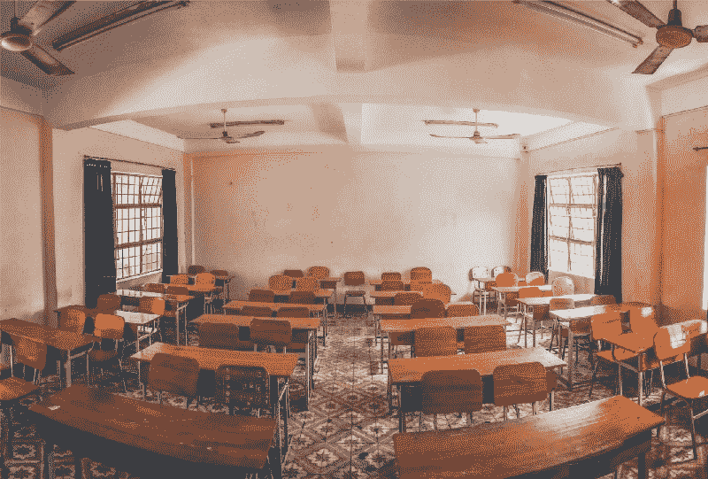

# 我从在媒体上发表故事中学到了什么

> 原文：<https://www.freecodecamp.org/news/what-ive-learned-from-publishing-stories-on-medium-9057da232465/>

当我第一次开始写文章，然后在媒体上发表时，我没有目标。我写的主题对我来说很重要，我觉得应该让聚光灯照亮它们。说到这里，疑惑困扰着我。这些疑虑告诉我，没有人会读我的故事，或者我选择写的主题是多余的。我不知道我的文章会有多受欢迎，也不知道我是否还有继续写作的理由。

在过去几个月持续发表故事后，我回顾了我写的所有故事，并想与你分享我一路走来学到的经验。

#### 一切开始的地方

我写的第一篇文章是关于我经历的个人经历，[寻找第二份工作](https://medium.freecodecamp.org/what-a-developer-goes-through-when-looking-for-a-second-job-f061c26ffd8f)。有很多文章是由刚入行的人写的，但我找不到一篇描述在你已经有了一些职业经验后在科技行业找工作是什么感觉的文章。

我心想，肯定有其他人和我一样，已经面临或将面临同样的情况，并能从阅读我的文章中受益。事实上，自从这篇文章发表以来，至今已有近 4000 次页面浏览。我从没想过它会曝光这么多。仅仅这个事实就让我意识到，我已经触及了一些值得写的东西，并且拥有了一群想要阅读我的故事的读者。

第一篇文章发表后，我有了更多关于写什么的想法，并开始养成每隔几周写一篇文章的习惯。即使我的想法没有那么充实，简单地点击**新故事**选项，记下我当时的想法，让我有了奋斗的目标。它让我坚持下去，并激励我继续写作，即使我不知道这个故事将如何或把我带到哪里。

#### 如何找到出版物

获得读者的很大一部分是在出版物下发表你的文章。类似于当你写一本书时，你希望它在一个强大的出版商下出版，这个出版商可以让尽可能多的人看到你的书。

当我写我的第一篇文章时，我也在积极地参与、贡献和互动 freeCodeCamp 社区。在某个时候，我注意到他们在 Medium 上有一个出版物，于是浏览了一下，看看他们在出版什么样的故事。

看到我在他们各自的球场上写作，我就给他们发了一封邮件，里面有我草稿的链接。没多久就得到回复，做了一些修改，最终我的文章在 freeCodeCamp 的刊物下发表了。

> 当你完成了你计划要做的事情时，那种感觉是无与伦比的。

通过我与 freeCodeCamp 的互动，我打开了一个渠道，让我继续提交文章并看到它们被发表。

因为 freeCodeCamp 的出版物有大量的订阅者，这让我获得了更多的追随者，并带来了更多的读者来阅读我的文章。这不仅让人们看到了我的作品，也让我看到了其他作家的作品。

Photo by [Markus Spiske](https://unsplash.com/@markusspiske?utm_source=medium&utm_medium=referral) on [Unsplash](https://unsplash.com?utm_source=medium&utm_medium=referral)

#### 第一次很有魅力

就像每一个第一次成功的人一样，总有压力在第二次重新创造那个成就。我对另一篇文章有几个想法，但我不知道我最应该继续写哪一篇。

一个月后，我的下一篇文章发表了。它没有得到第一部那样多的曝光率。诚然，这两篇文章的主题不同，但我认为我选择的主题会吸引人们的注意力。显然情况并非如此，但这并没有使我气馁。

重要的是不要对自己太苛刻，要明白你无法控制谁会阅读你的文章，以及他们会对你的文章做出怎样的反应。像你一样，每天有成千上万(如果不是更多)的作家在各种出版物上发表文章。试着用半杯水的视角看待事物。

享受这样一个事实，有些人确实读了你的文章，你也确实设法联系到了他们。说实话，没有人知道吸引观众的神奇公式，只要你把目标设定在一个现实的水平上，你就应该准备好了。

#### 寻找我自己的声音

在各种出版物上发表文章需要花费时间，而提交文章并发表文章的过程也需要时间。这个过程的一部分也是接受不同的观点，从管理出版物的人那里接受你的文章。

建设性的批评是你的朋友，我建议当有人有不同意见时，你要倾听。考虑到这些出版物背后的人每天都会看到大量的文章，并且知道什么类型的文章有效，什么无效。

他们也保留发表适合他们议程的文章的权利。毕竟，这是他们的出版物。

然而，这并不是单行道。如果出版商所说的部分内容与你的设想不符，试着解释一下。他们可能不像你一样看待事物，需要额外的解释来理解你的想法。

你发表的每一篇文章，都形成了你写作的某种风格。一开始你可能没有注意到，但随着时间的推移，它会变得很明显。它可以是你如何强调某些单词或短语。或者你如何对熟悉的事物提出不同的看法。确保在你发表的文章中保持这种写作特点。它将成为读者识别你作品的放大镜。

Photo by [Nam Hoang](https://unsplash.com/@puonqnam217?utm_source=medium&utm_medium=referral) on [Unsplash](https://unsplash.com?utm_source=medium&utm_medium=referral)

#### 我的两分钱

*   让别人听到你的声音 -你有自己的故事要讲，有自己的经历和想法。不要害怕分享。
*   不要灰心 -写作是一个艰难的过程，你并不总是有心情或精力去完成它。学会识别什么时候是头脑风暴和写作的好时机。
*   想法决定一切——不要去找出版物，看看你能为它们写些什么。如果你对一篇文章有想法，就把它写出来。**其余的将跟随**。
*   耐心——我怎么强调都不为过。事情需要时间，无论是写作过程，联系出版物并得到回应，还是等待你的文章被批准后发表。但是，不要让事情闲置太久。

如果你有兴趣阅读我的其他文章，欢迎查看我的[个人资料](https://medium.com/@tomerpacific)。你也可以通过媒体或邮件联系我。

***好运*** 。